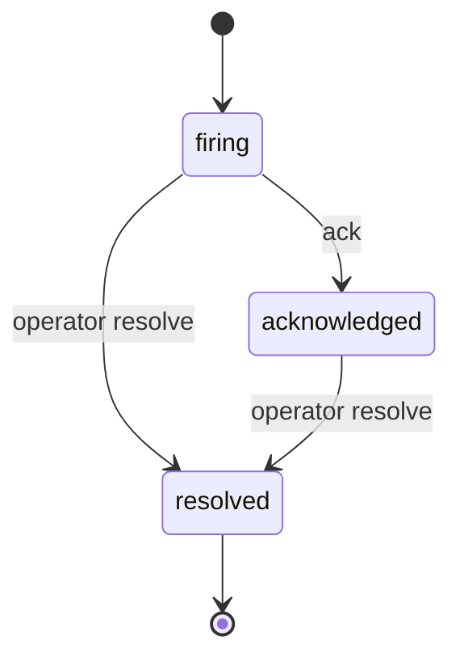

Alerts watch your agents for you and page you the moment something breaks, so you don't have to sit and refresh a dashboard. You set a rule once (an error-rate spike, a latency regression, an evaluator score drop, or any custom condition), and AgentEye checks it on a schedule and notifies you by email, Slack, webhook, or in the dashboard. Reach for alerts whenever there's a signal you'd want to hear about even when nobody's looking.


## Create an alert

You author every alert in the dashboard. The form writes the underlying rule for you, so you never have to hand-write JSON. The happy path is five steps:

1. Open **Alerts → New alert** and give it a name.
2. Pick a **trigger**: the condition to watch (see [Trigger types](#trigger-types) below).
3. Set the **threshold and window**: how bad, measured over how long.
4. Attach at least one **channel**, where the notification goes: email, Slack, webhook, or in-dashboard.
5. **Save**, then **Test** to send a synthetic notification and confirm each channel is wired up.

That's the whole loop. Everything below is reference: what each trigger stores, how notifications are delivered, and the knobs you can tune. The JSON specs are what the form builds under the hood. They're handy for understanding a rule, but you rarely type them yourself.

---

## Concepts

- **Alert**: the rule. It says *what* to check (the trigger), *how often* (the eval interval), *when to consider it broken* (compound logic), *how urgent* (severity), and *who/where to notify* (channels).
- **Dispatcher**: the background worker that evaluates each alert rule on its schedule and sends the notifications when a rule breaches. When this page says "the dispatcher fires," it means this worker; you never run it by hand.
- **Incident**: what happens when an alert fires. One alert has at most one open incident at a time. Repeated breaches update the same incident's evidence. Incidents are resolved by an operator; automatic resolution when the rule stops firing is planned but not currently enabled.
- **Channel**, where a notification goes: email, Slack, generic webhook, or in-dashboard. Each alert can attach any combination.

Alerts and incidents belong to an organization and are shared across that org's operators (in a single-tenant deployment that is simply the built-in `default` org). Incidents can be assigned to an individual operator for triage.

---

## Trigger types

Five kinds, each with its own JSON spec. Pick the one that matches how you want to describe "broken". The dashboard's **new alert** form builds the same spec for you, switching the condition editor to match the trigger type you pick:


### 1. `metric_threshold`

The simplest. Choose a metric from a closed list, an operator, a threshold, and a time window.

| Metric | What it counts |
|---|---|
| `event_count` | Total events in the window |
| `error_count` | `event_type = 'error'` OR any event with `error_type IS NOT NULL` |
| `error_rate` | `error_count / event_count` (0..1) |
| `p95_latency_ms` | `quantile(0.95)(duration_ms)` across all events with a `duration_ms` |
| `p99_latency_ms` | `quantile(0.99)(duration_ms)` |
| `token_sum` | `SUM(input_tokens + output_tokens)` |

Operators: `>`, `>=`, `<`, `<=`, `==` (also accepted as `gt`, `gte`, `lt`, `lte`, `eq`).

Optional filters: `environment`, `event_type`.

Example spec:

```json
{
  "metric": "p95_latency_ms",
  "filter": { "environment": "production" },
  "window_secs": 900,
  "op": ">",
  "value": 5000
}
```

### 2. `custom_sql`

For anything the preset metrics don't cover. The operator-supplied SQL goes through the same `/queries/run` guard (SELECT/WITH only, single statement, 10 000-row cap) before the dispatcher runs it. Two modes:

- **rows mode** (no `op`/`value`): the alert fires as soon as the query returns at least one row.
- **value mode**: the query must alias one column as `metric_value`; the dispatcher compares the first row's `metric_value` against `value` using `op`.

```json
{
  "sql": "SELECT count() AS metric_value FROM agenteye.events WHERE event_type = 'error' AND ts >= now() - INTERVAL 1 HOUR",
  "op": ">",
  "value": 100
}
```

### 3. `evaluation_score`

Watches an AgentEye evaluation score: the numeric quality ratings (like `hallucination` or `helpfulness`) that your evaluator writes for each scored session. See the [Evaluation suite](/agenteye/evaluation-suite) for how those scores are produced and named. This trigger reads the stored evaluations and compares the average of one named score across a window.

```json
{
  "score_key": "hallucination",
  "op": ">",
  "value": 0.6,
  "window_secs": 3600,
  "min_count": 5,
  "environment": "production"
}
```

`min_count` guards against single-sample outliers; the dispatcher won't fire until at least N evaluations exist in the window.

### 4. `eval_compound`

Catch a quality regression that only shows up across *several* evaluator scores at once. Where `evaluation_score` watches a single named score, `eval_compound` composes multiple evaluation-score conditions into one alert and combines their results with a chosen logic; so one rule can express "fire if helpfulness drops **or** hallucination climbs", "fire only if helpfulness **and** tool-efficiency both drop", or "fire if **at least 2 of** these three checks breach".

Each condition reads the average of one named score from `agenteye.evaluations` over the shared window and tests it with its own operator and threshold. The boolean results are then combined by the `combinator`:

| Combinator | Logic | Fires when |
|---|---|---|
| `"any"` | OR | at least one condition breaches |
| `"all"` | AND | every condition breaches |
| `{ "at_least": N }` | M-of-N | at least N conditions breach |

```json
{
  "combinator": { "at_least": 2 },
  "conditions": [
    { "score_key": "hallucination", "op": ">", "value": 0.8 },
    { "score_key": "helpfulness",   "op": "<", "value": 0.6 },
    { "score_key": "tone",          "op": "<", "value": 0.5 }
  ],
  "window_secs": 3600,
  "min_count": 5,
  "environment": "production"
}
```

- `combinator`: `"any"`, `"all"`, or `{ "at_least": N }`.
- `conditions[]`: each `{ score_key, op, value }`, using the same operators as the other triggers (`>`, `>=`, `<`, `<=`, `==`).
- `window_secs`: the shared lookback applied to every condition (default `3600`).
- `min_count`: per-condition minimum number of evaluations before that condition can breach; a condition with too few samples in the window counts as "not breached" (default `1`).
- `environment`: optional; restricts every condition to one environment.

The notification's evidence records each condition's observed average, the threshold it was tested against, how many evaluations were seen, and whether it breached; so you can see exactly which checks tripped.

### 5. `per_event`

For "any event matching X has landed" alerts. No aggregation; the dispatcher fires as soon as it sees a match in the lookback window.

```json
{
  "event_type": "error",
  "lookback_secs": 60,
  "environment": "production",
  "tool_name": "bash",
  "agent_id": "caa",
  "error_type": "TimeoutError",
  "message_contains": "vertex-ai timed out"
}
```

All filters are AND-combined; any field you leave out is unconstrained.

| Field | Purpose |
|---|---|
| `agent_id` | Restrict to errors from a specific agent (the one shown on the `/errors` row). |
| `error_type` | Restrict to a specific error class (e.g. `TimeoutError`) rather than every error. |
| `message_contains` | Case-insensitive substring match against `payload.message`. Useful for catching one specific failure mode (e.g. `prompt is too long`) without alerting on every error from the same agent. Capped at 200 characters; matched as a literal string, not a pattern. |

> **Tip:** Set `lookback_secs` to roughly match the alert's `eval_interval_secs` so you don't double-notify on the same event.

**Shortcut from `/errors`:** each error group's representative row on the errors view (and the session event-detail panel for an error event) has a **+ alert** button that opens `/alerts/new` prefilled with a `per_event` trigger keyed to that row's `event_type` + environment, including a name seeded from the payload's `error_type` when present. You still pick channels and confirm the lookback, but the matcher is filled in for you. Operators need `alerts:write` for the button to appear.

---

## Compound logic (M of N)

"M of N" is a noise filter: it controls how many of the last few checks must fail before the alert actually pages you. Every alert has two integer knobs in addition to the trigger:

- `eval_window`: how many recent evaluations to look at (default 1)
- `min_breaches`: how many of those must breach before the alert fires (default 1)

`1 of 1` (the default) is "fire on the first breach". `3 of 5` means "fire when the rule has breached 3 of the last 5 evaluations", useful for jittery signals where a single bad measurement is noise. The dispatcher maintains a ring buffer per alert; you don't have to manage state.

---

## Eval interval

`eval_interval_secs` controls how often the dispatcher runs your rule. Clamped to `[30, 86400]`. Presets in the dashboard: 1m / 5m / 15m / 1h. Pick an interval matched to how fast the underlying signal moves: a 5-minute error-rate alert evaluated every 15 seconds wastes CPU; a per-event alert needs a short lookback or it'll silently drop events between ticks.

---

## Channels

Each alert can attach any combination of these four. Per-channel credentials (Slack webhook URL, generic webhook URL + signing secret, default email recipients) are configured once in **`/settings`** and referenced by key from each alert. This way one Slack channel can serve many alerts without each one storing its own copy of the webhook URL. For where SMTP and the Slack/webhook credentials live, see the operational-settings section of [Deployment](/agenteye/deployment#operational-settings).

The three external channel kinds (email, Slack, webhook) are also gated by an org-wide kill switch, `alerts.enabled_channels`. When a fired alert attaches a channel kind that is not in this set, the dispatcher skips it and records an `alert_notifications` row with status `skipped_disabled` and target `<channel_disabled>` (letting you globally pause, say, all Slack delivery without editing every rule). The in-dashboard channel is always allowed. See [Configuration](#configuration).

### Email

Reuses the same SMTP transport that ships OTP login emails. Recipients resolve in order:

1. Per-channel `recipients[]` override (when non-empty).
2. The `alerts.email_default_recipients` setting (an array of email strings).

If SMTP is unconfigured the channel is a no-op; the dispatcher still records an `alert_notifications` row with target `<smtp_unconfigured>` so the audit trail makes the misconfiguration visible.

### Slack

Sends a Block Kit message to an [incoming webhook URL](https://api.slack.com/messaging/webhooks).

- Default URL: `alerts.slack_default_webhook` (set in `/settings`).
- Per-alert override: set the channel's `webhook_setting_key` to any other URL-typed setting key, e.g. `alerts.slack_oncall`, `alerts.slack_costs`.

The header includes a severity emoji (`:rotating_light:` / `:warning:` / `:bell:`), and the message carries a button that deep-links to the incident page.

### Generic webhook

A JSON-POST integration for PagerDuty, Opsgenie, or your own ingestion endpoint. Body shape:

```json
{
  "schema_version": 1,
  "event": "alert.firing",
  "incident": { "id": "uuid", "url": "https://…/incidents/uuid", "opened_at": "2026-…" },
  "alert":    { "id": "uuid", "name": "errors > 50/hr", "severity": "critical" },
  "breach":   { "value": 73.0, "summary": "ErrorCount > 50 (observed 73.000)", "evidence": { … } }
}
```

When `alerts.webhook_signing_secret` is set, the request includes an `X-AgentEye-Signature: sha256=<hex>` header, the HMAC-SHA256 of the body using the secret. Verify it on the receiving side before trusting the payload.

The header `X-AgentEye-Event` carries `alert.firing` / `alert.test`. (`alert.resolved` is reserved for the planned auto-resolve feature and is not currently emitted.)

### In-dashboard

No external delivery: the alert just writes an `alert_notifications` row that the dashboard's incidents page surfaces. Useful while you're tuning a rule and don't want to spam an external system, or for low-urgency alerts that operators check during normal triage.

---

## Incident lifecycle



- **firing**: the dispatcher just opened the incident or detected another breach. The firing notification is fanned out exactly once (gated by the `notified_firing_at` timestamp on the incident).
- **acknowledged**: an operator pressed *ack* on `/incidents/:id`. The incident is still considered open; subsequent breaches will update its evidence without re-notifying.
- **resolved**: an operator pressed *resolve*. Automatic resolution when the rule stops breaching is planned but not currently enabled, so an open incident stays open until an operator resolves it.

A new incident can re-open on the same alert at any point after the previous one resolved.

**Activity timeline.** Every action on an incident (opened, acknowledged, resolved) is recorded in an append-only activity log and shown on the incident's *activity* timeline, each entry attributed to the operator who performed it (by email) or to **automated** for actions the dispatcher took on its own (auto-open on breach). Acknowledgement is shared: several operators can ack the same incident and each appears as a separate, attributed entry.

The **Incidents** inbox groups open incidents by state and lets you filter by severity and assignee:


Opening an incident shows the breach evidence, assignees and subscribers, the attributed activity timeline, and a comment thread:


---

## Required permissions

Authoring alert *rules* and triaging *incidents* are separate concerns with separate grants, so you can give an on-call rotation incident access without also handing it the ability to rewrite the rules.

- `alerts:read`: view alert rules.
- `alerts:write`: create, edit, delete alert rules, and trigger a test notification.
- `incidents:read`: view incidents.
- `incidents:write`: open manual incidents, both standalone (ad-hoc) incidents and manual incidents attached to a parent alert.
- `incidents:ack`: acknowledge, assign, comment on, and resolve incidents.

> **Note:** Keys and operators that were granted the older `alerts:ack` token keep working: it is honored as `incidents:ack` (and implies `incidents:read`), so existing on-callers retain their access without re-issuing credentials. Issue new grants with the `incidents:*` family.

Grant these on API keys and operator accounts. See [API keys](/agenteye/api-keys) for how permissions map to keys. The dashboard's permission gate locks the relevant buttons when a permission is missing, so the action shows as denied.

> **Note:** The alert editor's recipient picker lists your org's members so you can pick them by name. It loads for any operator holding `alerts:read` or `alerts:write`; viewing your team's directory for this purpose does **not** require `users:read`, and the picker returns only member email addresses, never full user records.

---

## Configuration

Environment variables consumed by the dispatcher:

| Var | Default | Purpose |
|---|---|---|
| `ALERT_WORKERS` | `1` | Worker tasks per server instance. Most deployments only need one. |
| `ALERT_CLAIM_BATCH` | `16` | Max alerts a single worker tick processes. |
| `ALERT_POLL_IDLE_SECS` | `5` | Worker sleep when the queue is empty. |
| `ALERT_REQUEST_TIMEOUT_MS` | `15000` | Per-trigger evaluation timeout. |
| `DASHBOARD_URL` | `https://app.befailproof.ai` | Origin used to build the incident magic-link in notifications. Set to your dashboard host. |

After a transient evaluation failure (ClickHouse unreachable, a query timeout), the dispatcher retries the rule with exponential backoff. Once a rule has accumulated **5** consecutive transient failures it is rescheduled at its normal cadence instead of continuing to back off, so a persistently failing rule still keeps being re-evaluated. This ceiling is fixed and is not operator-tunable.

Channel settings (managed from `/settings`, not env):

- `alerts.email_default_recipients` (`email_list`): JSON array of email strings, the default recipients for email channels.
- `alerts.slack_default_webhook` (`url`): default Slack incoming-webhook URL.
- `alerts.webhook_default_url` (`url`): default generic-webhook URL.
- `alerts.webhook_signing_secret` (`secret`): HMAC-SHA256 key. Always returned as `""` in the GET response; type a new value to rotate.
- `alerts.enabled_channels` (`channel_set`): the org-wide set of external channel kinds that are dispatched when an alert fires; defaults to all three (`email`, `slack`, `webhook`). Removing a kind here globally suppresses that channel for every alert without editing each rule. The in-dashboard channel is always delivered and is not affected by this setting.

---

## Verify a new alert

Before relying on a new alert:

1. Save it as enabled with at least one notification channel.
2. Select **test** on the alert detail page and confirm each configured destination receives the synthetic notification.
3. After the first real breach, confirm the incident appears under **Incidents** and its measured value matches the corresponding dashboard query.

Incidents do not resolve automatically when a condition clears. An operator must resolve them from the incident detail page.

---

## Troubleshooting

| Symptom | Likely cause |
|---|---|
| Alert never fires | `enabled = false`, or no channels attached, or the underlying ClickHouse query returns 0 rows. Use *test* to confirm channels; use the query runner (`/queries/run`) to confirm the metric. |
| Slack notification missing | `alerts.slack_default_webhook` (or the per-alert override key) is unset: check `alert_notifications.target` for `<unset:…>` rows; or the `slack` kind is globally disabled in `alerts.enabled_channels`: check for `alert_notifications` rows with status `skipped_disabled` and target `<channel_disabled>`. |
| Generic webhook 401 | The recipient is requiring a signature but `alerts.webhook_signing_secret` is unset. Verify on the recipient that the HMAC matches `hmac_sha256(secret, body)`. |
| Email "from all sends failed" | SMTP credentials wrong or the `from` address is rejected by your relay. Same surface that ships OTP emails: if those work, the SMTP transport is fine. |
| Incident reopens repeatedly | The compound knobs are too aggressive: try raising `min_breaches` or `eval_window` so transient spikes don't reopen incidents you resolved. |

---

## Next steps

- [Evaluation suite](/agenteye/evaluation-suite): set up the evaluator scores that `evaluation_score` and `eval_compound` alerts watch.
- [API keys](/agenteye/api-keys): grant the `alerts:*` and `incidents:*` permissions an operator or key needs.
- [Deployment](/agenteye/deployment#operational-settings): configure SMTP and the Slack/webhook channel credentials each alert references.
