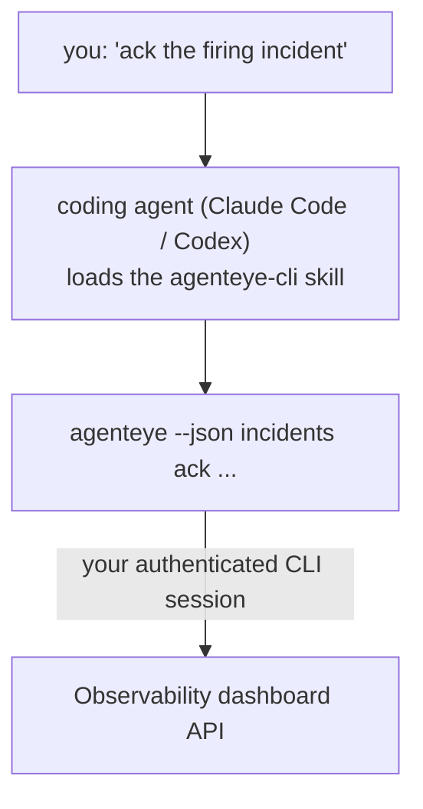

Ask your coding agent *"is anything broken today?"* and let it answer from your live Failproof AI Observability data, with no commands to memorize. The **Failproof AI Observability CLI skill** (`agenteye-cli`) is an *Agent Skill*: a small folder of instructions that a coding agent such as Claude Code or Codex loads on demand. It teaches the agent to operate your Observability deployment through the [`agenteye` CLI](/agenteye/cli) from plain-English requests like *"give CI a key that can only push events"* or *"ack the firing incident and assign it to me."*

It is **not** a service or a separate binary; there is nothing to deploy. It rides on top of the CLI you have already installed: the agent shells out to `agenteye --json …`, parses the clean JSON, and answers you in prose. Everything it can do, you could do yourself by typing the same commands.

---

## How it relates to the other Failproof AI Observability interfaces

Failproof AI Observability gives you four ways to reach the same data and controls. They complement each other:

| Interface | What it is | Where it runs | Reach for it when |
|---|---|---|---|
| **[CLI](/agenteye/cli)** | The command/flag reference for `agenteye` | Your terminal | You want to run or script a specific command |
| **[CLI recipes](/agenteye/cli-recipes)** | Copy-paste `jq`/pipeline patterns | Your terminal / scripts | You're wiring the CLI into automation |
| **CLI skill** (this doc) | A natural-language front door on the CLI | Your coding agent, on your workstation | You want to *just ask* and let the agent pick the command |
| **[In-dashboard AI assistant](/agenteye/assistant)** | A chat embedded in the dashboard | Server-side (in the dashboard) | You want in-dashboard Q&A over your data |

The skill itself has no privileges of its own; it just turns your words into CLI calls that run as you:



### vs. the in-dashboard AI assistant: an important distinction

These are two different tools with very different blast radii:

- The **in-dashboard AI assistant** ([AI assistant](/agenteye/assistant)) is a chat embedded in the dashboard, backed by the agent service. It is **read-only plus approval-gated authoring**: it can draft saved queries and dashboards, but every write pauses for your explicit click-approval, and it never deletes. It is gated by the `agent:use` permission and only ever sees data for the org you're viewing.
- The **CLI skill** runs on *your* workstation inside *your* coding agent and drives the `agenteye` CLI as **you**. It can perform the CLI's **full surface, including mutations** (create/rotate/disable API keys, change org settings, resolve incidents, delete saved queries), bounded only by the permissions of your CLI login. Treat it exactly as carefully as you would treat running those commands by hand.

---

## Prerequisites

1. The **`agenteye` CLI installed** and on `PATH` (see the [CLI](/agenteye/cli) reference: `pipx install agenteye`).
2. Your **dashboard URL** set (`AGENTEYE_DASHBOARD_URL`, or the agent passes `--base-url`).
3. A **logged-in session**: run `agenteye login` yourself first. The skill **cannot** complete the emailed one-time-code login for you; it will tell you to run `agenteye login` if the session is missing or expired (CLI exit code `4`).

---

## Where to get it

The skill is published in Failproof AI's public skills collection:

**[github.com/FailproofAI/skills](https://github.com/FailproofAI/skills)** → [`skills/agenteye-cli/`](https://github.com/FailproofAI/skills/tree/main/skills/agenteye-cli)

Nothing about it is gated — the repository is public and the skill needs no credential of its own, because it only drives the **public** `agenteye` CLI against *your* dashboard, using the session *you* logged in with. You do not need to ask anyone for it.

Note it ships as its own folder and is **not** inside the `pipx install agenteye` package, so don't look for it there.

## Installing the skill

The quickest path is the [`skills`](https://skills.sh) CLI, which fetches the folder and drops it where your agent looks:

```bash
# Claude Code, this project only
npx skills add FailproofAI/skills --skill agenteye-cli -a claude-code

# every project (installs to ~/.claude/skills/)
npx skills add FailproofAI/skills --skill agenteye-cli -a claude-code -g --copy

# Codex instead
npx skills add FailproofAI/skills --skill agenteye-cli -a codex
```

Then manage it like any other skill:

```bash
npx skills list -a claude-code      # what's installed
npx skills update agenteye-cli      # pull the latest version
npx skills remove agenteye-cli      # remove it
```

Prefer to install by hand? An Agent Skill is just a folder containing a `SKILL.md` (plus optional references), so copying it works too:

- **Claude Code**: put the `agenteye-cli/` folder in `~/.claude/skills/` (every project) or `<your-repo>/.claude/skills/` (that repo only). Claude Code auto-discovers it — verify with the `/skills` list, or simply ask a question that matches its description.
- **Codex (OpenAI)**: Codex reads the same `SKILL.md`. The bundled `agents/openai.yaml` sets `allow_implicit_invocation: true`, so Codex auto-selects the skill when a task matches; otherwise invoke it explicitly as `$agenteye-cli`.

---

## Safety: mutations do NOT prompt when an agent runs the CLI

> **Warning:** Read this before letting an agent make changes.

The `agenteye` CLI normally asks *"are you sure?"* before a destructive action. It **auto-skips that confirmation whenever it is not attached to a terminal (which is exactly how a coding agent runs it), and `--json` skips it too.** So the safety prompt will **not** fire for the agent.

The skill is written to compensate: it is instructed to state the exact command it will run and get your explicit **OK before any state change**. Keep that discipline. When you drive Failproof AI Observability through an agent, *you* are the confirmation step. The state-changing commands to watch for:

- `keys create` / `update` / `disable` / `regenerate`
- `users create` / `update` / `disable` / `enable`
- `settings set`
- `alerts create` / `update` / `delete` / `test`
- the writing `incidents` subcommands: `ack` / `assign` / `resolve` / `open` / `comment-add` / `comment-delete` / `subscribe` / `unsubscribe`
- `query create` / `update` / `delete`
- `agent rename` / `delete`
- `orgs switch`

Everything under **Observe** (`events`, `sessions`, `evals`, `errors`, `list`, `whoami`, `orgs list/current/perms`) is read-only and changes nothing.

Because the agent acts as **you**, it can only do what your login is permitted to do; permissions are resolved **per org** (see [API keys](/agenteye/api-keys)). A command you lack permission for returns exit code `5` with the exact permission named, so the agent can tell you precisely what to ask an admin for rather than failing opaquely.

---

## What you can ask it

Here's what a real round-trip looks like, a read, then a change that waits for your OK:

```text
you   ▸ Is anything broken in the last day?

agent ▸ Running: agenteye --json errors --since 24h --aggregate
        3 error types in the last 24h. The biggest is TimeoutError
        (18 hits, all on the checkout-agent), then RateLimited (5).
        Want the failing sessions for TimeoutError?

you   ▸ Give CI a key that can only push events.

agent ▸ This creates an API key. I'll run:
          agenteye keys create ci --add events:add
        OK to proceed?

you   ▸ yes

agent ▸ Done. Key "ci" created with events:add only.
        The secret is shown only once, so store it now. I can't reprint it.
```

The skill maps each plain-English intent to the right `agenteye` command, discovering valid values first (`list <kind>`, `whoami`) so it doesn't guess, and stating the exact command before any change. More examples:

- *"Is anything broken / failing in the last 24 hours?"* → `errors --since 24h --aggregate`, then a breakdown.
- *"Why did session `run-001` fail?"* → `events --session-id run-001 --all` + `evals --session-id run-001`.
- *"How is quality trending this week?"* → `evals --aggregate --since 7d`, then drill into low-scoring runs.
- *"Give CI a key that can only push events."* → `keys create ci --add events:add` (it states the command, then creates it and captures the one-time secret).
- *"Who has access? Make Dana read-only."* → `users list` → `users update dana@… --permission-set read-only` (after confirming with you).
- *"Ack the firing incident and assign it to me."* → `incidents list --state firing` → `incidents ack <id>` / `incidents assign <id> you@…`.

For the exact commands, flags, and JSON shapes behind these, see the [CLI](/agenteye/cli) reference and [CLI recipes for agents](/agenteye/cli-recipes).

---

## Next steps

- **[CLI](/agenteye/cli)**: full command and flag reference for `agenteye`.
- **[CLI recipes for agents](/agenteye/cli-recipes)**: copy-paste `jq` patterns and exit-code handling.
- **[AI assistant](/agenteye/assistant)**: the in-dashboard assistant (not to be confused with this terminal skill).
- **[API keys](/agenteye/api-keys)**: the per-org permission model that bounds what the skill can do.
