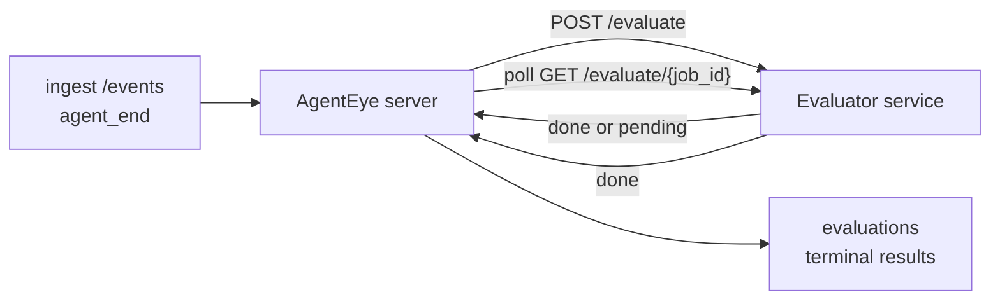

AgentEye can automatically score every finished agent run for quality: you supply a small scoring service, and AgentEye handles the rest. Use it to track the dimensions you care about (helpfulness, tool efficiency, factuality, safety; you choose), catch regressions early, and compare agents or environments at a glance. Scoring is opt-in: the pipeline does nothing until you set `EVALUATOR_ENDPOINT` on the server.

> **Note:** You define the score dimensions. Your evaluator can return any numeric keys it likes; AgentEye stores, trends, and displays whatever you send back.

## At a glance

1. **Write a scorer.** Stand up a small HTTP service that reads a session transcript and returns scores. AgentEye ships a working reference you can copy. See [Writing an evaluator with the SDK](#writing-an-evaluator-with-the-sdk).
2. **Point AgentEye at it.** Set `EVALUATOR_ENDPOINT` (and a shared `EVALUATOR_TOKEN`) on the server process.
3. **Watch the scores land.** Every completed session is scored automatically; results show up on the session detail page, the sessions grid, and saved dashboards.


*Once an evaluator is configured, each completed run is scored and the results appear in the session's right rail: the summary on top, then per-dimension score bars with reasoning.*

---

## How it works



When the AgentEye SDK emits an `agent_end` event for a session, the server
schedules an evaluation. It then POSTs the full event transcript to your
evaluator service, which can either:

- **Return the result inline** with `{"status":"done", "scores":{...}, "reasoning":{...}, "summary":"..."}`. The
  result is appended to the session's evaluation timeline. `reasoning` and
  `summary` are optional.
- **Defer** with `{"status":"pending", "job_id":"abc-123"}`. AgentEye then
  calls `GET {EVALUATOR_ENDPOINT}/evaluate/abc-123` until your evaluator
  returns `{"status":"done", ...}` or `{"status":"error", "error":"..."}`.

  The polling cadence is per-job: a `pending` response may include
  `next_poll_secs` to override; otherwise AgentEye uses the
  `default_poll_interval_secs` value from `GET /config`; otherwise the server
  falls back to `EVALUATOR_POLLING_INTERVAL_SECS` (default 10s). All values
  are clamped to [1s, 1h].

Sessions that never emit `agent_end` (for example, a crashed agent process)
can also be picked up: the evaluator's `GET /config` may return
`{"inactivity_timeout_secs": 1800}`, and AgentEye will evaluate any session
that has gone idle for that long. Set the field to `null` or omit it to
disable this fallback.

The pipeline is fully no-op when `EVALUATOR_ENDPOINT` is unset.

A session can accumulate **multiple terminal evaluations over time**: each
`agent_end` event (and each manual re-eval from the dashboard) appends a
fresh evaluation row. This is the supported way to evaluate a resumed
conversation: a user ends an agent, comes back later, sends more events,
ends the agent again, and a second evaluation runs against the full updated
transcript. The dashboard renders the most-recent evaluation as the
headline and the prior evaluations as a collapsible timeline. While one
evaluation is running for a session, additional `agent_end` events for that
session are ignored; the next one after the running evaluation completes
will enqueue a fresh evaluation as usual.

The inactivity fallback re-engages on resumed sessions too: if new events
arrive after a previous terminal evaluation and the session then goes idle
past `inactivity_timeout_secs`, a fresh evaluation is enqueued.

Transient failures (5xx, 429, timeouts, network errors) are retried with
exponential backoff up to `EVALUATOR_MAX_ATTEMPTS`; 4xx responses are
terminal. AgentEye is safe to run with multiple horizontally-scaled server
instances; work is partitioned so the same session is never dispatched
twice concurrently.

---

## HTTP contract

Every authenticated route uses **bearer token auth**. The same value must be
configured on both sides:

- AgentEye server: env var `EVALUATOR_TOKEN`
- Evaluator service: configured the same way (the `agenteye-evaluator` SDK
  reads `EVALUATOR_TOKEN` by convention)

If `EVALUATOR_TOKEN` is unset, the server sends no `Authorization` header; the
evaluator may then accept anonymous requests, which is fine for an
internal-only network but discouraged on the public internet.

### Routes the evaluator must serve

| Route | Body / params | Response |
|---|---|---|
| `GET /health` | none | `{"status":"ok"}` (open, no auth) |
| `GET /config` | none | `{"inactivity_timeout_secs": <int> \| null, "default_poll_interval_secs": <int> \| omitted}` |
| `POST /evaluate` | `EvalRequest` JSON | `{"status":"done", ...}` or `{"status":"pending", "job_id":"..."}` |
| `GET /evaluate/{id}` | none | same response shape as `/evaluate` |

### `EvalRequest` body sent by the server

```json
{
  "schema_version": "1",
  "session_id":     "session-abc123",
  "agent_id":       "planner",
  "environment":    "production",
  "started_at":     "2026-05-10T12:00:00Z",
  "ended_at":       "2026-05-10T12:05:00Z",
  "events": [
    { "id": 1234, "ts": "...", "event_type": "agent_start", "payload": { ... } },
    ...
  ]
}
```

### Response shapes

**Sync (done):**

```json
{
  "status": "done",
  "scores": { "helpfulness": 0.85, "tool_efficiency": 0.6 },
  "reasoning": {
    "helpfulness": "answered the question directly with citations",
    "tool_efficiency": "called list_files three times when one would have done"
  },
  "summary": "strong answer quality, weak tool selection"
}
```

`reasoning` (a per-score justification map) and `summary` (an overall
one-paragraph narrative) are both optional. Keys in `reasoning` should
mirror keys in `scores`; the dashboard renders each entry inline under
its score bar. Older evaluators that return only `scores` continue to
work unchanged; `reasoning` and `summary` simply read as null and
the corresponding UI affordances are omitted.

**Async (deferred):**

```json
{ "status": "pending", "job_id": "abc-123", "next_poll_secs": 30 }
```

`next_poll_secs` is optional; if omitted the server falls back to the
evaluator's `default_poll_interval_secs` from `/config`, then to its own
`EVALUATOR_POLLING_INTERVAL_SECS` env var.

**Terminal evaluator-side error:**

```json
{ "status": "error", "error": "model service unavailable" }
```

The server treats any other 2xx body as a protocol error and records a
terminal `error` for the session.

---

## Writing an evaluator with the SDK

You don't have to implement the HTTP contract by hand. The `agenteye-evaluator`
Python package gives you a typed FastAPI wrapper that handles auth, routing, and
the request/response shapes for you.

AgentEye also ships a **working reference evaluator**
(`deploy/examples/evaluator/evaluator.py`) that scores `helpfulness`,
`tool_efficiency`, and `factuality` from the shape of the transcript. Copy it as
a starting point and swap in your own logic: an LLM judge, a rule engine,
whatever fits your quality bar.

> **Note:** The `agenteye-evaluator` SDK is delivered to signed enterprise
> customers as a wheel/sdist inside each release tarball on the
> [agenteye-enterprise releases page](https://github.com/agenteye-enterprise/releases).
> It is not published to public PyPI. Install it from the wheel you download,
> or from the bundled `evaluator-sdk/` source, as the reference Dockerfile below
> does.

Minimum viable evaluator:

```python
import os
from agenteye_evaluator import Evaluator, EvalRequest, EvalResponse

app = Evaluator(token=os.environ["EVALUATOR_TOKEN"])

@app.evaluator
def run(req: EvalRequest) -> EvalResponse:
    # Inspect req.events (the full session transcript) and return scores.
    tool_calls = sum(1 for e in req.events if e.event_type == "tool_use")
    return EvalResponse(
        scores={"tool_calls": float(tool_calls)},
        reasoning={"tool_calls": f"{tool_calls} tool invocations in the transcript"},
        summary="tight tool loop" if tool_calls < 5 else "agent looped on tools",
    )
```

The `app` instance runs under any ASGI server, so `uvicorn module:app` starts it.

For evaluators that need to defer expensive work, return `JobPending`
instead and register a `@app.job_lookup` handler; the AgentEye server
polls `GET /evaluate/{job_id}` until you return a terminal status or the
`EVALUATOR_MAX_POLL_DURATION_SECS` cap (default 1 h) elapses.

The full API reference, async pattern, and event schema ship with the SDK: the
`agenteye-evaluator` README is included in each release tarball on the
[agenteye-enterprise releases page](https://github.com/agenteye-enterprise/releases).

---

## Running an evaluator on Kubernetes

The evaluator is **your service**: AgentEye does not ship a default
evaluator container. The signed enterprise release includes reference Kubernetes
manifests under `deploy/examples/evaluator/` that you can apply as-is after
swapping in your image and a shared bearer token.

> **Note:** The `deploy/` example bundle referenced throughout this section ships
> with the signed enterprise release. If you're reading from the public docs and
> don't have it yet, treat the manifests below as a template. The important
> shapes (Deployment, Service, secret) are shown inline.

### 1. Containerize your evaluator

A minimal Dockerfile for your evaluator:

```dockerfile
FROM python:3.12-slim
WORKDIR /app
# Install the agenteye-evaluator SDK from the bundled source that ships in your
# release (it is not on public PyPI). Build with the repo root as the context so
# this COPY can see the evaluator-sdk/ directory.
COPY evaluator-sdk /app/evaluator-sdk
RUN pip install --no-cache-dir /app/evaluator-sdk 'uvicorn[standard]>=0.30'
COPY my_evaluator.py .
RUN useradd --uid 10001 --create-home --shell /usr/sbin/nologin evaluator \
    && chown -R evaluator:evaluator /app
USER evaluator
EXPOSE 9000
CMD ["uvicorn", "my_evaluator:app", "--host", "0.0.0.0", "--port", "9000"]
```

`runAsNonRoot` (UID 10001) keeps the container compatible with Pod
Security restricted profiles.

### 2. Create the shared bearer token

```bash
kubectl -n agenteye create secret generic evaluator-token \
  --from-literal=token="$(openssl rand -hex 32)"
```

Use the same value as `EVALUATOR_TOKEN` on the AgentEye server. The
server sends `Authorization: Bearer <token>` on every request; the SDK
uses `hmac.compare_digest` for a constant-time check and rejects
mismatches with HTTP 401.

### 3. Apply the example manifests

```bash
# Edit deploy/examples/evaluator/deployment.yaml first to point
# `image:` at your registry, then:
kubectl apply -k deploy/examples/evaluator/
```

The example includes:

- A 2-replica Deployment with `runAsNonRoot`, read-only root filesystem,
  all capabilities dropped, liveness + readiness on `/health`
- A ClusterIP Service on port 9000
- A `secret.example.yaml` template (intentionally excluded from the
  Kustomization; create the real secret out-of-band so no token lands
  in git)

### 4. Wire AgentEye to it

On the AgentEye server, set:

```bash
EVALUATOR_ENDPOINT=http://evaluator:9000
EVALUATOR_TOKEN=<the value generated above>
```

The server fans out `EVALUATOR_WORKERS × EVALUATOR_CLAIM_BATCH`
concurrent requests across all evaluator pods (defaults: `2 × 4 = 8`).
Scale `replicas` and per-pod resource limits in concert with these
server-side knobs.

### Verification

```bash
kubectl -n agenteye port-forward svc/evaluator 9000:9000
curl -s http://localhost:9000/health   # → {"status":"ok"}
```

After an agent runs end-to-end, `GET /evaluations` on the AgentEye
server should return a row with `status: "done"` and the scores your
evaluator produced.

---

## Configuring the AgentEye server

Set on the server process:

| Env var | Meaning |
|---|---|
| `EVALUATOR_ENDPOINT` | Base URL of your evaluator (`http://evaluator:9000`). Unset = pipeline disabled. |
| `EVALUATOR_TOKEN` | Bearer token. Must equal the value the evaluator service is configured with. |
| `EVALUATOR_WORKERS` | Worker tasks per server instance (default 2). |
| `EVALUATOR_CLAIM_BATCH` | Rows claimed per worker tick (default 4). Batches are processed **concurrently**; effective concurrency on your evaluator endpoint is `EVALUATOR_WORKERS × EVALUATOR_CLAIM_BATCH`. |
| `EVALUATOR_POLL_IDLE_SECS` | How long a worker sleeps between dispatch attempts when no evaluation is due (default 2s). |
| `EVALUATOR_POLLING_INTERVAL_SECS` | Final fallback for `GET /evaluate/{id}` cadence when neither the per-response `next_poll_secs` nor the evaluator's `default_poll_interval_secs` is set (default 10s). |
| `EVALUATOR_REQUEST_TIMEOUT_MS` | Per-request timeout (default 30000). |
| `EVALUATOR_MAX_ATTEMPTS` | After this many transient failures the result is recorded as terminal `error` (default 5). |
| `EVALUATOR_CONFIG_REFRESH_SECS` | `GET /config` cadence (default 300). |
| `EVALUATOR_MAX_POLL_DURATION_SECS` | Maximum wallclock time a session may remain in the polling queue before it's terminated as `timeout` (default 3600s). Guards against an evaluator that keeps returning `pending` forever. |

To turn on automatic scoring across the whole instance, provision the `agenteye-evaluator` Secret with both keys set. On the bundled Kubernetes manifests, the server reads `EVALUATOR_ENDPOINT` and `EVALUATOR_TOKEN` from this optional Secret. Create it via your organization's standard secret-management process, then restart the server Deployment to pick up the change.

The tuning knobs above are not wired by default; expose the corresponding environment variables on the server container in your Deployment manifest if you need to override the defaults.

See [Deployment](/agenteye/deployment) for the full env var table.

---

## API reference

| Method | Path | Required permission | Purpose |
|---|---|---|---|
| `GET` | `/evaluations` | `evaluations:read` | Query terminal results. Supports `session_id`, `agent_id`, `environment`, `status` (`done`/`error`/`timeout`), `ts_from`, `ts_to`, `cursor`, `limit`, `score_filters`, `latest_per_session`. `limit` defaults to 50 and is capped at 200 (note this differs from `/events`, which caps at 1000). `environment` accepts a comma-separated list (e.g. `environment=prod,staging`); single values still work. With `latest_per_session=true` the response contains at most one row per `session_id` (the most recent by `completed_at`) used by the sessions-list page to collapse a session's evaluation timeline to its current headline. Defaults to false (returns the full history). |
| `GET` | `/evaluations/aggregate` | `evaluations:read` | Rolled-up eval health for a filtered slice: total count, a done/error/timeout breakdown, per-score-key stats (count/avg/min/max/p50 over the arbitrary `scores` keys), and a time-bucketed timeline. Accepts the **same filter params as `/evaluations`** plus `featured_keys` (CSV of score keys to trend) and `latest_per_session`. Powers the Dashboards feature; metrics are exact over the whole matching set, not sampled. |
| `GET` | `/evaluations/environments` | `evaluations:read` | Distinct environment values from the `evaluations` table. Used to populate filter dropdowns scoped to evaluation-readable data. |
| `GET` | `/evaluation-jobs` | `evaluations:read` | Visibility into in-flight evaluations. Filter by `status` (`pending`/`polling`). |
| `GET` | `/events` | `events:read` | Stream a session's raw events. Supports `session_id`, `agent_id`, `event_type` (CSV), `environment` (CSV), `ts_from`, `ts_to`, `cursor`, `limit`, and `order`. `order` is `desc` (newest-first, the default) or `asc` (oldest-first); an unrecognized value falls back to `desc`. Cursor-paginate via the response's `next_cursor` (an event id): pass it back as `cursor` to get the next page; with `asc` the next page is the events after that id, with `desc` the events before it. `limit` defaults to 50 and is capped at 1000. |
| `GET` | `/sessions/:session_id/export` | `events:read` | Returns the exact JSON body the evaluator would receive for this session, served as a downloadable attachment named `session-<id>.json`. Useful for replaying production sessions through `agenteye-evaluator` for offline testing. The bytes are byte-identical to what the evaluator pipeline sends. |
| `POST` | `/sessions/:session_id/re-evaluate` | `evaluations:trigger` | Enqueue a fresh evaluation for a session; runs whether or not a prior evaluation exists. The new result is **appended** to the session's evaluation timeline rather than overwriting the previous one, so prior scores remain visible as history. Returns `202` on enqueue, `404` for an unknown session, `409` if an evaluation is already in flight. Use this after deploying a new evaluator, or for sessions that never emitted `agent_end`. |

### Filtering by score range: `score_filters`

`GET /evaluations` accepts an optional `score_filters` parameter that
narrows results by numeric values inside the `scores` object. The
parameter is a comma-separated list of `key:min..max` entries; either
bound may be omitted. Multiple entries combine with logical AND. Rows
where the named key is absent or non-numeric are excluded. A request may
carry at most 20 filter entries; exceeding that returns HTTP 400.

Examples:
```text
# helpfulness in [0.5, 0.8]
GET /evaluations?score_filters=helpfulness:0.5..0.8

# tool_efficiency at most 0.3 (no lower bound)
GET /evaluations?score_filters=tool_efficiency:..0.3

# helpfulness >= 0.5 AND factuality >= 0.9
GET /evaluations?score_filters=helpfulness:0.5..,factuality:0.9..
```

Each `/evaluations` response object has these fields:

| Field | Type | Notes |
|---|---|---|
| `evaluation_id` | string (UUID) | The canonical identifier for this terminal evaluation. Each terminal evaluation gets a new UUID; a single session can hold multiple. |
| `id` | string (UUID) | Backwards-compatibility alias carrying the same value as `evaluation_id`. |
| `session_id` | string | The session this evaluation ran against. A session can have multiple evaluations in the timeline. |
| `agent_id` | string | Identifies the agent that produced the session. |
| `environment` | string | Environment label copied from the session. |
| `status` | enum | One of `"done"`, `"error"`, `"timeout"`. |
| `scores` | object \| null | Scores returned by your evaluator. |
| `reasoning` | object \| null | Optional per-score justification map returned by your evaluator. Keys typically mirror those in `scores`. The dashboard renders each entry under its score bar. |
| `summary` | string \| null | Optional one-paragraph overall narrative returned by your evaluator. The dashboard renders this above the per-score breakdown as the evaluation's headline. |
| `error` | string \| null | Populated on `"error"` / `"timeout"` only. |
| `attempt_count` | integer | Number of dispatch attempts (≥ 1). |
| `duration_ms` | integer \| null | Duration of the final attempt. |
| `completed_at` | string (ISO 8601 UTC) | When the terminal result was recorded. Results are ordered by `completed_at` (newest first). |
| `created_at` | string (ISO 8601 UTC) | Carries the same timestamp as `completed_at` (write-once semantics). |

---

## Permissions

| Permission | Grants |
|---|---|
| `evaluations:read` | List evaluation results, view scores in the dashboard, and load dashboard health metrics. |
| `evaluations:trigger` | Manually enqueue an evaluation for a session via `POST /sessions/:session_id/re-evaluate` or the dashboard's re-evaluate button. |
| `dashboards:read` | View saved dashboards (also needs `evaluations:read` to load their metrics). |
| `dashboards:write` | Create and edit dashboards. |
| `dashboards:delete` | Delete dashboards. |

The bootstrap admin (`ADMIN_KEY`, `ADMIN_EMAIL`) automatically receives these.

---

## Viewing results

- **`/sessions/<id>`**: events timeline + a right rail showing the session's
  scores and any error from the dispatch attempt. If your key has
  `evaluations:trigger`, a **re-evaluate** button appears next to the export
  button, useful for sessions that never emitted `agent_end`, or for
  refreshing scores after deploying a new evaluator. The dashboard polls for
  the new result and updates the right rail when it lands.
- **`/sessions`**: filterable session grid; the score column shows each
  session's evaluation status and scores at a glance.
- **`/dashboards`**: saved eval-health views (see [Dashboards](#dashboards) below).


*The sessions grid shows each run's evaluation status and scores at a glance; red/amber/green badges make low scores jump out.*

---

## Dashboards

The **Dashboards** page (`/dashboards`) lets you save a combination of evaluation
filters as a named, reusable view and watch how that slice of evaluations is
doing at a glance. Dashboards are **shared across your whole organization**;
everyone with `dashboards:read` sees the same set.

Each dashboard pins:

- **Filters**: the same controls as the sessions page: environment, status,
  agent, a rolling time window, and score-range filters (`key:min..max`).
- **A display configuration**: which score keys to feature, the green/amber/red
  health thresholds, which panels to show, and whether to collapse to the latest
  evaluation per session.

Each card shows the number of matching sessions, a done/error/timeout breakdown,
the average of each featured score, and a small trend sparkline. Opening a
dashboard shows the full-size panels; **"open in sessions"** drops you into the
sessions page pre-filtered to exactly that slice. Metrics are computed
server-side over the whole matching set (via `GET /evaluations/aggregate`), so
the numbers are exact rather than sampled.


**Permissions:** viewing needs both `dashboards:read` and `evaluations:read`;
creating and editing needs `dashboards:write`; deleting needs `dashboards:delete`.
The bootstrap admin receives all of these automatically.

---

## Troubleshooting

**Sessions exist but no evaluations are created.** Confirm `EVALUATOR_ENDPOINT`
is set on the server process, that the server and evaluator share the same
`EVALUATOR_TOKEN` value, and that the evaluator's `/health` endpoint is
reachable from the server. With `EVALUATOR_ENDPOINT` unset the pipeline is a
no-op.

**In-flight evaluations pile up.** Query `GET /evaluation-jobs` to see the
in-flight queue. Inspect `attempt_count`, `next_attempt_at`, and `last_error`
on each row. Common causes: evaluator service unreachable or returning 5xx
(retried with backoff), wrong `EVALUATOR_TOKEN` (401 is terminal), or an
async evaluator that returns `pending` indefinitely (see below).

**Sessions completed but no terminal evaluation.** Query
`GET /evaluation-jobs?status=polling`; the result may still be in flight.
If a job is stuck in `pending`, the server is having trouble reaching the
evaluator; check that the evaluator is up and that `EVALUATOR_TOKEN` matches.

**`HTTP 401 from evaluator: invalid bearer token`.** The `EVALUATOR_TOKEN`
on the server does not match the value the evaluator service is configured
with. They must be identical.

**Async evaluator returns `pending` forever.** The server polls
`GET /evaluate/{job_id}` until the evaluator returns `done` or `error`, or
until `EVALUATOR_MAX_POLL_DURATION_SECS` (default 1 h) elapses. After the cap
the evaluation is recorded as `timeout` and removed from the in-flight queue.
Raise `EVALUATOR_MAX_POLL_DURATION_SECS` if your evaluator legitimately needs
longer than the default.

---

## Next steps

- [Python SDK](/agenteye/python-sdk): emit the `agent_end` events that trigger scoring.
- [Deployment](/agenteye/deployment): the full server env var reference, including the evaluator knobs.
- [API keys](/agenteye/api-keys): the `evaluations:read` and `evaluations:trigger` permissions.
- [Audits](/agenteye/audits): AgentEye's other automated quality feature, for policy-based review.
