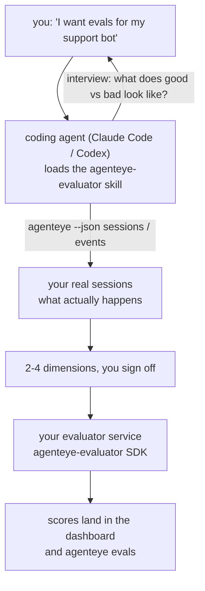

Go from *"I think our agent is sometimes bad"* to a deployed scoring service, with your coding agent doing both the deciding and the building. The **Failproof AI Observability evaluator skill** (`agenteye-evaluator`) is an *Agent Skill*: a small folder of instructions that a coding agent such as Claude Code or Codex loads on demand. It teaches the agent to work out which quality dimensions are worth tracking for *your* agent, then write, test, and deploy the [evaluator service](/agenteye/evaluation-suite) that scores them.

It is **not** a hosted scorer, a registry you upload to, or a plugin system. Your evaluator stays your own HTTP service on your own infrastructure, exactly as described in the [Evaluation suite](/agenteye/evaluation-suite) guide. The skill only teaches your agent to build it well, so everything it does, you could do yourself by writing the same code.

---

## The hard part is deciding what to score

The SDK surface is small — a decorator and two models — and an agent can write that from the [contract](/agenteye/evaluation-suite#http-contract) alone. That's not where evaluators fail. They fail because they score the wrong thing, and an evaluator that scores the wrong thing is worse than none: it produces a dashboard everyone learns to ignore.

So most of the skill is the part before any code exists. It has the agent interview you (*"describe a run that went well; now one that went badly"*), then pull your real sessions through the [`agenteye` CLI](/agenteye/cli) and read them end to end. Those two halves usually disagree, and the gap is the point: what you intend to measure versus what your transcripts can actually support. A dimension only survives if it is **computable** from the events and **discriminating** — if it scores 0.9 on both your good run and your bad one, it teaches nothing and gets cut.

What comes back is a proposal of 2-4 dimensions with the reasoning attached, for you to sign off on before a line is written.



---

## How it relates to the other evaluation pieces

Four docs cover scoring, and they hand off to each other in order:

| Page | What it is | Reach for it when |
|---|---|---|
| **[Evaluations](/agenteye/evaluations)** | The feature: scores on the sessions grid, dashboards, re-evaluate | You want to know what automatic scoring gets you |
| **[Evaluation suite](/agenteye/evaluation-suite)** | The HTTP contract, the SDK, the server env vars | You're implementing or debugging the evaluator yourself |
| **Evaluator skill** (this doc) | A natural-language front door on designing *and* building the scorer | You want to go from "I want evals" to a running service |
| **[CLI skill](/agenteye/cli-skill)** | A natural-language front door on the `agenteye` CLI | You want to *read* the scores you already have |
| **[Python SDK skill](/agenteye/python-sdk-skill)** | A natural-language front door on instrumenting your agent | Your agent isn't emitting sessions yet — there is nothing to score |

### vs. the CLI skill: build versus read

The two skills are deliberately non-overlapping, and installing both is the normal setup — the agent picks between them based on what you ask:

- **`agenteye-evaluator`** (this doc) builds the thing that *produces* scores. Its job ends when scores land for the first time.
- **[`agenteye-cli`](/agenteye/cli-skill)** reads scores that already exist (`agenteye evals`). *"Did quality drop this week?"* is its question, not this skill's.

---

## Prerequisites

1. The **`agenteye` CLI installed and logged in** (`pipx install agenteye`, then `agenteye login`). The skill leans on it twice: to pull the real sessions it designs against, and to confirm your scores landed at the end. Your login needs `events:read`, plus `evaluations:read` for that final check. As with the CLI skill, it **cannot** complete the emailed one-time-code login for you.
2. **Somewhere for the evaluator to live.** It gets built into an image and run as a long-running service, so it needs a real repo, not a scratch file. Evaluators often live in their own repo, separate from the agent being scored — the skill looks for an existing one and asks before scaffolding a new one.
3. **The `agenteye-evaluator` SDK wheel** — read the next section before your agent starts typing `pip` commands.

---

## Where to get it

The skill is published in Failproof AI's public skills collection:

**[github.com/FailproofAI/skills](https://github.com/FailproofAI/skills)** → [`skills/agenteye-evaluator/`](https://github.com/FailproofAI/skills/tree/main/skills/agenteye-evaluator)

The repository is public and the skill needs no credential of its own — it only drives the `agenteye` CLI with the session *you* logged in with, and writes code in *your* repo. Note it ships as its own folder and is **not** inside the `pipx install agenteye` package, so don't look for it there.

## Installing the skill

The quickest path is the [`skills`](https://skills.sh) CLI, which fetches the folder and drops it where your agent looks:

```bash
# Claude Code, this project only
npx skills add FailproofAI/skills --skill agenteye-evaluator -a claude-code

# every project (installs to ~/.claude/skills/)
npx skills add FailproofAI/skills --skill agenteye-evaluator -a claude-code -g --copy

# Codex instead
npx skills add FailproofAI/skills --skill agenteye-evaluator -a codex
```

Then manage it like any other skill:

```bash
npx skills list -a claude-code           # what's installed
npx skills update agenteye-evaluator     # pull the latest version
npx skills remove agenteye-evaluator     # remove it
```

Prefer to install by hand? An Agent Skill is just a folder containing a `SKILL.md` (plus optional references), so copying it works too:

- **Claude Code**: put the `agenteye-evaluator/` folder in `~/.claude/skills/` (every project) or `<your-repo>/.claude/skills/` (that repo only). Claude Code auto-discovers it — verify with the `/skills` list, or just ask for evals.
- **Codex (OpenAI)**: Codex reads the same `SKILL.md`. The bundled `agents/openai.yaml` sets `allow_implicit_invocation: true`, so Codex auto-selects the skill when a task matches; otherwise invoke it explicitly as `$agenteye-evaluator`.

---

## The SDK is not on public PyPI

> **Warning:** Read this before letting an agent install the SDK.

The skill is public; the SDK it drives is not. `agenteye-evaluator` ships only as a private release artifact, and unlike `agenteye`, the name is **unclaimed on public PyPI** — so a bare `pip install agenteye-evaluator` could pull a stranger's package into the service that reads your production transcripts. That's a supply-chain problem, not a typo.

The skill knows this and works down an install ladder instead, stopping at the first rung that applies: the monorepo source if you're inside the AgentEye repo, otherwise the private release wheel from GitHub Releases (needs access), and if neither is reachable it **stops and tells you to ask your Failproof AI contact for the wheel** rather than improvising.

So if your agent proposes a bare `pip install agenteye-evaluator` from public PyPI, that is the tell that the skill never loaded. Stop there and check it's installed.

---

## What you can ask it

A real round-trip starts with a vague ask and ends with a signed-off design, not with code:

```text
you   ▸ I want evals for our support bot. I think it's sometimes bad.

agent ▸ Before I write anything: describe a run that went well,
        and one that went badly.

you   ▸ Good: it answers from the docs. Bad: it makes stuff up,
        or gives up and says "contact support".

agent ▸ Running: agenteye --json sessions --status error --since 7d
        Reading 5 sessions, including two you'd call bad.

        Your words say factuality and deflection. The transcripts
        agree on deflection (2 of 5 end with a support hand-off,
        and it's plain in model_response.content), but factuality
        needs a ground truth your events don't carry.

        So I'd score three things:
          - deflection      rules, cheap, separates your two runs
          - tool_efficiency rules, catches the retry loop in run-004
          - groundedness    LLM judge: is every claim in the docs it retrieved?

        "factuality" would need ground truth we don't have; groundedness
        is the closest thing your transcripts can actually support.
        OK with those three names? Renaming later splits the history.

you   ▸ yes

agent ▸ No evaluator in this repo. Should I scaffold one here, or do
        you have one elsewhere?
```

From there it writes the rules-based dimensions first (free, instant, deterministic), tests them against a real captured session including the empty and never-finished ones that crash naive evaluators, and only reaches for an LLM judge on the subjective dimension. It knows the [dispatcher's limits](/agenteye/evaluation-suite#configuring-the-server) — a 30s request timeout and 8 concurrent calls deployment-wide — so if the judge won't reliably fit, it goes async with `JobPending` rather than letting your judge get cancelled and retried five times at five times the cost.

Then it deploys, sets the two server env vars, and confirms with `agenteye --json evals --session-id <id>` that scores actually landed. Scores landing is the only proof.

---

## What to watch for

- **Dimension names are close to permanent.** Score keys are arbitrary strings and the platform trends whatever you send, which means nothing downstream corrects a bad choice. Rename later and the history splits: old sessions keep the old key and the trend breaks. This is why the skill gets explicit sign-off before writing code — take that prompt seriously.
- **Fixtures are real production transcripts.** Designing against real sessions means pulling them to disk, and they can contain customer data. The skill asks before committing them to git; if in doubt, keep `fixtures/` out of the repo and have each developer pull their own.
- **The agent writes and deploys a service that reads every transcript.** It acts as you, bounded by your CLI login's permissions, but review the evaluator like any other code that touches production data.

---

## Next steps

- **[Evaluation suite](/agenteye/evaluation-suite)**: the HTTP contract, the SDK, and the server env vars the skill configures.
- **[Evaluations](/agenteye/evaluations)**: where the scores show up once they land.
- **[CLI skill](/agenteye/cli-skill)**: the sibling skill, for reading results rather than building the scorer.
- **[CLI](/agenteye/cli)**: the command reference behind the session data the skill designs against.
