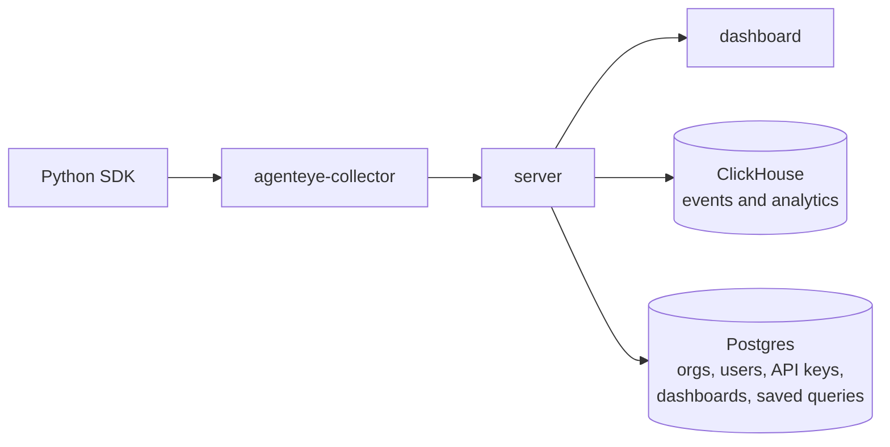

Stand up AgentEye and watch your first agent run appear in the dashboard, end to end, in about 15 minutes. By the end you'll have the server and dashboard running in your own infrastructure, a collector shipping events from an agent machine, and your Python agent instrumented so its runs show up as searchable sessions.

This guide uses the single-node **Docker Compose** path, the fastest way to try AgentEye. Running somewhere else? Pick your path: [Managed deployment](/agenteye/managed-deployment) (we operate it for you), [Kubernetes deployment](/agenteye/kubernetes-deployment) (production, multi-node), or [Single-pod deployment](/agenteye/single-pod-deployment) (one co-located pod).

> **AgentEye is an enterprise product from Failproof AI.** The steps below pull private container images, which needs signed enterprise access. To request a demo or get access, email [nivedit@exosphere.host](mailto:nivedit@exosphere.host), [nikita@exosphere.host](mailto:nikita@exosphere.host), [nivedit@befailproof.ai](mailto:nivedit@befailproof.ai), or [nikita@befailproof.ai](mailto:nikita@befailproof.ai).

---

## What is AgentEye?

AgentEye is a self-hosted platform for observing, evaluating, and improving your AI agents in production. It records what your agents do (every step of a run) so you can see how they behave in production and catch regressions before your users do. Connect your own evaluator service and it will also score the quality of each completed run automatically.

Here's how the data flows, in one direction:



Your agent code emits **events** through the **Python SDK**. A lightweight **collector** daemon batches them and ships them to the **server**. The server stores events and analytics in **ClickHouse** and operational state (organizations, users, API keys, dashboards, saved queries) in **Postgres**, and the **dashboard** reads it all back for you to explore.

What you get:

- **Events**: the raw, per-step trail of every agent run (tool calls, model calls, hooks, errors).
- **Sessions**: those events rolled up into one row per run, each ready to be scored automatically once you connect an evaluator.
- **Evaluations**: quality scores produced by your own evaluator services, so quality drops surface without manual review.
- **Queries & dashboards**: saved ClickHouse SQL over your data, charted into shared, org-scoped dashboards.
- **Alerts & incidents**: threshold rules that page you (email, Slack, webhook, in-dashboard) plus an incident workflow to triage them.
- **CLI & AI assistant**: a terminal client (`agenteye`) and the in-dashboard **AI assistant** for asking questions in plain English.

<div style={{ position: "relative", width: "100%", paddingBottom: "56.25%", height: 0, overflow: "hidden", borderRadius: "12px", margin: "1.5rem 0" }}>
  <iframe src="https://www.youtube.com/embed/VWxukZc5k7s?autoplay=1&mute=1&loop=1&playlist=VWxukZc5k7s&rel=0&playsinline=1" title="Watch: Agent Tracing by Failproof AI (2 min)" allow="autoplay; encrypted-media; picture-in-picture; fullscreen" allowFullScreen style={{ position: "absolute", top: 0, left: 0, width: "100%", height: "100%", border: 0 }}></iframe>
</div>

*See a live agent run trace itself in the AgentEye dashboard: every tool call, model request, and hook on one timeline.*

You run all of it in your own infrastructure, as a single Docker Compose stack (this guide), a production Kubernetes install, or a single co-located pod. The rest of this guide sets up the Compose stack end to end.

---

## Before you begin

The Docker Compose path takes about 15 minutes. On the machine where you'll run AgentEye, and on each agent machine, make sure you have:

- **Docker** and **Docker Compose**: to run the server, dashboard, and datastores (Steps 2-3).
- **GitHub CLI (`gh`)** and **curl**: to download the compose file, collector binary, and SDK (Steps 2, 4, 5).
- **Python 3** and **pip**: to install the SDK and instrument your agent (Steps 5-6).
- Signed enterprise access to pull the private AgentEye packages. See [GitHub token setup](/agenteye/github-token).

> **Note:** The collector download in Step 4 is a Linux x86_64 binary. For macOS, Linux arm64, or container installs, see [Collector installation](/agenteye/collector-installation).

---

## Step 1: Authenticate

AgentEye's packages are private, so this step authenticates you as a signed enterprise customer to pull them. All artifacts are distributed from the `agenteye-enterprise` GitHub organization; you generate your own GitHub personal access token (PAT) to fetch them. Follow the [GitHub token setup](/agenteye/github-token) guide for exact steps and required permissions.

```bash
export AGENTEYE_TOKEN=<your-github-pat>

# Authenticate Docker against GHCR
echo $AGENTEYE_TOKEN | docker login ghcr.io -u x --password-stdin
```

---

## Step 2: Deploy the Server and Dashboard

The server receives events from collectors and makes them queryable; the dashboard is where you explore them. Ingested events and analytics live in ClickHouse (the required analytics store), while Postgres holds operational state such as organizations, users, API keys, dashboards, and saved queries.

**Download the published compose file:**

```bash
mkdir -p ./agenteye
curl -fsSL \
  -H "Authorization: token $AGENTEYE_TOKEN" \
  https://raw.githubusercontent.com/agenteye-enterprise/releases/main/docker-compose.yml \
  -o ./agenteye/docker-compose.yml
cd agenteye
```

**Set your secrets:**

Create a `.env` file so the deployment does not run on the default `admin` credential. At minimum set `ADMIN_KEY` and `POSTGRES_PASSWORD`:

```bash
POSTGRES_PASSWORD=your-db-password
ADMIN_KEY=your-admin-secret
```

**Start the stack:**

```bash
docker compose up -d
```

This brings up the full stack, including the required ClickHouse analytics store and an optional Redis cache, alongside the server and dashboard. ClickHouse must be healthy for the server to start.

The server is now listening at `http://localhost:8080` and the dashboard at `http://localhost:3000`.

For production deployments (custom Postgres, TLS, reverse proxy), see [Deployment](/agenteye/deployment).

---

## Step 3: Create an API Key for the Collector

Each collector authenticates with a scoped API key. Use the `ADMIN_KEY` you set in Step 2 to create one:

```bash
curl -s -X POST http://localhost:8080/keys \
  -H "Authorization: Bearer $ADMIN_KEY" \
  -H "Content-Type: application/json" \
  -d '{"name":"prod-collector","key":"your-collector-secret","permissions":["events:add"]}'
```

You provide the `key` value yourself; use it in the collector config in Step 4. See [API keys](/agenteye/api-keys) for full key management.

---

## Step 4: Install the Collector

On every machine that runs your AI agents, install the collector daemon.

**Download the binary (Linux x86_64):**

```bash
# Check the agenteye-enterprise/releases page for the latest collector/v* tag.
VERSION=0.0.1-beta.14
GITHUB_TOKEN=$AGENTEYE_TOKEN gh release download "collector/v${VERSION}" \
  --repo agenteye-enterprise/releases \
  --pattern 'agenteye-collector-linux-x86_64'
chmod +x agenteye-collector-linux-x86_64
sudo mv agenteye-collector-linux-x86_64 /usr/local/bin/agenteye-collector
```

> **Note:** This downloads the **Linux x86_64** build. For macOS (Apple Silicon or Intel), Linux arm64, or Docker / systemd / launchd setup, see [Collector installation](/agenteye/collector-installation), which lists the download for each platform. The command above installs a Linux binary that will not run elsewhere.

**Configure:**

```bash
mkdir -p ~/.agenteye
cat > ~/.agenteye/config.json <<EOF
{
  "url": "http://your-server-host:8080/events",
  "key": "the-key-from-step-3"
}
EOF
```

**Start the daemon:**

```bash
agenteye-collector start
```

Verify connectivity with a one-shot flush (exits after draining any pending events):

```bash
agenteye-collector flush
```

For Docker, systemd, and launchd setup see [Collector installation](/agenteye/collector-installation).

---

## Step 5: Install the Python SDK

On each machine where you want to instrument agent code, install the wheel from GitHub Releases.

```bash
VERSION=0.0.1b9
GITHUB_TOKEN=$AGENTEYE_TOKEN gh release download "python-sdk/v${VERSION}" \
  --repo agenteye-enterprise/releases \
  --pattern 'agenteye-*.whl'
pip install agenteye-${VERSION}-py3-none-any.whl
```

---

## Step 6: Instrument Your Agent

Add events to your agent code. At minimum, emit `agent_start` and `agent_end`:

```python
import agenteye

agenteye.event.agent_start(
    session_id="run-001",
    agent_id="my-agent",
    goal="answer the user query",
)

# your agent logic here

agenteye.event.agent_end(
    session_id="run-001",
    agent_id="my-agent",
    outcome="success",
)
```

Events are buffered and flushed to `$AGENTEYE_HOME/events/` (or `~/.agenteye/events/` if `AGENTEYE_HOME` is not set) every 500 ms. The collector picks them up automatically.

See the [Python SDK](/agenteye/python-sdk) reference for the full event API.

> **Tip:** To confirm the full path works before opening the dashboard, run your agent, then run `agenteye-collector flush` on the agent machine, and refresh the Events page (Step 7). If nothing appears, that tells you which hop to check: the collector, the server URL, or the API key.

---

## Step 7: View Events in the Dashboard

Open `http://your-dashboard-host:3000` and sign in. AgentEye emails you a single-use code (or a one-click magic link), so there's no password to manage.


Once you're in, the **Events** page shows a live trail of all ingested events. Filter by `session_id` or `agent_id` to drill into a specific run.


The **Sessions** page rolls those events up into one row per run. Once you connect an evaluator service, AgentEye scores every completed run automatically and the latest score appears on each row, so quality regressions surface without manual review. Until you set one up, sessions still capture the full run; they just don't carry a score yet.


To turn on scoring and configure how sessions are evaluated, see the [Evaluation suite](/agenteye/evaluation-suite).

Click any session to open its **execution graph**, a git-style view of how agents, tools, hooks, and model calls unfolded over time, with parallel sub-agents on their own lanes and a per-run breakdown in the right rail:


---

## Step 8: Connect your coding agents

The events you are now browsing are one plain-English question away from your terminal. The **`agenteye` CLI** reads and administers your deployment (sessions, events, evals, keys, alerts, incidents), and the **[CLI skill](/agenteye/cli-skill)** teaches a coding agent like Claude Code or Codex to drive it for you, so you can just ask "is anything broken today?" instead of memorizing commands.

Install the CLI and sign in. This is a separate tool from the collector: the collector ships events to the server, while the CLI talks to your dashboard.

```bash
pipx install agenteye
agenteye --base-url http://your-dashboard-host:3000 login --email you@example.com   # emailed 6-digit code
agenteye whoami                                                                      # confirm user and active org
agenteye --json sessions --since 24h                                                 # the runs from Step 7, as JSON
```

To let an agent answer for you, place the `agenteye-cli/` skill folder (AgentEye provides it) in `~/.claude/skills/`; Claude Code discovers it automatically. Then ask in plain English:

```text
you   ▸ Why did session run-001 fail?
agent ▸ Running: agenteye --json events --session-id run-001 --all
        checkout-agent hit TimeoutError on its third tool call
```

The agent runs the CLI as you, so it can do only what your login permits, and it can change things (rotate a key, resolve an incident) as well as read. It states each command and waits for your OK before any write. See [CLI and agents](/agenteye/cli-and-agents) for the full picture, the [CLI reference](/agenteye/cli) for every command, and [CLI recipes](/agenteye/cli-recipes) for automation patterns.

---

## Step 9: Explore, chart, and alert

With events flowing, the **analyze** pages turn raw activity into answers, so you can measure agent behavior, share findings across the team, and get paged the moment something regresses. Dashboard pages are organization-scoped, so the URLs you see in the address bar are prefixed with your org slug (`/<org>/…`).

- **Queries** (`/<org>/queries`): start from a library of saved, reusable queries over your events and evaluations (built-in presets plus your own)…


  …then open one in the SQL composer to tweak it and run it with live results:


- **Dashboards** (`/<org>/dashboards`): pin queries as line, bar, area, or pie tiles into shared, org-wide dashboards.


- **Alerts** (`/<org>/alerts`): promote any threshold into a paging rule that notifies by email, Slack, webhook, or in-dashboard. See [Alerts](/agenteye/alerts).


---

## Next steps

- [Evaluation suite](/agenteye/evaluation-suite): connect an evaluator so sessions get scored.
- [Deployment](/agenteye/deployment): harden the stack for production.
- [API keys](/agenteye/api-keys): manage collector and user access.
- [Troubleshooting](/agenteye/troubleshooting): diagnose events that aren't showing up.
