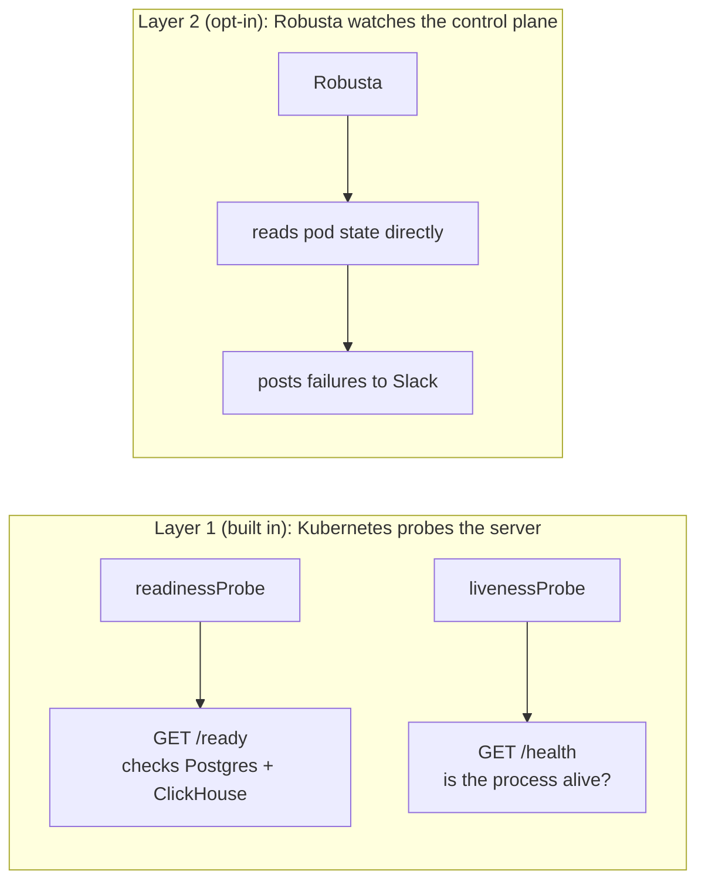

AgentEye watches your agents. This page is about watching AgentEye *itself*, so
you get alerted the moment the product is down or degraded, not just when your
agents misbehave. Detection is **independent of AgentEye**: it reads pod state
from the Kubernetes control plane and checks AgentEye's hard dependencies, so it
still fires when the server, ClickHouse, or Postgres is the thing that's down.

> **Note:** This is the Kubernetes story. If you run the single-pod or Docker
> Compose deployment, the built-in `/health` and `/ready` probes in the next
> section are all you need, and they behave identically there. Robusta (layer 2)
> is an opt-in Kubernetes-fleet add-on, not a requirement. See the
> [single-pod deployment guide](/agenteye/single-pod-deployment).

There are two layers. The first is built in; the second is opt-in.



Because layer 2 reads the control plane instead of asking AgentEye, it still alerts when the server, ClickHouse, or Postgres is the thing that is down.

## 1. Dependency-aware readiness (built in)

The server exposes two probe endpoints with deliberately different jobs:

| Endpoint | Probe | Checks | Auth |
|---|---|---|---|
| `GET /health` | liveness | process is alive (always `{"status":"ok"}`) | none |
| `GET /ready` | readiness | can actually serve: **Postgres + ClickHouse** reachable | none |

`/ready` returns `200` with `"status":"ready"` and every check `"ok"` when both
hard dependencies are reachable, and `503` with `"status":"not_ready"` when
either is unreachable. Both responses carry a small body:

```json
{ "status": "not_ready",
  "checks": { "postgres": "ok", "clickhouse": "down", "redis": "not_configured" } }
```

Redis is an optional cache the server degrades past, so it is reported for
information but **never** fails readiness. It shows `"ok"` when a cache is
configured and `"not_configured"` otherwise; it is never `"down"`.

On the bundled Kubernetes manifests the **readiness** probe points at `/ready`
and **liveness** stays on `/health`. The effect: a server that is *running but
cannot reach its database* is taken out of the Service and shows as `NotReady`,
a state your cluster monitoring (below) can alert on. Liveness stays cheap on
`/health`, so a brief dependency blip never restarts the pod, while the readiness
probe's generous failure threshold tolerates about 30 seconds of blips before
pulling a replica out of rotation.

**Verify the built-in probes yourself.** From anywhere that can reach the server
(swap in your server's address and port, `8080` in the bundled manifests):

```bash
# Liveness: always 200 while the process is up
curl -s http://localhost:8080/health
# {"status":"ok"}

# Readiness: 200 when Postgres + ClickHouse are reachable, 503 otherwise
curl -s -o /dev/null -w '%{http_code}\n' http://localhost:8080/ready
# 200   body: {"status":"ready",     "checks": { ... }}
# 503   body: {"status":"not_ready", "checks": { ... }}  if a hard dependency is down
```

## 2. Pod-failure alerting with Robusta (opt-in)

[Robusta](https://github.com/robusta-dev/robusta) is a Kubernetes-native monitor
that watches the API server and posts pod failures (`CrashLoopBackOff`,
`OOMKilled`, `ImagePullBackOff`, `Pending`/`NotReady`, `Failed`, evictions) to
Slack. Because it observes the control plane rather than asking AgentEye, it
alerts even when AgentEye cannot serve at all.

> **Note:** The rest of this section is operator setup: Helm, a Slack app, and a
> values file. If you are evaluating AgentEye rather than installing it, skip to
> [What it reports](#what-it-reports) to see the payoff.

Robusta ships as an opt-in add-on in the release bundle. Enable it with the
standard Robusta Helm chart and the small values file shown below:

1. Add the chart repo and get a Slack **bot token** (`xoxb-…`) for the channel:

   ```bash
   helm repo add robusta https://robusta-charts.storage.googleapis.com
   helm repo update
   ```

   Because the configuration below keeps everything in-cluster
   (`disableCloudRouting: true`), the token comes from a self-hosted Slack app:
   create an app at `https://api.slack.com/apps`, add the `chat:write` bot scope,
   install it to your workspace, copy the **Bot User OAuth Token** (`xoxb-…`), and
   invite the bot to the channel (`/invite @your-app`).

2. Create a `values.yaml` with a per-deployment label (`clusterName`) and your
   Slack channel, scoped to the `agenteye` namespace:

   ```yaml
   clusterName: "acme-prod"            # per-deployment label; appears on every alert
   enablePrometheusStack: false        # pod-crash alerts only; no metric stack
   disableCloudRouting: true           # deliver to Slack directly, in-cluster
   sinksConfig:
     - slack_sink:
         name: vendor_slack
         slack_channel: "agenteye-fleet-health"
         api_key: "REPLACE_WITH_SLACK_BOT_TOKEN"   # xoxb-… (prefer --set or a secret)
         scope:
           include:
             - namespace: [agenteye]   # only AgentEye-namespace alerts; remove to widen
   ```

3. Install, pinning `--version` to a known-good Robusta chart release
   ([releases](https://github.com/robusta-dev/robusta/releases)) so you never
   install an untested chart:

   ```bash
   helm install robusta robusta/robusta \
     --namespace robusta --create-namespace \
     --version <pin-a-known-good-version> \
     -f values.yaml \
     --set sinksConfig[0].slack_sink.api_key=$ROBUSTA_SLACK_TOKEN
   ```

### What it reports

- Kubernetes **pod state** (which AgentEye pod is failing and why) and each pod's
  **image tag**, i.e. the running component **version**.
- **No AgentEye event data and no customer data** ever leaves the cluster.
- The bundled values restrict alerts to the **`agenteye` namespace**, so unrelated
  workloads in the same cluster are not reported.

Here is what a pod-failure alert looks like when it lands in Slack:

```text
#agenteye-fleet-health

🔴  Robusta · Pod is crash looping
    Cluster:    acme-prod                    ← clusterName label (which deployment)
    Namespace:  agenteye
    Pod:        agenteye-server-7d9c8b6f5-2xk4t
    Container:  server  (ghcr.io/agenteye-enterprise/server:0.0.1-beta.18)
    Reason:     CrashLoopBackOff · last state OOMKilled (exit 137)
    Restarts:   5 in the last 3m
```

The `clusterName` tells you *which* deployment is affected at a glance, and the
image tag (`…/server:0.0.1-beta.18`) tells you exactly which version is running.

### One place for every deployment

Point every deployment's Robusta at **one shared Slack channel**, each with its
own `clusterName`. Every alert is tagged with that label, so a single channel
shows the health of your whole fleet, and you can tell which deployment is
affected at a glance.

### Total-cluster outages

A purely in-cluster watcher cannot report a **whole-cluster or network outage**
(it goes down with the cluster). If you need that, enable the optional **Robusta
UI sink**: set `disableCloudRouting: false` and add a `robusta_sink` (with a
token from `robusta gen-config`) to `sinksConfig`. It adds an aggregated
multi-cluster dashboard and flags any cluster that stops checking in.

## Troubleshooting

See the Health Monitoring section of the
[troubleshooting guide](/agenteye/troubleshooting#health-monitoring-issues) for "no
alerts arriving" and "server keeps flapping `NotReady`".

## Next steps

- [Kubernetes deployment](/agenteye/kubernetes-deployment): where the readiness and liveness probes and the Robusta add-on are wired in.
- [Single-pod deployment](/agenteye/single-pod-deployment): the `/health` and `/ready` probes for Compose and single-node setups.
- [Alerts](/agenteye/alerts): alert on your agents' behavior, the complement to this page's infrastructure health.
- [Troubleshooting](/agenteye/troubleshooting#health-monitoring-issues): fixes for missing alerts and `NotReady` flapping.
