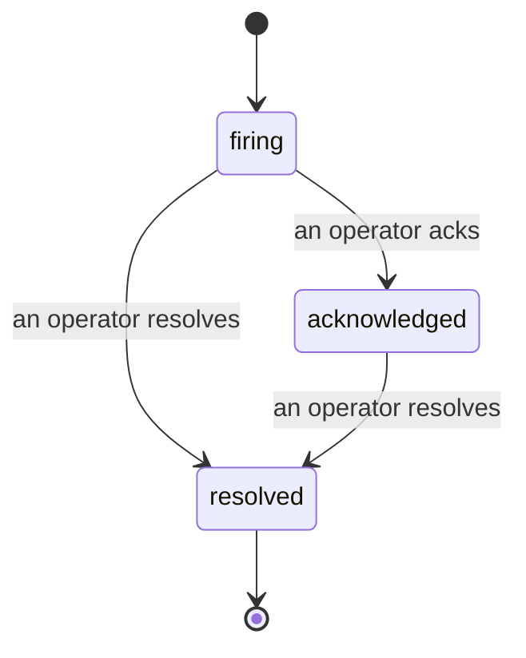

When an alert fires, the first question is always "who's on it?" Incidents answer it: the moment something breaches, everyone can see the incident is open, who owns it, and exactly what has happened so far, with a clean, attributed record you can hand straight to a post-mortem.

*The inbox groups open incidents by state and filters by severity and assignee, so you see what needs a human now.*

## Know who has it, at a glance

No more "is anyone looking at this?" in a chat thread. A breach opens an incident automatically and drops it into a shared inbox, grouped by state. Acknowledge it and your name is on it, so the rest of the team knows it is handled. Acknowledgement is shared: several operators can ack the same incident and each is recorded on its own, so a full war room shows up by name instead of stepping on each other. Assign one owner for triage, and filter the inbox by severity or assignee to cut it down to what is yours.

## The whole story, in one timeline

When the incident is over, you already have the write-up. Open any incident and you get the breach evidence, its assignees and subscribers, a comment thread for coordinating in place, and an append-only activity timeline.

*Everything that happened, in order, each line signed by whoever did it.*

Every action (opened, acknowledged, resolved, and so on) is written to that timeline and never edited away. Each entry is attributed: to the operator who took it, by email, or to **automated** for anything Failproof AI Observability did on its own, like opening the incident on the breach. Nothing is anonymous and nothing is lost, so the post-mortem more or less writes itself.

## How an incident moves

- **Open (firing):** the breach opens the incident and pages your channels once. Repeated breaches fold into the same incident and refresh its evidence instead of paging you again and again.
- **Acknowledged:** an operator picks it up. It stays open, and later breaches update the evidence quietly.
- **Resolved:** an operator closes it out. Automatic resolution when the condition clears is planned but not yet enabled, so an incident stays open until a human resolves it, which keeps everyone honest about what has actually cleared. A fresh incident can open on the same alert later.

One alert holds at most one open incident at a time, so a flapping rule cannot bury you in duplicates. You can also open an incident by hand: a standalone one for something no alert caught, or one attached to an existing alert, if you have `incidents:write`.

## Where to find it

Incidents live at `/<org-slug>/incidents`. Viewing needs **`incidents:read`**; opening a manual incident needs **`incidents:write`**; acknowledging, assigning, commenting, and resolving need **`incidents:ack`**. Older keys granted the retired `alerts:ack` keep working, since it is honored as `incidents:ack`, so your on-call rotation does not need re-issuing.

## Related

- [Alerts](/agenteye/alerts): the rules that open these incidents when a threshold breaches.
- [Error tracking](/agenteye/error-tracking): see every failure in one place and promote one to an alert.
- [Audits](/agenteye/audits): the scheduled analyst that finds the failures no rule was watching.
