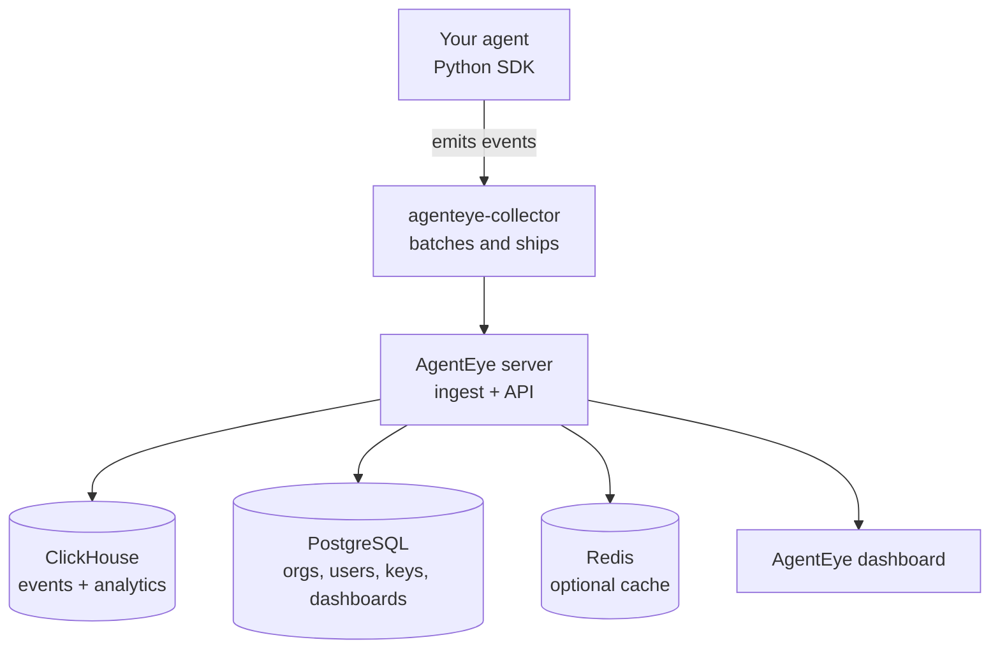

AgentEye is a self-hosted platform for observing, evaluating, and improving your AI agents in production. It records everything your agents do (every tool call, model request, hook, and error), scores the quality of each run, and surfaces the failures you didn't know to look for, all in a dashboard you run inside your own infrastructure.

If you ship AI agents and you're tired of guessing why a run went wrong, this is the page to start on. It explains what AgentEye gives you and how the pieces fit together, before you install anything.

> **AgentEye is an enterprise product from Failproof AI.** Want to see it in action? Request a demo: email [nivedit@exosphere.host](mailto:nivedit@exosphere.host), [nikita@exosphere.host](mailto:nikita@exosphere.host), [nivedit@befailproof.ai](mailto:nivedit@befailproof.ai), or [nikita@befailproof.ai](mailto:nikita@befailproof.ai).

*Every agent run is drawn as a git-style execution graph (left) beside its event timeline. Parallel sub-agents each get their own lane; the right rail breaks down the tools, models, hooks, and token spend for the run.*

---

## See it in action

Two short videos show the two things teams reach for first: tracing a run, and finding failures automatically.

*Agent tracing: follow a single run step by step, from goal to tools to final answer.*

*Failproof Audit: let AgentEye mine your logs across sessions and tell you what to fix.*

---

## Why teams use it

- **See what your agent actually did.** Every run becomes a readable, git-style execution graph: which tools ran in parallel, which sub-agents branched off, where it stalled, and what it spent.
- **Catch quality regressions automatically.** Connect a small scoring service and AgentEye scores every finished run, so a drop in helpfulness or a spike in hallucinations shows up on its own.
- **Find failures you didn't write a rule for.** Recurring audits mine your logs across sessions for error clusters, latency outliers, low scores, and stuck runs, then hand you ranked, evidence-backed findings.
- **Get paged when it matters.** Threshold rules fire on error rate, latency, cost, or evaluator scores and open incidents you can acknowledge, assign, and resolve.
- **Ask questions in plain English.** An in-dashboard AI assistant answers "how is quality trending in prod this week?" over your own data. Any change it makes is approval-gated.
- **Keep your data.** AgentEye is self-hosted: events, prompts, and analytics stay in infrastructure you control.

---

## What you get

AgentEye is organized around three ideas (**observe**, **analyze**, and **admin**), mirrored in the dashboard's left sidebar.

**Observe** (the raw truth of what happened):

- **Events**: the live, per-step trail of every run (tool calls, model calls, hooks, errors).
- **Sessions**: those events rolled up into one row per run, each ready to be scored.
- **Models, Tools, Hooks**: per-surface latency heat-maps and p50/p95/p99 vitals, so a tail spike stands out from the median.
- **Errors**: one triage surface for everything that went wrong, one click from a firing alert.

*Each observe surface pairs a sparkline and p50/p95/p99 vitals with a latency heat-map and a percentile band. Shown here: Tools.*

**Analyze** (turn activity into answers):

- **Queries & dashboards**: saved SQL over your events and evaluations, charted into shared, org-scoped dashboards.
- **Evaluations**: quality scores produced by your own evaluator service, with per-score reasoning.
- **Audits**: recurring investigations that surface failure patterns across sessions.
- **Alerts & incidents**: threshold rules that page you, plus an incident workflow to triage them.

**Admin** (run it for your team):

- **API keys**: scoped tokens for the collector, the dashboard, and the assistant.
- **Users**: passwordless, email-based sign-in with an allowlist.
- **Settings**: per-org configuration, including model context-window overrides.

---

## How the pieces fit

Data flows in one direction, from your agent code to the dashboard:

- **Python SDK**: you add a few `agenteye.event.*` calls to your agent; events are buffered locally.
- **agenteye-collector**: a lightweight daemon on each agent machine that batches events and ships them to the server.
- **Server**: ingests events into ClickHouse (the analytics store) and keeps operational state in PostgreSQL; Redis is an optional cache.
- **Dashboard**: where you explore everything, reachable only through the server's API.
- **Optional services**: a scoring service (evaluations), and an AI assistant service (the in-dashboard chat).

For the vocabulary used throughout the docs (*event, session, evaluation, audit, finding, incident*), see [Concepts](/agenteye/concepts).

---

## Getting AgentEye

AgentEye is an enterprise product from Failproof AI. It runs entirely in your own environment; you can deploy it as a single Docker Compose stack, a production Kubernetes install, a managed install on your cluster, or a single co-located pod. If you don't have access to the packages yet, request a demo and we'll get you set up: email [nivedit@exosphere.host](mailto:nivedit@exosphere.host), [nikita@exosphere.host](mailto:nikita@exosphere.host), [nivedit@befailproof.ai](mailto:nivedit@befailproof.ai), or [nikita@befailproof.ai](mailto:nikita@befailproof.ai).

Not sure which install path fits? See [Deployment options](/agenteye/deployment-options).

---

## Next steps

- [Concepts](/agenteye/concepts): the AgentEye vocabulary in one place.
- [Getting started](/agenteye/getting-started): deploy the stack and get your first event flowing.
- [Deployment options](/agenteye/deployment-options): Compose vs. Managed vs. Kubernetes vs. Single-pod.
- [Security](/agenteye/security): how AgentEye keeps your data isolated and in your control.
