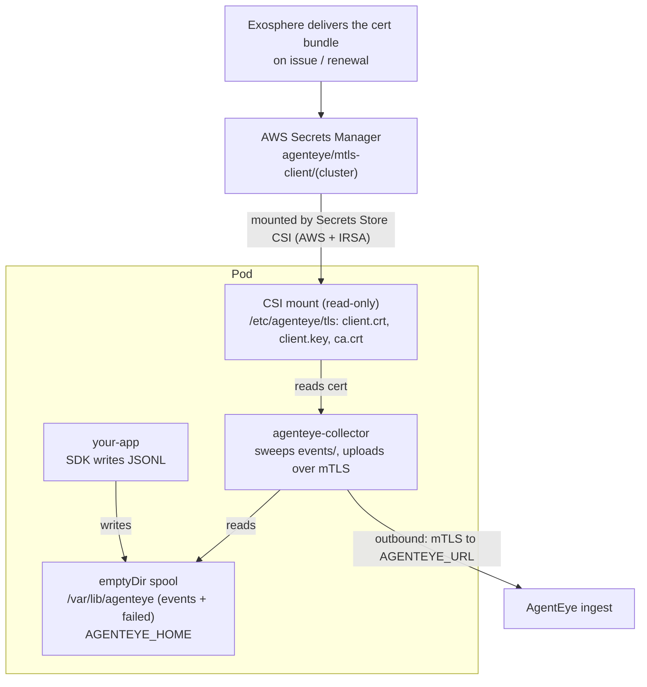

Run the AgentEye collector in the same Kubernetes Pod as your application so it can ship your agent's event logs to AgentEye without telemetry ever crossing a network boundary to be collected. Reach for this pattern when your app should hand off telemetry in-process rather than call across the network: you get low latency, tight lifecycle coupling, and per-tenant pod isolation. New to AgentEye? Read [Getting started](/agenteye/getting-started) first, then come back for the EKS sidecar setup.

Here, your app and the collector share one in-pod event spool (a shared folder): your SDK writes event files into it, and the collector reads and uploads them. The handoff is a plain file read: no localhost port to expose, no service mesh to traverse. The mTLS (mutual-TLS) client certificate the collector uses to authenticate to your backend is delivered straight into the pod from AWS Secrets Manager, so credential rotation needs no manual file shuffling on your side.

> **Tip:** This sidecar + shared-spool model is cloud-agnostic. Two containers sharing an `emptyDir` spool work on any Kubernetes distribution. Only the certificate-delivery path (AWS Secrets Manager + the Secrets Store CSI Driver + IAM Roles for Service Accounts, or IRSA) is specific to AWS / EKS. If you run elsewhere, keep the pod and spool layout and swap in your platform's secret-mount mechanism for Phases 2 and 3.

> **Note:** Pick single-pod when your application should not call across a network boundary to reach the collector. For multi-app fleets that share one collector per node or per cluster, see the [Kubernetes deployment](/agenteye/kubernetes-deployment) guide instead.

---

## At a glance



Two data flows, two volumes:

- **Events (in-pod):** your app's SDK writes `.jsonl` files into the shared `emptyDir` at `$AGENTEYE_HOME/events/`; the collector sweeper reads them and uploads. No localhost port, no loopback, pure shared-filesystem handoff.
- **mTLS cert (pod ← cloud):** the Secrets Store CSI Driver mounts the cert bundle from Secrets Manager into a read-only volume at `/etc/agenteye/tls/`, scoped to the collector container.

**Two independent parties:**

| Party | Responsibility |
|---|---|
| Exosphere | Issues the mTLS client certificate and delivers the bundle into **your** AWS account's Secrets Manager under a stable name. Re-publishes the renewed bundle into the same secret before expiry. |
| You | Install the Secrets Store CSI Driver, grant the pod's ServiceAccount read access to the secret via IRSA, and apply the Pod manifest. That's it. |

---

## Prerequisites

### In your AWS account / EKS cluster

- An EKS cluster with an **OIDC provider** associated. Confirm with:

  ```bash
  aws eks describe-cluster --name <your-cluster> \
    --query "cluster.identity.oidc.issuer" --output text
  ```

  If the command returns an `https://oidc.eks.…` URL, OIDC is enabled. If not, associate one:

  ```bash
  eksctl utils associate-iam-oidc-provider \
    --cluster <your-cluster> --approve
  ```

- The [Secrets Store CSI Driver](https://secrets-store-csi-driver.sigs.k8s.io/) and the [AWS provider](https://github.com/aws/secrets-store-csi-driver-provider-aws) installed in the cluster (see § Phase 2).

- AWS CLI v2 and `kubectl` on your workstation.

### Coordination with Exosphere

Before you deploy, Exosphere delivers the mTLS client bundle into your AWS account's Secrets Manager and provides:

- The **secret name** (convention: `agenteye/mtls-client/<your-cluster>`)
- The **AWS region** the secret lives in
- The **AgentEye backend URL** to configure the collector with
- Your collector **API key** (see [API keys](/agenteye/api-keys))

---

## Phase 1: What Exosphere delivers

You do not generate the mTLS client certificate yourself. Exosphere issues it and delivers the bundle directly into your AWS account's Secrets Manager, so the only credential material that ever lands in your environment is the finished, ready-to-mount secret.

What arrives in your account:

| Property | Value |
|---|---|
| Secret name | `agenteye/mtls-client/<cluster-name>` (stable across renewals) |
| Region | The AWS region you nominated for your EKS cluster |
| Payload | A single JSON secret with three keys (`client.crt`, `client.key`, and `ca.crt`), each holding the PEM-encoded material |
| Tag | `AgentEyeCluster=<cluster-name>` |

On renewal, the same secret is updated in place with a new version, so the ARN and name never change; your `SecretProviderClass` and IAM policy keep working untouched. For the certificate lifecycle (validity, renewal cadence, expiry alerting) see the [Kubernetes deployment](/agenteye/kubernetes-deployment) guide.

---

## Phase 2: Install the Secrets Store CSI Driver + AWS provider

The Secrets Store CSI Driver is a Kubernetes add-on that mounts secrets from an external store (here, AWS Secrets Manager) into a pod as read-only files. Skip this step if you already run another workload that mounts AWS secrets via CSI.

```bash
# CSI Driver
helm repo add secrets-store-csi-driver \
  https://kubernetes-sigs.github.io/secrets-store-csi-driver/charts
helm install -n kube-system csi-secrets-store \
  secrets-store-csi-driver/secrets-store-csi-driver \
  --set syncSecret.enabled=true \
  --set enableSecretRotation=true \
  --set rotationPollInterval=1h

# AWS provider
kubectl apply -f \
  https://raw.githubusercontent.com/aws/secrets-store-csi-driver-provider-aws/main/deployment/aws-provider-installer.yaml
```

**Verify:**

```bash
kubectl get pods -n kube-system | grep -E 'csi-secrets-store|aws-provider'
```

Expected: `Running` for every pod.

> **Note:** `rotationPollInterval=1h` sets how often the CSI Driver re-reads the secret. When Exosphere publishes a renewed certificate, Secrets Manager is updated in place; the CSI Driver picks it up on this interval and re-writes the mounted files. The collector reads the certificate files once at startup, so it begins presenting the renewed certificate only after a process restart; see § Certificate rotation for how to trigger one.

---

## Phase 3: Grant the pod read access to the secret (IRSA)

### 3.1 Create the IAM policy

Save as `agenteye-mtls-reader-policy.json`:

```json
{
  "Version": "2012-10-17",
  "Statement": [
    {
      "Sid": "ReadAgentEyeMtlsBundle",
      "Effect": "Allow",
      "Action": [
        "secretsmanager:GetSecretValue",
        "secretsmanager:DescribeSecret"
      ],
      "Resource": "arn:aws:secretsmanager:<region>:<account-id>:secret:agenteye/mtls-client/<cluster-name>-*"
    }
  ]
}
```

Substitute `<region>`, `<account-id>`, and `<cluster-name>`. The trailing `-*` matches the six-character random suffix AWS appends to every secret ARN.

Create the policy:

```bash
aws iam create-policy \
  --policy-name AgentEyeMtlsReader-<cluster-name> \
  --policy-document file://agenteye-mtls-reader-policy.json
```

### 3.2 Create the IAM role and bind it to the pod's ServiceAccount

```bash
eksctl create iamserviceaccount \
  --name agenteye-pod \
  --namespace <your-namespace> \
  --cluster <your-cluster> \
  --role-name AgentEyePodRole-<cluster-name> \
  --attach-policy-arn arn:aws:iam::<account-id>:policy/AgentEyeMtlsReader-<cluster-name> \
  --approve
```

This creates a `ServiceAccount` named `agenteye-pod` with the `eks.amazonaws.com/role-arn` annotation pointing at the new role.

### 3.3 Required IAM permissions: summary

| Permission | Scope | Why |
|---|---|---|
| `secretsmanager:GetSecretValue` | `arn:aws:secretsmanager:<region>:<acct>:secret:agenteye/mtls-client/<cluster>-*` | CSI Driver reads the cert bundle on every mount + rotation tick. |
| `secretsmanager:DescribeSecret` | same | CSI Driver calls `DescribeSecret` to detect version changes between polls. |

**Do NOT grant** `secretsmanager:PutSecretValue`, `secretsmanager:UpdateSecret`, or `secretsmanager:DeleteSecret` to the pod. The pod only ever reads the secret; writing new versions into it is handled by Exosphere when the certificate is issued or renewed.

If the secret is encrypted with a customer-managed KMS key (not the default `aws/secretsmanager` key), also grant:

```json
{
  "Effect": "Allow",
  "Action": ["kms:Decrypt"],
  "Resource": "arn:aws:kms:<region>:<acct>:key/<key-id>",
  "Condition": {
    "StringEquals": {
      "kms:ViaService": "secretsmanager.<region>.amazonaws.com"
    }
  }
}
```

---

## Phase 4: Deploy the Pod

### 4.1 SecretProviderClass

`agenteye-mtls-spc.yaml`:

```yaml
apiVersion: secrets-store.csi.x-k8s.io/v1
kind: SecretProviderClass
metadata:
  name: agenteye-mtls
  namespace: <your-namespace>
spec:
  provider: aws
  parameters:
    objects: |
      - objectName: "agenteye/mtls-client/<cluster-name>"
        objectType: "secretsmanager"
        jmesPath:
          - path: '"client.crt"'
            objectAlias: "client.crt"
          - path: '"client.key"'
            objectAlias: "client.key"
          - path: '"ca.crt"'
            objectAlias: "ca.crt"
```

The `jmesPath` block tells the AWS provider to split the JSON secret into three separate files on disk. The quoting in `'"client.crt"'` is required because JMESPath treats `.` as a sub-expression operator.

```bash
kubectl apply -f agenteye-mtls-spc.yaml
```

### 4.2 Pod / Deployment manifest

**How the two containers talk to each other.** The AgentEye SDK and the collector do not communicate over a network socket; there is no local HTTP port. The SDK writes event batches as `.jsonl` files into `$AGENTEYE_HOME/events/`, and the collector continuously watches that directory and uploads each file. For a sidecar pod this means:

- Both containers mount the **same** `emptyDir` volume at the **same** path.
- Both containers set `AGENTEYE_HOME` to that path.
- Your application image must have the AgentEye SDK installed and configured (see [Python SDK](/agenteye/python-sdk)).

> **Warning:** When `AGENTEYE_HOME` is unset, both the SDK and the collector default to `~/.agenteye`, and the two containers have different home directories, so they would land on two separate spools and the handoff would silently fail. Set `AGENTEYE_HOME` to the same explicit path on **both** containers. The §4.3 verification and the matching Troubleshooting row catch this if it is missed.

`agenteye-pod.yaml` (Deployment with one replica, scale as needed):

```yaml
apiVersion: apps/v1
kind: Deployment
metadata:
  name: my-app-with-collector
  namespace: <your-namespace>
spec:
  replicas: 1
  selector:
    matchLabels:
      app: my-app-with-collector
  template:
    metadata:
      labels:
        app: my-app-with-collector
    spec:
      serviceAccountName: agenteye-pod
      containers:
        - name: app
          image: <your-app-image>
          env:
            # SDK writes event JSONL files into $AGENTEYE_HOME/events/
            - name: AGENTEYE_HOME
              value: /var/lib/agenteye
          volumeMounts:
            - name: agenteye-spool
              mountPath: /var/lib/agenteye

        - name: agenteye-collector
          # Pin to a versioned :v<version> tag for production; :beta-latest
          # tracks the current beta build (:latest exists only for stable releases).
          image: ghcr.io/agenteye-enterprise/collector:beta-latest
          args: ["start"]
          env:
            # Must match the app container's AGENTEYE_HOME so the collector
            # sweeps the same directory the SDK writes to.
            - name: AGENTEYE_HOME
              value: /var/lib/agenteye
            - name: AGENTEYE_URL
              value: "https://ingest.example.agenteye.com/events"
            - name: AGENTEYE_KEY
              valueFrom:
                secretKeyRef:
                  name: agenteye-collector-api-key
                  key: key
            - name: AGENTEYE_TLS_CERT
              value: /etc/agenteye/tls/client.crt
            - name: AGENTEYE_TLS_KEY
              value: /etc/agenteye/tls/client.key
            # Only when the AgentEye server presents a cert not signed by a
            # publicly-trusted CA (e.g. self-signed by an in-cluster issuer
            # because you have no real DNS domain). The CSI mount already
            # exposes ca.crt alongside the client cert/key.
            - name: AGENTEYE_TLS_CA
              value: /etc/agenteye/tls/ca.crt
          volumeMounts:
            - name: agenteye-spool
              mountPath: /var/lib/agenteye
            - name: agenteye-mtls
              mountPath: /etc/agenteye/tls
              readOnly: true
          livenessProbe:
            exec:
              command: ["agenteye-collector", "health"]
            initialDelaySeconds: 10
            periodSeconds: 30

      volumes:
        # Shared event spool between app and collector. emptyDir is fine:
        # events are transient and the collector drains them before pod
        # termination on graceful shutdown.
        - name: agenteye-spool
          emptyDir: {}
        # mTLS cert bundle, mounted read-only into the collector only.
        - name: agenteye-mtls
          csi:
            driver: secrets-store.csi.k8s.io
            readOnly: true
            volumeAttributes:
              secretProviderClass: agenteye-mtls
```

The `agenteye-collector-api-key` Secret holds the collector's API key (see [API keys](/agenteye/api-keys) for provisioning).

**Apply:**

```bash
kubectl apply -f agenteye-pod.yaml
```

### 4.3 Verify

```bash
# Pod should be Running with 2/2 containers ready
kubectl get pods -n <your-namespace> -l app=my-app-with-collector

# Confirm the cert bundle was mounted
kubectl exec -n <your-namespace> deploy/my-app-with-collector \
  -c agenteye-collector -- ls -l /etc/agenteye/tls/
```

Expected: `client.crt`, `client.key`, `ca.crt` all present and read-only, owned by the container user.

**Confirm the shared event spool is visible to both containers:**

```bash
# In the collector, should show the events/ and failed/ subdirs that
# the collector auto-creates on startup:
kubectl exec -n <your-namespace> deploy/my-app-with-collector \
  -c agenteye-collector -- ls /var/lib/agenteye/

# In the app, should show the same directory contents:
kubectl exec -n <your-namespace> deploy/my-app-with-collector \
  -c app -- ls /var/lib/agenteye/
```

If the two listings diverge, the volume is not mounted in both containers (or `AGENTEYE_HOME` differs); see § Troubleshooting.

**End-to-end smoke test:**

```bash
kubectl exec -n <your-namespace> deploy/my-app-with-collector \
  -c agenteye-collector -- agenteye-collector flush
```

Expected: the collector uploads any queued events and prints a `Done: N/N uploaded, 0 failed.` summary. On an empty spool it still validates your configuration and reads and parses the TLS certificate first, then prints `No pending files.` and exits without ever exercising the upload/network path. So `flush` is a meaningful end-to-end smoke test only after your app has flushed at least one event.

Note that `flush` exits non-zero **only** for local setup faults: missing configuration (no URL/key resolved) or an unreadable/unparseable TLS cert (check § Troubleshooting). A **wrong API key does not change the exit code**. The upload gets a `401`, the file is moved to `failed/`, and the command still prints `[FAILED] …` per file plus `Done: 0/N uploaded, N failed.` and exits `0`. To detect a bad key or a rejected upload, read the `Done:`/`[FAILED]` output or check for files landing in `$AGENTEYE_HOME/failed/`, not the exit code.

Once events flow through, they show up in your AgentEye dashboard's events stream:


---

## Certificate rotation

The client certificate is valid for 90 days and is renewed automatically about 15 days before expiry; Exosphere then publishes the renewed bundle into the same Secrets Manager secret. From there, the in-pod flow is:

1. Secrets Manager's secret gets a new `AWSCURRENT` version. ARN and name are unchanged.
2. Within `rotationPollInterval` (1h by default; see § Phase 2), the CSI Driver reads the new version and rewrites the files under `/etc/agenteye/tls/`.
3. The collector loads the certificate files **once at startup**, so it keeps presenting the previous certificate until the process restarts. To switch to the renewed material, restart the collector; a rolling restart is sufficient:

   ```bash
   kubectl rollout restart deploy/my-app-with-collector -n <your-namespace>
   ```

   To make this automatic, add a sidecar that watches `/etc/agenteye/tls/` (for example with `inotifywait`) and triggers the rollout when the files change.

Because the previous certificate stays valid for roughly 15 days after renewal, you have a wide window to perform the restart with no interruption to ingestion. Exosphere publishes the renewed bundle for you; the only routine action on your side is to ensure the collector restarts within that window.

---

## Troubleshooting

| Symptom | Likely cause | Fix |
|---|---|---|
| Pod stuck in `ContainerCreating`, events show `MountVolume.SetUp failed for volume "agenteye-mtls"` | CSI provider can't reach Secrets Manager | Check IRSA is correctly bound: `kubectl describe sa agenteye-pod -n <ns>` shows the `eks.amazonaws.com/role-arn` annotation. Check CloudTrail for the AssumeRole call. |
| Error: `AccessDeniedException: not authorized to perform secretsmanager:GetSecretValue` | IAM policy is scoped to the wrong ARN | The secret ARN suffix is random; use `agenteye/mtls-client/<cluster>-*` with the wildcard, not the exact ARN. |
| Error: `ParameterNotFound` from AWS provider | Secret name mismatch between `SecretProviderClass.objects[].objectName` and the secret Exosphere delivered | Confirm the exact name with `aws secretsmanager list-secrets --filters Key=tag-key,Values=AgentEyeCluster`. |
| `jmesPath` error, only one file mounted | JMESPath syntax | The dots in the JSON keys require double-quoting: `'"client.crt"'`, not `client.crt`. |
| Collector logs `tls: bad certificate` after a renewal | The CSI Driver hasn't polled the new version yet, or the collector is still running with the previous certificate it loaded at startup | Confirm the mounted files have updated (`ls -l /etc/agenteye/tls/`), then restart the collector to load them: `kubectl rollout restart deploy/my-app-with-collector -n <ns>`. See § Certificate rotation. |
| Collector container crashloops with `no such file or directory: /etc/agenteye/tls/client.crt` | Volume not yet populated on first start; startup probe too aggressive | Add a small initial delay or use an init container that waits for the file to exist: `until [ -f /etc/agenteye/tls/client.crt ]; do sleep 1; done`. |
| CSI Driver pod `OOMKilled` | Default memory limits too low for clusters with many SecretProviderClasses | Bump `--set linux.resources.limits.memory=200Mi` in the Helm install. |
| App runs cleanly, `agenteye-collector flush` reports `No pending files.`, but your AgentEye dashboard shows no events | The app and collector are not sharing the event spool | Check that (a) both containers mount the same `agenteye-spool` emptyDir at the same path, and (b) both set `AGENTEYE_HOME` to that path. Run the two `ls /var/lib/agenteye/` checks from § 4.3; the listings must match. |

**Logs to grab first:**

```bash
kubectl logs -n kube-system -l app=secrets-store-csi-driver --tail=100
kubectl logs -n kube-system -l app=csi-secrets-store-provider-aws --tail=100
kubectl describe pod -n <your-namespace> -l app=my-app-with-collector
```

---

## Reference: files on disk in the pod

The pod has two data paths on disk:

### mTLS cert bundle: `/etc/agenteye/tls/` (CSI, read-only, collector only)

Mounted by the Secrets Store CSI Driver from AWS Secrets Manager.

| File | Contents | Used by collector as |
|---|---|---|
| `client.crt` | PEM-encoded client certificate | `AGENTEYE_TLS_CERT` |
| `client.key` | PEM-encoded private key | `AGENTEYE_TLS_KEY` |
| `ca.crt` | PEM-encoded CA cert | `AGENTEYE_TLS_CA` (optional, only when the AgentEye server cert isn't publicly-trusted) |

All three are mounted read-only and owned by the container user. They are re-written by the CSI Driver when the secret rotates.

### Event spool: `$AGENTEYE_HOME/` (emptyDir, shared read-write between both containers)

Shared via an `emptyDir` volume named `agenteye-spool`.

| Path | Written by | Read by | Purpose |
|---|---|---|---|
| `$AGENTEYE_HOME/events/*.jsonl` | App (AgentEye SDK) | Collector sweeper | Event batches the SDK has flushed, awaiting upload. |
| `$AGENTEYE_HOME/failed/` | Collector (on upload failure) | You (when debugging) | JSONL files the collector could not upload after retries. |
| `$AGENTEYE_HOME/config.json` | You (optional) | Collector | Optional collector config file (alternative to env vars). |

Both the `events/` and `failed/` subdirectories are auto-created by the collector on startup; no `initContainer` needed.

---

## Next steps

- [Collector installation](/agenteye/collector-installation): collector binary options, mTLS config reference, daemon modes.
- [Kubernetes deployment](/agenteye/kubernetes-deployment): multi-pod deployment, cert issuance internals, lifecycle and expiry alerts.
- [API keys](/agenteye/api-keys): provisioning the collector API key consumed by the pod.
- [Troubleshooting](/agenteye/troubleshooting): cluster-wide troubleshooting index.
