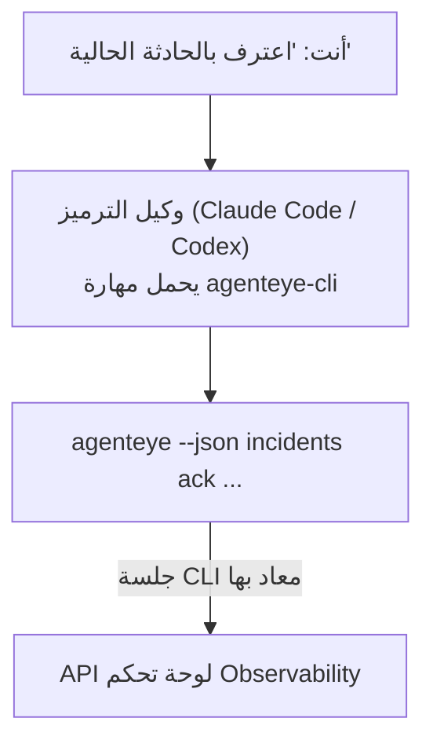

---
---
title: "مهارة عامل Failproof AI Observability CLI"
description: "اسأل وكيل الترميز الخاص بك \"هل هناك أي شيء معطل اليوم؟\" واسمح له بالإجابة من بيانات Failproof AI Observability المباشرة، دون الحاجة لحفظ أي أوامر."
---

اسأل وكيل الترميز الخاص بك *"هل هناك أي شيء معطل اليوم؟"* واسمح له بالإجابة من بيانات Failproof AI Observability المباشرة، دون الحاجة لحفظ أي أوامر. **مهارة Failproof AI Observability CLI** (`agenteye-cli`) هي *مهارة وكيل*: مجلد صغير من التعليمات التي يقوم وكيل ترميز مثل Claude Code أو Codex بتحميله عند الطلب. إنها تعلم الوكيل تشغيل نشر Observability الخاص بك من خلال [`agenteye` CLI](/ar/agenteye/cli) بناءً على طلبات باللغة الطبيعية مثل *"أعطِ CI مفتاحًا يمكنه فقط دفع الأحداث"* أو *"اعترف بالحادثة الحالية وأسندها إليّ."*

إنه **ليس** خدمة أو ملف ثنائي منفصل؛ لا يوجد شيء للنشر. يعمل فوق CLI الذي قمت بتثبيته بالفعل: الوكيل ينفذ `agenteye --json …`، يحلل JSON النظيف، ويجيبك بصيغة نثرية. كل ما يمكنه فعله، يمكنك فعله بنفسك بكتابة الأوامر نفسها.

---

## كيف يتعلق بواجهات Failproof AI Observability الأخرى

يمنحك Failproof AI Observability أربع طرق للوصول إلى نفس البيانات والتحكمات. إنها تكمل بعضها البعض:

| الواجهة | ماهي | حيث تعمل | استخدمها عندما |
|---|---|---|---|
| **[CLI](/ar/agenteye/cli)** | مرجع الأوامر والأعلام لـ `agenteye` | طرفيتك | تريد تشغيل أو كتابة أمر محدد |
| **[وصفات CLI](/ar/agenteye/cli-recipes)** | أنماط `jq`/خط الأنابيب الجاهزة للنسخ | طرفيتك / البرامج النصية | تربط CLI بالأتمتة |
| **مهارة CLI** (هذه الوثيقة) | باب الدخول باللغة الطبيعية لـ CLI | وكيل الترميز الخاص بك، على محطة عملك | تريد *أن تسأل فحسب* واترك الوكيل يختار الأمر |
| **[مهارة Evaluator](/ar/agenteye/evaluator-skill)** | مهارة شقيقة تصمم وتبني خدمة التقييم الخاصة بك | وكيل الترميز الخاص بك، على محطة عملك | تريد *إنتاج* درجات التقييم بدلاً من قراءتها |
| **[مهارة Python SDK](/ar/agenteye/python-sdk-skill)** | مهارة شقيقة تجهز وكيلك لإصدار التلمترا | وكيل الترميز الخاص بك، على محطة عملك | تريد من وكيلك *إنتاج* الأحداث التي تقرأها هذه المهارة |
| **[مساعد AI في لوحة التحكم](/ar/agenteye/assistant)** | محادثة مضمنة في لوحة التحكم | من جانب الخادم (في لوحة التحكم) | تريد أسئلة وأجوبة في لوحة التحكم حول بياناتك |

المهارة نفسها ليس لديها امتيازات خاصة بها؛ إنها تحول كلماتك إلى استدعاءات CLI تعمل بصفتك:



### مقابل مساعد AI في لوحة التحكم: تمييز مهم

هذه أداتان مختلفتان تمامًا برادي تأثير مختلفة جدًا:

- **مساعد AI في لوحة التحكم** ([مساعد AI](/ar/agenteye/assistant)) هو محادثة مضمنة في لوحة التحكم، مدعوم بخدمة الوكيل. إنه **للقراءة فقط بالإضافة إلى المؤلفة المحمية بالموافقة**: يمكنه صياغة الاستعلامات والمجموعات المحفوظة، لكن كل عملية كتابة توقف لموافقتك الصريحة بالنقر، ولا تحذف أبدًا. إنه محمي بإذن `agent:use` ولا يرى أبدًا إلا البيانات للمنظمة التي تعرضها.
- **مهارة CLI** تعمل على *محطة عملك* داخل *وكيل الترميز الخاص بك* وتشغل CLI `agenteye` بصفتك **أنت**. يمكنه تنفيذ **السطح الكامل لـ CLI، بما في ذلك الطفرات** (إنشاء/تدوير/تعطيل مفاتيح API، تغيير إعدادات المنظمة، حل الحوادث، حذف الاستعلامات المحفوظة)، مقيد فقط بأذونات دخول CLI الخاص بك. تعامل معها بنفس الحرص الذي ستتعامل به مع تشغيل تلك الأوامر يدويًا.

---

## المتطلبات الأساسية

1. **`agenteye` CLI مثبت** وفي `PATH` (انظر مرجع [CLI](/ar/agenteye/cli): `pipx install agenteye`).
2. **عنوان URL للوحة التحكم الخاصة بك** (مجموعة `AGENTEYE_DASHBOARD_URL`، أو يمرر الوكيل `--base-url`).
3. **جلسة تسجيل دخول**: قم بتشغيل `agenteye login` بنفسك أولاً. المهارة **لا تستطيع** إكمال دخول الكود لمرة واحدة المرسل بالبريد الإلكتروني؛ ستخبرك بتشغيل `agenteye login` إذا كانت الجلسة مفقودة أو منتهية الصلاحية (رمز خروج CLI `4`).

---

## من أين تحصل عليها

تُنشر المهارة في مجموعة المهارات العامة لـ Failproof AI:

**[github.com/FailproofAI/skills](https://github.com/FailproofAI/skills)** → [`skills/agenteye-cli/`](https://github.com/FailproofAI/skills/tree/main/skills/agenteye-cli)

لا شيء عنها محمي — المستودع عام والمهارة لا تحتاج أي بيانات اعتماد خاصة بها، لأنها تقود فقط CLI `agenteye` **العام** ضد لوحة التحكم *الخاصة بك*، باستخدام الجلسة *التي* قمت بتسجيل الدخول بها. أنت لا تحتاج لطلب إذن من أحد.

لاحظ أنها تأتي كمجلد خاص بها و**ليست** داخل حزمة `pipx install agenteye`، لذا لا تبحث عنها هناك.

## تثبيت المهارة

الطريق الأسرع هو [`skills`](https://skills.sh) CLI، الذي يجلب المجلد وينزله حيث ينظر وكيلك:

```bash
# Claude Code، هذا المشروع فقط
npx skills add FailproofAI/skills --skill agenteye-cli -a claude-code

# كل مشروع (يثبت في ~/.claude/skills/)
npx skills add FailproofAI/skills --skill agenteye-cli -a claude-code -g --copy

# Codex بدلاً من ذلك
npx skills add FailproofAI/skills --skill agenteye-cli -a codex
```

ثم أدره مثل أي مهارة أخرى:

```bash
npx skills list -a claude-code      # ما المثبت
npx skills update agenteye-cli      # اسحب أحدث نسخة
npx skills remove agenteye-cli      # أزله
```

تفضل التثبيت يدويًا؟ مهارة وكيل هي مجرد مجلد يحتوي على `SKILL.md` (بالإضافة إلى المراجع الاختيارية)، لذا نسخه يعمل أيضًا:

- **Claude Code**: ضع مجلد `agenteye-cli/` في `~/.claude/skills/` (كل مشروع) أو `<your-repo>/.claude/skills/` (فقط ذلك المستودع). Claude Code يكتشفه تلقائيًا — تحقق مع قائمة `/skills`، أو اسأل ببساطة سؤالاً يطابق وصفه.
- **Codex (OpenAI)**: يقرأ Codex نفس `SKILL.md`. ملف `agents/openai.yaml` المرفق يعيّن `allow_implicit_invocation: true`، لذا يختار Codex المهارة تلقائيًا عندما تطابق مهمة؛ وإلا استدعها بوضوح كـ `$agenteye-cli`.

---

## الأمان: الطفرات لا تطالب عندما يشغل الوكيل CLI

> **تحذير:** اقرأ هذا قبل السماح لوكيل بإجراء تغييرات.

CLI `agenteye` عادةً يسأل *"هل أنت متأكد؟"* قبل إجراء مدمّر. إنه **يتخطى هذا التأكيد تلقائيًا عندما لا يكون متصلاً بطرفية (وهو بالضبط كيف يشغله وكيل ترميز)، و`--json` يتخطاه أيضًا.** لذا دعوة الأمان **لن** تطلق للوكيل.

تمت كتابة المهارة للتعويض: يتم تعليمها بذكر الأمر بالضبط الذي ستشغله والحصول على **موافقة صريحة منك قبل أي تغيير حالة**. حافظ على هذا الانضباط. عندما تشغل Failproof AI Observability من خلال وكيل، *أنت* خطوة التأكيد. أوامر تغيير الحالة للمراقبة:

- `keys create` / `update` / `disable` / `regenerate`
- `users create` / `update` / `disable` / `enable`
- `settings set`
- `alerts create` / `update` / `delete` / `test`
- أوامر `incidents` الكاتبة: `ack` / `assign` / `resolve` / `open` / `comment-add` / `comment-delete` / `subscribe` / `unsubscribe`
- `query create` / `update` / `delete`
- `agent rename` / `delete`
- `orgs switch`

كل شيء تحت **Observe** (`events`, `sessions`, `evals`, `errors`, `list`, `whoami`, `orgs list/current/perms`) للقراءة فقط ولا يغير شيئًا.

لأن الوكيل يتصرف بصفتك **أنت**، يمكنه فقط فعل ما يسمح دخولك به؛ تُحل الأذونات **لكل منظمة** (انظر [مفاتيح API](/ar/agenteye/api-keys)). أمر تفتقد الإذن له يعيد رمز خروج `5` مع الإذن المحدد، لذا يمكن للوكيل أن يخبرك بالضبط ما تطلبه من مسؤول بدلاً من الفشل بشكل غامض.

---

## ما يمكنك أن تسأله

إليك كيف يبدو رحلة ذهاب وإياب حقيقية، قراءة، ثم تغيير ينتظر موافقتك:

```text
أنت   ▸ هل هناك أي شيء معطل في اليوم الأخير؟

الوكيل ▸ التشغيل: agenteye --json errors --since 24h --aggregate
        3 أنواع أخطاء في آخر 24 ساعة. الأكبر هي TimeoutError
        (18 عدد، كل على checkout-agent)، ثم RateLimited (5).
        تريد الجلسات الفاشلة لـ TimeoutError؟

أنت   ▸ أعطِ CI مفتاحًا يمكنه فقط دفع الأحداث.

الوكيل ▸ هذا ينشئ مفتاح API. سأشغل:
          agenteye keys create ci --add events:add
        موافق على المتابعة؟

أنت   ▸ نعم

الوكيل ▸ تم. تم إنشاء مفتاح "ci" مع events:add فقط.
        يُظهر السر مرة واحدة فقط، لذا احفظه الآن. لا يمكني إعادة طباعته.
```

تعيّن المهارة كل نية باللغة الطبيعية إلى أمر `agenteye` الصحيح، واكتشاف القيم الصحيحة أولاً (`list <kind>`, `whoami`) حتى لا تخمّن، ويذكر الأمر بالضبط قبل أي تغيير. أمثلة أخرى:

- *"هل هناك أي شيء معطل / فاشل في آخر 24 ساعة؟"* → `errors --since 24h --aggregate`، ثم تفصيل.
- *"لماذا فشلت جلسة `run-001`؟"* → `events --session-id run-001 --all` + `evals --session-id run-001`.
- *"كيف تتجه الجودة هذا الأسبوع؟"* → `evals --aggregate --since 7d`، ثم الحفر إلى الجريان منخفض.
- *"أعطِ CI مفتاحًا يمكنه فقط دفع الأحداث."* → `keys create ci --add events:add` (يذكر الأمر، ثم ينشئه ويستحوذ على السر لمرة واحدة).
- *"من لديه وصول؟ اجعل Dana للقراءة فقط."* → `users list` → `users update dana@… --permission-set read-only` (بعد التأكيد معك).
- *"اعترف بالحادثة الحالية وأسندها إليّ."* → `incidents list --state firing` → `incidents ack <id>` / `incidents assign <id> you@…`.

للأوامر والأعلام والأشكال JSON الدقيقة خلف هذا، انظر مرجع [CLI](/ar/agenteye/cli) و[وصفات CLI للوكلاء](/ar/agenteye/cli-recipes).

---

## الخطوات التالية

- **[CLI](/ar/agenteye/cli)**: مرجع أمر وعلم كامل لـ `agenteye`.
- **[وصفات CLI للوكلاء](/ar/agenteye/cli-recipes)**: أنماط `jq` جاهزة للنسخ ومعالجة رموز الخروج.
- **[مهارة وكيل Evaluator](/ar/agenteye/evaluator-skill)**: المهارة الشقيقة، لبناء المقيّم الذي تقرأ `agenteye evals` درجاته.
- **[مهارة وكيل Python SDK](/ar/agenteye/python-sdk-skill)**: المهارة الشقيقة، لتجهيز وكيل حتى يصدر التلمترا التي يقرأها `agenteye`.
- **[مساعد AI](/ar/agenteye/assistant)**: المساعد في لوحة التحكم (لا يخلط مع مهارة الطرفية هذه).
- **[مفاتيح API](/ar/agenteye/api-keys)**: نموذج الإذن لكل منظمة الذي يحد من ما تستطيع المهارة فعله.