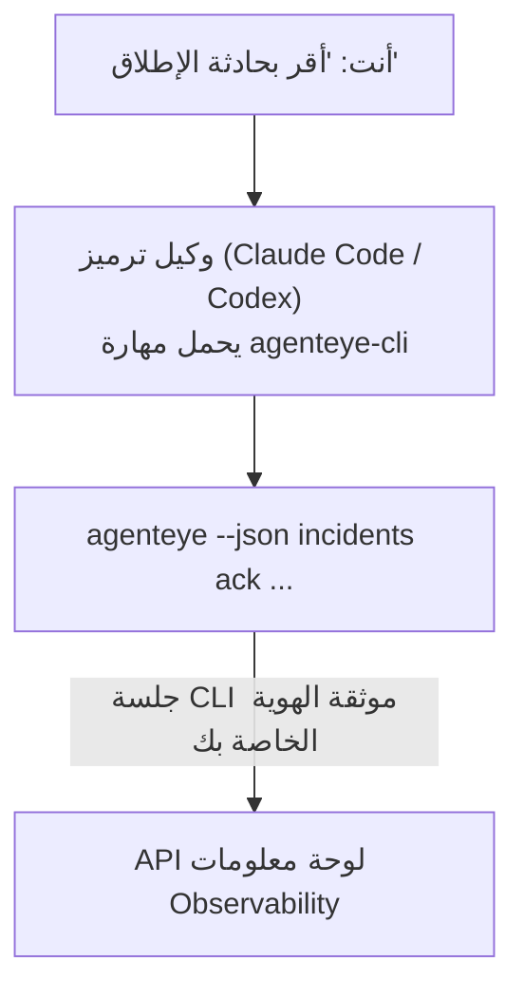

اسأل وكيل الترميز الخاص بك *"هل هناك أي شيء معطل اليوم؟"* واترك له الإجابة من بيانات FailproofAI Observability المباشرة، دون الحاجة لحفظ أي أوامر. **مهارة FailproofAI Observability CLI** (`agenteye-cli`) هي *مهارة Agent*: مجلد صغير من التعليمات يحمله وكيل ترميز مثل Claude Code أو Codex حسب الحاجة. تعلّم الوكيل تشغيل نشر Observability الخاص بك عبر [`agenteye` CLI](/ar/agenteye/cli) من طلبات باللغة الإنجليزية العادية مثل *"أعط CI مفتاحاً يمكنه فقط دفع الأحداث"* أو *"أقر بحادثة الإطلاق وأسندها إليّ."*

إنها **ليست** خدمة أو ملف بيناري منفصل؛ لا يوجد شيء للنشر. تعمل فوق CLI الذي لديك بالفعل: يقوم الوكيل بتنفيذ `agenteye --json …`، ويحلل JSON النظيف، ويجيب عليك بالنثر. كل شيء يمكنه فعله، يمكنك فعله بنفسك بكتابة الأوامر ذاتها.

---

## كيف ترتبط بواجهات FailproofAI Observability الأخرى

يوفر لك FailproofAI Observability أربع طرق للوصول إلى نفس البيانات والضوابط. تكمل بعضها بعضاً:

| الواجهة | ما هي | حيث تعمل | استخدمها عندما |
|---|---|---|---|
| **[CLI](/ar/agenteye/cli)** | مرجع الأوامر والعلامات لـ `agenteye` | طرفيتك | تريد تشغيل أو كتابة برنامج لأمر معين |
| **[وصفات CLI](/ar/agenteye/cli-recipes)** | أنماط `jq`/pipeline جاهزة للنسخ واللصق | طرفيتك / البرامج النصية | تدرج CLI في الأتمتة |
| **مهارة CLI** (هذه الوثيقة) | باب باللغة الطبيعية على CLI | وكيل الترميز الخاص بك، على محطة عملك | تريد فقط أن تسأل واترك الوكيل يختار الأمر |
| **[مساعد AI لوحة المعلومات](/ar/agenteye/assistant)** | دردشة مدمجة في لوحة المعلومات | على الخادم (في لوحة المعلومات) | تريد أسئلة وإجابات داخل لوحة المعلومات على بياناتك |

المهارة نفسها ليس لديها أي امتيازات خاصة بها؛ فهي فقط تحول كلماتك إلى استدعاءات CLI تعمل باسمك:



### مقابل مساعد AI لوحة المعلومات: تمييز مهم

هذان أداتان مختلفتان تماماً بنطاقات تأثير مختلفة جداً:

- **مساعد AI لوحة المعلومات** ([مساعد AI](/ar/agenteye/assistant)) هو دردشة مدمجة في لوحة المعلومات، مدعومة بخدمة الوكيل. إنه **قراءة فقط بالإضافة إلى تأليف مبوب بالموافقة**: يمكنه صياغة الاستعلامات المحفوظة ولوحات المعلومات، لكن كل عملية كتابة تتوقف للحصول على موافقتك الصريحة بالنقر، وهو لا يحذف أبداً. يتم تحديده بواسطة إذن `agent:use` ولا يرى أبداً سوى البيانات للمنظمة التي تعرضها.
- **مهارة CLI** تعمل على *محطة العمل الخاصة بك* داخل *وكيل الترميز الخاص بك* وتشغل `agenteye` CLI باسم **أنت**. يمكنها تنفيذ **السطح الكامل للـ CLI، بما في ذلك الطفرات** (إنشاء/تدوير/تعطيل مفاتيح API، تغيير إعدادات المنظمة، حل الحوادث، حذف الاستعلامات المحفوظة)، محدودة فقط بأذونات تسجيل دخول CLI الخاص بك. تعاملها بنفس الحذر الذي تتعامل به مع تشغيل تلك الأوامر يدوياً.

---

## المتطلبات الأساسية

1. **`agenteye` CLI مثبت** وعلى `PATH` (انظر مرجع [CLI](/ar/agenteye/cli): `pipx install agenteye`).
2. **عنوان URL لوحة المعلومات الخاص بك** معيّن (`AGENTEYE_DASHBOARD_URL`، أو يمرر الوكيل `--base-url`).
3. **جلسة مسجلة دخول**: قم بتشغيل `agenteye login` بنفسك أولاً. المهارة **لا تستطيع** إكمال تسجيل الدخول برمز لمرة واحدة عبر البريد الإلكتروني لك؛ ستخبرك بتشغيل `agenteye login` إذا كانت الجلسة مفقودة أو منتهية (كود خروج CLI `4`).

---

## تثبيت المهارة

Agent Skills هي مجلدات تحتوي على `SKILL.md` (بالإضافة إلى مراجع اختيارية). تثبت مهارة `agenteye-cli` بوضع مجلدها حيث يبحث وكيلك عن المهارات:

- **Claude Code**: انسخ مجلد `agenteye-cli/` إلى `~/.claude/skills/` (متاح في كل مشروع) أو إلى `<your-repo>/.claude/skills/` (محدود لذلك المستودع). Claude Code يكتشفها تلقائياً؛ تحقق برسالة `/skills`، أو فقط اسأل سؤالاً يطابق وصفها.
- **Codex (OpenAI)**: يقرأ Codex نفس `SKILL.md`. ملف `agents/openai.yaml` المضمن يعيّن `allow_implicit_invocation: true`، لذا يختار Codex المهارة تلقائياً عندما تطابق المهمة؛ وإلا استدعها صراحة باسم `$agenteye-cli`.

يتم الحفاظ على المهارة جنباً إلى جنب مع `agenteye` CLI لكنها تُسلّم كـ **مجلد منفصل**، وليس داخل حزمة `pipx install agenteye`، لذا لا تبحث عنها هناك. يوفر لك FailproofAI Observability مجلد `agenteye-cli/` بنفسه؛ إذا لم تحصل عليه، اطلب من جهة اتصالك في FailproofAI. لا شيء عنها مقيّد: لا تحتاج إلى أي بيانات اعتماد على الإطلاق، لأنها فقط تشغل `agenteye` CLI **العام** ضد لوحة المعلومات الخاصة بك.

---

## السلامة: الطفرات لا تطلب تأكيداً عندما يشغل وكيل CLI

> **تحذير:** اقرأ هذا قبل السماح لوكيل بإجراء تغييرات.

يطلب CLI `agenteye` عادة *"هل أنت متأكد؟"* قبل إجراء تدميري. إنه **يتخطى هذا التأكيد تلقائياً كلما لم يكن متصلاً بطرفية (وهذا بالضبط كيفية تشغيل وكيل ترميز له)، و`--json` يتخطاه أيضاً.** لذا طلب الأمان **لن** ينشط للوكيل.

تمت كتابة المهارة للتعويض: يتم إرشادها لذكر الأمر الدقيق الذي ستشغله والحصول على موافقتك الصريحة **قبل أي تغيير في الحالة**. احافظ على هذا الانضباط. عندما تشغل FailproofAI Observability من خلال وكيل، *أنت* خطوة التأكيد. أوامر تغيير الحالة التي يجب الانتباه لها:

- `keys create` / `update` / `disable` / `regenerate`
- `users create` / `update` / `disable` / `enable`
- `settings set`
- `alerts create` / `update` / `delete` / `test`
- أوامر `incidents` الكاتبة: `ack` / `assign` / `resolve` / `open` / `comment-add` / `comment-delete` / `subscribe` / `unsubscribe`
- `query create` / `update` / `delete`
- `agent rename` / `delete`
- `orgs switch`

كل شيء تحت **Observe** (`events`, `sessions`, `evals`, `errors`, `list`, `whoami`, `orgs list/current/perms`) للقراءة فقط ولا يغير شيئاً.

لأن الوكيل يعمل باسم **أنت**، يمكنه فقط فعل ما يُسمح لك تسجيل دخولك بفعله؛ يتم حل الأذونات **لكل منظمة** (انظر [مفاتيح API](/ar/agenteye/api-keys)). أمر تفتقر له الإذن يُرجع كود الخروج `5` مع الإذن المحدد بالضبط، لذا يمكن للوكيل أن يخبرك بالضبط ماذا تطلب من المسؤول بدلاً من الفشل بطريقة غير واضحة.

---

## ما يمكنك أن تسأله

إليك ما يبدو عليه الرحلة الكاملة الفعلية، قراءة، ثم تغيير ينتظر موافقتك:

```text
أنت    ▸ هل هناك أي شيء معطل في اليوم الأخير؟

الوكيل ▸ تشغيل: agenteye --json errors --since 24h --aggregate
         3 أنواع أخطاء في آخر 24 ساعة. الأكبر هو TimeoutError
         (18 عملية، كلها على checkout-agent)، ثم RateLimited (5).
         هل تريد الجلسات الفاشلة لـ TimeoutError؟

أنت    ▸ أعط CI مفتاحاً يمكنه فقط دفع الأحداث.

الوكيل ▸ هذا ينشئ مفتاح API. سأشغل:
          agenteye keys create ci --add events:add
        حسناً، هل تريد المتابعة؟

أنت    ▸ نعم

الوكيل ▸ تم. تم إنشاء المفتاح "ci" باستخدام events:add فقط.
         السر يُعرض مرة واحدة فقط، لذا احفظه الآن. لا يمكنني إعادة طباعته.
```

تخطط المهارة كل نية باللغة الطبيعية إلى أمر `agenteye` صحيح، تكتشف القيم الصحيحة أولاً (`list <kind>`, `whoami`) حتى لا تتخمن، وتذكر الأمر الدقيق قبل أي تغيير. المزيد من الأمثلة:

- *"هل هناك أي شيء معطل / فاشل في آخر 24 ساعة؟"* → `errors --since 24h --aggregate`، ثم تفصيل.
- *"لماذا فشلت الجلسة `run-001`؟"* → `events --session-id run-001 --all` + `evals --session-id run-001`.
- *"كيف يتجه الجودة هذا الأسبوع؟"* → `evals --aggregate --since 7d`، ثم التعمق في التشغيلات منخفضة الدرجات.
- *"أعط CI مفتاحاً يمكنه فقط دفع الأحداث."* → `keys create ci --add events:add` (تذكر الأمر، ثم تنشئه والتقط السر لمرة واحدة).
- *"من لديه حق الوصول؟ اجعل Dana للقراءة فقط."* → `users list` → `users update dana@… --permission-set read-only` (بعد تأكيد معك).
- *"أقر بحادثة الإطلاق وأسندها إليّ."* → `incidents list --state firing` → `incidents ack <id>` / `incidents assign <id> you@…`.

للأوامر الدقيقة والعلامات وأشكال JSON خلف هذه، انظر مرجع [CLI](/ar/agenteye/cli) و[وصفات CLI للوكلاء](/ar/agenteye/cli-recipes).

---

## الخطوات التالية

- **[CLI](/ar/agenteye/cli)**: مرجع أوامر وعلامات كامل لـ `agenteye`.
- **[وصفات CLI للوكلاء](/ar/agenteye/cli-recipes)**: أنماط `jq` جاهزة للنسخ واللصق ومعالجة كود الخروج.
- **[مساعد AI](/ar/agenteye/assistant)**: مساعد لوحة المعلومات (لا يجب الخلط بينه وبين مهارة الطرفية هذه).
- **[مفاتيح API](/ar/agenteye/api-keys)**: نموذج الإذن لكل منظمة الذي يحدد ما يمكن للمهارة فعله.