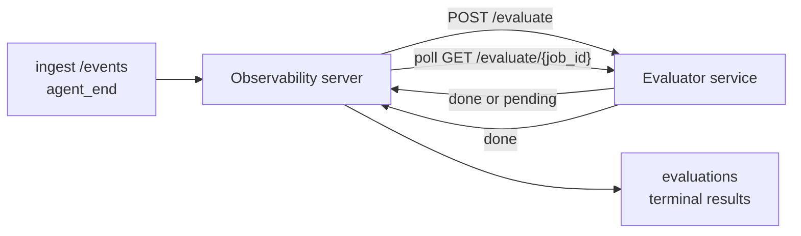

يمكن لنظام Failproof AI Observability تقييم جودة كل جلسة وكيل مكتملة تلقائياً: توفر خدمة تقييم صغيرة، ويتولى Observability الباقي. استخدمه لتتبع الأبعاد التي تهمك (المساعدة، كفاءة الأدوات، الدقة، الأمان؛ أنت من تختار)، اكتشف الانحدارات مبكراً، وقارن بين الوكلاء أو البيئات بسهولة. التقييم اختياري: لا يفعل خط الأنابيب شيئاً حتى تضبط `EVALUATOR_ENDPOINT` على الخادم.

> **ملاحظة:** أنت من تحدد أبعاد التقييم. يمكن لأداة التقييم الخاصة بك أن ترجع أي مفاتيح رقمية تريدها؛ يخزن Observability ويرسم بيانياً ويعرض كل ما تعيده.

## لمحة عامة

1. **اكتب أداة تقييم.** أنشئ خدمة HTTP صغيرة تقرأ نسخة جلسة عمل وترجع نقاطاً. يأتي Observability مع مرجع عملي يمكنك نسخه. انظر [كتابة أداة تقييم باستخدام SDK](#كتابة-أداة-تقييم-باستخدام-sdk).
2. **وجّه Observability إليها.** اضبط `EVALUATOR_ENDPOINT` (و`EVALUATOR_TOKEN` مشترك) على عملية الخادم.
3. **راقب وصول النقاط.** يتم تقييم كل جلسة مكتملة تلقائياً؛ تظهر النتائج في صفحة تفاصيل الجلسة، شبكة الجلسات، ولوحات التحكم المحفوظة.


*بمجرد تكوين أداة تقييم، يتم تقييم كل عملية مكتملة وتظهر النتائج في الجزء الأيمن من الجلسة: الملخص أعلاه، ثم أشرطة النقاط لكل بعد مع الاستدلال.*

---

## كيفية العمل



عندما يصدر Failproof AI Observability SDK حدث `agent_end` لجلسة، يجدول الخادم تقييماً. ثم يرسل نسخة الحدث الكاملة إلى خدمة التقييم الخاصة بك، والتي يمكنها إما:

- **إرجاع النتيجة مباشرة** مع `{"status":"done", "scores":{...}, "reasoning":{...}, "summary":"..."}`. تضاف النتيجة إلى الجدول الزمني للتقييم في الجلسة. `reasoning` و `summary` اختياريان.
- **الانتظار** مع `{"status":"pending", "job_id":"abc-123"}`. يستدعي Observability بعد ذلك `GET {EVALUATOR_ENDPOINT}/evaluate/abc-123` حتى ترجع أداة التقييم الخاصة بك `{"status":"done", ...}` أو `{"status":"error", "error":"..."}`.

  يتم الاستقصاء لكل مهمة: قد تتضمن استجابة `pending` `next_poll_secs` للتجاوز؛ وإلا فإن Observability يستخدم قيمة `default_poll_interval_secs` من `GET /config`؛ وإلا يعود الخادم إلى `EVALUATOR_POLLING_INTERVAL_SECS` (الافتراضي 10 ثوان). يتم تثبيت جميع القيم على [1 ثانية، 1 ساعة].

يمكن أيضاً التقاط الجلسات التي لم تصدر أبداً `agent_end` (على سبيل المثال، عملية وكيل متعطلة): قد يرجع `GET /config` الخاص بأداة التقييم `{"inactivity_timeout_secs": 1800}`، وسيقيّم Observability أي جلسة تكون خاملة لهذه المدة. اضبط الحقل على `null` أو احذفه لتعطيل هذا البديل.

خط الأنابيب بدون عملية بالكامل عندما يكون `EVALUATOR_ENDPOINT` غير مضبوط.

يمكن لجلسة تجميع **تقييمات نهائية متعددة بمرور الوقت**: كل حدث `agent_end` (وكل إعادة تقييم يدوية من لوحة التحكم) يضيف صف تقييم جديد. هذه هي الطريقة المدعومة لتقييم محادثة معاودة: ينهي المستخدم وكيلاً، يعود لاحقاً، يرسل المزيد من الأحداث، ينهي الوكيل مرة أخرى، ويتم تشغيل تقييم ثانٍ ضد النسخة المحدثة الكاملة. تعرض لوحة التحكم التقييم الأحدث كعنوان وتقييمات سابقة كمخطط زمني قابل للطي. بينما يتم تشغيل تقييم واحد لجلسة، يتم تجاهل أحداث `agent_end` الإضافية لتلك الجلسة؛ الحدث التالي بعد اكتمال التقييم الجاري سيصطف لتقييم جديد كالمعتاد.

يعاود البديل الخامل الاشتباك على الجلسات المستأنفة أيضاً: إذا وصلت أحداث جديدة بعد تقييم نهائي سابق وأصبحت الجلسة بعد ذلك خاملة لفترة تجاوز `inactivity_timeout_secs`، يتم صف تقييم جديد.

تحاول الأخطاء العابرة (5xx، 429، انتهاء المهلة الزمنية، أخطاء الشبكة) مع التراجع الأسي حتى `EVALUATOR_MAX_ATTEMPTS`؛ ردود 4xx نهائية. يعمل Observability بأمان مع عدة حالات خادم مقسمة أفقياً؛ يتم تقسيم العمل بحيث لا يتم أبداً إرسال نفس الجلسة مرتين بالتزامن.

---

## العقد HTTP

كل طريق مُصادق عليه يستخدم **مصادقة رمز الدخول**. يجب أن تكون نفس القيمة مضبوطة على كلا الجانبين:

- خادم Observability: متغير البيئة `EVALUATOR_TOKEN`
- خدمة التقييم: مضبوطة بنفس الطريقة (يقرأ SDK `agenteye-evaluator` `EVALUATOR_TOKEN` بالاتفاق)

إذا كان `EVALUATOR_TOKEN` غير مضبوط، لا يرسل الخادم رأس `Authorization`؛ قد تقبل أداة التقييم بعد ذلك طلبات مجهولة، وهذا جيد لشبكة داخلية فقط ولكن لا يُنصح به على الإنترنت العام.

### الطرق التي يجب أن تخدمها أداة التقييم

| الطريق | الجسم / المعاملات | الاستجابة |
|---|---|---|
| `GET /health` | بلا | `{"status":"ok"}` (مفتوح، بدون مصادقة) |
| `GET /config` | بلا | `{"inactivity_timeout_secs": <int> \| null, "default_poll_interval_secs": <int> \| omitted}` |
| `POST /evaluate` | JSON `EvalRequest` | `{"status":"done", ...}` أو `{"status":"pending", "job_id":"..."}` |
| `GET /evaluate/{id}` | بلا | نفس شكل الاستجابة مثل `/evaluate` |

### جسم `EvalRequest` المرسل من قبل الخادم

```json
{
  "schema_version": "1",
  "session_id":     "session-abc123",
  "agent_id":       "planner",
  "environment":    "production",
  "started_at":     "2026-05-10T12:00:00Z",
  "ended_at":       "2026-05-10T12:05:00Z",
  "events": [
    { "id": 1234, "ts": "...", "event_type": "agent_start", "payload": { ... } },
    ...
  ]
}
```

### أشكال الاستجابة

**متزامن (مكتمل):**

```json
{
  "status": "done",
  "scores": { "helpfulness": 0.85, "tool_efficiency": 0.6 },
  "reasoning": {
    "helpfulness": "answered the question directly with citations",
    "tool_efficiency": "called list_files three times when one would have done"
  },
  "summary": "strong answer quality, weak tool selection"
}
```

`reasoning` (خريطة تبرير لكل نقاط) و `summary` (سرد شامل في فقرة واحدة) كلاهما اختياري. يجب أن تعكس المفاتيح في `reasoning` المفاتيح في `scores`؛ تعرض لوحة التحكم كل إدخال مضمناً تحت شريط النقاط الخاص به. تحافظ أدوات التقييم الأقدم التي ترجع فقط `scores` على العمل دون تغيير؛ `reasoning` و `summary` يقرآن ببساطة كـ null والتسهيلات المتعلقة بواجهة المستخدم المقابلة يتم حذفها.

**غير متزامن (مؤجل):**

```json
{ "status": "pending", "job_id": "abc-123", "next_poll_secs": 30 }
```

`next_poll_secs` اختياري؛ إذا تم حذفه، يعود الخادم إلى `default_poll_interval_secs` الخاص بأداة التقييم من `/config`، ثم إلى متغير البيئة الخاص به `EVALUATOR_POLLING_INTERVAL_SECS`.

**خطأ نهائي من جانب أداة التقييم:**

```json
{ "status": "error", "error": "model service unavailable" }
```

يعامل الخادم أي جسم 2xx آخر كخطأ بروتوكول ويسجل `error` نهائي للجلسة.

---

## كتابة أداة تقييم باستخدام SDK

لا تحتاج إلى تنفيذ العقد HTTP بنفسك. تمنحك حزمة `agenteye-evaluator` Python غلاف FastAPI مكتوب بشكل صحيح يتعامل مع المصادقة والتوجيه وأشكال الطلب/الاستجابة بالنيابة عنك.

يأتي Failproof AI Observability أيضاً مع **أداة تقييم مرجعية عملية** تقيم `helpfulness` و `tool_efficiency` و `factuality` من شكل النسخة. انسخها كنقطة انطلاق وبدل المنطق الخاص بك: حكم LLM، محرك قواعد، أياً كان ما يناسب شريط الجودة الخاص بك.

أداة تقييم حد أدنى قابل للحياة:

```python
import os
from agenteye_evaluator import Evaluator, EvalRequest, EvalResponse

app = Evaluator(token=os.environ["EVALUATOR_TOKEN"])

@app.evaluator
def run(req: EvalRequest) -> EvalResponse:
    # Inspect req.events (the full session transcript) and return scores.
    tool_calls = sum(1 for e in req.events if e.event_type == "tool_use")
    return EvalResponse(
        scores={"tool_calls": float(tool_calls)},
        reasoning={"tool_calls": f"{tool_calls} tool invocations in the transcript"},
        summary="tight tool loop" if tool_calls < 5 else "agent looped on tools",
    )
```

تعمل نسخة `app` تحت أي خادم ASGI، لذا `uvicorn module:app` يبدأه.

بالنسبة لأدوات التقييم التي تحتاج إلى تأجيل العمل المكلف، أرجع `JobPending` بدلاً من ذلك وسجل معالج `@app.job_lookup`؛ يستقصي خادم Observability `GET /evaluate/{job_id}` حتى ترجع أداة التقييم حالة نهائية أو تنقضي قيمة حد `EVALUATOR_MAX_POLL_DURATION_SECS` (الافتراضي 1 ساعة).

موثق المرجع الكامل، النمط غير المتزامن، وخطة الحدث في ملف README الخاص بـ SDK `agenteye-evaluator`.

---

## تشغيل أداة التقييم الخاصة بك

أداة التقييم **خدمتك** — لا يأتي Failproof AI Observability مع أداة تقييم افتراضية، لذا تبني وتشغلها حيث تشغل خدماتك الخاصة. تعمل تحت أي خادم ASGI (على سبيل المثال `uvicorn my_evaluator:app`)؛ خدم طرق `/health` و `/config` و `/evaluate` من [العقد HTTP](#العقد-http)، ثم وجّه الخادم إليها (انظر [تكوين الخادم](#تكوين-الخادم)).

بمجرد أن تصبح أداة التقييم قابلة للوصول، يرجع `GET /health` قيمة `{"status":"ok"}`. بعد تشغيل وكيل من البداية إلى النهاية، يرجع `GET /evaluations` على الخادم صف مع `status: "done"` والنقاط التي أنتجتها أداة التقييم الخاصة بك.

---

## تكوين الخادم

اضبط على عملية الخادم:

| متغير البيئة | المعنى |
|---|---|
| `EVALUATOR_ENDPOINT` | عنوان URL الأساسي لأداة التقييم الخاصة بك (`http://evaluator:9000`). لم يتم الضبط = خط الأنابيب معطل. |
| `EVALUATOR_TOKEN` | رمز الدخول. يجب أن يساوي القيمة المضبوطة عليها خدمة أداة التقييم. |
| `EVALUATOR_WORKERS` | مهام العامل لكل نسخة خادم (الافتراضي 2). |
| `EVALUATOR_CLAIM_BATCH` | صفوف مطالب لكل حركة عامل (الافتراضي 4). يتم معالجة الدفعات **بالتزامن**؛ التزامن الفعلي على نقطة نهاية أداة التقييم الخاصة بك هو `EVALUATOR_WORKERS × EVALUATOR_CLAIM_BATCH`. |
| `EVALUATOR_POLL_IDLE_SECS` | مدة نوم العامل بين محاولات الإرسال عندما لا يكون أي تقييم مستحقاً (الافتراضي 2 ثانية). |
| `EVALUATOR_POLLING_INTERVAL_SECS` | البديل النهائي لإيقاع `GET /evaluate/{id}` عندما لا يتم تعيين `next_poll_secs` لكل استجابة أو `default_poll_interval_secs` الخاص بأداة التقييم (الافتراضي 10 ثوان). |
| `EVALUATOR_REQUEST_TIMEOUT_MS` | مهلة زمنية لكل طلب (الافتراضي 30000). |
| `EVALUATOR_MAX_ATTEMPTS` | بعد عدد الأخطاء العابرة هذا يتم تسجيل النتيجة كـ `error` نهائي (الافتراضي 5). |
| `EVALUATOR_CONFIG_REFRESH_SECS` | إيقاع `GET /config` (الافتراضي 300). |
| `EVALUATOR_MAX_POLL_DURATION_SECS` | أقصى وقت حائط زمني قد تبقى فيه جلسة في قائمة الاستقصاء قبل إنهاؤها كـ `timeout` (الافتراضي 3600 ثانية). يحمي من أداة تقييم تستمر في إرجاع `pending` إلى الأبد. |

لتشغيل التقييم التلقائي، اضبط كلاً من `EVALUATOR_ENDPOINT` و `EVALUATOR_TOKEN` على الخادم، ثم أعد تشغيله لالتقاط التغيير. عندما يكون `EVALUATOR_ENDPOINT` غير مضبوط يبقى خط الأنابيب بدون عملية.

أزرار الضبط أعلاه اختيارية؛ اضبط متغيرات البيئة المقابلة على الخادم فقط إذا احتجت إلى تجاوز الافتراضيات.

---

## مرجع API

| الطريقة | المسار | الإذن المطلوب | الغرض |
|---|---|---|---|
| `GET` | `/evaluations` | `evaluations:read` | استعلم النتائج النهائية. يدعم `session_id`، `agent_id`، `environment`، `status` (`done`/`error`/`timeout`)، `ts_from`، `ts_to`، `cursor`، `limit`، `score_filters`، `latest_per_session`. الافتراضي `limit` هو 50 ويقتصر على 200 (لاحظ أن هذا يختلف عن `/events`، والذي يقتصر على 1000). `environment` يقبل قائمة مفصولة بفواصل (على سبيل المثال `environment=prod,staging`)؛ تعمل القيم الفردية أيضاً. مع `latest_per_session=true` تحتوي الاستجابة على صف واحد على الأكثر لكل `session_id` (الأحدث حسب `completed_at`) يستخدمه صفحة قائمة الجلسات لطي الجدول الزمني لتقييم جلسة إلى عنوانها الحالي. الافتراضي false (يرجع السجل الكامل). |
| `GET` | `/evaluations/aggregate` | `evaluations:read` | صحة التقييم المجمعة لشريحة مُصفاة: العد الإجمالي، تفصيل done/error/timeout، إحصائيات لكل مفتاح نقاط (العد/المتوسط/الحد الأدنى/الحد الأقصى/p50 على مفاتيح `scores` التعسفية)، والجدول الزمني ذو الحد الزمني. يقبل **نفس معاملات الفلتر مثل `/evaluations`** بالإضافة إلى `featured_keys` (CSV لمفاتيح النقاط للرسم البياني) و `latest_per_session`. يشغل ميزة لوحات التحكم؛ المقاييس دقيقة على مجموعة المطابقة بأكملها، وليست مأخوذة عينات. |
| `GET` | `/evaluations/environments` | `evaluations:read` | قيم البيئة المميزة من جدول `evaluations`. المستخدمة لملء القوائم المنسدلة للفلتر المحدودة لبيانات التقييم المقروءة. |
| `GET` | `/evaluation-jobs` | `evaluations:read` | الرؤية إلى التقييمات أثناء الطيران. صفّ حسب `status` (`pending`/`polling`). |
| `GET` | `/events` | `events:read` | بث أحداث جلسة أولية. يدعم `session_id`، `agent_id`، `event_type` (CSV)، `environment` (CSV)، `ts_from`، `ts_to`، `cursor`، `limit`، و `order`. `order` هو `desc` (الأحدث أولاً، الافتراضي) أو `asc` (الأقدم أولاً)؛ قيمة غير معروفة ترجع إلى `desc`. ضع حدود لصفحة عبر `next_cursor` (معرّف حدث) في الاستجابة: مرره مرة أخرى كـ `cursor` للحصول على الصفحة التالية؛ مع `asc` الصفحة التالية هي الأحداث بعد هذا المعرّف، مع `desc` الأحداث قبله. الافتراضي `limit` هو 50 ويقتصر على 1000. |
| `GET` | `/sessions/:session_id/export` | `events:read` | يرجع جسم JSON الدقيق الذي ستتلقاه أداة التقييم لهذه الجلسة، يُقدم كمرفق قابل للتنزيل باسم `session-<id>.json`. مفيد لإعادة تشغيل الجلسات من الإنتاج عبر `agenteye-evaluator` للاختبار غير المتصل. البايتات متطابقة بايت مع ما يرسله خط أنابيب المقيّم. |
| `POST` | `/sessions/:session_id/re-evaluate` | `evaluations:trigger` | صف تقييم جديد لجلسة؛ يعمل سواء كان التقييم السابق موجوداً أم لا. يتم **إضافة** النتيجة الجديدة إلى الجدول الزمني لتقييم الجلسة بدلاً من الكتابة فوق النتيجة السابقة، لذا تبقى النقاط السابقة مرئية كسجل. يرجع `202` عند الصف، `404` لجلسة غير معروفة، `409` إذا كان التقييم قيد التشغيل بالفعل. استخدم هذا بعد نشر أداة تقييم جديدة، أو للجلسات التي لم تصدر أبداً `agent_end`. |

### الفلترة حسب نطاق النقاط: `score_filters`

يقبل `GET /evaluations` معامل `score_filters` اختياري يضيق النتائج حسب القيم الرقمية داخل كائن `scores`. المعامل عبارة عن قائمة مفصولة بفواصل من إدخالات `key:min..max`؛ قد يتم حذف أي حد. تتحد إدخالات متعددة مع AND منطقي. تُستبعد الصفوف التي يكون فيها المفتاح المسمى غائباً أو غير رقمي. قد يحمل الطلب الواحد 20 إدخال فلتر كحد أقصى؛ تجاوز ذلك يرجع HTTP 400.

أمثلة:
```text
# helpfulness in [0.5, 0.8]
GET /evaluations?score_filters=helpfulness:0.5..0.8

# tool_efficiency at most 0.3 (no lower bound)
GET /evaluations?score_filters=tool_efficiency:..0.3

# helpfulness >= 0.5 AND factuality >= 0.9
GET /evaluations?score_filters=helpfulness:0.5..,factuality:0.9..
```

لدى كل كائن استجابة `/evaluations` هذه الحقول:

| الحقل | النوع | ملاحظات |
|---|---|---|
| `evaluation_id` | string (UUID) | المعرّف القانوني لهذا التقييم النهائي. يحصل كل تقييم نهائي على UUID جديد؛ يمكن لجلسة واحدة الاحتفاظ بعدة. |
| `id` | string (UUID) | تعويض الرجعية يحمل نفس قيمة `evaluation_id`. |
| `session_id` | string | الجلسة التي يعمل ضدها هذا التقييم. يمكن لجلسة واحدة أن تحتوي على تقييمات متعددة في الجدول الزمني. |
| `agent_id` | string | يحدد الوكيل الذي أنتج الجلسة. |
| `environment` | string | تسمية البيئة المنسوخة من الجلسة. |
| `status` | enum | واحد من `"done"`، `"error"`، `"timeout"`. |
| `scores` | object \| null | النقاط المرجعة من قبل أداة التقييم الخاصة بك. |
| `reasoning` | object \| null | خريطة تبرير اختيارية لكل نقاط مرجعة من قبل أداة التقييم الخاصة بك. عادة ما تعكس المفاتيح تلك في `scores`. تعرض لوحة التحكم كل إدخال تحت شريط النقاط الخاص به. |
| `summary` | string \| null | سرد شامل اختياري في فقرة واحدة مرجع من قبل أداة التقييم الخاصة بك. تعرض لوحة التحكم هذا فوق تفصيل النقاط لكل بعد كعنوان التقييم. |
| `error` | string \| null | معبأ على `"error"` / `"timeout"` فقط. |
| `attempt_count` | integer | عدد محاولات الإرسال (≥ 1). |
| `duration_ms` | integer \| null | مدة المحاولة الأخيرة. |
| `completed_at` | string (ISO 8601 UTC) | عند تسجيل النتيجة النهائية. يتم ترتيب النتائج حسب `completed_at` (الأحدث أولاً). |
| `created_at` | string (ISO 8601 UTC) | يحمل نفس الطابع الزمني مثل `completed_at` (دلالات الكتابة مرة واحدة). |

---

## الأذونات

| الإذن | المنح |
|---|---|
| `evaluations:read` | قائمة نتائج التقييم، اعرض النقاط في لوحة التحكم، وحمّل مقاييس صحة لوحة التحكم. |
| `evaluations:trigger` | ضع تقييماً يدوياً لجلسة عبر `POST /sessions/:session_id/re-evaluate` أو زر إعادة التقييم على لوحة التحكم. |
| `dashboards:read` | عرض لوحات التحكم المحفوظة (تحتاج أيضاً إلى `evaluations:read` لتحميل مقاييسها). |
| `dashboards:write` | إنشاء وتحرير لوحات التحكم. |
| `dashboards:delete` | حذف لوحات التحكم. |

يتلقى مسؤول التمهيد (`ADMIN_KEY`، `ADMIN_EMAIL`) تلقائياً هذه.

---

## عرض النتائج

- **`/sessions/<id>`**: جدول زمني للأحداث + جزء أيمن يعرض نقاط الجلسة وأي خطأ من محاولة الإرسال. إذا كان لديك المفتاح `evaluations:trigger`، يظهر زر **إعادة تقييم** بجانب زر التصدير، مفيد للجلسات التي لم تصدر أبداً `agent_end`، أو لتحديث النقاط بعد نشر أداة تقييم جديدة. تستقصي لوحة التحكم النتيجة الجديدة وتحدث الجزء الأيمن عند وصولها.
- **`/sessions`**: شبكة جلسات قابلة للتصفية؛ يعرض عمود النقاط حالة التقييم والنقاط في الجلسة بلمحة.
- **`/dashboards`**: عروض صحة تقييم محفوظة (انظر [لوحات التحكم](#لوحات-التحكم) أدناه).


*تعرض شبكة الجلسات حالة التقييم والنقاط في كل جلسة بلمحة؛ تجعل شارات أحمر/كهرماني/أخضر انخفاض النقاط بارزاً.*

---

## لوحات التحكم

تتيح صفحة **Dashboards** (`/dashboards`) لك حفظ مجموعة من فلاتر التقييم كعرض مسمى وقابل لإعادة الاستخدام ومراقبة كيفية سير تلك الشريحة من التقييمات بلمحة. يتم **مشاركة لوحات التحكم عبر منظمتك بأكملها**؛ يرى الجميع الذين لديهم `dashboards:read` نفس المجموعة.

كل لوحة تحكم تثبت:

- **الفلاتر**: نفس الضوابط مثل صفحة الجلسات: البيئة، الحالة، الوكيل، نافذة زمنية متداول، وفلاتر نطاق النقاط (`key:min..max`).
- **تكوين العرض**: مفاتيح النقاط المميزة، حدود صحة أخضر/كهرماني/أحمر، اللوحات المراد إظهارها، وما إذا كان يجب طي أحدث تقييم لكل جلسة.

تعرض كل بطاقة عدد الجلسات المطابقة، تفصيل done/error/timeout، متوسط كل نقطة مميزة، وخط اتجاه صغير. يؤدي فتح لوحة تحكم إلى عرض اللوحات بالحجم الكامل؛ يسقطك **"فتح في الجلسات"** في صفحة الجلسات مع فلترة مسبقة بالضبط لتلك الشريحة. يتم حساب المقاييس من جانب الخادم على مجموعة المطابقة بأكملها (عبر `GET /evaluations/aggregate`)، لذا فإن الأرقام دقيقة بدلاً من أن تكون عينة.


**الأذونات:** يحتاج العرض إلى `dashboards:read` و `evaluations:read`؛ يحتاج الإنشاء والتحرير إلى `dashboards:write`؛ يحتاج الحذف إلى `dashboards:delete`. يتلقى مسؤول التمهيد كل هذه تلقائياً.

---

## استكشاف الأخطاء

**الجلسات موجودة ولكن لا يتم إنشاء تقييمات.** تأكد من ضبط `EVALUATOR_ENDPOINT` على عملية الخادم، من أن الخادم وأداة التقييم تشترك نفس قيمة `EVALUATOR_TOKEN`، ومن أن نقطة نهاية `/health` الخاصة بأداة التقييم قابلة للوصول من الخادم. مع `EVALUATOR_ENDPOINT` غير مضبوط يكون خط الأنابيب بدون عملية.

**تتراكم التقييمات أثناء الطيران.** استعلم `GET /evaluation-jobs` لرؤية طابور الطيران. افحص `attempt_count` و `next_attempt_at` و `last_error` على كل صف. الأسباب الشائعة: خدمة المقيّم غير قابلة للوصول أو ترجع 5xx (تحاول مع التراجع)، `EVALUATOR_TOKEN` خاطئ (401 نهائي)، أو مقيّم غير متزامن يرجع `pending` إلى الأبد (انظر أدناه).

**تمت الجلسات لكن لا تقييم نهائي.** استعلم `GET /evaluation-jobs?status=polling`؛ قد تظل النتيجة قيد الطيران. إذا تعثرت مهمة في `pending`، يواجه الخادم مشكلة في الوصول إلى المقيّم؛ تحقق من أن المقيّم مشغل وأن `EVALUATOR_TOKEN` مطابق.

**`HTTP 401 from evaluator: invalid bearer token`.** لا يطابق `EVALUATOR_TOKEN` على الخادم القيمة المضبوط عليها خدمة المقيّم. يجب أن تكون متطابقة.

**يرجع المقيّم غير المتزامن `pending` إلى الأبد.** يستقصي الخادم `GET /evaluate/{job_id}` حتى يرجع المقيّم `done` أو `error`، أو حتى `EVALUATOR_MAX_POLL_DURATION_SECS` (الافتراضي 1 ساعة) ينقضي. بعد الحد يتم تسجيل التقييم كـ `timeout` وإزالته من طابور الطيران. ارفع `EVALUATOR_MAX_POLL_DURATION_SECS` إذا كان المقيّم الخاص بك يحتاج بشكل شرعي إلى أكثر من الافتراضي.

---

## الخطوات التالية

- [مهارة وكيل المقيّم](/ar/agenteye/evaluator-skill): اجعل وكيل الترميز يصمم أبعادك ضد الجلسات الحقيقية وينشئ هذه الخدمة بالنيابة عنك.
- [Python SDK](/ar/agenteye/python-sdk): اصدر أحداث `agent_end` التي تشغل التقييم.
- [مفاتيح API](/ar/agenteye/api-keys): أذونات `evaluations:read` و `evaluations:trigger`.
- [التدقيق](/ar/agenteye/audits): ميزة الجودة الآلية الأخرى في Observability، للمراجعة القائمة على السياسة.