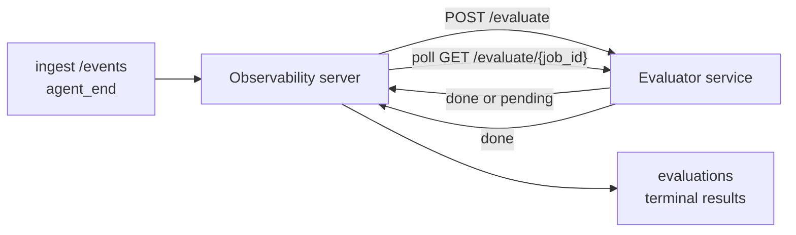

يمكن لـ FailproofAI Observability تسجيل كل عملية agent مكتملة تلقائياً من حيث الجودة: توفر خدمة تسجيل صغيرة، و Observability يتولى الباقي. استخدمها لتتبع الأبعاد التي تهمك (المساعدة، كفاءة الأدوات، الدقة، الأمان؛ تختار أنت)، واكتشف الانحدار مبكراً، وقارن العملاء أو البيئات في لمحة سريعة. التسجيل اختياري: لا يفعل خط الأنابيب شيئاً حتى تعيّن `EVALUATOR_ENDPOINT` على الخادم.

> **ملاحظة:** أنت تحدد أبعاد النقاط. يمكن لمقيِّمك أن يعيد أي مفاتيح رقمية يشاء؛ يخزن Observability ويتابع ويعرض ما تعيده.

## لمحة سريعة

1. **اكتب مسجلاً.** قم بإنشاء خدمة HTTP صغيرة تقرأ نسخة جلسة عمل وتعيد النقاط. يأتي Observability مع مرجع عملي يمكنك نسخه. انظر [كتابة محقق باستخدام SDK](#writing-an-evaluator-with-the-sdk).
2. **أشر Observability إليه.** عيّن `EVALUATOR_ENDPOINT` (و`EVALUATOR_TOKEN` مشترك) على عملية الخادم.
3. **راقب النقاط تصل.** يتم تسجيل كل جلسة مكتملة تلقائياً؛ تظهر النتائج في صفحة تفاصيل الجلسة وشبكة الجلسات واللوحات المحفوظة.


*بعد تكوين مقيِّم، يتم تسجيل كل عملية مكتملة وتظهر النتائج في الشريط الأيمن للجلسة: الملخص في الأعلى، ثم أشرطة النقاط لكل بُعد مع التفسير.*

---

## كيف يعمل



عندما يصدر Observability SDK حدث `agent_end` لجلسة ما، يجدول الخادم تقييماً. يرسل بعد ذلك نسخة الأحداث الكاملة إلى خدمة المقيِّم، والتي يمكنها إما:

- **إرجاع النتيجة مباشرة** باستخدام `{"status":"done", "scores":{...}, "reasoning":{...}, "summary":"..."}`. تُضاف النتيجة إلى خط زمن تقييم الجلسة. `reasoning` و`summary` اختياريان.
- **تأجيل** باستخدام `{"status":"pending", "job_id":"abc-123"}`. بعد ذلك يستدعي Observability `GET {EVALUATOR_ENDPOINT}/evaluate/abc-123` حتى يعيد المقيِّم `{"status":"done", ...}` أو `{"status":"error", "error":"..."}`.

  وتيرة الاستطلاع خاصة بكل وظيفة: قد تتضمن استجابة `pending` `next_poll_secs` للتجاوز؛ وإلا يستخدم Observability قيمة `default_poll_interval_secs` من `GET /config`؛ وإلا يعود الخادم إلى `EVALUATOR_POLLING_INTERVAL_SECS` (الافتراضي 10 ثوان). يتم تثبيت جميع القيم على [1s، 1h].

الجلسات التي لم تصدر `agent_end` أبداً (على سبيل المثال، عملية agent محطمة) يمكن التقاطها أيضاً: قد يعيد `GET /config` للمقيِّم `{"inactivity_timeout_secs": 1800}`، و سيقيِّم Observability أي جلسة كانت خاملة لمدة هذا الطول. اضبط الحقل على `null` أو تجاهله لتعطيل هذا البديل.

خط الأنابيب خالي تماماً عندما يكون `EVALUATOR_ENDPOINT` غير معيّن.

يمكن للجلسة تراكم **تقييمات نهائية متعددة بمرور الوقت**: كل حدث `agent_end` (وكل إعادة تقييم يدوية من لوحة المعلومات) يضيف صف تقييم جديد. هذه هي الطريقة المدعومة لتقييم محادثة مستأنفة: ينهي المستخدم agent، يعود لاحقاً، يرسل المزيد من الأحداث، ينهي agent مرة أخرى، وتعمل تقييم ثانية ضد النسخة الكاملة المحدثة. تعرض لوحة المعلومات أحدث تقييم كعنوان رئيسي والتقييمات السابقة كخط زمني قابل للطي. بينما يعمل تقييم واحد لجلسة ما، يتم تجاهل أحداث `agent_end` إضافية لتلك الجلسة؛ سيؤدي الحدث التالي بعد اكتمال التقييم قيد التشغيل إلى ترتيب تقييم جديد كالمعتاد.

يعيد بديل الخمول الاشتباك على الجلسات المستأنفة أيضاً: إذا وصلت أحداث جديدة بعد تقييم نهائي سابق وذهبت الجلسة بعد ذلك خاملة فوق `inactivity_timeout_secs`، يتم ترتيب تقييم جديد.

تتم إعادة محاولة الفشل العابر (5xx، 429، المهل الزمنية، أخطاء الشبكة) بتراجع أسي يصل إلى `EVALUATOR_MAX_ATTEMPTS`؛ استجابات 4xx نهائية. Observability آمن للتشغيل مع عدة نسخ خادم مقسمة أفقياً؛ يتم تقسيم العمل بحيث لا يتم إرسال نفس الجلسة مرتين في وقت واحد.

---

## العقد HTTP

كل مسار مصرح يستخدم **مصادقة bearer token**. يجب أن تكون نفس القيمة مكونة على كلا الجانبين:

- خادم Observability: متغير env `EVALUATOR_TOKEN`
- خدمة المقيِّم: مكونة بنفس الطريقة (يقرأ SDK `agenteye-evaluator` `EVALUATOR_TOKEN` حسب الاصطلاح)

إذا لم تُعيّن `EVALUATOR_TOKEN`، لا يرسل الخادم رأس `Authorization`؛ قد يقبل المقيِّم بعد ذلك طلبات مجهولة، وهذا جيد لشبكة داخلية فقط ولكن يُثبط على الإنترنت العام.

### المسارات التي يجب أن يخدمها المقيِّم

| المسار | الجسم / المعاملات | الاستجابة |
|---|---|---|
| `GET /health` | لا شيء | `{"status":"ok"}` (مفتوح، بدون مصادقة) |
| `GET /config` | لا شيء | `{"inactivity_timeout_secs": <int> \| null, "default_poll_interval_secs": <int> \| omitted}` |
| `POST /evaluate` | JSON `EvalRequest` | `{"status":"done", ...}` أو `{"status":"pending", "job_id":"..."}` |
| `GET /evaluate/{id}` | لا شيء | نفس شكل الاستجابة مثل `/evaluate` |

### جسم `EvalRequest` الذي يرسله الخادم

```json
{
  "schema_version": "1",
  "session_id":     "session-abc123",
  "agent_id":       "planner",
  "environment":    "production",
  "started_at":     "2026-05-10T12:00:00Z",
  "ended_at":       "2026-05-10T12:05:00Z",
  "events": [
    { "id": 1234, "ts": "...", "event_type": "agent_start", "payload": { ... } },
    ...
  ]
}
```

### أشكال الاستجابة

**متزامن (مكتمل):**

```json
{
  "status": "done",
  "scores": { "helpfulness": 0.85, "tool_efficiency": 0.6 },
  "reasoning": {
    "helpfulness": "answered the question directly with citations",
    "tool_efficiency": "called list_files three times when one would have done"
  },
  "summary": "strong answer quality, weak tool selection"
}
```

`reasoning` (خريطة تبرير لكل نقطة) و`summary` (سرد شامل لفقرة واحدة) اختياريان. يجب أن تعكس المفاتيح في `reasoning` المفاتيح في `scores`؛ تعرض لوحة المعلومات كل إدخال مباشرة تحت شريط النقاط الخاص به. يستمر المقيِّمون القدماء الذين يعيدون `scores` فقط في العمل دون تغيير؛ `reasoning` و`summary` يُقرآن ببساطة كـ null وتُحذف affordances واجهة المستخدم المقابلة.

**غير متزامن (مؤجل):**

```json
{ "status": "pending", "job_id": "abc-123", "next_poll_secs": 30 }
```

`next_poll_secs` اختياري؛ إذا تم حذفه، يعود الخادم إلى `default_poll_interval_secs` للمقيِّم من `/config`، ثم إلى متغير env `EVALUATOR_POLLING_INTERVAL_SECS` الخاص به.

**خطأ نهائي من جانب المقيِّم:**

```json
{ "status": "error", "error": "model service unavailable" }
```

يتعامل الخادم مع أي جسم 2xx آخر كخطأ بروتوكول ويسجل `error` نهائي للجلسة.

---

## كتابة محقق باستخدام SDK

لا تضطر إلى تطبيق العقد HTTP يدوياً. تمنحك حزمة Python `agenteye-evaluator` غلاف FastAPI مكتوب يتعامل مع المصادقة والتوجيه وأشكال الطلب/الاستجابة نيابة عنك.

يأتي FailproofAI Observability أيضاً مع **محقق مرجعي عملي** يسجل `helpfulness` و`tool_efficiency` و`factuality` من شكل النسخة. انسخه كنقطة بداية واستبدل منطقك الخاص: حكم LLM أو محرك قواعد أو أي شيء يناسب شريط الجودة الخاص بك.

محقق الحد الأدنى القابل للتطبيق:

```python
import os
from agenteye_evaluator import Evaluator, EvalRequest, EvalResponse

app = Evaluator(token=os.environ["EVALUATOR_TOKEN"])

@app.evaluator
def run(req: EvalRequest) -> EvalResponse:
    # Inspect req.events (the full session transcript) and return scores.
    tool_calls = sum(1 for e in req.events if e.event_type == "tool_use")
    return EvalResponse(
        scores={"tool_calls": float(tool_calls)},
        reasoning={"tool_calls": f"{tool_calls} tool invocations in the transcript"},
        summary="tight tool loop" if tool_calls < 5 else "agent looped on tools",
    )
```

تعمل نسخة `app` تحت أي خادم ASGI، لذا يبدأ `uvicorn module:app` بتشغيله.

بالنسبة للمحققين الذين يحتاجون إلى تأجيل العمل المكلف، أعد `JobPending` بدلاً من ذلك وسجل معالج `@app.job_lookup`؛ يستطلع خادم Observability `GET /evaluate/{job_id}` حتى تعيد حالة نهائية أو ينقضي غطاء `EVALUATOR_MAX_POLL_DURATION_SECS` (الافتراضي 1 ساعة).

يتم توثيق مرجع API الكامل والنمط غير المتزامن ومخطط الأحداث في ملف README لـ SDK `agenteye-evaluator`.

---

## تشغيل المقيِّم

المقيِّم **خدمتك** — لا يشحن FailproofAI Observability محقق افتراضي، لذا تقوم ببنائه وتشغيله حيثما تشغل خدماتك الخاصة. يعمل تحت أي خادم ASGI (على سبيل المثال `uvicorn my_evaluator:app`؛ اخدم مسارات `/health` و`/config` و`/evaluate` من [العقد HTTP](#http-contract)، ثم أشر الخادم إليه (انظر [تكوين الخادم](#configuring-the-server)).

بمجرد أن يكون المقيِّم قابلاً للوصول، يعيد `GET /health` قيمة `{"status":"ok"}`. بعد تشغيل agent من البداية إلى النهاية، يعيد `GET /evaluations` على الخادم صفاً بـ `status: "done"` والنقاط التي أنتجها المقيِّم.

---

## تكوين الخادم

عيّن على عملية الخادم:

| متغير Env | المعنى |
|---|---|
| `EVALUATOR_ENDPOINT` | عنوان URL الأساسي للمقيِّم (`http://evaluator:9000`). غير معيّن = خط الأنابيب معطل. |
| `EVALUATOR_TOKEN` | Bearer token. يجب أن تساوي القيمة التي مكونة بها خدمة المقيِّم. |
| `EVALUATOR_WORKERS` | مهام العامل لكل نسخة خادم (الافتراضي 2). |
| `EVALUATOR_CLAIM_BATCH` | صفوف مطالب بكل علامة عامل (الافتراضي 4). تتم معالجة الدفعات **بشكل متزامن**؛ التزامن الفعلي على نقطة نهاية المقيِّم الخاص بك هو `EVALUATOR_WORKERS × EVALUATOR_CLAIM_BATCH`. |
| `EVALUATOR_POLL_IDLE_SECS` | كم من الوقت ينام العامل بين محاولات الإرسال عندما لا يكون هناك تقييم مستحق (الافتراضي 2 ثانية). |
| `EVALUATOR_POLLING_INTERVAL_SECS` | الملاذ الأخير النهائي لوتيرة `GET /evaluate/{id}` عندما لا يتم تعيين `next_poll_secs` لكل استجابة ولا `default_poll_interval_secs` للمقيِّم (الافتراضي 10 ثوان). |
| `EVALUATOR_REQUEST_TIMEOUT_MS` | مهلة زمنية لكل طلب (الافتراضي 30000). |
| `EVALUATOR_MAX_ATTEMPTS` | بعد هذا العدد من الأعطال العابرة يتم تسجيل النتيجة كـ `error` نهائي (الافتراضي 5). |
| `EVALUATOR_CONFIG_REFRESH_SECS` | وتيرة `GET /config` (الافتراضي 300). |
| `EVALUATOR_MAX_POLL_DURATION_SECS` | أقصى وقت جداري قد تبقى جلسة في قائمة الاستطلاع قبل إنهاؤها كـ `timeout` (الافتراضي 3600 ثانية). يحمي ضد محقق يستمر في إرجاع `pending` للأبد. |

لتشغيل التسجيل التلقائي، عيّن كل من `EVALUATOR_ENDPOINT` و`EVALUATOR_TOKEN` على الخادم، ثم أعد تشغيله لاستقبال التغيير. مع عدم تعيين `EVALUATOR_ENDPOINT` يبقى خط الأنابيب no-op.

أزرار الضبط أعلاه اختيارية؛ عيّن متغيرات env المقابلة على الخادم فقط إذا كنت تحتاج إلى تجاوز الافتراضيات.

---

## مرجع API

| الطريقة | المسار | الإذن المطلوب | الغرض |
|---|---|---|---|
| `GET` | `/evaluations` | `evaluations:read` | نتائج نهائية للاستعلام. يدعم `session_id`، `agent_id`، `environment`، `status` (`done`/`error`/`timeout`)، `ts_from`، `ts_to`، `cursor`، `limit`، `score_filters`، `latest_per_session`. يفترض `limit` 50 ويُحد بـ 200 (لاحظ هذا يختلف عن `/events`، الذي يحد عند 1000). يقبل `environment` قائمة مفصولة بفواصل (على سبيل المثال `environment=prod,staging`)؛ القيم الفردية تعمل أيضاً. مع `latest_per_session=true` تتضمن الاستجابة صفاً واحداً على الأكثر لكل `session_id` (الأحدث بـ `completed_at`) تستخدمه صفحة قائمة الجلسات لطي خط زمن تقييم الجلسة إلى عنوانها الحالي. الافتراضي false (إرجاع السجل الكامل). |
| `GET` | `/evaluations/aggregate` | `evaluations:read` | صحة eval مجمعة لشريحة مفلترة: عدد إجمالي، تفصيل done/error/timeout، إحصائيات لكل مفتاح نقطة (عدد/متوسط/دقيقة/أقصى/p50 على مفاتيح `scores` التعسفية)، وخط زمني مجموعة حسب الوقت. يقبل **نفس معاملات الفلتر مثل `/evaluations`** بالإضافة إلى `featured_keys` (CSV من مفاتيح النقاط للاتجاه) و`latest_per_session`. يشغل ميزة لوحات المعلومات؛ المقاييس دقيقة على المجموعة المطابقة كاملة، وليست مأخوذة عينات. |
| `GET` | `/evaluations/environments` | `evaluations:read` | قيم بيئة مميزة من جدول `evaluations`. تُستخدم لملء قوائم الفلاتر المحدودة بيانات قابلة للقراءة بالتقييم. |
| `GET` | `/evaluation-jobs` | `evaluations:read` | الرؤية في التقييمات الجارية. الفلتر حسب `status` (`pending`/`polling`). |
| `GET` | `/events` | `events:read` | دفق أحداث جلسة خام. يدعم `session_id`، `agent_id`، `event_type` (CSV)، `environment` (CSV)، `ts_from`، `ts_to`، `cursor`، `limit`، و`order`. `order` هو `desc` (الأحدث أولاً، الافتراضي) أو `asc` (الأقدم أولاً)؛ قيمة غير معروفة تعود إلى `desc`. صفحة cursor عبر `next_cursor` (معرّف حدث): مرره مرة أخرى كـ `cursor` للصفحة التالية؛ مع `asc` الصفحة التالية هي الأحداث بعد ذلك المعرّف، مع `desc` الأحداث قبله. يفترض `limit` 50 ويُحد عند 1000. |
| `GET` | `/sessions/:session_id/export` | `events:read` | يعيد جسم JSON الدقيق الذي سيستقبله المقيِّم لهذه الجلسة، يُقدم كمرفق قابل للتحميل المسمى `session-<id>.json`. مفيد لإعادة تشغيل جلسات الإنتاج عبر `agenteye-evaluator` للاختبار بدون الاتصال. البايتات متطابقة بايت لبايت مع ما يرسله خط أنابيب المقيِّم. |
| `POST` | `/sessions/:session_id/re-evaluate` | `evaluations:trigger` | ترتيب تقييم جديد لجلسة؛ يعمل بغض النظر عما إذا كان هناك تقييم سابق. **تُضاف** النتيجة الجديدة إلى خط زمن تقييم الجلسة بدلاً من استبدال الجلسة السابقة، لذا تبقى النقاط السابقة مرئية كسجل. يعيد `202` عند الترتيب، `404` لجلسة غير معروفة، `409` إذا كان تقييم جارياً بالفعل. استخدم هذا بعد نشر محقق جديد، أو لجلسات لم تصدر `agent_end` أبداً. |

### الفلتر حسب نطاق النقاط: `score_filters`

يقبل `GET /evaluations` معامل `score_filters` اختياري يضيق النتائج حسب القيم الرقمية داخل كائن `scores`. المعامل هو قائمة مفصولة بفواصل من مدخلات `key:min..max`؛ قد يتم حذف أي حد. تجمع مدخلات متعددة مع AND منطقي. يتم استبعاد الصفوف حيث لا يكون المفتاح المسمى موجوداً أو رقمياً. قد يحمل الطلب الواحد 20 مدخل فلتر كحد أقصى؛ تجاوز هذا يعيد HTTP 400.

أمثلة:
```text
# helpfulness in [0.5, 0.8]
GET /evaluations?score_filters=helpfulness:0.5..0.8

# tool_efficiency at most 0.3 (no lower bound)
GET /evaluations?score_filters=tool_efficiency:..0.3

# helpfulness >= 0.5 AND factuality >= 0.9
GET /evaluations?score_filters=helpfulness:0.5..,factuality:0.9..
```

كل كائن استجابة `/evaluations` له هذه الحقول:

| الحقل | النوع | ملاحظات |
|---|---|---|
| `evaluation_id` | string (UUID) | المعرّف الأساسي لهذا التقييم النهائي. يحصل كل تقييم نهائي على UUID جديد؛ يمكن أن تحتفظ جلسة واحدة بتقييمات متعددة. |
| `id` | string (UUID) | اسم مستعار للتوافق مع الإصدارات السابقة يحمل نفس القيمة مثل `evaluation_id`. |
| `session_id` | string | الجلسة التي تم تشغيل التقييم عليها. يمكن أن تحتوي جلسة واحدة على تقييمات متعددة في الخط الزمني. |
| `agent_id` | string | يحدد agent الذي أنتج الجلسة. |
| `environment` | string | تسمية البيئة المنسوخة من الجلسة. |
| `status` | enum | واحد من `"done"`، `"error"`، `"timeout"`. |
| `scores` | object \| null | النقاط المعادة من قبل المقيِّم. |
| `reasoning` | object \| null | خريطة تبرير اختيارية لكل نقطة معادة من المقيِّم. عادة ما تعكس المفاتيح تلك الموجودة في `scores`. تعرض لوحة المعلومات كل إدخال تحت شريط النقاط الخاص به. |
| `summary` | string \| null | سرد اختياري شامل لفقرة واحدة معاد من المقيِّم. تعرض لوحة المعلومات هذا فوق الفصل لكل نقطة كعنوان التقييم. |
| `error` | string \| null | مملوء على `"error"` / `"timeout"` فقط. |
| `attempt_count` | integer | عدد محاولات الإرسال (≥ 1). |
| `duration_ms` | integer \| null | مدة المحاولة النهائية. |
| `completed_at` | string (ISO 8601 UTC) | عندما تم تسجيل النتيجة النهائية. يتم ترتيب النتائج حسب `completed_at` (الأحدث أولاً). |
| `created_at` | string (ISO 8601 UTC) | يحمل نفس الطابع الزمني مثل `completed_at` (دلالات write-once). |

---

## الأذونات

| الإذن | منح |
|---|---|
| `evaluations:read` | قائمة نتائج التقييم، عرض النقاط في لوحة المعلومات، وتحميل مقاييس صحة لوحة المعلومات. |
| `evaluations:trigger` | ترتيب تقييم يدوي لجلسة عبر `POST /sessions/:session_id/re-evaluate` أو زر إعادة التقييم في لوحة المعلومات. |
| `dashboards:read` | عرض لوحات المعلومات المحفوظة (تحتاج أيضاً إلى `evaluations:read` لتحميل مقاييسها). |
| `dashboards:write` | إنشاء وتحرير لوحات المعلومات. |
| `dashboards:delete` | حذف لوحات المعلومات. |

يستقبل admin bootstrap (`ADMIN_KEY`، `ADMIN_EMAIL`) هذه تلقائياً.

---

## عرض النتائج

- **`/sessions/<id>`**: خط زمني للأحداث + شريط أيمن يعرض نقاط الجلسة وأي خطأ من محاولة الإرسال. إذا كان لمفتاحك `evaluations:trigger`، يظهر زر **re-evaluate** بجانب زر التصدير، مفيد للجلسات التي لم تصدر `agent_end` أبداً، أو لتحديث النقاط بعد نشر محقق جديد. تستطلع لوحة المعلومات النتيجة الجديدة وتحدث الشريط الأيمن عندما تصل.
- **`/sessions`**: شبكة جلسات قابلة للفلتر؛ يعرض عمود النقاط حالة التقييم والنقاط لكل جلسة في لمحة سريعة.
- **`/dashboards`**: طرق عرض صحة eval المحفوظة (انظر [لوحات المعلومات](#dashboards) أدناه).


*تعرض شبكة الجلسات حالة التقييم والنقاط لكل عملية في لمحة سريعة؛ تجعل شارات أحمر/كهرماني/أخضر النقاط المنخفضة تبرز.*

---

## لوحات المعلومات

تتيح صفحة **لوحات المعلومات** (`/dashboards`) حفظ مزيج من فلاتر التقييم كعرض مسمى وقابل لإعادة الاستخدام ومراقبة كيف يعمل هذا الجزء من التقييمات في لمحة سريعة. **تُشارك لوحات المعلومات عبر منظمتك بأكملها**؛ يرى الجميع بـ `dashboards:read` نفس المجموعة.

تثبت كل لوحة مراقبة:

- **الفلاتر**: نفس التحكم كما في صفحة الجلسات: البيئة، الحالة، agent، نافذة زمنية متدحرجة، وفلاتر نطاق النقاط (`key:min..max`).
- **تكوين عرض**: مفاتيح النقاط المراد تمييزها، عتبات صحة أخضر/كهرماني/أحمر، أي لوحات يجب عرضها، وما إذا كان يجب طي أحدث تقييم لكل جلسة.

تعرض كل بطاقة عدد الجلسات المطابقة، تفصيل done/error/timeout، متوسط كل نقطة مميزة، وخط اتجاه صغير. فتح لوحة مراقبة يظهر اللوحات بالحجم الكامل؛ **"فتح في الجلسات"** ينقلك إلى صفحة الجلسات مع فلتر مسبق على نفس الشريحة. يتم حساب المقاييس من جانب الخادم على المجموعة المطابقة كاملة (عبر `GET /evaluations/aggregate`)، لذا الأرقام دقيقة بدلاً من أن تكون مأخوذة عينات.


**الأذونات:** العرض يحتاج إلى `dashboards:read` و`evaluations:read` معاً؛ الإنشاء والتحرير يحتاج إلى `dashboards:write`؛ الحذف يحتاج إلى `dashboards:delete`. يستقبل admin bootstrap جميع هذه تلقائياً.

---

## استكشاف الأخطاء

**الجلسات موجودة لكن لم تُنشأ تقييمات.** تأكد من تعيين `EVALUATOR_ENDPOINT` على عملية الخادم، من مشاركة الخادم والمقيِّم لنفس قيمة `EVALUATOR_TOKEN`، وأن نقطة نهاية `/health` للمقيِّم قابلة للوصول من الخادم. مع عدم تعيين `EVALUATOR_ENDPOINT` خط الأنابيب هو no-op.

**التقييمات الجارية تتراكم.** استعلم `GET /evaluation-jobs` لرؤية قائمة الانتظار الجارية. افحص `attempt_count` و`next_attempt_at` و`last_error` على كل صف. الأسباب الشائعة: خدمة المقيِّم غير قابلة للوصول أو تعيد 5xx (أعيدت المحاولة بتراجع)، `EVALUATOR_TOKEN` خاطئ (401 نهائي)، أو محقق غير متزامن يعيد `pending` للأبد (انظر أدناه).

**الجلسات اكتملت لكن لا يوجد تقييم نهائي.** استعلم `GET /evaluation-jobs?status=polling`؛ قد تبقى النتيجة جارية. إذا كانت وظيفة عالقة في `pending`، يواجه الخادم مشكلة في الوصول إلى المقيِّم؛ تحقق من أن المقيِّم قيد التشغيل وأن `EVALUATOR_TOKEN` يتطابق.

**`HTTP 401 from evaluator: invalid bearer token`.** لا يتطابق `EVALUATOR_TOKEN` على الخادم مع القيمة التي مكونة بها خدمة المقيِّم. يجب أن تكون متطابقة.

**المحقق غير المتزامن يعيد `pending` للأبد.** يستطلع الخادم `GET /evaluate/{job_id}` حتى يعيد المقيِّم `done` أو `error`، أو حتى ينقضي `EVALUATOR_MAX_POLL_DURATION_SECS` (الافتراضي 1 ساعة). بعد الغطاء يتم تسجيل التقييم كـ `timeout` وإزالته من قائمة الانتظار الجارية. ارفع `EVALUATOR_MAX_POLL_DURATION_SECS` إذا كان محققك يحتاج بشرعية لفترة أطول من الافتراضي.

---

## الخطوات التالية

- [Python SDK](/ar/agenteye/python-sdk): انبعاث أحداث `agent_end` التي تشغل التسجيل.
- [مفاتيح API](/ar/agenteye/api-keys): أذونات `evaluations:read` و`evaluations:trigger`.
- [عمليات التدقيق](/ar/agenteye/audits): ميزة الجودة الآلية الأخرى في Observability، لمراجعة قائمة على السياسة.