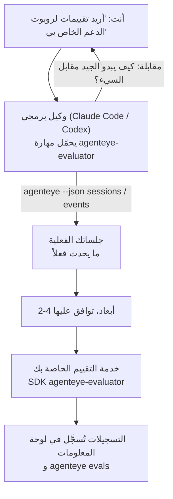

---
---
title: "مهارة وكيل Failproof AI للملاحظة والتقييم"
description: "انتقل من \"أعتقد أن وكيلنا سيء أحيانًا\" إلى خدمة تسجيل مُنشرة، مع قيام وكيلك البرمجي بالقرار والبناء معًا."
---

انتقل من *"أعتقد أن وكيلنا سيء أحيانًا"* إلى خدمة تسجيل مُنشرة، مع قيام وكيلك البرمجي بالقرار والبناء معًا. **مهارة Failproof AI للملاحظة والتقييم** (`agenteye-evaluator`) هي *مهارة وكيل*: مجلد صغير من التعليمات يحمّله وكيل برمجي مثل Claude Code أو Codex عند الحاجة. تعلّم الوكيل كيفية معرفة أي أبعاد الجودة تستحق التتبع ل*وكيلك*، ثم كتابة واختبار ونشر [خدمة التقييم](/ar/agenteye/evaluation-suite) التي تسجلها.

إنها **ليست** خدمة تسجيل مستضافة، ولا سجل تحمل إليه، ولا نظام إضافات. يبقى مُقيّمك خدمة HTTP خاصة بك على بنيتك الأساسية، تمامًا كما هو موضح في دليل [Evaluation suite](/ar/agenteye/evaluation-suite). تعلّم المهارة وكيلك فقط لبناؤها بشكل جيد، لذا كل ما تفعله، يمكنك أن تفعله بنفسك بكتابة نفس الكود.

---

## الجزء الصعب هو تحديد ما يجب تسجيله

سطح SDK صغير — مزخرف واثنتا نماذج — ويمكن لوكيل كتابة ذلك من [العقد](/ar/agenteye/evaluation-suite#http-contract) وحده. هذا ليس حيث يفشل المُقيّمون. يفشلون لأنهم يسجلون الشيء الخطأ، والمُقيّم الذي يسجل الشيء الخطأ أسوأ من لا شيء: ينتج لوحة معلومات يتعلم الجميع تجاهلها.

لذا معظم المهارة هي الجزء قبل وجود أي كود. يوجد الوكيل مقابلة معك (*"صِف عملية سارت بشكل جيد؛ الآن واحدة سارت بشكل سيء"*)، ثم يسحب جلساتك الفعلية عبر [`agenteye` CLI](/ar/agenteye/cli) ويقرأها من البداية إلى النهاية. هاتان النصفان عادة ما يختلفان، والفجوة هي النقطة: ما تنوي قياسه مقابل ما يمكن لنسخك الفعلية فعلاً دعمه. البعد يستمر فقط إذا كان **قابلاً للحساب** من الأحداث و**ممّيزًا** — إذا سجّل 0.9 على جلستك الجيدة وعلى جلستك السيئة، فإنه لا يعلّم شيئًا ويتم حذفه.

ما يعود هو اقتراح من 2-4 أبعاد مع التفكير المرفق، لتوافق عليه قبل كتابة سطر واحد.



---

## كيفية ارتباطها بأجزاء التقييم الأخرى

أربعة مستندات تغطي التسجيل، وتسلّم لبعضها البعض بالتسلسل:

| الصفحة | ما هي | استخدمها عندما |
|---|---|---|
| **[التقييمات](/ar/agenteye/evaluations)** | الميزة: التسجيلات على شبكة الجلسات، لوحات المعلومات، إعادة تقييم | تريد معرفة ما يحصل عليه التسجيل التلقائي |
| **[Evaluation suite](/ar/agenteye/evaluation-suite)** | عقد HTTP والـ SDK والمتغيرات البيئية للخادم | أنت تنفذ أو تصحح المُقيّم بنفسك |
| **مهارة المُقيّم** (هذا المستند) | باب أمامي لغة طبيعية لتصميم *وبناء* المسجّل | تريد الانتقال من "أريد تقييمات" إلى خدمة تعمل |
| **[مهارة CLI](/ar/agenteye/cli-skill)** | باب أمامي لغة طبيعية على CLI `agenteye` | تريد *قراءة* التسجيلات التي لديك بالفعل |
| **[مهارة Python SDK](/ar/agenteye/python-sdk-skill)** | باب أمامي لغة طبيعية على أداة وكيلك | وكيلك لا يُصدر جلسات حتى الآن — لا توجد جلسات للتقييم |

### مقابل مهارة CLI: البناء مقابل القراءة

المهارتان متعمدتان غير متداخلتين، والتثبيت لكليهما هو الإعداد الطبيعي — يختار الوكيل بينهما بناءً على ما تطلبه:

- **`agenteye-evaluator`** (هذا المستند) يبني الشيء الذي *ينتج* التسجيلات. تنتهي مهمته عندما تُسجّل التسجيلات للمرة الأولى.
- **[`agenteye-cli`](/ar/agenteye/cli-skill)** يقرأ التسجيلات التي موجودة بالفعل (`agenteye evals`). سؤاله هو *"هل انخفضت الجودة هذا الأسبوع؟"* وليس سؤال هذه المهارة.

---

## المتطلبات الأساسية

1. **تثبيت CLI `agenteye` وتسجيل الدخول** (`pipx install agenteye`، ثم `agenteye login`). تعتمد المهارة عليها مرتين: لسحب الجلسات الفعلية التي تصممها، وللتأكد من هبوط تسجيلاتك في النهاية. يحتاج تسجيل دخولك إلى `events:read`، بالإضافة إلى `evaluations:read` لهذا الفحص النهائي. كما هو الحال مع مهارة CLI، فهي **لا يمكنها** إكمال تسجيل الدخول برمز لمرة واحدة عبر البريد الإلكتروني.
2. **مكان للمُقيّم ليعيش فيه.** يتم بناؤه في صورة ويعمل كخدمة طويلة الأجل، لذا يحتاج إلى مستودع حقيقي وليس ملف مؤقت. غالبًا ما يعيش المُقيّمون في مستودعهم الخاص، منفصل عن الوكيل الذي يتم تسجيله — تبحث المهارة عن مستودع موجود وتسأل قبل البناء الجديد.
3. **عجلة SDK `agenteye-evaluator`** — اقرأ القسم التالي قبل أن يبدأ وكيلك في كتابة أوامر `pip`.

---

## أين تحصل عليها

تُنشر المهارة في مجموعة المهارات العامة من Failproof AI:

**[github.com/FailproofAI/skills](https://github.com/FailproofAI/skills)** → [`skills/agenteye-evaluator/`](https://github.com/FailproofAI/skills/tree/main/skills/agenteye-evaluator)

المستودع عام والمهارة لا تحتاج إلى أي بيانات اعتماد خاصة بها — إنها فقط تُشغّل CLI `agenteye` مع الجلسة التي *سجلت الدخول إليها*، وتكتب كودًا في *مستودعك*. لاحظ أنها تُشحن كمجلد خاص بها وهي **ليست** داخل حزمة `pipx install agenteye`، لذا لا تبحث عنها هناك.

## تثبيت المهارة

أسرع طريق هي CLI [`skills`](https://skills.sh)، التي تجلب المجلد وتضعه حيث يبحث وكيلك:

```bash
# Claude Code، هذا المشروع فقط
npx skills add FailproofAI/skills --skill agenteye-evaluator -a claude-code

# كل مشروع (تثبيت في ~/.claude/skills/)
npx skills add FailproofAI/skills --skill agenteye-evaluator -a claude-code -g --copy

# Codex بدلاً من ذلك
npx skills add FailproofAI/skills --skill agenteye-evaluator -a codex
```

ثم أدِره مثل أي مهارة أخرى:

```bash
npx skills list -a claude-code           # ما هو مثبت
npx skills update agenteye-evaluator     # اسحب أحدث إصدار
npx skills remove agenteye-evaluator     # احذفها
```

تفضل التثبيت يدويًا؟ مهارة الوكيل هي مجرد مجلد يحتوي على `SKILL.md` (بالإضافة إلى مراجع اختيارية)، لذا نسخها يعمل أيضًا:

- **Claude Code**: ضع مجلد `agenteye-evaluator/` في `~/.claude/skills/` (كل مشروع) أو `<your-repo>/.claude/skills/` (هذا المستودع فقط). يكتشفها Claude Code تلقائيًا — تحقق باستخدام قائمة `/skills`، أو فقط اطلب التقييمات.
- **Codex (OpenAI)**: يقرأ Codex نفس `SKILL.md`. يعيّن `agents/openai.yaml` المُرفق `allow_implicit_invocation: true`، لذا يختار Codex المهارة تلقائيًا عندما تطابق المهمة؛ وإلا فاستدعِها بشكل صريح كـ `$agenteye-evaluator`.

---

## SDK ليس على PyPI العام

> **تحذير:** اقرأ هذا قبل السماح لوكيل بتثبيت SDK.

المهارة عامة؛ SDK الذي تقودها ليس كذلك. `agenteye-evaluator` يُشحن فقط كقطعة إصدار خاصة، وخلافًا لـ `agenteye`، الاسم **غير مطالب به على PyPI العام** — لذا قد يسحب `pip install agenteye-evaluator` مجرد حزمة من شخص غريب في الخدمة التي تقرأ نسخك الإنتاجية. هذه مشكلة سلسلة التوريد، وليست خطأ إملائي.

تعرف المهارة هذا وتعمل بسلم التثبيت بدلاً من ذلك، متوقفة عند أول درجة تنطبق: مصدر المونوريبو إذا كنت داخل مستودع AgentEye، وإلا عجلة الإصدار الخاص من GitHub Releases (تحتاج إلى وصول)، وإذا لم يكن أي منهما متاحًا فإنها **توقف وتخبرك بطلب عجلة من جهة اتصال Failproof AI الخاصة بك** بدلاً من الارتجال.

لذا إذا اقترح وكيلك `pip install agenteye-evaluator` مجرد من PyPI العام، فهذا يدل على أن المهارة لم تحمّل أبدًا. توقف هناك وتحقق من تثبيتها.

---

## ما يمكنك أن تطلبه

جولة حقيقية ذهابًا وإيابًا تبدأ بطلب غامض وتنتهي بتصميم موقع، وليس بكود:

```text
أنت   ▸ أريد تقييمات لروبوت الدعم الخاص بنا. أعتقد أنه سيء أحيانًا.

وكيل ▸ قبل أن أكتب أي شيء: صِف جلسة سارت بشكل جيد،
        وواحدة سارت بشكل سيء.

أنت   ▸ جيدة: يجيب من المستندات. سيئة: يخترع أشياء،
        أو يستسلم ويقول "اتصل بالدعم".

وكيل ▸ تشغيل: agenteye --json sessions --status error --since 7d
        قراءة 5 جلسات، بما في ذلك اثنتان تعتبرهما سيئة.

        كلماتك تقول الدقة والتحويل. النسخ توافق على التحويل 
        (تنتهي 2 من 5 بتحويل الدعم، وهو واضح في 
        model_response.content)، لكن الدقة تحتاج إلى حقيقة أرضية 
        أحداثك لا تحملها.

        لذا سأسجل ثلاثة أشياء:
          - التحويل       قواعد، رخيصة، تفصل بين جلساتك
          - كفاءة_الأداة  قواعد، تلتقط حلقة إعادة المحاولة في run-004
          - التأسيس      حكم LLM: هل كل مطالبة في المستندات التي استرجعتها؟

        "الدقة" ستحتاج إلى حقيقة أرضية لا نملكها؛ التأسيس
        هو أقرب شيء يمكن للنسخ الخاصة بك فعلاً دعمه.
        موافق على هذه الأسماء الثلاثة؟ إعادة التسمية لاحقًا تفصل التاريخ.

أنت   ▸ نعم

وكيل ▸ لا يوجد مُقيّم في هذا المستودع. هل يجب أن أبني واحدًا هنا، أم
        لديك واحد في مكان آخر؟
```

من هناك يكتب الأبعاد المستندة إلى القواعد أولاً (مجانية، فورية، حتمية)، ويختبرها على جلسة منسوخة حقيقية بما في ذلك الجلسات الفارغة والتي لم تنته أبدًا التي تحطم المقيّمين الساذجين، ولا يصل إلى حكم LLM إلا على البعد الذاتي. يعرف [حدود الموزع](/ar/agenteye/evaluation-suite#configuring-the-server) — مهلة طلب 30 ثانية و 8 استدعاءات متزامنة في النشر — لذا إذا لم يناسب الحكم بشكل موثوق، يذهب غير متزامن مع `JobPending` بدلاً من السماح لحكمك بالإلغاء وإعادة المحاولة خمس مرات بخمسة أضعاف التكلفة.

ثم ينشره، ويعيّن متغيري البيئة للخادم، ويؤكد مع `agenteye --json evals --session-id <id>` أن التسجيلات فعلاً هبطت. هبوط التسجيلات هو الدليل الوحيد.

---

## ما الذي يجب الانتباه له

- **أسماء الأبعاد قريبة من الدوام.** مفاتيح التسجيل عبارة عن سلاسل نصية تعسفية والمنصة تتجه إلى ما ترسله، مما يعني أنه لا شيء يصحح اختيارًا سيئًا لاحقًا. إعادة التسمية لاحقًا وينقسم التاريخ: الجلسات القديمة تحافظ على المفتاح القديم والاتجاه ينقطع. هذا هو السبب في أن المهارة تحصل على موافقة صريحة قبل كتابة الكود — خذ هذا الطلب بجدية.
- **المستقلات هي نسخ إنتاجية حقيقية.** تصميم مقابل جلسات حقيقية يعني سحبها إلى القرص، ويمكنها أن تحتوي على بيانات العميل. تسأل المهارة قبل التزامها بـ git؛ إذا كنت في شك، أبقِ `fixtures/` خارج المستودع واطلب من كل مطور سحب خاصه.
- **يكتب الوكيل وينشر خدمة تقرأ كل نسخة.** يتصرف كأنت، محدود بأذونات تسجيل دخول CLI، لكن راجع المُقيّم مثل أي كود آخر يلمس بيانات الإنتاج.

---

## الخطوات التالية

- **[Evaluation suite](/ar/agenteye/evaluation-suite)**: عقد HTTP والـ SDK ومتغيرات البيئة للخادم التي تُعدّلها المهارة.
- **[التقييمات](/ar/agenteye/evaluations)**: حيث تظهر التسجيلات بمجرد هبوطها.
- **[مهارة CLI](/ar/agenteye/cli-skill)**: المهارة الشقيقة، لقراءة النتائج بدلاً من بناء المسجّل.
- **[CLI](/ar/agenteye/cli)**: مرجع الأوامر خلف بيانات الجلسة التي تصممها المهارة.