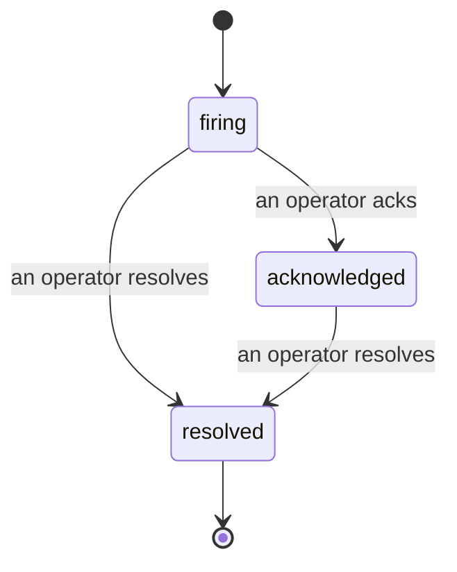

عندما ينطلق تنبيه، يكون السؤال الأول دائماً "من يتولى الأمر؟" الحوادث تجيب عليه: في اللحظة التي يحدث فيها اختراق، يمكن للجميع رؤية أن الحادثة مفتوحة، ومن يملكها، وبالضبط ما حدث حتى الآن، مع سجل نظيف ومنسوب يمكنك تسليمه مباشرة إلى تحليل ما بعد الحادثة.

*يقوم الصندوق بتجميع الحوادث المفتوحة حسب الحالة والتصفية حسب الخطورة والمسؤول، حتى ترى ما يحتاج إلى تدخل بشري الآن.*

## تعرّف على من يملكها، في لمحة

لا مزيد من "هل أحد ينظر إلى هذا؟" في خيط الدردشة. يفتح الاختراق حادثة تلقائياً وينقلها إلى صندوق وارد مشترك، مجمعة حسب الحالة. أقرّ بها واسمك عليها، حتى يعرف بقية الفريق أنها تحت السيطرة. الإقرار مشترك: يمكن لعدة مشغلين الإقرار بنفس الحادثة وكل واحد منهم مسجل على حدة، لذا تظهر غرفة الحرب بأكملها بالأسماء بدلاً من التضارب. عيّن مالكاً واحداً للفحص الأولي، وصفّ صندوق الوارد حسب الخطورة أو المسؤول لتضييق النطاق على ما هو لك.

## القصة كاملة، في خط زمني واحد

عندما تنتهي الحادثة، يكون لديك بالفعل التقرير. افتح أي حادثة وستحصل على دليل الاختراق وملخص الخرق، والمسؤولين والمشتركين، وخيط تعليقات للتنسيق في مكانه، وخط زمني للنشاط المضاف فقط.

*كل شيء حدث، بالترتيب، كل سطر موقّع من قبل من فعله.*

كل إجراء (مفتوح، مقرّ به، محلول، وما إلى ذلك) يُكتب على هذا الخط الزمني ولا يتم تحريره أبداً. كل إدخال منسوب: إلى المشغل الذي اتخذه، بالبريد الإلكتروني، أو إلى **automated** لأي شيء فعلته FailproofAI Observability من تلقاء نفسها، مثل فتح الحادثة عند الخرق. لا شيء غير معروف الهوية ولا شيء مفقود، لذا يكتب تحليل ما بعد الحادثة نفسه أساساً.

## كيف تتحرك الحادثة

- **مفتوحة (firing):** يفتح الخرق الحادثة وينبّه قنواتك مرة واحدة. تطويات الخروقات المتكررة في نفس الحادثة وتحديث دليلها بدلاً من تنبيهك مراراً وتكراراً.
- **مقرّ بها (Acknowledged):** يلتقطها مشغل. تبقى مفتوحة، والخروقات اللاحقة تحدّث الدليل بهدوء.
- **محلولة (Resolved):** يغلقها مشغل. الحل التلقائي عند زوال الحالة مخطط له لكن لم يتم تفعيله بعد، لذا تبقى الحادثة مفتوحة حتى يحلها شخص بشري، مما يبقي الجميع صادقين بشأن ما قد زال فعلاً. يمكن لحادثة جديدة أن تُفتح على نفس التنبيه لاحقاً.

يحمل التنبيه الواحد حادثة مفتوحة واحدة على الأكثر في نفس الوقت، لذا لا يمكن لقاعدة متذبذبة أن تغمرك بالنسخ المكررة. يمكنك أيضاً فتح حادثة يدويًا: واحدة مستقلة لشيء لم يلتقطه أي تنبيه، أو واحدة مرتبطة بتنبيه موجود، إذا كان لديك `incidents:write`.

## أين تجدها

تعيش الحوادث في `/<org-slug>/incidents`. العرض يحتاج إلى **`incidents:read`**؛ فتح حادثة يدوية تحتاج إلى **`incidents:write`**؛ الإقرار والتعيين والتعليق والحل تحتاج إلى **`incidents:ack`**. المفاتيح الأقدم التي منحت `alerts:ack` المتقاعدة تستمر في العمل، لأنها تُشرّف كـ `incidents:ack`، لذا لا تحتاج دورة الاستعداد الخاصة بك إلى إعادة إصدار.

## ذات صلة

- [التنبيهات](/ar/agenteye/alerts): القواعد التي تفتح هذه الحوادث عند اختراق حد معين.
- [تتبع الأخطاء](/ar/agenteye/error-tracking): شاهد كل فشل في مكان واحد وعزّز واحداً إلى تنبيه.
- [التدقيقات](/ar/agenteye/audits): محلل مجدول يجد الأعطال التي لم تكن أي قاعدة تراقبها.