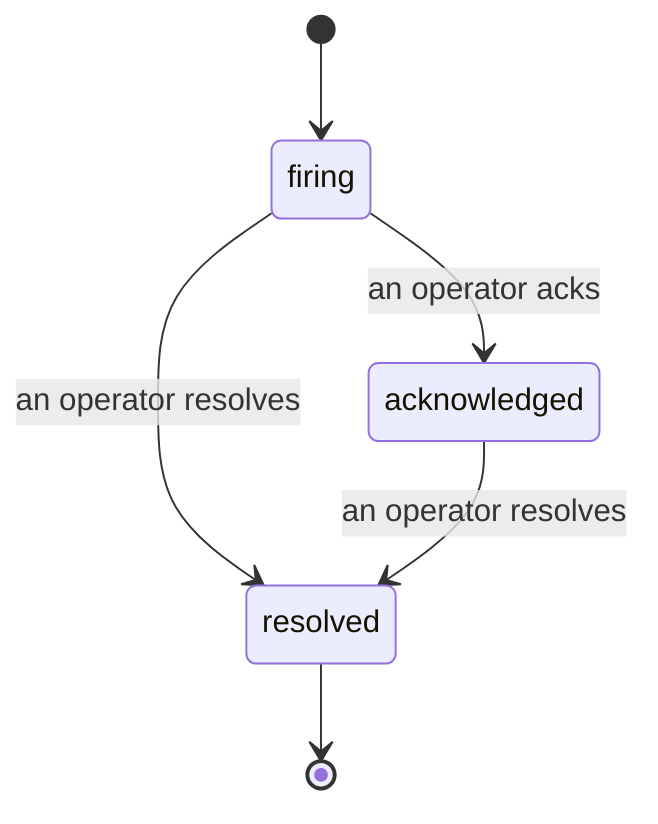

عند تشغيل تنبيه، السؤال الأول دائماً هو «من يتولى الأمر؟» الحوادث تجيب عليه: في اللحظة التي يحدث فيها انتهاك ما، يمكن للجميع رؤية أن الحادثة مفتوحة، ومن يتولاها، وبالضبط ما حدث حتى الآن، مع سجل نظيف وموحد يمكنك تسليمه مباشرة إلى المراجعة اللاحقة للحادثة.

*يجمع الصندوق الحوادث المفتوحة حسب الحالة ويفلترها حسب الخطورة واسم المسؤول، حتى ترى ما يتطلب تدخلاً بشرياً الآن.*

## اعرف من لديه الحادثة، بنظرة واحدة

لا مزيد من «هل أحد ينظر إلى هذا؟» في خيط المحادثة. الانتهاك يفتح حادثة تلقائياً ويضعها في صندوق وارد مشترك، مجمعة حسب الحالة. أقرّ الحادثة واسمك سيظهر عليها، حتى يعرف بقية الفريق أنها تحت السيطرة. الإقرار مشترك: عدة مشغلين يمكنهم إقرار نفس الحادثة وكل واحد يُسجل على حدة، لذا غرفة الحرب الكاملة تظهر بالأسماء بدلاً من الكتابة فوق بعضها. عيّن مالكاً واحداً للفرز السريع، وفلترّ الصندوق حسب الخطورة أو المسؤول لتقليله إلى ما هو من اختصاصك.

## القصة كاملة، على خط زمني واحد

عندما تنتهي الحادثة، يكون لديك التقرير بالفعل. افتح أي حادثة وستحصل على بيانات الانتهاك، والمسؤولون والمشتركون فيها، وخيط تعليقات للتنسيق في المكان، وخط زمني للنشاط موحد ومنسوب.

*كل شيء حدث، بالترتيب، كل سطر موقع من قبل من فعله.*

كل إجراء (فتح، إقرار، حل، إلخ) يُكتب على خط الزمن هذا ولا يُعدّل أبداً. كل إدخال موحد: للمشغل الذي اتخذه، بالبريد الإلكتروني، أو إلى **automated** لأي شيء فعلته Failproof AI Observability بنفسها، مثل فتح الحادثة على الانتهاك. لا شيء مجهول ولا شيء ضائع، لذا المراجعة اللاحقة تكتب نفسها أساساً.

## كيف تتحرك الحادثة

- **مفتوحة (firing):** الانتهاك يفتح الحادثة ويرسل صفحة واحدة إلى قنواتك. الانتهاكات المتكررة تُطوى في نفس الحادثة وتحدّث بيناتها بدلاً من إرسال صفحات متكررة.
- **مقرّة (acknowledged):** مشغل يتولاها. تبقى مفتوحة، والانتهاكات اللاحقة تحدّث البيانات بهدوء.
- **محلولة (resolved):** مشغل يغلقها. الحل التلقائي عند زوال الشرط مخطط له لكن لم يُفعّل بعد، لذا الحادثة تبقى مفتوحة حتى يحلها إنسان، وهذا يحافظ على المسؤولية حول ما فعلاً انتهى. يمكن فتح حادثة جديدة على نفس التنبيه لاحقاً.

تنبيه واحد يحمل حادثة مفتوحة واحدة على الأكثر في المرة، لذا قاعدة متعثرة لا يمكنها أن تغرقك في نسخ مكررة. يمكنك أيضاً فتح حادثة يدوياً: واحدة مستقلة لشيء لم يلتقطه أي تنبيه، أو واحدة مرتبطة بتنبيه موجود، إذا كان لديك `incidents:write`.

## حيث تجدها

الحوادث موجودة في `/<org-slug>/incidents`. العرض يحتاج **`incidents:read`**؛ فتح حادثة يدوية يحتاج **`incidents:write`**؛ الإقرار والتعيين والتعليق والحل يحتاجون **`incidents:ack`**. المفاتيح الأقدم التي منحت `alerts:ack` المتقاعد لا تزال تعمل، لأنه يُعترف به كـ `incidents:ack`، لذا فريق الحراسة الدائمة لا يحتاج لإعادة إصدار.

## ذات صلة

- [التنبيهات](/ar/agenteye/alerts): القواعد التي تفتح هذه الحوادث عند اختراق حد ما.
- [تتبع الأخطاء](/ar/agenteye/error-tracking): شاهد كل فشل في مكان واحد وارفعه إلى تنبيه.
- [التدقيق](/ar/agenteye/audits): محلل مجدول يجد الأخطاء التي لم تكن أي قاعدة تراقبها.