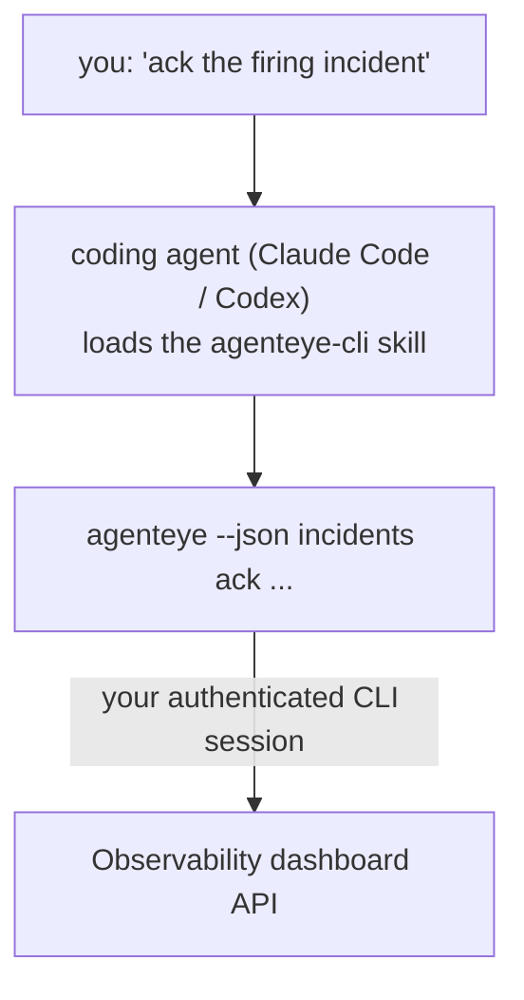

Fragen Sie Ihren Coding-Agenten *„Ist heute etwas kaputt?"* und lassen Sie ihn die Antwort aus Ihren Live-Daten von Failproof AI Observability liefern – ohne Befehle auswendig lernen zu müssen. Der **Failproof AI Observability CLI-Skill** (`agenteye-cli`) ist ein *Agent Skill*: ein kleiner Ordner mit Anweisungen, den ein Coding-Agent wie Claude Code oder Codex bei Bedarf lädt. Er bringt dem Agenten bei, Ihre Observability-Umgebung über das [`agenteye`-CLI](/de/agenteye/cli) auf Basis von Anfragen in natürlicher Sprache zu steuern – etwa *„Gib CI einen Schlüssel, der nur Events pushen kann"* oder *„Bestätige den aktiven Vorfall und weise ihn mir zu."*

Es handelt sich **nicht** um einen Dienst oder eine separate Binärdatei; es gibt nichts zu deployen. Der Skill setzt auf dem bereits installierten CLI auf: Der Agent ruft `agenteye --json …` auf, parst das saubere JSON und antwortet Ihnen in Prosatext. Alles, was er tun kann, könnten Sie selbst durch Eingabe derselben Befehle erreichen.

---

## Verhältnis zu den anderen Failproof AI Observability-Schnittstellen

Failproof AI Observability bietet Ihnen vier Möglichkeiten, auf dieselben Daten und Steuerelemente zuzugreifen. Sie ergänzen einander:

| Schnittstelle | Was es ist | Wo es läuft | Verwenden Sie es, wenn |
|---|---|---|---|
| **[CLI](/de/agenteye/cli)** | Die Befehls-/Flag-Referenz für `agenteye` | Ihr Terminal | Sie einen bestimmten Befehl ausführen oder skripten möchten |
| **[CLI-Rezepte](/de/agenteye/cli-recipes)** | Copy-paste-`jq`/Pipeline-Muster | Ihr Terminal / Skripte | Sie das CLI in die Automatisierung einbinden |
| **CLI-Skill** (dieses Dokument) | Eine natürlichsprachliche Eingabeschnittstelle für das CLI | Ihr Coding-Agent, auf Ihrer Workstation | Sie einfach fragen und den Agenten den richtigen Befehl auswählen lassen möchten |
| **[Evaluator-Skill](/de/agenteye/evaluator-skill)** | Ein verwandter Skill, der Ihren Scoring-Dienst entwirft und aufbaut | Ihr Coding-Agent, auf Ihrer Workstation | Sie Eval-Scores *erzeugen* statt lesen möchten |
| **[Python-SDK-Skill](/de/agenteye/python-sdk-skill)** | Ein verwandter Skill, der Ihren Agenten instrumentiert, damit er überhaupt Telemetriedaten ausgibt | Ihr Coding-Agent, auf Ihrer Workstation | Sie möchten, dass Ihr Agent die Events *erzeugt*, die dieser Skill liest |
| **[In-Dashboard-KI-Assistent](/de/agenteye/assistant)** | Ein in das Dashboard eingebetteter Chat | Serverseitig (im Dashboard) | Sie Q&A über Ihre Daten direkt im Dashboard durchführen möchten |

Der Skill selbst hat keine eigenen Berechtigungen; er übersetzt lediglich Ihre Worte in CLI-Aufrufe, die als Sie ausgeführt werden:



### vs. der In-Dashboard-KI-Assistent: ein wichtiger Unterschied

Dies sind zwei verschiedene Tools mit sehr unterschiedlichem Wirkungsradius:

- Der **In-Dashboard-KI-Assistent** ([KI-Assistent](/de/agenteye/assistant)) ist ein in das Dashboard eingebetteter Chat, der vom Agentendienst unterstützt wird. Er ist **nur lesend plus genehmigungspflichtig bei Erstellungsaktionen**: Er kann gespeicherte Abfragen und Dashboards entwerfen, aber jeder Schreibvorgang wartet auf Ihre explizite Bestätigung per Klick, und er löscht nie. Er ist durch die Berechtigung `agent:use` gesichert und sieht immer nur Daten für die Organisation, die Sie gerade anzeigen.
- Der **CLI-Skill** läuft auf *Ihrer* Workstation innerhalb *Ihres* Coding-Agenten und steuert das `agenteye`-CLI **als Sie**. Er kann die **volle Oberfläche des CLI nutzen, einschließlich Mutationen** (API-Schlüssel erstellen/rotieren/deaktivieren, Organisationseinstellungen ändern, Vorfälle auflösen, gespeicherte Abfragen löschen) – begrenzt nur durch die Berechtigungen Ihres CLI-Logins. Behandeln Sie ihn genauso sorgfältig, wie Sie diese Befehle manuell ausführen würden.

---

## Voraussetzungen

1. Das **`agenteye`-CLI installiert** und im `PATH` (siehe die [CLI](/de/agenteye/cli)-Referenz: `pipx install agenteye`).
2. Ihre **Dashboard-URL** gesetzt (`AGENTEYE_DASHBOARD_URL` oder der Agent übergibt `--base-url`).
3. Eine **angemeldete Sitzung**: Führen Sie `agenteye login` selbst zuerst aus. Der Skill **kann** den per E-Mail gesendeten Einmalcode-Login nicht für Sie abschließen; er weist Sie an, `agenteye login` auszuführen, wenn die Sitzung fehlt oder abgelaufen ist (CLI-Exit-Code `4`).

---

## Bezugsquelle

Der Skill ist in der öffentlichen Skills-Sammlung von Failproof AI veröffentlicht:

**[github.com/FailproofAI/skills](https://github.com/FailproofAI/skills)** → [`skills/agenteye-cli/`](https://github.com/FailproofAI/skills/tree/main/skills/agenteye-cli)

Es gibt keine Zugangsbeschränkungen – das Repository ist öffentlich, und der Skill benötigt keine eigenen Zugangsdaten, da er nur das **öffentliche** `agenteye`-CLI gegen *Ihr* Dashboard verwendet und dabei die Sitzung nutzt, mit der *Sie* sich angemeldet haben. Sie müssen niemanden darum bitten.

Beachten Sie, dass er als eigener Ordner ausgeliefert wird und **nicht** im `pipx install agenteye`-Paket enthalten ist – suchen Sie ihn dort also nicht.

## Den Skill installieren

Der schnellste Weg ist das [`skills`](https://skills.sh)-CLI, das den Ordner abruft und dort ablegt, wo Ihr Agent sucht:

```bash
# Claude Code, nur dieses Projekt
npx skills add FailproofAI/skills --skill agenteye-cli -a claude-code

# jedes Projekt (installiert in ~/.claude/skills/)
npx skills add FailproofAI/skills --skill agenteye-cli -a claude-code -g --copy

# stattdessen Codex
npx skills add FailproofAI/skills --skill agenteye-cli -a codex
```

Verwalten Sie ihn dann wie jeden anderen Skill:

```bash
npx skills list -a claude-code      # was ist installiert
npx skills update agenteye-cli      # neueste Version laden
npx skills remove agenteye-cli      # entfernen
```

Bevorzugen Sie manuelle Installation? Ein Agent Skill ist nur ein Ordner mit einer `SKILL.md` (plus optionalen Referenzen), daher funktioniert auch das Kopieren:

- **Claude Code**: Legen Sie den Ordner `agenteye-cli/` in `~/.claude/skills/` (jedes Projekt) oder `<Ihr-Repo>/.claude/skills/` (nur dieses Repo) ab. Claude Code erkennt ihn automatisch – überprüfen Sie dies mit der `/skills`-Liste oder stellen Sie einfach eine Frage, die seiner Beschreibung entspricht.
- **Codex (OpenAI)**: Codex liest dieselbe `SKILL.md`. Die mitgelieferte `agents/openai.yaml` setzt `allow_implicit_invocation: true`, sodass Codex den Skill automatisch auswählt, wenn eine Aufgabe passt; andernfalls rufen Sie ihn explizit als `$agenteye-cli` auf.

---

## Sicherheit: Mutationen fordern KEINE Bestätigung, wenn ein Agent das CLI ausführt

> **Warnung:** Lesen Sie dies, bevor Sie einem Agenten erlauben, Änderungen vorzunehmen.

Das `agenteye`-CLI fragt normalerweise *„Sind Sie sicher?"* vor einer destruktiven Aktion. Es **überspringt diese Bestätigung automatisch, wenn es nicht an ein Terminal angehängt ist (was genau der Fall ist, wenn ein Coding-Agent es ausführt), und `--json` überspringt sie ebenfalls.** Die Sicherheitsabfrage wird für den Agenten also **nicht** ausgelöst.

Der Skill ist so geschrieben, dass er dies kompensiert: Er ist angewiesen, den genauen Befehl anzugeben, den er ausführen wird, und Ihr ausdrückliches **OK vor jeder Zustandsänderung** einzuholen. Halten Sie diese Disziplin aufrecht. Wenn Sie Failproof AI Observability über einen Agenten steuern, sind *Sie* der Bestätigungsschritt. Die zustandsändernden Befehle, auf die Sie achten sollten:

- `keys create` / `update` / `disable` / `regenerate`
- `users create` / `update` / `disable` / `enable`
- `settings set`
- `alerts create` / `update` / `delete` / `test`
- die schreibenden `incidents`-Unterbefehle: `ack` / `assign` / `resolve` / `open` / `comment-add` / `comment-delete` / `subscribe` / `unsubscribe`
- `query create` / `update` / `delete`
- `agent rename` / `delete`
- `orgs switch`

Alles unter **Observe** (`events`, `sessions`, `evals`, `errors`, `list`, `whoami`, `orgs list/current/perms`) ist schreibgeschützt und ändert nichts.

Da der Agent **als Sie** agiert, kann er nur das tun, wozu Ihr Login berechtigt ist; Berechtigungen werden **pro Organisation** aufgelöst (siehe [API-Schlüssel](/de/agenteye/api-keys)). Ein Befehl, für den Sie keine Berechtigung haben, gibt Exit-Code `5` mit dem genauen Berechtigungsnamen zurück, sodass der Agent Ihnen präzise sagen kann, was Sie einen Administrator fragen müssen, anstatt undurchsichtig zu scheitern.

---

## Was Sie fragen können

So sieht ein echter Ablauf aus – zunächst eine Abfrage, dann eine Änderung, die auf Ihr OK wartet:

```text
you   ▸ Is anything broken in the last day?

agent ▸ Running: agenteye --json errors --since 24h --aggregate
        3 error types in the last 24h. The biggest is TimeoutError
        (18 hits, all on the checkout-agent), then RateLimited (5).
        Want the failing sessions for TimeoutError?

you   ▸ Give CI a key that can only push events.

agent ▸ This creates an API key. I'll run:
          agenteye keys create ci --add events:add
        OK to proceed?

you   ▸ yes

agent ▸ Done. Key "ci" created with events:add only.
        The secret is shown only once, so store it now. I can't reprint it.
```

Der Skill ordnet jede natürlichsprachliche Absicht dem richtigen `agenteye`-Befehl zu, ermittelt dabei zuerst gültige Werte (`list <kind>`, `whoami`), rät nicht und gibt den genauen Befehl vor jeder Änderung an. Weitere Beispiele:

- *„Ist in den letzten 24 Stunden etwas kaputt gegangen / fehlgeschlagen?"* → `errors --since 24h --aggregate`, dann eine Aufschlüsselung.
- *„Warum ist Sitzung `run-001` fehlgeschlagen?"* → `events --session-id run-001 --all` + `evals --session-id run-001`.
- *„Wie entwickelt sich die Qualität diese Woche?"* → `evals --aggregate --since 7d`, dann in niedrig bewertete Läufe einsteigen.
- *„Gib CI einen Schlüssel, der nur Events pushen kann."* → `keys create ci --add events:add` (gibt den Befehl an, erstellt ihn dann und erfasst das einmalige Secret).
- *„Wer hat Zugriff? Mach Dana schreibgeschützt."* → `users list` → `users update dana@… --permission-set read-only` (nach Bestätigung durch Sie).
- *„Bestätige den aktiven Vorfall und weise ihn mir zu."* → `incidents list --state firing` → `incidents ack <id>` / `incidents assign <id> you@…`.

Die genauen Befehle, Flags und JSON-Strukturen dahinter finden Sie in der [CLI](/de/agenteye/cli)-Referenz und den [CLI-Rezepten für Agenten](/de/agenteye/cli-recipes).

---

## Nächste Schritte

- **[CLI](/de/agenteye/cli)**: vollständige Befehls- und Flag-Referenz für `agenteye`.
- **[CLI-Rezepte für Agenten](/de/agenteye/cli-recipes)**: Copy-paste-`jq`-Muster und Exit-Code-Behandlung.
- **[Evaluator-Agent-Skill](/de/agenteye/evaluator-skill)**: der verwandte Skill zum Aufbau des Evaluators, dessen Scores `agenteye evals` liest.
- **[Python-SDK-Agent-Skill](/de/agenteye/python-sdk-skill)**: der verwandte Skill zum Instrumentieren eines Agenten, damit er die Telemetriedaten ausgibt, die `agenteye` liest.
- **[KI-Assistent](/de/agenteye/assistant)**: der In-Dashboard-Assistent (nicht zu verwechseln mit diesem Terminal-Skill).
- **[API-Schlüssel](/de/agenteye/api-keys)**: das organisationsbasierte Berechtigungsmodell, das den Wirkungsbereich des Skills begrenzt.