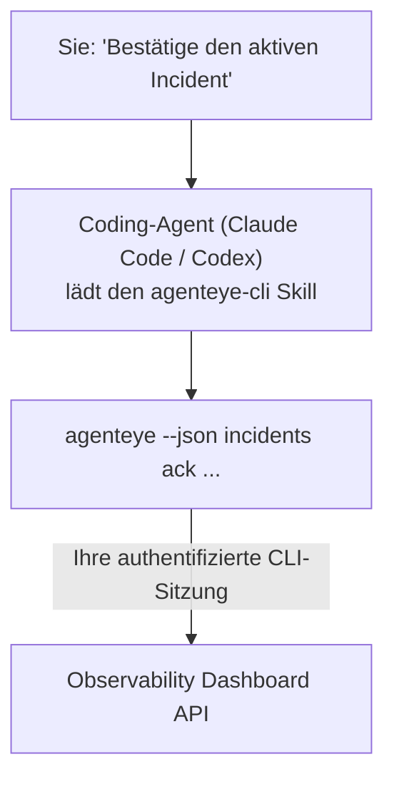

Fragen Sie Ihren Coding-Agenten einfach *„Ist heute irgendetwas kaputt?"* und lassen Sie ihn direkt aus Ihren Live-FailproofAI-Observability-Daten antworten – ganz ohne Befehle auswendig lernen zu müssen. Der **FailproofAI Observability CLI Skill** (`agenteye-cli`) ist ein *Agent Skill*: ein kleines Verzeichnis mit Anweisungen, das ein Coding-Agent wie Claude Code oder Codex bei Bedarf lädt. Es bringt dem Agenten bei, Ihre Observability-Umgebung über die [`agenteye` CLI](/de/agenteye/cli) auf Basis von Anfragen in natürlicher Sprache zu steuern – zum Beispiel *„Erstelle für CI einen Schlüssel, der nur Events pushen darf"* oder *„Bestätige den aktiven Incident und weise ihn mir zu."*

Es handelt sich **nicht** um einen Dienst oder eine separate ausführbare Datei; es gibt nichts zu deployen. Es setzt auf der bereits installierten CLI auf: Der Agent ruft `agenteye --json …` auf, verarbeitet das saubere JSON und antwortet Ihnen in verständlichem Prosatext. Alles, was er tun kann, könnten Sie selbst durch Eingabe derselben Befehle erledigen.

---

## Einordnung in die anderen FailproofAI-Observability-Schnittstellen

FailproofAI Observability bietet vier Wege, um auf dieselben Daten und Steuerungsmöglichkeiten zuzugreifen. Sie ergänzen sich gegenseitig:

| Schnittstelle | Was es ist | Wo es läuft | Wann Sie es verwenden |
|---|---|---|---|
| **[CLI](/de/agenteye/cli)** | Die Befehls- und Flag-Referenz für `agenteye` | Ihr Terminal | Wenn Sie einen bestimmten Befehl ausführen oder skripten möchten |
| **[CLI-Rezepte](/de/agenteye/cli-recipes)** | Kopierfertige `jq`-/Pipeline-Muster | Ihr Terminal / Skripte | Wenn Sie die CLI in Automatisierungen einbinden |
| **CLI Skill** (diese Dokumentation) | Ein natürlichsprachlicher Einstieg in die CLI | Ihr Coding-Agent auf Ihrer Workstation | Wenn Sie einfach fragen und den Agenten den Befehl auswählen lassen möchten |
| **[KI-Assistent im Dashboard](/de/agenteye/assistant)** | Ein in das Dashboard eingebetteter Chat | Serverseitig (im Dashboard) | Wenn Sie im Dashboard Fragen zu Ihren Daten stellen möchten |

Der Skill selbst besitzt keine eigenen Berechtigungen; er übersetzt lediglich Ihre Worte in CLI-Aufrufe, die als Sie ausgeführt werden:



### vs. der KI-Assistent im Dashboard: ein wichtiger Unterschied

Dies sind zwei unterschiedliche Werkzeuge mit sehr unterschiedlichem Wirkungsbereich:

- Der **KI-Assistent im Dashboard** ([AI assistant](/de/agenteye/assistant)) ist ein in das Dashboard eingebetteter Chat, der vom Agentendienst unterstützt wird. Er ist **schreibgeschützt mit genehmigungspflichtigem Authoring**: Er kann gespeicherte Abfragen und Dashboards entwerfen, aber jeder Schreibvorgang erfordert Ihre ausdrückliche Bestätigung per Klick, und er löscht niemals etwas. Er ist durch die Berechtigung `agent:use` abgesichert und sieht stets nur Daten der Organisation, die Sie gerade betrachten.
- Der **CLI Skill** läuft auf *Ihrer* Workstation innerhalb *Ihres* Coding-Agenten und steuert die `agenteye` CLI **als Sie**. Er kann den **gesamten Funktionsumfang der CLI einschließlich aller Schreiboperationen** ausführen (API-Schlüssel erstellen/rotieren/deaktivieren, Organisationseinstellungen ändern, Incidents auflösen, gespeicherte Abfragen löschen) – begrenzt nur durch die Berechtigungen Ihres CLI-Logins. Behandeln Sie ihn genauso sorgfältig, wie Sie es beim manuellen Ausführen dieser Befehle tun würden.

---

## Voraussetzungen

1. Die **`agenteye` CLI muss installiert** und im `PATH` vorhanden sein (siehe [CLI](/de/agenteye/cli)-Referenz: `pipx install agenteye`).
2. Ihre **Dashboard-URL** muss konfiguriert sein (`AGENTEYE_DASHBOARD_URL` oder der Agent übergibt `--base-url`).
3. Eine **aktive Sitzung**: Führen Sie zunächst selbst `agenteye login` aus. Der Skill **kann** den per E-Mail zugesandten Einmalcode-Login nicht für Sie abschließen; er wird Sie auffordern, `agenteye login` auszuführen, wenn die Sitzung fehlt oder abgelaufen ist (CLI-Exit-Code `4`).

---

## Den Skill installieren

Agent Skills sind Verzeichnisse, die eine `SKILL.md` (und optionale Referenzdateien) enthalten. Sie installieren den `agenteye-cli` Skill, indem Sie sein Verzeichnis dort ablegen, wo Ihr Agent nach Skills sucht:

- **Claude Code**: Kopieren Sie den Ordner `agenteye-cli/` in `~/.claude/skills/` (verfügbar in jedem Projekt) oder in `<ihr-repo>/.claude/skills/` (auf dieses Repository beschränkt). Claude Code erkennt ihn automatisch; überprüfen Sie dies mit der `/skills`-Liste, oder stellen Sie einfach eine Frage, die zu seiner Beschreibung passt.
- **Codex (OpenAI)**: Codex liest dieselbe `SKILL.md`. Die mitgelieferte Datei `agents/openai.yaml` setzt `allow_implicit_invocation: true`, sodass Codex den Skill automatisch auswählt, wenn eine Aufgabe passt; andernfalls rufen Sie ihn explizit als `$agenteye-cli` auf.

Der Skill wird zusammen mit der `agenteye` CLI gepflegt, wird jedoch als **separates Verzeichnis** ausgeliefert – nicht im `pipx install agenteye`-Paket enthalten, suchen Sie ihn dort also nicht. FailproofAI Observability stellt Ihnen den Ordner `agenteye-cli/` eigenständig zur Verfügung; falls Sie ihn nicht haben, wenden Sie sich an Ihren FailproofAI-Kontakt. Er ist in keiner Weise eingeschränkt: Er benötigt keinerlei Zugangsdaten, da er ausschließlich die **öffentliche** `agenteye` CLI gegen Ihr eigenes Dashboard ausführt.

---

## Sicherheit: Schreiboperationen zeigen KEINE Rückfragen, wenn ein Agent die CLI ausführt

> **Warnung:** Lesen Sie dies, bevor Sie einem Agenten erlauben, Änderungen vorzunehmen.

Die `agenteye` CLI fragt normalerweise *„Sind Sie sicher?"* vor einer destruktiven Aktion. Sie **überspringt diese Bestätigung automatisch, wenn sie nicht an ein Terminal angebunden ist – was genau der Fall ist, wenn ein Coding-Agent sie ausführt – und `--json` überspringt sie ebenfalls.** Die Sicherheitsabfrage wird für den Agenten also **nicht** ausgelöst.

Der Skill ist so konzipiert, dass er dies ausgleicht: Er ist angewiesen, den genauen auszuführenden Befehl anzugeben und Ihre ausdrückliche **Bestätigung vor jeder Zustandsänderung** einzuholen. Halten Sie diese Disziplin aufrecht. Wenn Sie FailproofAI Observability über einen Agenten steuern, *sind Sie* der Bestätigungsschritt. Die zustandsändernden Befehle, auf die Sie achten sollten:

- `keys create` / `update` / `disable` / `regenerate`
- `users create` / `update` / `disable` / `enable`
- `settings set`
- `alerts create` / `update` / `delete` / `test`
- die schreibenden `incidents`-Unterbefehle: `ack` / `assign` / `resolve` / `open` / `comment-add` / `comment-delete` / `subscribe` / `unsubscribe`
- `query create` / `update` / `delete`
- `agent rename` / `delete`
- `orgs switch`

Alles unter **Observe** (`events`, `sessions`, `evals`, `errors`, `list`, `whoami`, `orgs list/current/perms`) ist schreibgeschützt und ändert nichts.

Da der Agent **als Sie** handelt, kann er nur das tun, was Ihr Login erlaubt; Berechtigungen werden **pro Organisation** aufgelöst (siehe [API-Schlüssel](/de/agenteye/api-keys)). Ein Befehl, für den Sie keine Berechtigung haben, gibt Exit-Code `5` mit dem genauen Berechtigungsnamen zurück, sodass der Agent Ihnen genau mitteilen kann, was Sie bei einem Administrator anfragen müssen – anstatt undurchsichtig zu scheitern.

---

## Was Sie fragen können

Hier sehen Sie, wie ein echter Ablauf aussieht – zuerst eine Leseanfrage, dann eine Änderung, die auf Ihre Bestätigung wartet:

```text
Sie   ▸ Ist irgendetwas im letzten Tag schiefgelaufen?

Agent ▸ Führe aus: agenteye --json errors --since 24h --aggregate
        3 Fehlertypen in den letzten 24 Stunden. Der häufigste ist TimeoutError
        (18 Vorkommen, alle beim checkout-agent), dann RateLimited (5).
        Soll ich die fehlgeschlagenen Sessions für TimeoutError aufrufen?

Sie   ▸ Erstelle für CI einen Schlüssel, der nur Events pushen darf.

Agent ▸ Das erstellt einen API-Schlüssel. Ich werde folgendes ausführen:
          agenteye keys create ci --add events:add
        OK, um fortzufahren?

Sie   ▸ ja

Agent ▸ Fertig. Schlüssel "ci" mit ausschließlich events:add erstellt.
        Das Secret wird nur einmal angezeigt, also speichern Sie es jetzt. Ich kann es nicht erneut ausgeben.
```

Der Skill ordnet jede natürlichsprachliche Absicht dem richtigen `agenteye`-Befehl zu, ermittelt zunächst gültige Werte (`list <kind>`, `whoami`), um nicht zu raten, und gibt den genauen Befehl vor jeder Änderung an. Weitere Beispiele:

- *„Ist heute irgendetwas kaputt / fehlgeschlagen in den letzten 24 Stunden?"* → `errors --since 24h --aggregate`, dann eine Aufschlüsselung.
- *„Warum ist Session `run-001` fehlgeschlagen?"* → `events --session-id run-001 --all` + `evals --session-id run-001`.
- *„Wie entwickelt sich die Qualität diese Woche?"* → `evals --aggregate --since 7d`, dann in schlecht bewertete Ausführungen einsteigen.
- *„Erstelle für CI einen Schlüssel, der nur Events pushen darf."* → `keys create ci --add events:add` (er gibt den Befehl an, erstellt ihn dann und erfasst das einmalige Secret).
- *„Wer hat Zugriff? Setze Dana auf schreibgeschützt."* → `users list` → `users update dana@… --permission-set read-only` (nach Ihrer Bestätigung).
- *„Bestätige den aktiven Incident und weise ihn mir zu."* → `incidents list --state firing` → `incidents ack <id>` / `incidents assign <id> sie@…`.

Die genauen Befehle, Flags und JSON-Strukturen dahinter finden Sie in der [CLI](/de/agenteye/cli)-Referenz und den [CLI-Rezepten für Agenten](/de/agenteye/cli-recipes).

---

## Nächste Schritte

- **[CLI](/de/agenteye/cli)**: vollständige Befehls- und Flag-Referenz für `agenteye`.
- **[CLI-Rezepte für Agenten](/de/agenteye/cli-recipes)**: kopierfertige `jq`-Muster und Exit-Code-Behandlung.
- **[KI-Assistent](/de/agenteye/assistant)**: der Assistent im Dashboard (nicht zu verwechseln mit diesem Terminal-Skill).
- **[API-Schlüssel](/de/agenteye/api-keys)**: das organisationsweite Berechtigungsmodell, das den Wirkungsbereich des Skills begrenzt.