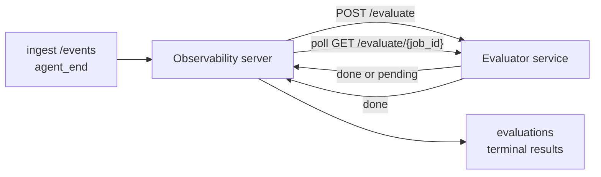

FailproofAI Observability kann jeden abgeschlossenen Agentenlauf automatisch auf Qualität bewerten: Sie stellen einen kleinen Scoring-Dienst bereit, und Observability erledigt den Rest. Nutzen Sie dies, um die Dimensionen zu verfolgen, die Ihnen wichtig sind (Hilfsbereitschaft, Tool-Effizienz, Faktentreue, Sicherheit – Sie entscheiden), Regressionen frühzeitig zu erkennen und Agenten oder Umgebungen auf einen Blick zu vergleichen. Das Scoring ist optional: Die Pipeline tut nichts, bis Sie `EVALUATOR_ENDPOINT` am Server setzen.

> **Hinweis:** Sie definieren die Score-Dimensionen. Ihr Evaluator kann beliebige numerische Schlüssel zurückgeben; Observability speichert, verfolgt und zeigt alles an, was Sie zurücksenden.

## Auf einen Blick

1. **Einen Scorer schreiben.** Stellen Sie einen kleinen HTTP-Dienst bereit, der ein Sitzungsprotokoll liest und Scores zurückgibt. Observability liefert eine funktionierende Referenzimplementierung, die Sie kopieren können. Siehe [Einen Evaluator mit dem SDK schreiben](#writing-an-evaluator-with-the-sdk).
2. **Observability darauf zeigen.** Setzen Sie `EVALUATOR_ENDPOINT` (und ein gemeinsames `EVALUATOR_TOKEN`) am Serverprozess.
3. **Die Scores beobachten.** Jede abgeschlossene Sitzung wird automatisch bewertet; die Ergebnisse erscheinen auf der Sitzungsdetailseite, im Sitzungsraster und in gespeicherten Dashboards.


*Sobald ein Evaluator konfiguriert ist, wird jeder abgeschlossene Lauf bewertet und die Ergebnisse erscheinen in der rechten Leiste der Sitzung: oben die Zusammenfassung, darunter Score-Balken pro Dimension mit Begründung.*

---

## Funktionsweise



Wenn das Observability SDK ein `agent_end`-Ereignis für eine Sitzung ausgibt, plant der Server eine Auswertung. Er sendet dann das vollständige Ereignisprotokoll per POST an Ihren Evaluatordienst, der entweder:

- **Das Ergebnis direkt zurückgeben** kann mit `{"status":"done", "scores":{...}, "reasoning":{...}, "summary":"..."}`. Das Ergebnis wird an die Auswertungszeitleiste der Sitzung angehängt. `reasoning` und `summary` sind optional.
- **Verschieben** kann mit `{"status":"pending", "job_id":"abc-123"}`. Observability ruft dann `GET {EVALUATOR_ENDPOINT}/evaluate/abc-123` ab, bis Ihr Evaluator `{"status":"done", ...}` oder `{"status":"error", "error":"..."}` zurückgibt.

  Der Abfrageintervall gilt pro Auftrag: Eine `pending`-Antwort kann `next_poll_secs` enthalten, um den Standard zu überschreiben; andernfalls verwendet Observability den Wert `default_poll_interval_secs` aus `GET /config`; andernfalls fällt der Server auf `EVALUATOR_POLLING_INTERVAL_SECS` zurück (Standard 10s). Alle Werte werden auf [1s, 1h] begrenzt.

Sitzungen, die nie `agent_end` ausgeben (z. B. ein abgestürzter Agentenprozess), können ebenfalls erfasst werden: Das `GET /config` des Evaluators kann `{"inactivity_timeout_secs": 1800}` zurückgeben, und Observability wertet jede Sitzung aus, die so lange inaktiv war. Setzen Sie das Feld auf `null` oder lassen Sie es weg, um diesen Fallback zu deaktivieren.

Die Pipeline ist vollständig inaktiv, wenn `EVALUATOR_ENDPOINT` nicht gesetzt ist.

Eine Sitzung kann **im Laufe der Zeit mehrere abgeschlossene Auswertungen ansammeln**: Jedes `agent_end`-Ereignis (und jede manuelle Neuauswertung über das Dashboard) hängt eine neue Auswertungszeile an. Dies ist der unterstützte Weg zur Auswertung einer fortgesetzten Unterhaltung: Ein Benutzer beendet einen Agenten, kommt später zurück, sendet weitere Ereignisse, beendet den Agenten erneut, und eine zweite Auswertung läuft gegen das vollständige aktualisierte Protokoll. Das Dashboard zeigt die aktuellste Auswertung als Hauptinformation und die früheren Auswertungen als ausklappbare Zeitleiste. Während für eine Sitzung eine Auswertung läuft, werden weitere `agent_end`-Ereignisse für diese Sitzung ignoriert; das nächste nach Abschluss der laufenden Auswertung stellt wie gewohnt eine neue Auswertung in die Warteschlange.

Der Inaktivitätsfallback greift auch bei fortgesetzten Sitzungen: Wenn nach einer vorherigen abgeschlossenen Auswertung neue Ereignisse eintreffen und die Sitzung dann länger als `inactivity_timeout_secs` inaktiv bleibt, wird eine neue Auswertung eingereiht.

Vorübergehende Fehler (5xx, 429, Timeouts, Netzwerkfehler) werden mit exponentiellem Backoff bis zu `EVALUATOR_MAX_ATTEMPTS` wiederholt; 4xx-Antworten sind endgültig. Observability kann sicher mit mehreren horizontal skalierten Serverinstanzen betrieben werden; die Arbeit wird so aufgeteilt, dass dieselbe Sitzung nie zweimal gleichzeitig verarbeitet wird.

---

## HTTP-Vertrag

Jede authentifizierte Route verwendet **Bearer-Token-Authentifizierung**. Derselbe Wert muss auf beiden Seiten konfiguriert sein:

- Observability-Server: Umgebungsvariable `EVALUATOR_TOKEN`
- Evaluatordienst: gleichermaßen konfiguriert (das `agenteye-evaluator`-SDK liest `EVALUATOR_TOKEN` nach Konvention)

Wenn `EVALUATOR_TOKEN` nicht gesetzt ist, sendet der Server keinen `Authorization`-Header; der Evaluator kann dann anonyme Anfragen akzeptieren, was für ein rein internes Netzwerk akzeptabel ist, im öffentlichen Internet jedoch nicht empfohlen wird.

### Routen, die der Evaluator bedienen muss

| Route | Body / Parameter | Antwort |
|---|---|---|
| `GET /health` | keine | `{"status":"ok"}` (offen, keine Authentifizierung) |
| `GET /config` | keine | `{"inactivity_timeout_secs": <int> \| null, "default_poll_interval_secs": <int> \| omitted}` |
| `POST /evaluate` | `EvalRequest` JSON | `{"status":"done", ...}` oder `{"status":"pending", "job_id":"..."}` |
| `GET /evaluate/{id}` | keine | gleiche Antwortstruktur wie `/evaluate` |

### Vom Server gesendeter `EvalRequest`-Body

```json
{
  "schema_version": "1",
  "session_id":     "session-abc123",
  "agent_id":       "planner",
  "environment":    "production",
  "started_at":     "2026-05-10T12:00:00Z",
  "ended_at":       "2026-05-10T12:05:00Z",
  "events": [
    { "id": 1234, "ts": "...", "event_type": "agent_start", "payload": { ... } },
    ...
  ]
}
```

### Antwortstrukturen

**Synchron (done):**

```json
{
  "status": "done",
  "scores": { "helpfulness": 0.85, "tool_efficiency": 0.6 },
  "reasoning": {
    "helpfulness": "answered the question directly with citations",
    "tool_efficiency": "called list_files three times when one would have done"
  },
  "summary": "strong answer quality, weak tool selection"
}
```

`reasoning` (eine Score-bezogene Begründungsmap) und `summary` (eine übergreifende einabsätzige Beschreibung) sind beide optional. Schlüssel in `reasoning` sollten die Schlüssel in `scores` widerspiegeln; das Dashboard rendert jeden Eintrag direkt unter seinem Score-Balken. Ältere Evaluatoren, die nur `scores` zurückgeben, funktionieren weiterhin unverändert; `reasoning` und `summary` werden dann als null gelesen und die entsprechenden UI-Elemente weggelassen.

**Asynchron (zurückgestellt):**

```json
{ "status": "pending", "job_id": "abc-123", "next_poll_secs": 30 }
```

`next_poll_secs` ist optional; wenn weggelassen, fällt der Server auf den `default_poll_interval_secs`-Wert des Evaluators aus `/config` zurück, dann auf seine eigene Umgebungsvariable `EVALUATOR_POLLING_INTERVAL_SECS`.

**Endgültiger evaluatorseitiger Fehler:**

```json
{ "status": "error", "error": "model service unavailable" }
```

Der Server behandelt jeden anderen 2xx-Body als Protokollfehler und zeichnet einen endgültigen `error` für die Sitzung auf.

---

## Einen Evaluator mit dem SDK schreiben

Sie müssen den HTTP-Vertrag nicht von Hand implementieren. Das Python-Paket `agenteye-evaluator` stellt Ihnen einen typisierten FastAPI-Wrapper bereit, der Authentifizierung, Routing und die Anfrage-/Antwortstrukturen für Sie übernimmt.

FailproofAI Observability liefert außerdem einen **funktionierenden Referenz-Evaluator**, der `helpfulness`, `tool_efficiency` und `factuality` aus der Form des Protokolls bewertet. Kopieren Sie ihn als Ausgangspunkt und ersetzen Sie die Logik durch Ihre eigene: einen LLM-Richter, eine Regelmaschine oder was auch immer Ihrer Qualitätsanforderung entspricht.

Minimaler funktionsfähiger Evaluator:

```python
import os
from agenteye_evaluator import Evaluator, EvalRequest, EvalResponse

app = Evaluator(token=os.environ["EVALUATOR_TOKEN"])

@app.evaluator
def run(req: EvalRequest) -> EvalResponse:
    # Inspect req.events (the full session transcript) and return scores.
    tool_calls = sum(1 for e in req.events if e.event_type == "tool_use")
    return EvalResponse(
        scores={"tool_calls": float(tool_calls)},
        reasoning={"tool_calls": f"{tool_calls} tool invocations in the transcript"},
        summary="tight tool loop" if tool_calls < 5 else "agent looped on tools",
    )
```

Die `app`-Instanz läuft unter jedem ASGI-Server, daher startet `uvicorn module:app` sie.

Für Evaluatoren, die aufwändige Arbeit zurückstellen müssen, geben Sie stattdessen `JobPending` zurück und registrieren einen `@app.job_lookup`-Handler; der Observability-Server fragt `GET /evaluate/{job_id}` ab, bis Sie einen endgültigen Status zurückgeben oder die `EVALUATOR_MAX_POLL_DURATION_SECS`-Obergrenze (Standard 1 h) abläuft.

Die vollständige API-Referenz, das asynchrone Muster und das Ereignisschema sind in der README des `agenteye-evaluator`-SDK dokumentiert.

---

## Ihren Evaluator betreiben

Der Evaluator ist **Ihr Dienst** — FailproofAI Observability liefert keinen Standard-Evaluator, daher erstellen und betreiben Sie ihn dort, wo Sie Ihre eigenen Dienste betreiben. Er läuft unter jedem ASGI-Server (z. B. `uvicorn my_evaluator:app`); bedienen Sie die Routen `/health`, `/config` und `/evaluate` gemäß dem [HTTP-Vertrag](#http-contract) und zeigen Sie den Server dann darauf (siehe [Server konfigurieren](#configuring-the-server)).

Sobald der Evaluator erreichbar ist, gibt `GET /health` `{"status":"ok"}` zurück. Nachdem ein Agent von Anfang bis Ende ausgeführt wurde, gibt `GET /evaluations` am Server eine Zeile mit `status: "done"` und den von Ihrem Evaluator erzeugten Scores zurück.

---

## Den Server konfigurieren

Am Serverprozess setzen:

| Umgebungsvariable | Bedeutung |
|---|---|
| `EVALUATOR_ENDPOINT` | Basis-URL Ihres Evaluators (`http://evaluator:9000`). Nicht gesetzt = Pipeline deaktiviert. |
| `EVALUATOR_TOKEN` | Bearer-Token. Muss dem Wert entsprechen, mit dem der Evaluatordienst konfiguriert ist. |
| `EVALUATOR_WORKERS` | Worker-Tasks pro Serverinstanz (Standard 2). |
| `EVALUATOR_CLAIM_BATCH` | Pro Worker-Tick beanspruchte Zeilen (Standard 4). Batches werden **gleichzeitig** verarbeitet; die effektive Parallelität auf Ihrem Evaluator-Endpunkt beträgt `EVALUATOR_WORKERS × EVALUATOR_CLAIM_BATCH`. |
| `EVALUATOR_POLL_IDLE_SECS` | Wie lange ein Worker zwischen Dispatch-Versuchen schläft, wenn keine Auswertung fällig ist (Standard 2s). |
| `EVALUATOR_POLLING_INTERVAL_SECS` | Endgültiger Fallback für das `GET /evaluate/{id}`-Intervall, wenn weder das antwortbezogene `next_poll_secs` noch der `default_poll_interval_secs` des Evaluators gesetzt sind (Standard 10s). |
| `EVALUATOR_REQUEST_TIMEOUT_MS` | Timeout pro Anfrage (Standard 30000). |
| `EVALUATOR_MAX_ATTEMPTS` | Nach so vielen vorübergehenden Fehlern wird das Ergebnis als endgültiger `error` aufgezeichnet (Standard 5). |
| `EVALUATOR_CONFIG_REFRESH_SECS` | `GET /config`-Intervall (Standard 300). |
| `EVALUATOR_MAX_POLL_DURATION_SECS` | Maximale Echtzeit, die eine Sitzung in der Abfragewarteschlange verbleiben darf, bevor sie als `timeout` beendet wird (Standard 3600s). Schützt vor einem Evaluator, der dauerhaft `pending` zurückgibt. |

Um automatisches Scoring zu aktivieren, setzen Sie sowohl `EVALUATOR_ENDPOINT` als auch `EVALUATOR_TOKEN` am Server und starten Sie ihn neu, damit die Änderung wirksam wird. Wenn `EVALUATOR_ENDPOINT` nicht gesetzt ist, bleibt die Pipeline inaktiv.

Die oben genannten Konfigurationsparameter sind optional; setzen Sie die entsprechenden Umgebungsvariablen am Server nur, wenn Sie die Standardwerte überschreiben möchten.

---

## API-Referenz

| Methode | Pfad | Erforderliche Berechtigung | Zweck |
|---|---|---|---|
| `GET` | `/evaluations` | `evaluations:read` | Endgültige Ergebnisse abfragen. Unterstützt `session_id`, `agent_id`, `environment`, `status` (`done`/`error`/`timeout`), `ts_from`, `ts_to`, `cursor`, `limit`, `score_filters`, `latest_per_session`. `limit` ist standardmäßig 50 und auf 200 begrenzt (beachten Sie, dass dies von `/events` abweicht, das auf 1000 begrenzt ist). `environment` akzeptiert eine kommagetrennte Liste (z. B. `environment=prod,staging`); Einzelwerte funktionieren weiterhin. Mit `latest_per_session=true` enthält die Antwort höchstens eine Zeile pro `session_id` (die aktuellste nach `completed_at`), die von der Sitzungsliste verwendet wird, um die Auswertungszeitleiste einer Sitzung auf ihre aktuelle Hauptauswertung zu reduzieren. Standardmäßig false (gibt die vollständige Historie zurück). |
| `GET` | `/evaluations/aggregate` | `evaluations:read` | Zusammengefasste Auswertungsübersicht für einen gefilterten Bereich: Gesamtanzahl, eine Aufschlüsselung nach done/error/timeout, statistiken pro Score-Schlüssel (Anzahl/Durchschnitt/Min/Max/p50 über die beliebigen `scores`-Schlüssel) und eine zeitlich aufgeteilte Zeitleiste. Akzeptiert **dieselben Filterparameter wie `/evaluations`** plus `featured_keys` (CSV der Score-Schlüssel für Trends) und `latest_per_session`. Treibt die Dashboards-Funktion an; Metriken sind exakt über das gesamte übereinstimmende Set, nicht gesampelt. |
| `GET` | `/evaluations/environments` | `evaluations:read` | Eindeutige Umgebungswerte aus der `evaluations`-Tabelle. Wird verwendet, um Filter-Dropdowns zu befüllen, die auf auswertungslesbare Daten beschränkt sind. |
| `GET` | `/evaluation-jobs` | `evaluations:read` | Einblick in laufende Auswertungen. Nach `status` filtern (`pending`/`polling`). |
| `GET` | `/events` | `events:read` | Rohe Ereignisse einer Sitzung streamen. Unterstützt `session_id`, `agent_id`, `event_type` (CSV), `environment` (CSV), `ts_from`, `ts_to`, `cursor`, `limit` und `order`. `order` ist `desc` (neueste zuerst, Standard) oder `asc` (älteste zuerst); ein unbekannter Wert fällt auf `desc` zurück. Cursor-Paginierung über den `next_cursor` der Antwort (eine Ereignis-ID): Übergeben Sie ihn als `cursor`, um die nächste Seite zu erhalten; mit `asc` ist die nächste Seite die Ereignisse nach dieser ID, mit `desc` die Ereignisse davor. `limit` ist standardmäßig 50 und auf 1000 begrenzt. |
| `GET` | `/sessions/:session_id/export` | `events:read` | Gibt den genauen JSON-Body zurück, den der Evaluator für diese Sitzung erhalten würde, als herunterladbaren Anhang namens `session-<id>.json`. Nützlich zum Wiederholen von Produktionssitzungen durch `agenteye-evaluator` für Offline-Tests. Die Bytes sind byteidentisch mit dem, was die Evaluator-Pipeline sendet. |
| `POST` | `/sessions/:session_id/re-evaluate` | `evaluations:trigger` | Stellt eine neue Auswertung für eine Sitzung in die Warteschlange; läuft unabhängig davon, ob eine vorherige Auswertung existiert. Das neue Ergebnis wird an die Auswertungszeitleiste der Sitzung **angehängt** anstatt das vorherige zu überschreiben, sodass frühere Scores als Historie sichtbar bleiben. Gibt `202` bei Einreihung zurück, `404` für eine unbekannte Sitzung, `409` wenn bereits eine Auswertung läuft. Verwenden Sie dies nach dem Einspielen eines neuen Evaluators oder für Sitzungen, die nie `agent_end` ausgegeben haben. |

### Nach Score-Bereich filtern: `score_filters`

`GET /evaluations` akzeptiert einen optionalen `score_filters`-Parameter, der Ergebnisse nach numerischen Werten im `scores`-Objekt einschränkt. Der Parameter ist eine kommagetrennte Liste von `key:min..max`-Einträgen; beide Grenzen können weggelassen werden. Mehrere Einträge werden mit logischem UND kombiniert. Zeilen, bei denen der genannte Schlüssel fehlt oder nicht numerisch ist, werden ausgeschlossen. Eine Anfrage darf höchstens 20 Filtereinträge enthalten; beim Überschreiten wird HTTP 400 zurückgegeben.

Beispiele:
```text
# helpfulness in [0.5, 0.8]
GET /evaluations?score_filters=helpfulness:0.5..0.8

# tool_efficiency at most 0.3 (no lower bound)
GET /evaluations?score_filters=tool_efficiency:..0.3

# helpfulness >= 0.5 AND factuality >= 0.9
GET /evaluations?score_filters=helpfulness:0.5..,factuality:0.9..
```

Jedes `/evaluations`-Antwortobjekt hat diese Felder:

| Feld | Typ | Hinweise |
|---|---|---|
| `evaluation_id` | string (UUID) | Der kanonische Bezeichner für diese abgeschlossene Auswertung. Jede abgeschlossene Auswertung erhält eine neue UUID; eine einzelne Sitzung kann mehrere enthalten. |
| `id` | string (UUID) | Rückwärtskompatibilitäts-Alias mit demselben Wert wie `evaluation_id`. |
| `session_id` | string | Die Sitzung, gegen die diese Auswertung lief. Eine Sitzung kann mehrere Auswertungen in der Zeitleiste haben. |
| `agent_id` | string | Identifiziert den Agenten, der die Sitzung erzeugt hat. |
| `environment` | string | Aus der Sitzung kopiertes Umgebungslabel. |
| `status` | enum | Eines von `"done"`, `"error"`, `"timeout"`. |
| `scores` | object \| null | Von Ihrem Evaluator zurückgegebene Scores. |
| `reasoning` | object \| null | Optionale Score-bezogene Begründungsmap, die von Ihrem Evaluator zurückgegeben wird. Schlüssel spiegeln typischerweise die in `scores` wider. Das Dashboard rendert jeden Eintrag unter seinem Score-Balken. |
| `summary` | string \| null | Optionale einabsätzige Gesamtbeschreibung, die von Ihrem Evaluator zurückgegeben wird. Das Dashboard rendert dies über der Score-Aufschlüsselung als Hauptinformation der Auswertung. |
| `error` | string \| null | Nur bei `"error"` / `"timeout"` gefüllt. |
| `attempt_count` | integer | Anzahl der Dispatch-Versuche (≥ 1). |
| `duration_ms` | integer \| null | Dauer des letzten Versuchs. |
| `completed_at` | string (ISO 8601 UTC) | Zeitpunkt, zu dem das endgültige Ergebnis aufgezeichnet wurde. Ergebnisse sind nach `completed_at` geordnet (neueste zuerst). |
| `created_at` | string (ISO 8601 UTC) | Enthält denselben Zeitstempel wie `completed_at` (Einmal-Schreib-Semantik). |

---

## Berechtigungen

| Berechtigung | Gewährt |
|---|---|
| `evaluations:read` | Auswertungsergebnisse auflisten, Scores im Dashboard anzeigen und Dashboard-Gesundheitsmetriken laden. |
| `evaluations:trigger` | Manuell eine Auswertung für eine Sitzung über `POST /sessions/:session_id/re-evaluate` oder die Neuauswertungs-Schaltfläche im Dashboard einreihen. |
| `dashboards:read` | Gespeicherte Dashboards anzeigen (benötigt außerdem `evaluations:read`, um deren Metriken zu laden). |
| `dashboards:write` | Dashboards erstellen und bearbeiten. |
| `dashboards:delete` | Dashboards löschen. |

Der Bootstrap-Administrator (`ADMIN_KEY`, `ADMIN_EMAIL`) erhält diese automatisch.

---

## Ergebnisse anzeigen

- **`/sessions/<id>`**: Ereigniszeitleiste + eine rechte Leiste mit den Scores der Sitzung und etwaigen Fehlern des Dispatch-Versuchs. Wenn Ihr Schlüssel `evaluations:trigger` hat, erscheint neben der Export-Schaltfläche eine **Neuauswertungs**-Schaltfläche, nützlich für Sitzungen, die nie `agent_end` ausgegeben haben, oder zum Aktualisieren von Scores nach dem Einspielen eines neuen Evaluators. Das Dashboard fragt nach dem neuen Ergebnis und aktualisiert die rechte Leiste, wenn es eintrifft.
- **`/sessions`**: Filterbares Sitzungsraster; die Score-Spalte zeigt den Auswertungsstatus und die Scores jeder Sitzung auf einen Blick.
- **`/dashboards`**: Gespeicherte Auswertungs-Gesundheitsansichten (siehe [Dashboards](#dashboards) unten).


*Das Sitzungsraster zeigt den Auswertungsstatus und die Scores jedes Laufs auf einen Blick; rote/gelbe/grüne Badges machen niedrige Scores sofort sichtbar.*

---

## Dashboards

Die **Dashboards**-Seite (`/dashboards`) ermöglicht es Ihnen, eine Kombination von Auswertungsfiltern als benannte, wiederverwendbare Ansicht zu speichern und zu beobachten, wie sich dieser Ausschnitt der Auswertungen entwickelt. Dashboards werden **innerhalb Ihrer gesamten Organisation geteilt**; alle mit `dashboards:read` sehen dieselbe Sammlung.

Jedes Dashboard fixiert:

- **Filter**: dieselben Steuerelemente wie auf der Sitzungsseite: Umgebung, Status, Agent, ein gleitendes Zeitfenster und Score-Bereichsfilter (`key:min..max`).
- **Eine Anzeigelogik**: welche Score-Schlüssel hervorgehoben werden sollen, die grünen/gelben/roten Schwellenwerte für den Gesundheitsstatus, welche Panels angezeigt werden sollen und ob auf die neueste Auswertung pro Sitzung reduziert werden soll.

Jede Karte zeigt die Anzahl der übereinstimmenden Sitzungen, eine Aufschlüsselung nach done/error/timeout, den Durchschnitt jedes hervorgehobenen Scores und eine kleine Trend-Sparkline. Das Öffnen eines Dashboards zeigt die Panels in voller Größe; **„In Sitzungen öffnen"** bringt Sie zur Sitzungsseite, die genau auf diesen Ausschnitt vorgefiltert ist. Metriken werden serverseitig über das gesamte übereinstimmende Set berechnet (über `GET /evaluations/aggregate`), sodass die Zahlen exakt und nicht gesampelt sind.


**Berechtigungen:** Das Anzeigen erfordert sowohl `dashboards:read` als auch `evaluations:read`; das Erstellen und Bearbeiten erfordert `dashboards:write`; das Löschen erfordert `dashboards:delete`. Der Bootstrap-Administrator erhält all diese automatisch.

---

## Fehlerbehebung

**Sitzungen existieren, aber es werden keine Auswertungen erstellt.** Stellen Sie sicher, dass `EVALUATOR_ENDPOINT` am Serverprozess gesetzt ist, dass Server und Evaluator denselben `EVALUATOR_TOKEN`-Wert teilen und dass der `/health`-Endpunkt des Evaluators vom Server aus erreichbar ist. Wenn `EVALUATOR_ENDPOINT` nicht gesetzt ist, ist die Pipeline inaktiv.

**Laufende Auswertungen häufen sich an.** Fragen Sie `GET /evaluation-jobs` ab, um die laufende Warteschlange zu sehen. Überprüfen Sie `attempt_count`, `next_attempt_at` und `last_error` für jede Zeile. Häufige Ursachen: Evaluatordienst nicht erreichbar oder gibt 5xx zurück (mit Backoff wiederholt), falsches `EVALUATOR_TOKEN` (401 ist endgültig) oder ein asynchroner Evaluator, der dauerhaft `pending` zurückgibt (siehe unten).

**Sitzungen abgeschlossen, aber keine endgültige Auswertung.** Fragen Sie `GET /evaluation-jobs?status=polling` ab; das Ergebnis könnte noch laufen. Wenn ein Auftrag in `pending` feststeckt, hat der Server Schwierigkeiten, den Evaluator zu erreichen; überprüfen Sie, ob der Evaluator läuft und ob `EVALUATOR_TOKEN` übereinstimmt.

**`HTTP 401 from evaluator: invalid bearer token`.** Das `EVALUATOR_TOKEN` am Server stimmt nicht mit dem Wert überein, mit dem der Evaluatordienst konfiguriert ist. Sie müssen identisch sein.

**Asynchroner Evaluator gibt dauerhaft `pending` zurück.** Der Server fragt `GET /evaluate/{job_id}` ab, bis der Evaluator `done` oder `error` zurückgibt oder bis `EVALUATOR_MAX_POLL_DURATION_SECS` (Standard 1 h) abläuft. Nach Ablauf der Obergrenze wird die Auswertung als `timeout` aufgezeichnet und aus der laufenden Warteschlange entfernt. Erhöhen Sie `EVALUATOR_MAX_POLL_DURATION_SECS`, wenn Ihr Evaluator legitim länger als den Standard benötigt.

---

## Nächste Schritte

- [Python SDK](/de/agenteye/python-sdk): Die `agent_end`-Ereignisse ausgeben, die das Scoring auslösen.
- [API-Schlüssel](/de/agenteye/api-keys): Die Berechtigungen `evaluations:read` und `evaluations:trigger`.
- [Audits](/de/agenteye/audits): Das andere automatisierte Qualitätsmerkmal von Observability für richtlinienbasierte Überprüfungen.