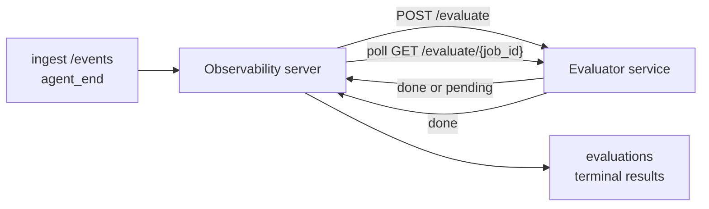

Failproof AI Observability kann jeden abgeschlossenen Agenten-Lauf automatisch auf Qualität bewerten: Sie stellen einen kleinen Scoring-Service bereit, und Observability erledigt den Rest. Verwenden Sie es, um die für Sie relevanten Dimensionen zu verfolgen (Hilfsbereitschaft, Tool-Effizienz, Faktentreue, Sicherheit – Sie entscheiden), Regressionen frühzeitig zu erkennen und Agenten oder Umgebungen auf einen Blick zu vergleichen. Das Scoring ist opt-in: Die Pipeline tut nichts, bis Sie `EVALUATOR_ENDPOINT` auf dem Server setzen.

> **Hinweis:** Sie definieren die Score-Dimensionen. Ihr Evaluator kann beliebige numerische Schlüssel zurückgeben; Observability speichert, verfolgt und zeigt alles an, was Sie zurücksenden.

## Auf einen Blick

1. **Schreiben Sie einen Scorer.** Stellen Sie einen kleinen HTTP-Service bereit, der ein Sitzungsprotokoll liest und Scores zurückgibt. Observability liefert einen funktionierenden Referenz-Evaluator, den Sie kopieren können. Siehe [Evaluator mit dem SDK schreiben](#writing-an-evaluator-with-the-sdk).
2. **Verweisen Sie Observability darauf.** Setzen Sie `EVALUATOR_ENDPOINT` (und ein gemeinsames `EVALUATOR_TOKEN`) auf dem Server-Prozess.
3. **Beobachten Sie die eingehenden Scores.** Jede abgeschlossene Sitzung wird automatisch bewertet; die Ergebnisse erscheinen auf der Sitzungsdetailseite, im Sitzungsraster und in gespeicherten Dashboards.


*Sobald ein Evaluator konfiguriert ist, wird jeder abgeschlossene Lauf bewertet, und die Ergebnisse erscheinen in der rechten Spalte der Sitzung: oben die Zusammenfassung, darunter Score-Balken pro Dimension mit Begründung.*

---

## Funktionsweise



Wenn das Observability SDK ein `agent_end`-Event für eine Sitzung ausgibt, plant
der Server eine Evaluierung. Er sendet dann das vollständige Event-Protokoll per POST an
Ihren Evaluator-Service, der entweder:

- **Das Ergebnis direkt zurückgeben** kann mit `{"status":"done", "scores":{...}, "reasoning":{...}, "summary":"..."}`. Das
  Ergebnis wird an die Evaluierungs-Timeline der Sitzung angehängt. `reasoning` und
  `summary` sind optional.
- **Zurückstellen** mit `{"status":"pending", "job_id":"abc-123"}`. Observability ruft dann
  `GET {EVALUATOR_ENDPOINT}/evaluate/abc-123` auf, bis Ihr Evaluator
  `{"status":"done", ...}` oder `{"status":"error", "error":"..."}` zurückgibt.

  Der Polling-Takt ist pro Job: Eine `pending`-Antwort kann
  `next_poll_secs` enthalten, um diesen zu überschreiben; andernfalls verwendet Observability den
  Wert `default_poll_interval_secs` aus `GET /config`; andernfalls fällt der Server
  auf `EVALUATOR_POLLING_INTERVAL_SECS` zurück (Standard: 10s). Alle Werte
  werden auf [1s, 1h] begrenzt.

Sitzungen, die nie `agent_end` ausgeben (z. B. ein abgestürzter Agenten-Prozess),
können ebenfalls erfasst werden: Der `GET /config`-Endpunkt des Evaluators kann
`{"inactivity_timeout_secs": 1800}` zurückgeben, und Observability wertet jede Sitzung
aus, die so lange inaktiv war. Setzen Sie das Feld auf `null` oder lassen Sie es weg, um
diesen Fallback zu deaktivieren.

Die Pipeline ist vollständig inaktiv, wenn `EVALUATOR_ENDPOINT` nicht gesetzt ist.

Eine Sitzung kann **mehrere abgeschlossene Evaluierungen im Laufe der Zeit ansammeln**: Jedes
`agent_end`-Event (und jede manuelle Neubewertung über das Dashboard) hängt eine
neue Evaluierungszeile an. Dies ist die unterstützte Methode zur Auswertung einer fortgesetzten
Konversation: Ein Benutzer beendet einen Agenten, kommt später zurück, sendet weitere Events,
beendet den Agenten erneut, und eine zweite Evaluierung wird gegen das vollständige aktualisierte
Protokoll ausgeführt. Das Dashboard zeigt die neueste Evaluierung als Hauptüberschrift und
die früheren Evaluierungen als ausklappbare Timeline. Während eine Evaluierung für eine Sitzung
läuft, werden weitere `agent_end`-Events für diese Sitzung ignoriert; das nächste nach
Abschluss der laufenden Evaluierung stellt wie gewohnt eine neue Evaluierung in die Warteschlange.

Der Inaktivitäts-Fallback greift auch bei fortgesetzten Sitzungen: Wenn nach einer vorherigen
abgeschlossenen Evaluierung neue Events eintreffen und die Sitzung dann länger als
`inactivity_timeout_secs` inaktiv bleibt, wird eine neue Evaluierung in die Warteschlange gestellt.

Vorübergehende Fehler (5xx, 429, Timeouts, Netzwerkfehler) werden mit
exponentiellem Backoff bis zu `EVALUATOR_MAX_ATTEMPTS` wiederholt; 4xx-Antworten sind
endgültig. Observability ist sicher mit mehreren horizontal skalierten Server-Instanzen
betreibbar; die Arbeit wird aufgeteilt, sodass dieselbe Sitzung nie zweimal gleichzeitig
verarbeitet wird.

---

## HTTP-Vertrag

Jede authentifizierte Route verwendet **Bearer-Token-Authentifizierung**. Derselbe Wert muss
auf beiden Seiten konfiguriert sein:

- Observability-Server: Umgebungsvariable `EVALUATOR_TOKEN`
- Evaluator-Service: gleich konfiguriert (das `agenteye-evaluator`-SDK
  liest `EVALUATOR_TOKEN` per Konvention)

Wenn `EVALUATOR_TOKEN` nicht gesetzt ist, sendet der Server keinen `Authorization`-Header; der
Evaluator kann dann anonyme Anfragen akzeptieren, was für ein rein internes Netzwerk
in Ordnung ist, im öffentlichen Internet jedoch nicht empfohlen wird.

### Routen, die der Evaluator bereitstellen muss

| Route | Body / Parameter | Antwort |
|---|---|---|
| `GET /health` | keine | `{"status":"ok"}` (offen, keine Authentifizierung) |
| `GET /config` | keine | `{"inactivity_timeout_secs": <int> \| null, "default_poll_interval_secs": <int> \| omitted}` |
| `POST /evaluate` | `EvalRequest` JSON | `{"status":"done", ...}` oder `{"status":"pending", "job_id":"..."}` |
| `GET /evaluate/{id}` | keine | gleiche Antwortstruktur wie `/evaluate` |

### `EvalRequest`-Body, der vom Server gesendet wird

```json
{
  "schema_version": "1",
  "session_id":     "session-abc123",
  "agent_id":       "planner",
  "environment":    "production",
  "started_at":     "2026-05-10T12:00:00Z",
  "ended_at":       "2026-05-10T12:05:00Z",
  "events": [
    { "id": 1234, "ts": "...", "event_type": "agent_start", "payload": { ... } },
    ...
  ]
}
```

### Antwortstrukturen

**Synchron (fertig):**

```json
{
  "status": "done",
  "scores": { "helpfulness": 0.85, "tool_efficiency": 0.6 },
  "reasoning": {
    "helpfulness": "answered the question directly with citations",
    "tool_efficiency": "called list_files three times when one would have done"
  },
  "summary": "strong answer quality, weak tool selection"
}
```

`reasoning` (eine Score-bezogene Begründungsmap) und `summary` (eine
Gesamtübersicht in einem Absatz) sind beide optional. Schlüssel in `reasoning` sollten
die Schlüssel in `scores` widerspiegeln; das Dashboard rendert jeden Eintrag direkt
unterhalb des entsprechenden Score-Balkens. Ältere Evaluatoren, die nur `scores` zurückgeben,
funktionieren weiterhin unverändert; `reasoning` und `summary` werden einfach als null
gelesen, und die entsprechenden UI-Elemente werden weggelassen.

**Asynchron (zurückgestellt):**

```json
{ "status": "pending", "job_id": "abc-123", "next_poll_secs": 30 }
```

`next_poll_secs` ist optional; wenn weggelassen, fällt der Server auf
`default_poll_interval_secs` des Evaluators aus `/config` zurück, dann auf seine eigene
Umgebungsvariable `EVALUATOR_POLLING_INTERVAL_SECS`.

**Endgültiger Fehler auf Evaluator-Seite:**

```json
{ "status": "error", "error": "model service unavailable" }
```

Der Server behandelt jeden anderen 2xx-Body als Protokollfehler und verzeichnet einen
endgültigen `error` für die Sitzung.

---

## Evaluator mit dem SDK schreiben

Sie müssen den HTTP-Vertrag nicht manuell implementieren. Das Python-Paket `agenteye-evaluator`
stellt Ihnen einen typisierten FastAPI-Wrapper bereit, der Authentifizierung, Routing und
die Request-/Response-Strukturen für Sie übernimmt.

Failproof AI Observability liefert außerdem einen **funktionierenden Referenz-Evaluator**, der
`helpfulness`, `tool_efficiency` und `factuality` anhand der Struktur des Protokolls bewertet.
Kopieren Sie ihn als Ausgangspunkt und ersetzen Sie die Logik durch Ihre eigene: einen LLM-Judge,
eine Regelmaschine oder was auch immer zu Ihrem Qualitätsmaßstab passt.

Minimaler funktionsfähiger Evaluator:

```python
import os
from agenteye_evaluator import Evaluator, EvalRequest, EvalResponse

app = Evaluator(token=os.environ["EVALUATOR_TOKEN"])

@app.evaluator
def run(req: EvalRequest) -> EvalResponse:
    # Inspect req.events (the full session transcript) and return scores.
    tool_calls = sum(1 for e in req.events if e.event_type == "tool_use")
    return EvalResponse(
        scores={"tool_calls": float(tool_calls)},
        reasoning={"tool_calls": f"{tool_calls} tool invocations in the transcript"},
        summary="tight tool loop" if tool_calls < 5 else "agent looped on tools",
    )
```

Die `app`-Instanz läuft unter jedem ASGI-Server, sodass `uvicorn module:app` sie startet.

Für Evaluatoren, die aufwendige Arbeit zurückstellen müssen, geben Sie stattdessen `JobPending`
zurück und registrieren Sie einen `@app.job_lookup`-Handler; der Observability-Server
fragt `GET /evaluate/{job_id}` ab, bis Sie einen abgeschlossenen Status zurückgeben oder das
Limit `EVALUATOR_MAX_POLL_DURATION_SECS` (Standard: 1 h) abläuft.

Die vollständige API-Referenz, das Async-Muster und das Event-Schema sind in der README des
`agenteye-evaluator`-SDKs dokumentiert.

---

## Evaluator betreiben

Der Evaluator ist **Ihr Service** — Failproof AI Observability liefert keinen
Standard-Evaluator, daher erstellen und betreiben Sie ihn dort, wo Sie Ihre eigenen Services
betreiben. Er läuft unter jedem ASGI-Server (z. B. `uvicorn my_evaluator:app`); stellen Sie
die Routen `/health`, `/config` und `/evaluate` gemäß dem
[HTTP-Vertrag](#http-contract) bereit und verweisen Sie den Server darauf (siehe
[Server konfigurieren](#configuring-the-server)).

Sobald der Evaluator erreichbar ist, gibt `GET /health` `{"status":"ok"}` zurück. Nachdem
ein Agent vollständig durchgelaufen ist, gibt `GET /evaluations` auf dem Server eine Zeile mit
`status: "done"` und den von Ihrem Evaluator produzierten Scores zurück.

---

## Server konfigurieren

Auf dem Server-Prozess setzen:

| Umgebungsvariable | Bedeutung |
|---|---|
| `EVALUATOR_ENDPOINT` | Basis-URL Ihres Evaluators (`http://evaluator:9000`). Nicht gesetzt = Pipeline deaktiviert. |
| `EVALUATOR_TOKEN` | Bearer-Token. Muss mit dem Wert übereinstimmen, mit dem der Evaluator-Service konfiguriert ist. |
| `EVALUATOR_WORKERS` | Worker-Tasks pro Server-Instanz (Standard: 2). |
| `EVALUATOR_CLAIM_BATCH` | Zeilen, die pro Worker-Tick beansprucht werden (Standard: 4). Batches werden **gleichzeitig** verarbeitet; die effektive Parallelität auf Ihrem Evaluator-Endpunkt beträgt `EVALUATOR_WORKERS × EVALUATOR_CLAIM_BATCH`. |
| `EVALUATOR_POLL_IDLE_SECS` | Wie lange ein Worker zwischen Dispatch-Versuchen wartet, wenn keine Evaluierung fällig ist (Standard: 2s). |
| `EVALUATOR_POLLING_INTERVAL_SECS` | Letzter Fallback für den `GET /evaluate/{id}`-Takt, wenn weder das `next_poll_secs` der Antwort noch das `default_poll_interval_secs` des Evaluators gesetzt ist (Standard: 10s). |
| `EVALUATOR_REQUEST_TIMEOUT_MS` | Timeout pro Anfrage (Standard: 30000). |
| `EVALUATOR_MAX_ATTEMPTS` | Nach so vielen vorübergehenden Fehlern wird das Ergebnis als endgültiger `error` verzeichnet (Standard: 5). |
| `EVALUATOR_CONFIG_REFRESH_SECS` | `GET /config`-Takt (Standard: 300). |
| `EVALUATOR_MAX_POLL_DURATION_SECS` | Maximale Echtzeit, die eine Sitzung in der Polling-Warteschlange verbleiben darf, bevor sie als `timeout` beendet wird (Standard: 3600s). Schützt vor einem Evaluator, der dauerhaft `pending` zurückgibt. |

Um automatisches Scoring zu aktivieren, setzen Sie sowohl `EVALUATOR_ENDPOINT` als auch
`EVALUATOR_TOKEN` auf dem Server und starten Sie ihn dann neu, um die Änderung zu übernehmen. Wenn
`EVALUATOR_ENDPOINT` nicht gesetzt ist, bleibt die Pipeline inaktiv.

Die oben genannten Einstellungsparameter sind optional; setzen Sie die entsprechenden Umgebungsvariablen
auf dem Server nur, wenn Sie die Standardwerte überschreiben müssen.

---

## API-Referenz

| Methode | Pfad | Erforderliche Berechtigung | Zweck |
|---|---|---|---|
| `GET` | `/evaluations` | `evaluations:read` | Abgeschlossene Ergebnisse abfragen. Unterstützt `session_id`, `agent_id`, `environment`, `status` (`done`/`error`/`timeout`), `ts_from`, `ts_to`, `cursor`, `limit`, `score_filters`, `latest_per_session`. `limit` ist standardmäßig 50 und auf 200 begrenzt (dies unterscheidet sich von `/events`, das auf 1000 begrenzt ist). `environment` akzeptiert eine kommagetrennte Liste (z. B. `environment=prod,staging`); einzelne Werte funktionieren weiterhin. Mit `latest_per_session=true` enthält die Antwort höchstens eine Zeile pro `session_id` (die neueste nach `completed_at`), die von der Sitzungslisten-Seite verwendet wird, um die Evaluierungs-Timeline einer Sitzung auf ihre aktuelle Überschrift zu reduzieren. Standardmäßig false (gibt die vollständige Historie zurück). |
| `GET` | `/evaluations/aggregate` | `evaluations:read` | Zusammengefasste Eval-Qualität für einen gefilterten Bereich: Gesamtanzahl, eine Aufschlüsselung nach done/error/timeout, Statistiken pro Score-Schlüssel (count/avg/min/max/p50 über die beliebigen `scores`-Schlüssel) und eine zeitbasierte Timeline. Akzeptiert **dieselben Filterparameter wie `/evaluations`** plus `featured_keys` (CSV der zu trendenden Score-Schlüssel) und `latest_per_session`. Treibt die Dashboards-Funktion an; Metriken sind exakt über die gesamte übereinstimmende Menge, nicht gesampelt. |
| `GET` | `/evaluations/environments` | `evaluations:read` | Unterschiedliche Umgebungswerte aus der `evaluations`-Tabelle. Wird verwendet, um Filter-Dropdowns zu befüllen, die auf evaluierungslesbare Daten beschränkt sind. |
| `GET` | `/evaluation-jobs` | `evaluations:read` | Sichtbarkeit in laufende Evaluierungen. Filtern nach `status` (`pending`/`polling`). |
| `GET` | `/events` | `events:read` | Rohe Events einer Sitzung streamen. Unterstützt `session_id`, `agent_id`, `event_type` (CSV), `environment` (CSV), `ts_from`, `ts_to`, `cursor`, `limit` und `order`. `order` ist `desc` (neueste zuerst, Standard) oder `asc` (älteste zuerst); ein unbekannter Wert fällt auf `desc` zurück. Cursor-Paginierung über das `next_cursor` der Antwort (eine Event-ID): Geben Sie es als `cursor` zurück, um die nächste Seite zu erhalten; mit `asc` ist die nächste Seite die Events nach dieser ID, mit `desc` die Events davor. `limit` ist standardmäßig 50 und auf 1000 begrenzt. |
| `GET` | `/sessions/:session_id/export` | `events:read` | Gibt den exakten JSON-Body zurück, den der Evaluator für diese Sitzung erhalten würde, als herunterladbarer Anhang namens `session-<id>.json`. Nützlich zum Wiedergeben von Produktionssitzungen durch `agenteye-evaluator` für Offline-Tests. Die Bytes sind byte-identisch mit dem, was die Evaluierungs-Pipeline sendet. |
| `POST` | `/sessions/:session_id/re-evaluate` | `evaluations:trigger` | Eine neue Evaluierung für eine Sitzung in die Warteschlange stellen; läuft unabhängig davon, ob eine frühere Evaluierung existiert. Das neue Ergebnis wird an die Evaluierungs-Timeline der Sitzung **angehängt**, anstatt das vorherige zu überschreiben, sodass frühere Scores als Historie sichtbar bleiben. Gibt `202` bei Einreihung zurück, `404` für eine unbekannte Sitzung, `409` wenn eine Evaluierung bereits läuft. Verwenden Sie dies nach dem Deployment eines neuen Evaluators oder für Sitzungen, die nie `agent_end` ausgegeben haben. |

### Filtern nach Score-Bereich: `score_filters`

`GET /evaluations` akzeptiert einen optionalen `score_filters`-Parameter, der
Ergebnisse nach numerischen Werten innerhalb des `scores`-Objekts einschränkt. Der
Parameter ist eine kommagetrennte Liste von `key:min..max`-Einträgen; beide Grenzen
können weggelassen werden. Mehrere Einträge werden mit logischem AND kombiniert. Zeilen,
bei denen der genannte Schlüssel fehlt oder nicht numerisch ist, werden ausgeschlossen. Eine Anfrage darf
höchstens 20 Filtereinträge enthalten; bei Überschreitung wird HTTP 400 zurückgegeben.

Beispiele:
```text
# helpfulness in [0.5, 0.8]
GET /evaluations?score_filters=helpfulness:0.5..0.8

# tool_efficiency at most 0.3 (no lower bound)
GET /evaluations?score_filters=tool_efficiency:..0.3

# helpfulness >= 0.5 AND factuality >= 0.9
GET /evaluations?score_filters=helpfulness:0.5..,factuality:0.9..
```

Jedes `/evaluations`-Antwortobjekt hat diese Felder:

| Feld | Typ | Hinweise |
|---|---|---|
| `evaluation_id` | string (UUID) | Der kanonische Bezeichner für diese abgeschlossene Evaluierung. Jede abgeschlossene Evaluierung erhält eine neue UUID; eine einzelne Sitzung kann mehrere enthalten. |
| `id` | string (UUID) | Alias für Abwärtskompatibilität mit demselben Wert wie `evaluation_id`. |
| `session_id` | string | Die Sitzung, gegen die diese Evaluierung ausgeführt wurde. Eine Sitzung kann mehrere Evaluierungen in der Timeline haben. |
| `agent_id` | string | Identifiziert den Agenten, der die Sitzung produziert hat. |
| `environment` | string | Umgebungsbezeichnung, die von der Sitzung kopiert wurde. |
| `status` | enum | Eines von `"done"`, `"error"`, `"timeout"`. |
| `scores` | object \| null | Scores, die von Ihrem Evaluator zurückgegeben wurden. |
| `reasoning` | object \| null | Optionale Score-bezogene Begründungsmap, die von Ihrem Evaluator zurückgegeben wurde. Schlüssel spiegeln typischerweise die in `scores` wider. Das Dashboard rendert jeden Eintrag unterhalb seines Score-Balkens. |
| `summary` | string \| null | Optionale Gesamtübersicht in einem Absatz, die von Ihrem Evaluator zurückgegeben wurde. Das Dashboard rendert diese oberhalb der Score-Aufschlüsselung als Überschrift der Evaluierung. |
| `error` | string \| null | Nur bei `"error"` / `"timeout"` befüllt. |
| `attempt_count` | integer | Anzahl der Dispatch-Versuche (≥ 1). |
| `duration_ms` | integer \| null | Dauer des letzten Versuchs. |
| `completed_at` | string (ISO 8601 UTC) | Zeitpunkt, zu dem das abgeschlossene Ergebnis verzeichnet wurde. Ergebnisse sind nach `completed_at` geordnet (neueste zuerst). |
| `created_at` | string (ISO 8601 UTC) | Enthält denselben Zeitstempel wie `completed_at` (Write-Once-Semantik). |

---

## Berechtigungen

| Berechtigung | Gewährt |
|---|---|
| `evaluations:read` | Evaluierungsergebnisse auflisten, Scores im Dashboard anzeigen und Dashboard-Qualitätsmetriken laden. |
| `evaluations:trigger` | Manuell eine Evaluierung für eine Sitzung über `POST /sessions/:session_id/re-evaluate` oder die Neubewertungsschaltfläche des Dashboards in die Warteschlange stellen. |
| `dashboards:read` | Gespeicherte Dashboards anzeigen (benötigt außerdem `evaluations:read`, um deren Metriken zu laden). |
| `dashboards:write` | Dashboards erstellen und bearbeiten. |
| `dashboards:delete` | Dashboards löschen. |

Der Bootstrap-Administrator (`ADMIN_KEY`, `ADMIN_EMAIL`) erhält diese automatisch.

---

## Ergebnisse anzeigen

- **`/sessions/<id>`**: Events-Timeline + eine rechte Spalte mit den Scores der Sitzung
  und etwaigen Fehlern aus dem Dispatch-Versuch. Wenn Ihr Schlüssel
  `evaluations:trigger` hat, erscheint neben der Export-Schaltfläche eine **Neubewerten**-Schaltfläche,
  nützlich für Sitzungen, die nie `agent_end` ausgegeben haben, oder zum
  Aktualisieren von Scores nach dem Deployment eines neuen Evaluators. Das Dashboard fragt das
  neue Ergebnis ab und aktualisiert die rechte Spalte, wenn es eintrifft.
- **`/sessions`**: Filterbares Sitzungsraster; die Score-Spalte zeigt den Evaluierungsstatus und
  die Scores jeder Sitzung auf einen Blick.
- **`/dashboards`**: Gespeicherte Eval-Qualitätsansichten (siehe [Dashboards](#dashboards) unten).


*Das Sitzungsraster zeigt den Evaluierungsstatus und die Scores jedes Laufs auf einen Blick; rote/gelbe/grüne Badges lassen niedrige Scores sofort auffallen.*

---

## Dashboards

Die **Dashboards**-Seite (`/dashboards`) ermöglicht es Ihnen, eine Kombination von Evaluierungsfiltern
als benannte, wiederverwendbare Ansicht zu speichern und auf einen Blick zu sehen, wie dieser Bereich
von Evaluierungen abschneidet. Dashboards werden **organisationsweit geteilt**;
jeder mit `dashboards:read` sieht denselben Satz.

Jedes Dashboard speichert:

- **Filter**: dieselben Steuerelemente wie die Sitzungsseite: Umgebung, Status,
  Agent, ein rollierendes Zeitfenster und Score-Bereichsfilter (`key:min..max`).
- **Eine Anzeigeeinstellung**: welche Score-Schlüssel hervorgehoben werden sollen, die grün/gelb/roten
  Qualitätsschwellenwerte, welche Panels angezeigt werden sollen und ob auf die neueste
  Evaluierung pro Sitzung reduziert werden soll.

Jede Karte zeigt die Anzahl der übereinstimmenden Sitzungen, eine Aufschlüsselung nach done/error/timeout,
den Durchschnitt jedes hervorgehobenen Scores und eine kleine Trend-Sparkline. Das Öffnen eines
Dashboards zeigt die vollständigen Panels; **„In Sitzungen öffnen"** bringt Sie zur
Sitzungsseite, die auf genau diesen Bereich vorgefiltert ist. Metriken werden
serverseitig über die gesamte übereinstimmende Menge berechnet (über `GET /evaluations/aggregate`), sodass
die Zahlen exakt und nicht gesampelt sind.


**Berechtigungen:** Anzeigen erfordert sowohl `dashboards:read` als auch `evaluations:read`;
Erstellen und Bearbeiten erfordert `dashboards:write`; Löschen erfordert `dashboards:delete`.
Der Bootstrap-Administrator erhält alle diese automatisch.

---

## Fehlerbehebung

**Sitzungen existieren, aber keine Evaluierungen werden erstellt.** Überprüfen Sie, ob `EVALUATOR_ENDPOINT`
auf dem Server-Prozess gesetzt ist, ob Server und Evaluator denselben `EVALUATOR_TOKEN`-Wert teilen,
und ob der `/health`-Endpunkt des Evaluators vom Server aus erreichbar ist. Wenn `EVALUATOR_ENDPOINT`
nicht gesetzt ist, ist die Pipeline inaktiv.

**Laufende Evaluierungen häufen sich an.** Fragen Sie `GET /evaluation-jobs` ab, um die
laufende Warteschlange zu sehen. Überprüfen Sie `attempt_count`, `next_attempt_at` und `last_error`
für jede Zeile. Häufige Ursachen: Evaluator-Service nicht erreichbar oder gibt 5xx zurück
(wird mit Backoff wiederholt), falsches `EVALUATOR_TOKEN` (401 ist endgültig) oder ein
asynchroner Evaluator, der dauerhaft `pending` zurückgibt (siehe unten).

**Sitzungen abgeschlossen, aber keine abgeschlossene Evaluierung.** Fragen Sie
`GET /evaluation-jobs?status=polling` ab; das Ergebnis könnte noch in Bearbeitung sein.
Wenn ein Job in `pending` feststeckt, hat der Server Schwierigkeiten, den
Evaluator zu erreichen; überprüfen Sie, ob der Evaluator aktiv ist und ob `EVALUATOR_TOKEN` übereinstimmt.

**`HTTP 401 from evaluator: invalid bearer token`.** Das `EVALUATOR_TOKEN`
auf dem Server stimmt nicht mit dem Wert überein, mit dem der Evaluator-Service konfiguriert ist.
Sie müssen identisch sein.

**Asynchroner Evaluator gibt dauerhaft `pending` zurück.** Der Server fragt
`GET /evaluate/{job_id}` ab, bis der Evaluator `done` oder `error` zurückgibt oder
bis `EVALUATOR_MAX_POLL_DURATION_SECS` (Standard: 1 h) abläuft. Nach dem Ablauf
wird die Evaluierung als `timeout` verzeichnet und aus der laufenden Warteschlange entfernt.
Erhöhen Sie `EVALUATOR_MAX_POLL_DURATION_SECS`, wenn Ihr Evaluator legitim länger
als den Standardwert benötigt.

---

## Nächste Schritte

- [Evaluator-Agenten-Skill](/de/agenteye/evaluator-skill): Lassen Sie einen Coding-Agenten Ihre Dimensionen anhand echter Sitzungen entwerfen und diesen Service für Sie erstellen.
- [Python SDK](/de/agenteye/python-sdk): Geben Sie die `agent_end`-Events aus, die das Scoring auslösen.
- [API-Schlüssel](/de/agenteye/api-keys): Die Berechtigungen `evaluations:read` und `evaluations:trigger`.
- [Audits](/de/agenteye/audits): Die andere automatisierte Qualitätsfunktion von Observability für richtlinienbasierte Überprüfungen.