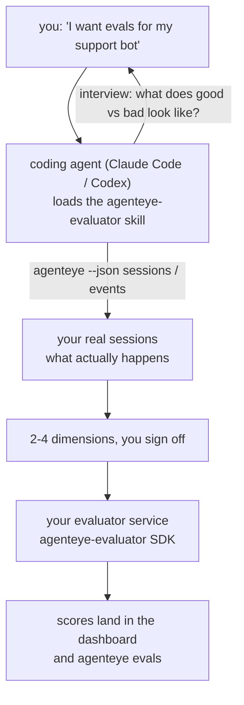

Von *„Ich glaube, unser Agent ist manchmal schlecht"* zu einem deployten Scoring-Service – mit dem Coding-Agent, der sowohl die Konzeption als auch die Umsetzung übernimmt. Der **Failproof AI Observability Evaluator Skill** (`agenteye-evaluator`) ist ein *Agent Skill*: ein kleines Verzeichnis mit Anweisungen, das ein Coding-Agent wie Claude Code oder Codex bei Bedarf lädt. Es bringt dem Agent bei, herauszufinden, welche Qualitätsdimensionen es für *Ihren* Agent wert sind, verfolgt zu werden – und dann den [Evaluator-Service](/de/agenteye/evaluation-suite), der diese bewertet, zu schreiben, zu testen und zu deployen.

Es handelt sich **nicht** um einen gehosteten Scorer, eine Registry, in die Sie hochladen, oder ein Plugin-System. Ihr Evaluator bleibt Ihr eigener HTTP-Service auf Ihrer eigenen Infrastruktur, genau wie im Guide zur [Evaluation Suite](/de/agenteye/evaluation-suite) beschrieben. Der Skill lehrt Ihren Agent lediglich, ihn gut zu bauen – alles, was er tut, könnten Sie also selbst tun, indem Sie denselben Code schreiben.

---

## Das Schwierige ist zu entscheiden, was bewertet werden soll

Die SDK-Oberfläche ist klein – ein Dekorator und zwei Modelle – und ein Agent kann das allein aus dem [Vertrag](/de/agenteye/evaluation-suite#http-contract) heraus schreiben. Daran scheitern Evaluatoren nicht. Sie scheitern, weil sie die falschen Dinge bewerten, und ein Evaluator, der die falschen Dinge bewertet, ist schlimmer als keiner: Er produziert ein Dashboard, das alle lernen zu ignorieren.

Daher besteht der größte Teil des Skills aus dem, was passiert, bevor überhaupt Code existiert. Der Agent interviewt Sie (*„Beschreiben Sie einen Durchlauf, der gut lief; jetzt einen, der schlecht lief"*), zieht dann Ihre echten Sessions über die [`agenteye` CLI](/de/agenteye/cli) und liest sie von Anfang bis Ende. Diese beiden Hälften stimmen meistens nicht überein, und genau diese Lücke ist der Kern der Sache: was Sie zu messen beabsichtigen, gegenüber dem, was Ihre Transkripte tatsächlich unterstützen können. Eine Dimension überlebt nur dann, wenn sie aus den Events **berechenbar** ist und **diskriminierend** wirkt – wenn sie bei Ihrem guten und Ihrem schlechten Durchlauf gleichermaßen 0,9 ergibt, lehrt sie nichts und wird gestrichen.

Das Ergebnis ist ein Vorschlag mit 2–4 Dimensionen samt der zugehörigen Begründung, den Sie absegnen müssen, bevor eine einzige Zeile geschrieben wird.



---

## Wie es sich zu den anderen Evaluierungs-Komponenten verhält

Vier Dokumente befassen sich mit Scoring und gehen in dieser Reihenfolge aufeinander über:

| Seite | Was es ist | Verwenden wenn |
|---|---|---|
| **[Evaluations](/de/agenteye/evaluations)** | Das Feature: Scores im Sessions-Grid, Dashboards, Neu-Evaluierung | Sie wissen möchten, was automatisches Scoring Ihnen bringt |
| **[Evaluation suite](/de/agenteye/evaluation-suite)** | Der HTTP-Vertrag, das SDK, die Server-Umgebungsvariablen | Sie den Evaluator selbst implementieren oder debuggen |
| **Evaluator Skill** (dieses Dokument) | Ein natürlichsprachlicher Einstieg für das Design *und* den Aufbau des Scorers | Sie von „Ich möchte Evals" zu einem laufenden Service kommen wollen |
| **[CLI skill](/de/agenteye/cli-skill)** | Ein natürlichsprachlicher Einstieg für die `agenteye` CLI | Sie die bereits vorhandenen Scores *lesen* möchten |
| **[Python SDK skill](/de/agenteye/python-sdk-skill)** | Ein natürlichsprachlicher Einstieg für die Instrumentierung Ihres Agents | Ihr Agent noch keine Sessions emittiert – es gibt nichts zu bewerten |

### Vs. den CLI Skill: Aufbauen versus Lesen

Die beiden Skills überschneiden sich bewusst nicht, und beide zu installieren ist die übliche Konfiguration – der Agent wählt zwischen ihnen basierend darauf, was Sie anfragen:

- **`agenteye-evaluator`** (dieses Dokument) baut das Ding, das Scores *produziert*. Seine Aufgabe endet, wenn Scores zum ersten Mal landen.
- **[`agenteye-cli`](/de/agenteye/cli-skill)** liest bereits vorhandene Scores (`agenteye evals`). *„Hat die Qualität diese Woche nachgelassen?"* ist seine Frage, nicht die dieses Skills.

---

## Voraussetzungen

1. **Die `agenteye` CLI installiert und eingeloggt** (`pipx install agenteye`, dann `agenteye login`). Der Skill nutzt sie an zwei Stellen: um die echten Sessions abzurufen, gegen die er designed, und um am Ende zu bestätigen, dass Ihre Scores angekommen sind. Ihr Login benötigt `events:read` sowie `evaluations:read` für diese abschließende Prüfung. Wie beim CLI Skill kann er den per E-Mail zugesandten Einmalcode-Login **nicht** für Sie abschließen.
2. **Einen Platz für den Evaluator.** Er wird in ein Image gebaut und als langlebiger Service ausgeführt, benötigt also ein echtes Repo, keine temporäre Datei. Evaluatoren leben oft in einem eigenen Repo, getrennt von dem Agent, der bewertet wird – der Skill sucht nach einem vorhandenen und fragt, bevor er ein neues Gerüst erstellt.
3. **Das `agenteye-evaluator` SDK Wheel** – lesen Sie den nächsten Abschnitt, bevor Ihr Agent anfängt, `pip`-Befehle einzutippen.

---

## Wo Sie es bekommen

Der Skill ist in Failproof AIs öffentlicher Skills-Sammlung veröffentlicht:

**[github.com/FailproofAI/skills](https://github.com/FailproofAI/skills)** → [`skills/agenteye-evaluator/`](https://github.com/FailproofAI/skills/tree/main/skills/agenteye-evaluator)

Das Repository ist öffentlich, und der Skill benötigt keine eigenen Zugangsdaten – er steuert lediglich die `agenteye` CLI mit der Session, mit der *Sie* eingeloggt sind, und schreibt Code in *Ihrem* Repo. Beachten Sie, dass er als eigener Ordner geliefert wird und **nicht** im `pipx install agenteye`-Paket enthalten ist – suchen Sie also nicht dort danach.

## Den Skill installieren

Der schnellste Weg ist die [`skills`](https://skills.sh) CLI, die den Ordner abruft und dort ablegt, wo Ihr Agent sucht:

```bash
# Claude Code, nur dieses Projekt
npx skills add FailproofAI/skills --skill agenteye-evaluator -a claude-code

# jedes Projekt (installiert nach ~/.claude/skills/)
npx skills add FailproofAI/skills --skill agenteye-evaluator -a claude-code -g --copy

# stattdessen Codex
npx skills add FailproofAI/skills --skill agenteye-evaluator -a codex
```

Verwalten Sie ihn dann wie jeden anderen Skill:

```bash
npx skills list -a claude-code           # was installiert ist
npx skills update agenteye-evaluator     # aktuelle Version ziehen
npx skills remove agenteye-evaluator     # entfernen
```

Bevorzugen Sie manuelle Installation? Ein Agent Skill ist nur ein Ordner mit einer `SKILL.md` (plus optionaler Referenzen), daher funktioniert auch einfaches Kopieren:

- **Claude Code**: Legen Sie den Ordner `agenteye-evaluator/` in `~/.claude/skills/` (jedes Projekt) oder `<your-repo>/.claude/skills/` (nur dieses Repo). Claude Code erkennt ihn automatisch – prüfen Sie das mit der `/skills`-Liste, oder fragen Sie einfach nach Evals.
- **Codex (OpenAI)**: Codex liest dieselbe `SKILL.md`. Das mitgelieferte `agents/openai.yaml` setzt `allow_implicit_invocation: true`, sodass Codex den Skill automatisch auswählt, wenn eine Aufgabe passt; andernfalls rufen Sie ihn explizit als `$agenteye-evaluator` auf.

---

## Das SDK ist nicht auf dem öffentlichen PyPI

> **Warnung:** Lesen Sie dies, bevor Sie einen Agent das SDK installieren lassen.

Der Skill ist öffentlich; das SDK, das er antreibt, nicht. `agenteye-evaluator` wird ausschließlich als privates Release-Artefakt geliefert, und anders als `agenteye` ist der Name auf dem öffentlichen PyPI **nicht beansprucht** – ein bloßes `pip install agenteye-evaluator` könnte also das Paket eines Unbekannten in den Service laden, der Ihre Produktionstranskripte liest. Das ist ein Supply-Chain-Problem, kein Tippfehler.

Der Skill kennt das und arbeitet stattdessen eine Install-Leiter herunter, wobei er bei der ersten zutreffenden Sprosse stoppt: den Monorepo-Quellcode, wenn Sie sich im AgentEye-Repo befinden, andernfalls das private Release-Wheel von GitHub Releases (erfordert Zugang) – und wenn keines erreichbar ist, **stoppt er und fordert Sie auf, Ihren Failproof AI-Ansprechpartner nach dem Wheel zu fragen**, anstatt zu improvisieren.

Wenn Ihr Agent also ein bloßes `pip install agenteye-evaluator` aus dem öffentlichen PyPI vorschlägt, ist das ein sicheres Zeichen dafür, dass der Skill nie geladen wurde. Stoppen Sie dort und überprüfen Sie, ob er installiert ist.

---

## Was Sie fragen können

Ein echter Durchlauf beginnt mit einer vagen Anfrage und endet mit einem abgesegneten Design, nicht mit Code:

```text
you   ▸ I want evals for our support bot. I think it's sometimes bad.

agent ▸ Before I write anything: describe a run that went well,
        and one that went badly.

you   ▸ Good: it answers from the docs. Bad: it makes stuff up,
        or gives up and says "contact support".

agent ▸ Running: agenteye --json sessions --status error --since 7d
        Reading 5 sessions, including two you'd call bad.

        Your words say factuality and deflection. The transcripts
        agree on deflection (2 of 5 end with a support hand-off,
        and it's plain in model_response.content), but factuality
        needs a ground truth your events don't carry.

        So I'd score three things:
          - deflection      rules, cheap, separates your two runs
          - tool_efficiency rules, catches the retry loop in run-004
          - groundedness    LLM judge: is every claim in the docs it retrieved?

        "factuality" would need ground truth we don't have; groundedness
        is the closest thing your transcripts can actually support.
        OK with those three names? Renaming later splits the history.

you   ▸ yes

agent ▸ No evaluator in this repo. Should I scaffold one here, or do
        you have one elsewhere?
```

Von dort an schreibt er zuerst die regelbasierten Dimensionen (kostenlos, sofort, deterministisch), testet sie gegen eine echte aufgezeichnete Session – einschließlich der leeren und nie abgeschlossenen, die naive Evaluatoren zum Absturz bringen – und greift erst bei der subjektiven Dimension auf einen LLM-Judge zurück. Er kennt die [Limits des Dispatchers](/de/agenteye/evaluation-suite#configuring-the-server) – ein 30-Sekunden-Request-Timeout und 8 gleichzeitige Aufrufe deployment-weit – wenn der Judge also nicht zuverlässig hineinpasst, geht er asynchron mit `JobPending` vor, anstatt zuzulassen, dass Ihr Judge fünfmal abgebrochen und wiederholt wird – zu fünffachen Kosten.

Dann deployed er, setzt die beiden Server-Umgebungsvariablen und bestätigt mit `agenteye --json evals --session-id <id>`, dass Scores tatsächlich angekommen sind. Das Ankommen der Scores ist der einzige Beweis.

---

## Worauf Sie achten sollten

- **Dimensionsnamen sind nahezu dauerhaft.** Score-Keys sind beliebige Strings, und die Plattform zeigt Trends für alles, was Sie senden – das bedeutet, dass nichts nachgelagert eine schlechte Wahl korrigiert. Benennen Sie später um, und die Historie spaltet sich: Alte Sessions behalten den alten Key, und der Trend bricht. Deshalb holt der Skill explizite Zustimmung ein, bevor Code geschrieben wird – nehmen Sie diese Aufforderung ernst.
- **Fixtures sind echte Produktionstranskripte.** Das Design gegen echte Sessions bedeutet, sie auf die Festplatte zu ziehen, und sie können Kundendaten enthalten. Der Skill fragt, bevor er sie in Git committet; im Zweifelsfall halten Sie `fixtures/` aus dem Repo heraus und lassen jeden Entwickler seine eigenen ziehen.
- **Der Agent schreibt und deployed einen Service, der jedes Transkript liest.** Er handelt als Sie, begrenzt durch die Berechtigungen Ihres CLI-Logins, aber prüfen Sie den Evaluator wie jeden anderen Code, der Produktionsdaten berührt.

---

## Nächste Schritte

- **[Evaluation suite](/de/agenteye/evaluation-suite)**: der HTTP-Vertrag, das SDK und die Server-Umgebungsvariablen, die der Skill konfiguriert.
- **[Evaluations](/de/agenteye/evaluations)**: wo die Scores erscheinen, sobald sie ankommen.
- **[CLI skill](/de/agenteye/cli-skill)**: der Schwester-Skill zum Lesen von Ergebnissen, nicht zum Aufbauen des Scorers.
- **[CLI](/de/agenteye/cli)**: die Befehlsreferenz hinter den Session-Daten, gegen die der Skill designed.