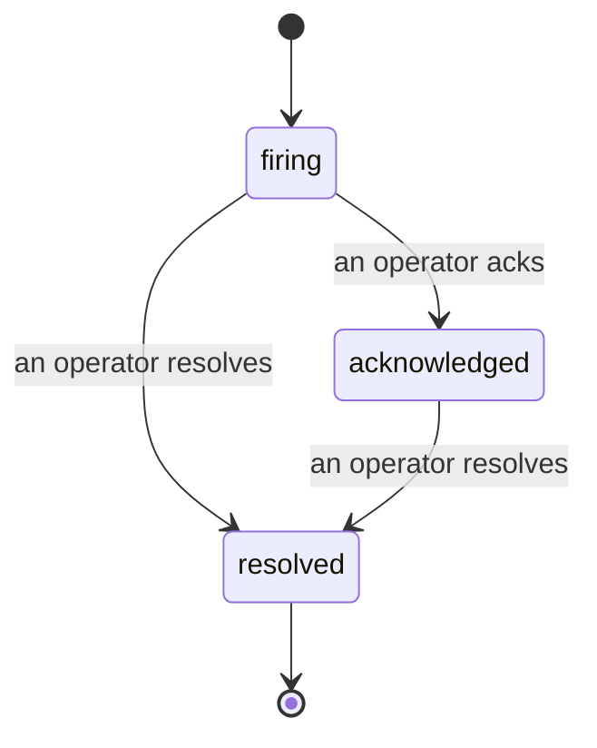

Wenn ein Alert ausgelöst wird, lautet die erste Frage stets: „Wer kümmert sich darum?" Incidents geben darauf eine Antwort: Sobald eine Schwellenwertüberschreitung eintritt, sehen alle Beteiligten, dass der Incident offen ist, wer ihn besitzt und was bisher geschehen ist – mit einem sauberen, zugeordneten Protokoll, das sich direkt für ein Post-Mortem verwenden lässt.

*Der Posteingang gruppiert offene Incidents nach Status und lässt sich nach Schweregrad und Bearbeiter filtern – so siehst du sofort, was jetzt menschliche Aufmerksamkeit braucht.*

## Auf einen Blick sehen, wer zuständig ist

Schluss mit „Schaut sich das jemand an?" im Chat. Eine Schwellenwertüberschreitung öffnet automatisch einen Incident und legt ihn in einen gemeinsamen Posteingang, gruppiert nach Status. Bestätigst du ihn, erscheint dein Name darauf – so weiß das restliche Team, dass er in Bearbeitung ist. Bestätigungen sind geteilt: Mehrere Operatoren können denselben Incident bestätigen, und jede Bestätigung wird einzeln erfasst. Ein vollständiges War-Room-Team erscheint namentlich, ohne sich gegenseitig zu überschreiben. Weise einen Verantwortlichen für die Triage zu und filtere den Posteingang nach Schweregrad oder Bearbeiter, um nur das zu sehen, was dir gehört.

## Die ganze Geschichte in einer Zeitleiste

Wenn der Incident vorbei ist, hast du den Bericht bereits. Öffne einen beliebigen Incident und du siehst die Beweise für die Überschreitung, Bearbeiter und Abonnenten, einen Kommentarbereich zur direkten Koordination sowie eine unveränderliche Aktivitätszeitleiste.

*Alles, was passiert ist, in chronologischer Reihenfolge – jede Zeile signiert von derjenigen Person, die die Aktion durchgeführt hat.*

Jede Aktion (geöffnet, bestätigt, gelöst usw.) wird in diese Zeitleiste geschrieben und niemals nachträglich bearbeitet. Jeder Eintrag ist zugeordnet: per E-Mail dem Operator, der die Aktion durchgeführt hat, oder **automated** für alles, was FailproofAI Observability selbstständig erledigt hat – etwa das Öffnen des Incidents bei einer Überschreitung. Nichts ist anonym, nichts geht verloren – das Post-Mortem schreibt sich so gut wie von selbst.

## Wie sich ein Incident bewegt

- **Offen (firing):** Die Überschreitung öffnet den Incident und benachrichtigt deine Kanäle einmalig. Wiederholte Überschreitungen werden in denselben Incident zusammengefasst und aktualisieren dessen Beweise, anstatt dich immer wieder zu benachrichtigen.
- **Bestätigt (acknowledged):** Ein Operator übernimmt den Incident. Er bleibt offen, und spätere Überschreitungen aktualisieren die Beweise still.
- **Gelöst (resolved):** Ein Operator schließt den Incident ab. Automatische Auflösung beim Wegfall der Bedingung ist geplant, aber noch nicht aktiviert – ein Incident bleibt daher so lange offen, bis ein Mensch ihn auflöst. Das sorgt für Ehrlichkeit darüber, was tatsächlich behoben wurde. Später kann für denselben Alert ein neuer Incident geöffnet werden.

Ein Alert hält jeweils höchstens einen offenen Incident, sodass eine flatternde Regel dich nicht in Duplikaten begräbt. Du kannst einen Incident auch manuell öffnen: einen eigenständigen für etwas, das kein Alert erfasst hat, oder einen, der einem vorhandenen Alert zugeordnet ist – vorausgesetzt, du verfügst über `incidents:write`.

## Wo du es findest

Incidents befinden sich unter `/<org-slug>/incidents`. Zum Anzeigen wird **`incidents:read`** benötigt; zum manuellen Öffnen eines Incidents wird **`incidents:write`** benötigt; zum Bestätigen, Zuweisen, Kommentieren und Auflösen wird **`incidents:ack`** benötigt. Ältere Schlüssel mit dem veralteten `alerts:ack` funktionieren weiterhin, da es als `incidents:ack` anerkannt wird – deine Bereitschaftsrotation muss also nicht neu ausgestellt werden.

## Verwandte Themen

- [Alerts](/de/agenteye/alerts): Die Regeln, die diese Incidents bei einer Schwellenwertüberschreitung öffnen.
- [Fehlerverfolgung](/de/agenteye/error-tracking): Alle Fehler an einem Ort einsehen und einen davon zu einem Alert befördern.
- [Audits](/de/agenteye/audits): Der geplante Analyst, der Fehler findet, auf die keine Regel geachtet hat.