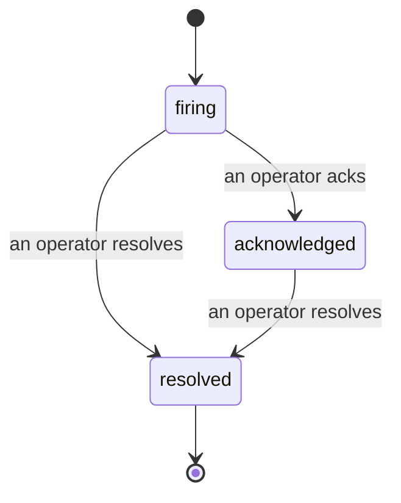

Wenn ein Alert ausgelöst wird, lautet die erste Frage immer: „Wer kümmert sich darum?" Incidents geben die Antwort: Sobald etwas eine Schwelle überschreitet, sieht das gesamte Team sofort, dass ein Incident offen ist, wer es besitzt und genau was bisher passiert ist – mit einem sauberen, zugeordneten Protokoll, das sich direkt als Grundlage für ein Post-mortem eignet.

*Der Posteingang gruppiert offene Incidents nach Status und filtert nach Schweregrad und zugewiesener Person, damit du sofort siehst, was jetzt menschliches Eingreifen erfordert.*

## Auf einen Blick sehen, wer zuständig ist

Kein „Schaut sich das jemand an?" mehr im Chat-Thread. Eine Schwellenwertüberschreitung öffnet automatisch ein Incident und legt es in einen gemeinsamen Posteingang, gruppiert nach Status. Wer es bestätigt, hat seinen Namen daran – so weiß das restliche Team, dass es in Bearbeitung ist. Die Bestätigung ist geteilt: Mehrere Operatoren können dasselbe Incident bestätigen, und jede Bestätigung wird einzeln erfasst, sodass ein vollständiger War-Room namentlich aufgeführt wird, ohne sich gegenseitig zu überschreiben. Weise einen Verantwortlichen für die Triage zu und filtere den Posteingang nach Schweregrad oder zugewiesener Person, um ihn auf das Wesentliche zu reduzieren.

## Die gesamte Geschichte in einer Zeitleiste

Wenn das Incident abgeschlossen ist, hast du den Bericht bereits fertig. Öffne ein beliebiges Incident und du siehst den Breach-Beweis, zugewiesene Personen und Abonnenten, einen Kommentar-Thread zur direkten Koordination sowie eine rein erweiterbare Aktivitäts-Zeitleiste.

*Alles, was passiert ist, in chronologischer Reihenfolge – jede Zeile signiert von der Person, die sie ausgeführt hat.*

Jede Aktion (geöffnet, bestätigt, gelöst usw.) wird in diese Zeitleiste geschrieben und nie nachträglich bearbeitet. Jeder Eintrag ist zugeordnet: dem Operator, der die Aktion ausgeführt hat, per E-Mail, oder als **automated** für alles, was Failproof AI Observability eigenständig getan hat, z. B. das Öffnen des Incidents beim Breach. Nichts ist anonym und nichts geht verloren – das Post-mortem schreibt sich dadurch fast von selbst.

## Wie sich ein Incident entwickelt

- **Offen (firing):** Der Breach öffnet das Incident und benachrichtigt deine Kanäle einmalig. Wiederholte Breaches werden in dasselbe Incident eingebunden und aktualisieren dessen Beweise, anstatt dich immer wieder zu benachrichtigen.
- **Bestätigt (acknowledged):** Ein Operator übernimmt es. Es bleibt offen, und spätere Breaches aktualisieren die Beweise still im Hintergrund.
- **Gelöst (resolved):** Ein Operator schließt es ab. Die automatische Auflösung beim Verschwinden der Bedingung ist geplant, aber noch nicht aktiviert – ein Incident bleibt daher so lange offen, bis ein Mensch es auflöst. Das hält alle ehrlich darüber, was tatsächlich behoben wurde. Für denselben Alert kann später ein neues Incident geöffnet werden.

Ein Alert kann höchstens ein offenes Incident gleichzeitig haben, sodass eine flatternde Regel dich nicht mit Duplikaten überhäufen kann. Du kannst ein Incident auch manuell öffnen: ein eigenständiges für etwas, das kein Alert erfasst hat, oder eines, das einem vorhandenen Alert zugeordnet ist, sofern du `incidents:write` besitzt.

## Wo du es findest

Incidents befinden sich unter `/<org-slug>/incidents`. Zum Anzeigen wird **`incidents:read`** benötigt; zum Öffnen eines manuellen Incidents wird **`incidents:write`** benötigt; zum Bestätigen, Zuweisen, Kommentieren und Auflösen wird **`incidents:ack`** benötigt. Ältere Schlüssel, denen das veraltete `alerts:ack` gewährt wurde, funktionieren weiterhin, da es als `incidents:ack` anerkannt wird – deine Bereitschaftsrotation muss also nicht neu ausgestellt werden.

## Verwandte Themen

- [Alerts](/de/agenteye/alerts): Die Regeln, die diese Incidents öffnen, wenn ein Schwellenwert überschritten wird.
- [Error tracking](/de/agenteye/error-tracking): Sieh jeden Fehler an einem Ort und befördere einen davon zu einem Alert.
- [Audits](/de/agenteye/audits): Der geplante Analyst, der Fehler findet, auf die keine Regel geachtet hat.