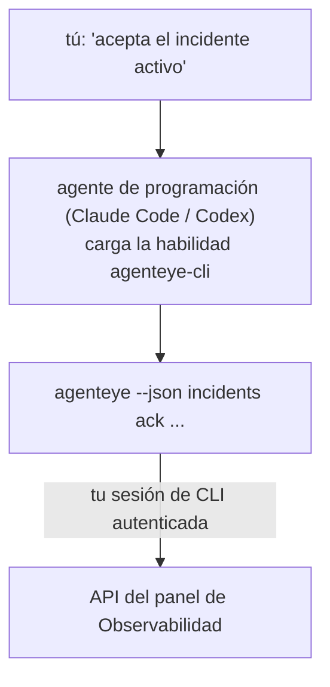

Pregúntale a tu agente de programación *"¿hay algo roto hoy?"* y deja que responda con tus datos en vivo de Observabilidad de FailproofAI, sin necesidad de memorizar comandos. La **habilidad CLI de Observabilidad de FailproofAI** (`agenteye-cli`) es una *Habilidad de Agente*: una pequeña carpeta de instrucciones que un agente de programación como Claude Code o Codex carga bajo demanda. Le enseña al agente a operar tu despliegue de Observabilidad a través de la [CLI `agenteye`](/es/agenteye/cli) con solicitudes en lenguaje natural como *"dale a CI una clave que solo pueda enviar eventos"* o *"acepta el incidente activo y asígnalo a mí."*

**No** es un servicio ni un binario separado; no hay nada que desplegar. Se apoya en la CLI que ya tienes instalada: el agente ejecuta `agenteye --json …`, analiza el JSON limpio y te responde en prosa. Todo lo que puede hacer, tú podrías hacerlo escribiendo los mismos comandos.

---

## Cómo se relaciona con las otras interfaces de Observabilidad de FailproofAI

Observabilidad de FailproofAI te ofrece cuatro formas de acceder a los mismos datos y controles. Se complementan entre sí:

| Interfaz | Qué es | Dónde se ejecuta | Úsala cuando |
|---|---|---|---|
| **[CLI](/es/agenteye/cli)** | La referencia de comandos y flags para `agenteye` | Tu terminal | Quieres ejecutar o automatizar un comando específico |
| **[Recetas de CLI](/es/agenteye/cli-recipes)** | Patrones de `jq`/pipeline para copiar y pegar | Tu terminal / scripts | Estás integrando la CLI en automatización |
| **Habilidad CLI** (este doc) | Una interfaz de lenguaje natural para la CLI | Tu agente de programación, en tu estación de trabajo | Quieres simplemente preguntar y dejar que el agente elija el comando |
| **[Asistente de IA en el panel](/es/agenteye/assistant)** | Un chat integrado en el panel | En el servidor (dentro del panel) | Quieres hacer preguntas sobre tus datos desde el panel |

La habilidad en sí no tiene privilegios propios; simplemente convierte tus palabras en llamadas a la CLI que se ejecutan como tú:



### vs. el asistente de IA en el panel: una distinción importante

Son dos herramientas diferentes con radios de acción muy distintos:

- El **asistente de IA en el panel** ([asistente de IA](/es/agenteye/assistant)) es un chat integrado en el panel, respaldado por el servicio de agente. Es **solo lectura más creación con aprobación**: puede crear consultas guardadas y paneles, pero cada escritura se pausa para tu aprobación explícita con un clic, y nunca elimina nada. Está controlado por el permiso `agent:use` y solo accede a los datos de la organización que estás viendo.
- La **habilidad CLI** se ejecuta en *tu* estación de trabajo dentro de *tu* agente de programación y opera la CLI `agenteye` como **tú**. Puede realizar la **superficie completa de la CLI, incluidas las mutaciones** (crear/rotar/deshabilitar claves API, cambiar configuraciones de la organización, resolver incidentes, eliminar consultas guardadas), limitadas únicamente por los permisos de tu sesión de CLI. Trátala exactamente con el mismo cuidado con el que tratarías ejecutar esos comandos manualmente.

---

## Requisitos previos

1. La **CLI `agenteye` instalada** y en el `PATH` (consulta la referencia de [CLI](/es/agenteye/cli): `pipx install agenteye`).
2. Tu **URL del panel** configurada (`AGENTEYE_DASHBOARD_URL`, o el agente pasa `--base-url`).
3. Una **sesión activa**: ejecuta `agenteye login` tú mismo primero. La habilidad **no puede** completar el inicio de sesión con código de un solo uso enviado por correo electrónico; te indicará que ejecutes `agenteye login` si la sesión falta o ha expirado (código de salida de CLI `4`).

---

## Instalación de la habilidad

Las Habilidades de Agente son carpetas que contienen un `SKILL.md` (más referencias opcionales). Instalas la habilidad `agenteye-cli` colocando su carpeta donde tu agente busca habilidades:

- **Claude Code**: copia la carpeta `agenteye-cli/` en `~/.claude/skills/` (disponible en todos los proyectos) o en `<tu-repositorio>/.claude/skills/` (limitado a ese repositorio). Claude Code la descubre automáticamente; verifícalo con la lista `/skills`, o simplemente haz una pregunta que coincida con su descripción.
- **Codex (OpenAI)**: Codex lee el mismo `SKILL.md`. El archivo `agents/openai.yaml` incluido establece `allow_implicit_invocation: true`, por lo que Codex selecciona la habilidad automáticamente cuando una tarea coincide; de lo contrario, invócala explícitamente como `$agenteye-cli`.

La habilidad se mantiene junto a la CLI `agenteye` pero se distribuye como una **carpeta separada**, no dentro del paquete `pipx install agenteye`, así que no la busques ahí. Observabilidad de FailproofAI te entrega la carpeta `agenteye-cli/` por su cuenta; si no la tienes, contacta a tu representante de FailproofAI. No hay nada restringido: no necesita ninguna credencial, porque solo opera la CLI **pública** `agenteye` contra tu propio panel.

---

## Seguridad: las mutaciones NO solicitan confirmación cuando un agente ejecuta la CLI

> **Advertencia:** Lee esto antes de permitir que un agente realice cambios.

La CLI `agenteye` normalmente pregunta *"¿estás seguro?"* antes de una acción destructiva. **Omite automáticamente esa confirmación cuando no está conectada a una terminal (que es exactamente cómo la ejecuta un agente de programación), y `--json` también la omite.** Por lo tanto, la solicitud de confirmación **no** se activará para el agente.

La habilidad está diseñada para compensar esto: está instruida para indicar el comando exacto que va a ejecutar y obtener tu **confirmación explícita antes de cualquier cambio de estado**. Mantén esa disciplina. Cuando operas Observabilidad de FailproofAI a través de un agente, *tú* eres el paso de confirmación. Los comandos que cambian estado que debes vigilar:

- `keys create` / `update` / `disable` / `regenerate`
- `users create` / `update` / `disable` / `enable`
- `settings set`
- `alerts create` / `update` / `delete` / `test`
- los subcomandos de escritura de `incidents`: `ack` / `assign` / `resolve` / `open` / `comment-add` / `comment-delete` / `subscribe` / `unsubscribe`
- `query create` / `update` / `delete`
- `agent rename` / `delete`
- `orgs switch`

Todo lo que está bajo **Observe** (`events`, `sessions`, `evals`, `errors`, `list`, `whoami`, `orgs list/current/perms`) es de solo lectura y no cambia nada.

Dado que el agente actúa como **tú**, solo puede hacer lo que tu inicio de sesión tiene permiso de hacer; los permisos se resuelven **por organización** (consulta [Claves API](/es/agenteye/api-keys)). Un comando para el que no tienes permiso devuelve el código de salida `5` con el nombre exacto del permiso, para que el agente pueda indicarte exactamente qué pedirle a un administrador en lugar de fallar de forma opaca.

---

## Qué puedes pedirle

Aquí hay un ejemplo de un intercambio real: una lectura, seguida de un cambio que espera tu confirmación:

```text
tú    ▸ ¿Hay algo roto en el último día?

agente ▸ Ejecutando: agenteye --json errors --since 24h --aggregate
         3 tipos de errores en las últimas 24h. El mayor es TimeoutError
         (18 ocurrencias, todas en el checkout-agent), luego RateLimited (5).
         ¿Quieres las sesiones fallidas para TimeoutError?

tú    ▸ Dale a CI una clave que solo pueda enviar eventos.

agente ▸ Esto creará una clave API. Voy a ejecutar:
           agenteye keys create ci --add events:add
         ¿Procedo?

tú    ▸ sí

agente ▸ Listo. Clave "ci" creada solo con events:add.
         El secreto se muestra una única vez, guárdalo ahora. No puedo volver a mostrarlo.
```

La habilidad mapea cada intención en lenguaje natural al comando `agenteye` correcto, descubriendo primero los valores válidos (`list <kind>`, `whoami`) para no adivinar, e indicando el comando exacto antes de cualquier cambio. Más ejemplos:

- *"¿Hay algo roto o fallando en las últimas 24 horas?"* → `errors --since 24h --aggregate`, seguido de un desglose.
- *"¿Por qué falló la sesión `run-001`?"* → `events --session-id run-001 --all` + `evals --session-id run-001`.
- *"¿Cómo está evolucionando la calidad esta semana?"* → `evals --aggregate --since 7d`, luego profundizar en las ejecuciones con puntuación baja.
- *"Dale a CI una clave que solo pueda enviar eventos."* → `keys create ci --add events:add` (indica el comando, luego lo crea y captura el secreto de un solo uso).
- *"¿Quién tiene acceso? Haz que Dana sea de solo lectura."* → `users list` → `users update dana@… --permission-set read-only` (después de confirmar contigo).
- *"Acepta el incidente activo y asígnalo a mí."* → `incidents list --state firing` → `incidents ack <id>` / `incidents assign <id> tu@…`.

Para los comandos exactos, flags y estructuras JSON detrás de estas operaciones, consulta la referencia de [CLI](/es/agenteye/cli) y las [recetas de CLI para agentes](/es/agenteye/cli-recipes).

---

## Próximos pasos

- **[CLI](/es/agenteye/cli)**: referencia completa de comandos y flags para `agenteye`.
- **[Recetas de CLI para agentes](/es/agenteye/cli-recipes)**: patrones `jq` para copiar y pegar, y manejo de códigos de salida.
- **[Asistente de IA](/es/agenteye/assistant)**: el asistente integrado en el panel (no confundir con esta habilidad de terminal).
- **[Claves API](/es/agenteye/api-keys)**: el modelo de permisos por organización que limita lo que la habilidad puede hacer.