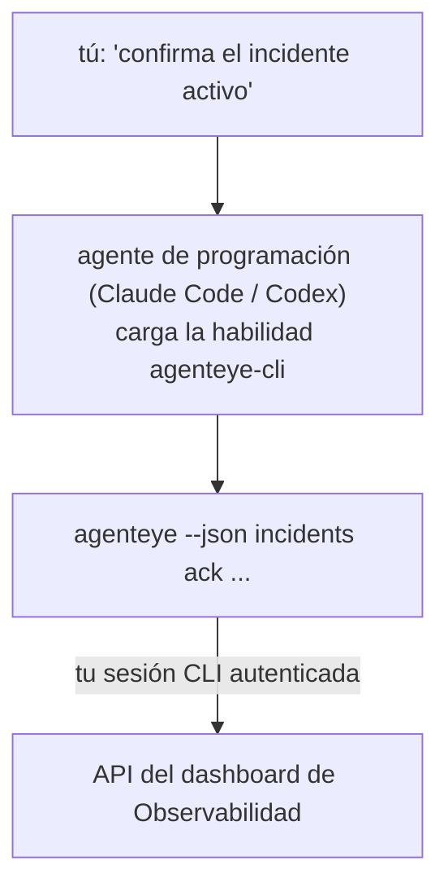

Pregúntale a tu agente de programación *«¿hay algo roto hoy?»* y deja que responda con tus datos en vivo de Observabilidad de Failproof AI, sin comandos que memorizar. La **habilidad CLI de Observabilidad de Failproof AI** (`agenteye-cli`) es una *Agent Skill*: una pequeña carpeta de instrucciones que un agente de programación como Claude Code o Codex carga bajo demanda. Le enseña al agente a operar tu despliegue de Observabilidad a través de la [CLI `agenteye`](/es/agenteye/cli) a partir de solicitudes en lenguaje natural como *«dale a CI una clave que solo pueda enviar eventos»* o *«confirma el incidente activo y asígnamelo»*.

**No** es un servicio ni un binario independiente; no hay nada que desplegar. Se apoya en la CLI que ya tienes instalada: el agente ejecuta `agenteye --json …`, analiza el JSON limpio y te responde en prosa. Todo lo que puede hacer, podrías hacerlo tú mismo escribiendo los mismos comandos.

---

## Relación con las otras interfaces de Observabilidad de Failproof AI

Observabilidad de Failproof AI te ofrece cuatro formas de acceder a los mismos datos y controles. Se complementan entre sí:

| Interfaz | Qué es | Dónde se ejecuta | Úsala cuando |
|---|---|---|---|
| **[CLI](/es/agenteye/cli)** | La referencia de comandos y flags para `agenteye` | Tu terminal | Quieres ejecutar o automatizar un comando específico |
| **[Recetas de CLI](/es/agenteye/cli-recipes)** | Patrones de `jq`/pipeline listos para copiar y pegar | Tu terminal / scripts | Estás integrando la CLI en automatizaciones |
| **Habilidad CLI** (este documento) | Una puerta de entrada en lenguaje natural a la CLI | Tu agente de programación, en tu estación de trabajo | Quieres *simplemente preguntar* y dejar que el agente elija el comando |
| **[Habilidad Evaluator](/es/agenteye/evaluator-skill)** | Una habilidad hermana que diseña y construye tu servicio de puntuación | Tu agente de programación, en tu estación de trabajo | Quieres *producir* puntuaciones de evaluación, no solo leerlas |
| **[Habilidad Python SDK](/es/agenteye/python-sdk-skill)** | Una habilidad hermana que instrumenta tu agente para que emita telemetría | Tu agente de programación, en tu estación de trabajo | Quieres que tu agente *produzca* los eventos que esta habilidad lee |
| **[Asistente de IA en el dashboard](/es/agenteye/assistant)** | Un chat integrado en el dashboard | En el servidor (dentro del dashboard) | Quieres hacer preguntas sobre tus datos directamente en el dashboard |

La habilidad no tiene privilegios propios; simplemente convierte tus palabras en llamadas a la CLI que se ejecutan como tú:



### vs. el asistente de IA en el dashboard: una distinción importante

Estas son dos herramientas distintas con radios de acción muy diferentes:

- El **asistente de IA en el dashboard** ([asistente de IA](/es/agenteye/assistant)) es un chat integrado en el dashboard, respaldado por el servicio de agente. Es **de solo lectura más creación con aprobación**: puede redactar consultas guardadas y dashboards, pero toda escritura se pausa para que la apruebes con un clic explícito, y nunca elimina nada. Está limitado por el permiso `agent:use` y solo accede a datos de la organización que estás visualizando.
- La **habilidad CLI** se ejecuta en *tu* estación de trabajo dentro de *tu* agente de programación y maneja la CLI `agenteye` como **tú**. Puede realizar la **superficie completa de la CLI, incluidas las mutaciones** (crear/rotar/deshabilitar claves de API, cambiar configuraciones de la organización, resolver incidentes, eliminar consultas guardadas), limitadas únicamente por los permisos de tu sesión CLI. Trátala con exactamente el mismo cuidado con el que ejecutarías esos comandos manualmente.

---

## Requisitos previos

1. La **CLI `agenteye` instalada** y en el `PATH` (consulta la referencia de la [CLI](/es/agenteye/cli): `pipx install agenteye`).
2. Tu **URL del dashboard** configurada (`AGENTEYE_DASHBOARD_URL`, o el agente usa `--base-url`).
3. Una **sesión iniciada**: ejecuta `agenteye login` tú mismo primero. La habilidad **no puede** completar el inicio de sesión con código de un solo uso enviado por correo electrónico; te indicará que ejecutes `agenteye login` si la sesión falta o expiró (código de salida CLI `4`).

---

## Dónde obtenerla

La habilidad está publicada en la colección pública de habilidades de Failproof AI:

**[github.com/FailproofAI/skills](https://github.com/FailproofAI/skills)** → [`skills/agenteye-cli/`](https://github.com/FailproofAI/skills/tree/main/skills/agenteye-cli)

No hay nada restringido: el repositorio es público y la habilidad no necesita credenciales propias, ya que solo maneja la CLI **pública** `agenteye` contra *tu* dashboard, usando la sesión con la que *tú* iniciaste sesión. No necesitas pedírsela a nadie.

Ten en cuenta que se distribuye como su propia carpeta y **no** está incluida en el paquete `pipx install agenteye`, así que no la busques ahí.

## Instalación de la habilidad

La forma más rápida es usar la CLI [`skills`](https://skills.sh), que descarga la carpeta y la coloca donde tu agente la busca:

```bash
# Claude Code, solo este proyecto
npx skills add FailproofAI/skills --skill agenteye-cli -a claude-code

# todos los proyectos (instala en ~/.claude/skills/)
npx skills add FailproofAI/skills --skill agenteye-cli -a claude-code -g --copy

# Codex en su lugar
npx skills add FailproofAI/skills --skill agenteye-cli -a codex
```

Luego adminístrala como cualquier otra habilidad:

```bash
npx skills list -a claude-code      # qué está instalado
npx skills update agenteye-cli      # obtener la última versión
npx skills remove agenteye-cli      # eliminarla
```

¿Prefieres instalarla manualmente? Una Agent Skill es simplemente una carpeta que contiene un `SKILL.md` (más referencias opcionales), por lo que copiarla también funciona:

- **Claude Code**: coloca la carpeta `agenteye-cli/` en `~/.claude/skills/` (todos los proyectos) o `<tu-repo>/.claude/skills/` (solo ese repositorio). Claude Code la descubre automáticamente — verifica con la lista `/skills`, o simplemente haz una pregunta que coincida con su descripción.
- **Codex (OpenAI)**: Codex lee el mismo `SKILL.md`. El archivo `agents/openai.yaml` incluido establece `allow_implicit_invocation: true`, por lo que Codex selecciona la habilidad automáticamente cuando una tarea coincide; de lo contrario, invócala explícitamente como `$agenteye-cli`.

---

## Seguridad: las mutaciones NO solicitan confirmación cuando un agente ejecuta la CLI

> **Advertencia:** Lee esto antes de permitir que un agente realice cambios.

La CLI `agenteye` normalmente pregunta *«¿estás seguro?»* antes de una acción destructiva. **Omite automáticamente esa confirmación cuando no está conectada a una terminal (que es exactamente cómo la ejecuta un agente de programación), y `--json` también la omite.** Por lo tanto, el aviso de seguridad **no** se activará para el agente.

La habilidad está escrita para compensar esto: tiene instrucciones de indicar el comando exacto que va a ejecutar y obtener tu **aprobación explícita antes de cualquier cambio de estado**. Mantén esa disciplina. Cuando manejas Observabilidad de Failproof AI a través de un agente, *tú* eres el paso de confirmación. Los comandos que modifican el estado que debes vigilar:

- `keys create` / `update` / `disable` / `regenerate`
- `users create` / `update` / `disable` / `enable`
- `settings set`
- `alerts create` / `update` / `delete` / `test`
- los subcomandos de escritura de `incidents`: `ack` / `assign` / `resolve` / `open` / `comment-add` / `comment-delete` / `subscribe` / `unsubscribe`
- `query create` / `update` / `delete`
- `agent rename` / `delete`
- `orgs switch`

Todo lo que está bajo **Observe** (`events`, `sessions`, `evals`, `errors`, `list`, `whoami`, `orgs list/current/perms`) es de solo lectura y no modifica nada.

Dado que el agente actúa como **tú**, solo puede hacer lo que tu inicio de sesión tiene permiso para hacer; los permisos se resuelven **por organización** (consulta [Claves de API](/es/agenteye/api-keys)). Un comando para el que no tienes permiso devuelve el código de salida `5` con el nombre exacto del permiso, de modo que el agente puede indicarte exactamente qué pedirle a un administrador en lugar de fallar de forma opaca.

---

## Qué puedes preguntarle

Así se ve un ciclo real completo: primero una lectura, luego un cambio que espera tu aprobación:

```text
tú    ▸ ¿Hay algo roto en el último día?

agente ▸ Ejecutando: agenteye --json errors --since 24h --aggregate
         3 tipos de errores en las últimas 24h. El mayor es TimeoutError
         (18 ocurrencias, todas en checkout-agent), luego RateLimited (5).
         ¿Quieres las sesiones fallidas de TimeoutError?

tú    ▸ Dale a CI una clave que solo pueda enviar eventos.

agente ▸ Esto crea una clave de API. Ejecutaré:
           agenteye keys create ci --add events:add
         ¿Procedo?

tú    ▸ sí

agente ▸ Listo. Clave "ci" creada solo con events:add.
         El secreto se muestra una sola vez, guárdalo ahora. No puedo volver a mostrarlo.
```

La habilidad mapea cada intención en lenguaje natural al comando `agenteye` correcto, descubriendo primero los valores válidos (`list <kind>`, `whoami`) para no adivinar, e indicando el comando exacto antes de cualquier cambio. Más ejemplos:

- *«¿Hay algo roto o fallando en las últimas 24 horas?»* → `errors --since 24h --aggregate`, luego un desglose.
- *«¿Por qué falló la sesión `run-001`?»* → `events --session-id run-001 --all` + `evals --session-id run-001`.
- *«¿Cómo va la calidad esta semana?»* → `evals --aggregate --since 7d`, luego se profundiza en las ejecuciones con puntuación baja.
- *«Dale a CI una clave que solo pueda enviar eventos.»* → `keys create ci --add events:add` (indica el comando, luego lo crea y captura el secreto de un solo uso).
- *«¿Quién tiene acceso? Pon a Dana como solo lectura.»* → `users list` → `users update dana@… --permission-set read-only` (tras confirmar contigo).
- *«Confirma el incidente activo y asígnamelo.»* → `incidents list --state firing` → `incidents ack <id>` / `incidents assign <id> tu@…`.

Para los comandos exactos, flags y estructuras JSON detrás de todo esto, consulta la referencia de la [CLI](/es/agenteye/cli) y las [recetas de CLI para agentes](/es/agenteye/cli-recipes).

---

## Próximos pasos

- **[CLI](/es/agenteye/cli)**: referencia completa de comandos y flags para `agenteye`.
- **[Recetas de CLI para agentes](/es/agenteye/cli-recipes)**: patrones de `jq` listos para copiar y pegar, y manejo de códigos de salida.
- **[Habilidad del agente Evaluator](/es/agenteye/evaluator-skill)**: la habilidad hermana, para construir el evaluador cuyas puntuaciones lee `agenteye evals`.
- **[Habilidad del agente Python SDK](/es/agenteye/python-sdk-skill)**: la habilidad hermana, para instrumentar un agente de modo que emita la telemetría que lee `agenteye`.
- **[Asistente de IA](/es/agenteye/assistant)**: el asistente integrado en el dashboard (no debe confundirse con esta habilidad de terminal).
- **[Claves de API](/es/agenteye/api-keys)**: el modelo de permisos por organización que delimita lo que puede hacer la habilidad.