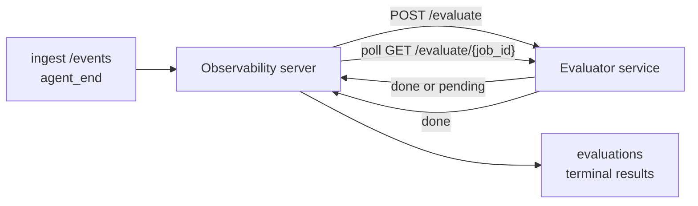

Failproof AI Observability puede puntuar automáticamente cada ejecución finalizada de un agente en términos de calidad: tú proporcionas un pequeño servicio de puntuación y Observability se encarga del resto. Úsalo para hacer seguimiento de las dimensiones que te importan (utilidad, eficiencia de herramientas, veracidad, seguridad; tú decides), detectar regresiones a tiempo y comparar agentes o entornos de un vistazo. La puntuación es opcional: el pipeline no hace nada hasta que configures `EVALUATOR_ENDPOINT` en el servidor.

> **Nota:** Tú defines las dimensiones de puntuación. Tu evaluador puede devolver cualquier clave numérica que desees; Observability almacena, analiza tendencias y muestra lo que le envíes.

## Resumen rápido

1. **Escribe un evaluador.** Levanta un pequeño servicio HTTP que lea una transcripción de sesión y devuelva puntuaciones. Observability incluye una referencia funcional que puedes copiar. Consulta [Escribir un evaluador con el SDK](#writing-an-evaluator-with-the-sdk).
2. **Apunta Observability hacia él.** Configura `EVALUATOR_ENDPOINT` (y un `EVALUATOR_TOKEN` compartido) en el proceso del servidor.
3. **Observa cómo llegan las puntuaciones.** Cada sesión completada se puntúa automáticamente; los resultados aparecen en la página de detalle de sesión, la cuadrícula de sesiones y los paneles guardados.


*Una vez configurado un evaluador, cada ejecución completada se puntúa y los resultados aparecen en el panel lateral derecho de la sesión: el resumen en la parte superior, seguido de barras de puntuación por dimensión con el razonamiento correspondiente.*

---

## Cómo funciona



Cuando el SDK de Observability emite un evento `agent_end` para una sesión, el servidor
programa una evaluación. Luego envía un POST con la transcripción completa de eventos a tu
servicio evaluador, que puede:

- **Devolver el resultado de forma inmediata** con `{"status":"done", "scores":{...}, "reasoning":{...}, "summary":"..."}`. El
  resultado se añade a la línea de tiempo de evaluación de la sesión. `reasoning` y
  `summary` son opcionales.
- **Diferir** con `{"status":"pending", "job_id":"abc-123"}`. Observability entonces
  llama a `GET {EVALUATOR_ENDPOINT}/evaluate/abc-123` hasta que tu evaluador
  devuelva `{"status":"done", ...}` o `{"status":"error", "error":"..."}`.

  La cadencia de sondeo es por trabajo: una respuesta `pending` puede incluir
  `next_poll_secs` para sobrescribirla; de lo contrario, Observability usa el valor
  `default_poll_interval_secs` de `GET /config`; si tampoco está disponible, el servidor
  recurre a `EVALUATOR_POLLING_INTERVAL_SECS` (por defecto 10s). Todos los valores
  se limitan al rango [1s, 1h].

Las sesiones que nunca emiten `agent_end` (por ejemplo, un proceso de agente que falló)
también pueden procesarse: el `GET /config` del evaluador puede devolver
`{"inactivity_timeout_secs": 1800}`, y Observability evaluará cualquier sesión
que haya estado inactiva durante ese tiempo. Establece el campo en `null` u omítelo para
deshabilitar este comportamiento de reserva.

El pipeline es completamente inactivo cuando `EVALUATOR_ENDPOINT` no está configurado.

Una sesión puede acumular **múltiples evaluaciones terminales a lo largo del tiempo**: cada
evento `agent_end` (y cada re-evaluación manual desde el panel) añade una
nueva fila de evaluación. Esta es la forma recomendada de evaluar una conversación reanudada:
un usuario termina un agente, regresa más tarde, envía más eventos,
termina el agente de nuevo, y una segunda evaluación se ejecuta contra la transcripción completa actualizada.
El panel muestra la evaluación más reciente como titular y las anteriores como una línea de tiempo colapsable. Mientras una
evaluación está en curso para una sesión, los eventos `agent_end` adicionales para esa
sesión se ignoran; el siguiente evento tras completarse la evaluación en curso
pondrá en cola una nueva evaluación de la manera habitual.

La reserva por inactividad también se reactiva en sesiones reanudadas: si llegan nuevos eventos
después de una evaluación terminal anterior y la sesión luego queda inactiva
más allá de `inactivity_timeout_secs`, se encola una nueva evaluación.

Los fallos transitorios (5xx, 429, tiempos de espera agotados, errores de red) se reintentan con
retroceso exponencial hasta `EVALUATOR_MAX_ATTEMPTS`; las respuestas 4xx son
terminales. Observability es seguro para ejecutarse con múltiples instancias de servidor escaladas horizontalmente;
el trabajo se distribuye de forma que la misma sesión nunca se procese
dos veces de forma concurrente.

---

## Contrato HTTP

Todas las rutas autenticadas usan **autenticación por token Bearer**. El mismo valor debe estar
configurado en ambos lados:

- Servidor de Observability: variable de entorno `EVALUATOR_TOKEN`
- Servicio evaluador: configurado de la misma manera (el SDK `agenteye-evaluator`
  lee `EVALUATOR_TOKEN` por convención)

Si `EVALUATOR_TOKEN` no está configurado, el servidor no envía ningún encabezado `Authorization`; el
evaluador puede entonces aceptar solicitudes anónimas, lo cual está bien para una
red interna, pero no se recomienda en internet público.

### Rutas que el evaluador debe servir

| Ruta | Cuerpo / parámetros | Respuesta |
|---|---|---|
| `GET /health` | ninguno | `{"status":"ok"}` (abierto, sin autenticación) |
| `GET /config` | ninguno | `{"inactivity_timeout_secs": <int> \| null, "default_poll_interval_secs": <int> \| omitted}` |
| `POST /evaluate` | JSON `EvalRequest` | `{"status":"done", ...}` o `{"status":"pending", "job_id":"..."}` |
| `GET /evaluate/{id}` | ninguno | misma forma de respuesta que `/evaluate` |

### Cuerpo `EvalRequest` enviado por el servidor

```json
{
  "schema_version": "1",
  "session_id":     "session-abc123",
  "agent_id":       "planner",
  "environment":    "production",
  "started_at":     "2026-05-10T12:00:00Z",
  "ended_at":       "2026-05-10T12:05:00Z",
  "events": [
    { "id": 1234, "ts": "...", "event_type": "agent_start", "payload": { ... } },
    ...
  ]
}
```

### Formas de respuesta

**Síncrona (done):**

```json
{
  "status": "done",
  "scores": { "helpfulness": 0.85, "tool_efficiency": 0.6 },
  "reasoning": {
    "helpfulness": "answered the question directly with citations",
    "tool_efficiency": "called list_files three times when one would have done"
  },
  "summary": "strong answer quality, weak tool selection"
}
```

`reasoning` (un mapa de justificación por puntuación) y `summary` (una narrativa general
de un párrafo) son ambos opcionales. Las claves en `reasoning` deben
coincidir con las claves en `scores`; el panel muestra cada entrada debajo
de su barra de puntuación. Los evaluadores más antiguos que solo devuelven `scores` siguen
funcionando sin cambios; `reasoning` y `summary` simplemente se leen como null y
los elementos de interfaz correspondientes se omiten.

**Asíncrona (diferida):**

```json
{ "status": "pending", "job_id": "abc-123", "next_poll_secs": 30 }
```

`next_poll_secs` es opcional; si se omite, el servidor recurre al
`default_poll_interval_secs` del evaluador desde `/config`, luego a su propia
variable de entorno `EVALUATOR_POLLING_INTERVAL_SECS`.

**Error terminal del evaluador:**

```json
{ "status": "error", "error": "model service unavailable" }
```

El servidor trata cualquier otro cuerpo 2xx como un error de protocolo y registra un
`error` terminal para la sesión.

---

## Escribir un evaluador con el SDK

No tienes que implementar el contrato HTTP manualmente. El paquete Python `agenteye-evaluator`
te ofrece un wrapper de FastAPI tipado que gestiona la autenticación, el enrutamiento y
las formas de solicitud/respuesta por ti.

Failproof AI Observability también incluye un **evaluador de referencia funcional** que
puntúa `helpfulness`, `tool_efficiency` y `factuality` a partir de la estructura de la
transcripción. Cópialo como punto de partida y sustituye la lógica por la tuya propia: un juez LLM,
un motor de reglas, lo que mejor se adapte a tus criterios de calidad.

Evaluador mínimo viable:

```python
import os
from agenteye_evaluator import Evaluator, EvalRequest, EvalResponse

app = Evaluator(token=os.environ["EVALUATOR_TOKEN"])

@app.evaluator
def run(req: EvalRequest) -> EvalResponse:
    # Inspect req.events (the full session transcript) and return scores.
    tool_calls = sum(1 for e in req.events if e.event_type == "tool_use")
    return EvalResponse(
        scores={"tool_calls": float(tool_calls)},
        reasoning={"tool_calls": f"{tool_calls} tool invocations in the transcript"},
        summary="tight tool loop" if tool_calls < 5 else "agent looped on tools",
    )
```

La instancia `app` se ejecuta bajo cualquier servidor ASGI, por lo que `uvicorn module:app` la inicia.

Para evaluadores que necesitan diferir trabajo costoso, devuelve `JobPending`
en su lugar y registra un manejador `@app.job_lookup`; el servidor de Observability
sondea `GET /evaluate/{job_id}` hasta que devuelves un estado terminal o se agota
el límite `EVALUATOR_MAX_POLL_DURATION_SECS` (por defecto 1 h).

La referencia completa de la API, el patrón asíncrono y el esquema de eventos están documentados en el
README del SDK `agenteye-evaluator`.

---

## Ejecutar tu evaluador

El evaluador es **tu servicio** — Failproof AI Observability no incluye un
evaluador por defecto, así que debes construirlo y ejecutarlo donde ejecutas tus propios servicios.
Se ejecuta bajo cualquier servidor ASGI (por ejemplo `uvicorn my_evaluator:app`); sirve
las rutas `/health`, `/config` y `/evaluate` del
[contrato HTTP](#http-contract), luego apunta el servidor hacia él (consulta
[Configurar el servidor](#configuring-the-server)).

Una vez que el evaluador sea accesible, `GET /health` devuelve `{"status":"ok"}`. Después
de que un agente se ejecute de extremo a extremo, `GET /evaluations` en el servidor devuelve una fila con
`status: "done"` y las puntuaciones que produjo tu evaluador.

---

## Configurar el servidor

Configura en el proceso del servidor:

| Variable de entorno | Significado |
|---|---|
| `EVALUATOR_ENDPOINT` | URL base de tu evaluador (`http://evaluator:9000`). Sin configurar = pipeline deshabilitado. |
| `EVALUATOR_TOKEN` | Token Bearer. Debe ser igual al valor con el que está configurado el servicio evaluador. |
| `EVALUATOR_WORKERS` | Tareas de trabajo por instancia de servidor (por defecto 2). |
| `EVALUATOR_CLAIM_BATCH` | Filas reclamadas por ciclo de trabajo (por defecto 4). Los lotes se procesan **de forma concurrente**; la concurrencia efectiva en tu endpoint evaluador es `EVALUATOR_WORKERS × EVALUATOR_CLAIM_BATCH`. |
| `EVALUATOR_POLL_IDLE_SECS` | Tiempo que duerme un worker entre intentos de despacho cuando no hay evaluación pendiente (por defecto 2s). |
| `EVALUATOR_POLLING_INTERVAL_SECS` | Reserva final para la cadencia de `GET /evaluate/{id}` cuando no están configurados ni el `next_poll_secs` por respuesta ni el `default_poll_interval_secs` del evaluador (por defecto 10s). |
| `EVALUATOR_REQUEST_TIMEOUT_MS` | Tiempo de espera por solicitud (por defecto 30000). |
| `EVALUATOR_MAX_ATTEMPTS` | Tras este número de fallos transitorios, el resultado se registra como `error` terminal (por defecto 5). |
| `EVALUATOR_CONFIG_REFRESH_SECS` | Cadencia de `GET /config` (por defecto 300). |
| `EVALUATOR_MAX_POLL_DURATION_SECS` | Tiempo máximo de reloj que una sesión puede permanecer en la cola de sondeo antes de terminar como `timeout` (por defecto 3600s). Protege contra un evaluador que siga devolviendo `pending` indefinidamente. |

Para activar la puntuación automática, configura tanto `EVALUATOR_ENDPOINT` como
`EVALUATOR_TOKEN` en el servidor y reinícialo para que tome los cambios. Con
`EVALUATOR_ENDPOINT` sin configurar, el pipeline permanece inactivo.

Los controles de ajuste anteriores son opcionales; configura las variables de entorno
correspondientes en el servidor solo si necesitas sobreescribir los valores por defecto.

---

## Referencia de la API

| Método | Ruta | Permiso requerido | Propósito |
|---|---|---|---|
| `GET` | `/evaluations` | `evaluations:read` | Consultar resultados terminales. Admite `session_id`, `agent_id`, `environment`, `status` (`done`/`error`/`timeout`), `ts_from`, `ts_to`, `cursor`, `limit`, `score_filters`, `latest_per_session`. `limit` tiene un valor por defecto de 50 y un máximo de 200 (ten en cuenta que esto difiere de `/events`, que tiene un máximo de 1000). `environment` acepta una lista separada por comas (p. ej. `environment=prod,staging`); los valores individuales también funcionan. Con `latest_per_session=true` la respuesta contiene como máximo una fila por `session_id` (la más reciente según `completed_at`), utilizada por la página de lista de sesiones para colapsar la línea de tiempo de evaluación de una sesión a su titular actual. Por defecto es false (devuelve el historial completo). |
| `GET` | `/evaluations/aggregate` | `evaluations:read` | Estado de salud de evaluación agrupado para un subconjunto filtrado: recuento total, desglose por done/error/timeout, estadísticas por clave de puntuación (count/avg/min/max/p50 sobre las claves arbitrarias de `scores`), y una línea de tiempo agrupada por tiempo. Acepta los **mismos parámetros de filtro que `/evaluations`** más `featured_keys` (CSV de claves de puntuación a seguir) y `latest_per_session`. Impulsa la funcionalidad de Paneles; las métricas son exactas sobre todo el conjunto coincidente, sin muestreo. |
| `GET` | `/evaluations/environments` | `evaluations:read` | Valores de entorno distintos de la tabla `evaluations`. Se usa para rellenar los desplegables de filtro con alcance a los datos legibles por evaluación. |
| `GET` | `/evaluation-jobs` | `evaluations:read` | Visibilidad sobre las evaluaciones en curso. Filtra por `status` (`pending`/`polling`). |
| `GET` | `/events` | `events:read` | Transmitir los eventos brutos de una sesión. Admite `session_id`, `agent_id`, `event_type` (CSV), `environment` (CSV), `ts_from`, `ts_to`, `cursor`, `limit` y `order`. `order` es `desc` (más reciente primero, el valor por defecto) o `asc` (más antiguo primero); un valor no reconocido vuelve a `desc`. Pagina con cursor mediante el `next_cursor` de la respuesta (un id de evento): pásalo como `cursor` para obtener la siguiente página; con `asc` la siguiente página son los eventos después de ese id, con `desc` los eventos antes. `limit` tiene un valor por defecto de 50 y un máximo de 1000. |
| `GET` | `/sessions/:session_id/export` | `events:read` | Devuelve el cuerpo JSON exacto que recibiría el evaluador para esta sesión, servido como un adjunto descargable llamado `session-<id>.json`. Útil para reproducir sesiones de producción a través de `agenteye-evaluator` para pruebas sin conexión. Los bytes son idénticos a lo que envía el pipeline del evaluador. |
| `POST` | `/sessions/:session_id/re-evaluate` | `evaluations:trigger` | Encolar una nueva evaluación para una sesión; se ejecuta independientemente de si existe una evaluación anterior. El nuevo resultado se **añade** a la línea de tiempo de evaluación de la sesión en lugar de sobrescribir el anterior, por lo que las puntuaciones previas permanecen visibles como historial. Devuelve `202` al encolar, `404` para una sesión desconocida, `409` si ya hay una evaluación en curso. Úsalo después de desplegar un nuevo evaluador o para sesiones que nunca emitieron `agent_end`. |

### Filtrar por rango de puntuación: `score_filters`

`GET /evaluations` acepta un parámetro opcional `score_filters` que
restringe los resultados por valores numéricos dentro del objeto `scores`. El
parámetro es una lista separada por comas de entradas `key:min..max`; cualquiera de
los límites puede omitirse. Varias entradas se combinan con AND lógico. Las filas
donde la clave indicada está ausente o no es numérica se excluyen. Una solicitud puede
contener como máximo 20 entradas de filtro; superarlo devuelve HTTP 400.

Ejemplos:
```text
# helpfulness en [0.5, 0.8]
GET /evaluations?score_filters=helpfulness:0.5..0.8

# tool_efficiency como máximo 0.3 (sin límite inferior)
GET /evaluations?score_filters=tool_efficiency:..0.3

# helpfulness >= 0.5 AND factuality >= 0.9
GET /evaluations?score_filters=helpfulness:0.5..,factuality:0.9..
```

Cada objeto de respuesta de `/evaluations` tiene estos campos:

| Campo | Tipo | Notas |
|---|---|---|
| `evaluation_id` | string (UUID) | El identificador canónico de esta evaluación terminal. Cada evaluación terminal recibe un nuevo UUID; una sola sesión puede tener múltiples. |
| `id` | string (UUID) | Alias de compatibilidad hacia atrás que lleva el mismo valor que `evaluation_id`. |
| `session_id` | string | La sesión contra la que se ejecutó esta evaluación. Una sesión puede tener múltiples evaluaciones en la línea de tiempo. |
| `agent_id` | string | Identifica al agente que produjo la sesión. |
| `environment` | string | Etiqueta de entorno copiada de la sesión. |
| `status` | enum | Uno de `"done"`, `"error"`, `"timeout"`. |
| `scores` | object \| null | Puntuaciones devueltas por tu evaluador. |
| `reasoning` | object \| null | Mapa de justificación opcional por puntuación devuelto por tu evaluador. Las claves normalmente coinciden con las de `scores`. El panel muestra cada entrada debajo de su barra de puntuación. |
| `summary` | string \| null | Narrativa general opcional de un párrafo devuelta por tu evaluador. El panel la muestra encima del desglose por puntuación como el titular de la evaluación. |
| `error` | string \| null | Se rellena solo en `"error"` / `"timeout"`. |
| `attempt_count` | integer | Número de intentos de despacho (≥ 1). |
| `duration_ms` | integer \| null | Duración del intento final. |
| `completed_at` | string (ISO 8601 UTC) | Cuándo se registró el resultado terminal. Los resultados se ordenan por `completed_at` (más reciente primero). |
| `created_at` | string (ISO 8601 UTC) | Lleva la misma marca de tiempo que `completed_at` (semántica de escritura única). |

---

## Permisos

| Permiso | Otorga |
|---|---|
| `evaluations:read` | Listar resultados de evaluación, ver puntuaciones en el panel y cargar métricas de salud del panel. |
| `evaluations:trigger` | Encolar manualmente una evaluación para una sesión mediante `POST /sessions/:session_id/re-evaluate` o el botón de re-evaluar del panel. |
| `dashboards:read` | Ver paneles guardados (también necesita `evaluations:read` para cargar sus métricas). |
| `dashboards:write` | Crear y editar paneles. |
| `dashboards:delete` | Eliminar paneles. |

El administrador de arranque (`ADMIN_KEY`, `ADMIN_EMAIL`) recibe estos permisos automáticamente.

---

## Ver resultados

- **`/sessions/<id>`**: línea de tiempo de eventos + un panel lateral derecho que muestra las
  puntuaciones de la sesión y cualquier error del intento de despacho. Si tu clave tiene
  `evaluations:trigger`, aparece un botón de **re-evaluar** junto al botón de exportar,
  útil para sesiones que nunca emitieron `agent_end`, o para
  actualizar puntuaciones después de desplegar un nuevo evaluador. El panel sondea en busca del
  nuevo resultado y actualiza el panel lateral cuando llega.
- **`/sessions`**: cuadrícula de sesiones filtrable; la columna de puntuación muestra el
  estado de evaluación y las puntuaciones de cada sesión de un vistazo.
- **`/dashboards`**: vistas guardadas de salud de evaluación (consulta [Paneles](#dashboards) a continuación).


*La cuadrícula de sesiones muestra el estado de evaluación y las puntuaciones de cada ejecución de un vistazo; las insignias en rojo/ámbar/verde hacen que las puntuaciones bajas destaquen.*

---

## Paneles

La página de **Paneles** (`/dashboards`) te permite guardar una combinación de filtros de evaluación
como una vista con nombre y reutilizable, y observar cómo está ese subconjunto de evaluaciones
de un vistazo. Los paneles son **compartidos en toda tu organización**;
todos los que tienen `dashboards:read` ven el mismo conjunto.

Cada panel fija:

- **Filtros**: los mismos controles que la página de sesiones: entorno, estado,
  agente, una ventana de tiempo deslizante y filtros de rango de puntuación (`key:min..max`).
- **Una configuración de visualización**: qué claves de puntuación destacar, los umbrales de salud
  verde/ámbar/rojo, qué paneles mostrar, y si colapsar a la evaluación más reciente
  por sesión.

Cada tarjeta muestra el número de sesiones coincidentes, un desglose por done/error/timeout,
el promedio de cada puntuación destacada y una pequeña línea de tendencia. Abrir un
panel muestra los paneles a tamaño completo; **"abrir en sesiones"** te lleva a la
página de sesiones pre-filtrada exactamente para ese subconjunto. Las métricas se calculan
en el servidor sobre todo el conjunto coincidente (mediante `GET /evaluations/aggregate`), por lo que
los números son exactos y no están muestreados.


**Permisos:** ver requiere tanto `dashboards:read` como `evaluations:read`;
crear y editar requiere `dashboards:write`; eliminar requiere `dashboards:delete`.
El administrador de arranque recibe todos estos permisos automáticamente.

---

## Solución de problemas

**Existen sesiones pero no se crean evaluaciones.** Confirma que `EVALUATOR_ENDPOINT`
está configurado en el proceso del servidor, que el servidor y el evaluador comparten el mismo
valor de `EVALUATOR_TOKEN`, y que el endpoint `/health` del evaluador es
accesible desde el servidor. Con `EVALUATOR_ENDPOINT` sin configurar, el pipeline está inactivo.

**Las evaluaciones en curso se acumulan.** Consulta `GET /evaluation-jobs` para ver la
cola en curso. Inspecciona `attempt_count`, `next_attempt_at` y `last_error`
en cada fila. Causas comunes: servicio evaluador inaccesible o devolviendo 5xx
(reintentado con retroceso), `EVALUATOR_TOKEN` incorrecto (401 es terminal), o un
evaluador asíncrono que devuelve `pending` indefinidamente (consulta a continuación).

**Las sesiones se completaron pero no hay evaluación terminal.** Consulta
`GET /evaluation-jobs?status=polling`; el resultado puede seguir en curso.
Si un trabajo está atascado en `pending`, el servidor tiene problemas para alcanzar el
evaluador; comprueba que el evaluador esté activo y que `EVALUATOR_TOKEN` coincida.

**`HTTP 401 from evaluator: invalid bearer token`.** El `EVALUATOR_TOKEN`
en el servidor no coincide con el valor con el que está configurado el servicio evaluador.
Deben ser idénticos.

**El evaluador asíncrono devuelve `pending` indefinidamente.** El servidor sondea
`GET /evaluate/{job_id}` hasta que el evaluador devuelve `done` o `error`, o
hasta que se agota `EVALUATOR_MAX_POLL_DURATION_SECS` (por defecto 1 h). Tras el límite,
la evaluación se registra como `timeout` y se elimina de la cola en curso.
Aumenta `EVALUATOR_MAX_POLL_DURATION_SECS` si tu evaluador legítimamente necesita
más tiempo que el valor por defecto.

---

## Próximos pasos

- [Habilidad de agente evaluador](/es/agenteye/evaluator-skill): haz que un agente de codificación diseñe tus dimensiones con sesiones reales y construya este servicio por ti.
- [SDK de Python](/es/agenteye/python-sdk): emite los eventos `agent_end` que desencadenan la puntuación.
- [Claves de API](/es/agenteye/api-keys): los permisos `evaluations:read` y `evaluations:trigger`.
- [Auditorías](/es/agenteye/audits): la otra funcionalidad de calidad automatizada de Observability, para revisión basada en políticas.