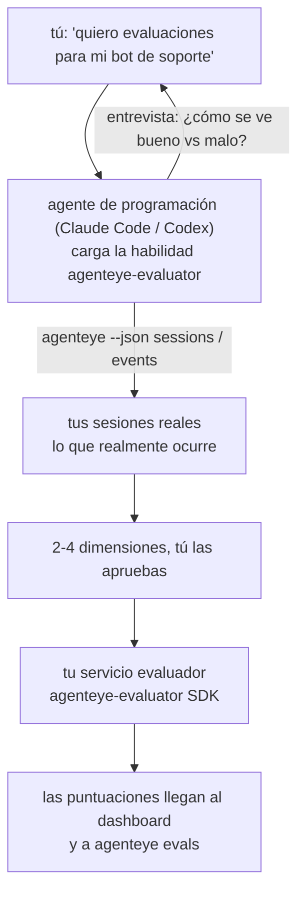

Pasa de *«creo que nuestro agente a veces falla»* a un servicio de puntuación desplegado, con tu agente de programación tomando las decisiones y construyéndolo. La **habilidad de evaluador de Observabilidad de Failproof AI** (`agenteye-evaluator`) es una *Agent Skill*: una pequeña carpeta de instrucciones que un agente de programación como Claude Code o Codex carga bajo demanda. Enseña al agente a determinar qué dimensiones de calidad vale la pena rastrear para *tu* agente, y luego a escribir, probar y desplegar el [servicio evaluador](/es/agenteye/evaluation-suite) que las puntúa.

**No** es un evaluador alojado, un registro al que subir archivos ni un sistema de plugins. Tu evaluador sigue siendo tu propio servicio HTTP en tu propia infraestructura, exactamente como se describe en la guía de la [Evaluation suite](/es/agenteye/evaluation-suite). La habilidad solo enseña a tu agente a construirlo bien, de modo que todo lo que hace, tú podrías hacerlo escribiendo el mismo código.

---

## La parte difícil es decidir qué puntuar

La superficie del SDK es pequeña — un decorador y dos modelos — y un agente puede escribirla a partir del [contrato](/es/agenteye/evaluation-suite#http-contract) por sí solo. El problema no está ahí. Los evaluadores fallan porque puntúan las cosas equivocadas, y uno que puntúa lo incorrecto es peor que ninguno: produce un dashboard que todos aprenden a ignorar.

Por eso la mayor parte de la habilidad corresponde a la fase previa a que exista cualquier código. El agente te entrevista (*«describe una ejecución que salió bien; ahora una que salió mal»*), luego extrae tus sesiones reales mediante la [CLI `agenteye`](/es/agenteye/cli) y las lee de principio a fin. Ambas mitades suelen discrepar, y esa brecha es precisamente el punto: lo que pretendes medir versus lo que tus transcripciones pueden realmente sustentar. Una dimensión solo sobrevive si es **computable** a partir de los eventos y **discriminante** — si puntúa 0,9 tanto en tu ejecución buena como en la mala, no enseña nada y se elimina.

El resultado es una propuesta de 2-4 dimensiones con el razonamiento adjunto, para que la apruebes antes de que se escriba una sola línea.



---

## Cómo se relaciona con las otras piezas de evaluación

Cuatro documentos cubren la puntuación, y se encadenan en orden:

| Página | Qué es | Úsala cuando |
|---|---|---|
| **[Evaluations](/es/agenteye/evaluations)** | La funcionalidad: puntuaciones en la cuadrícula de sesiones, dashboards, re-evaluar | Quieres saber qué te ofrece la puntuación automática |
| **[Evaluation suite](/es/agenteye/evaluation-suite)** | El contrato HTTP, el SDK, las variables de entorno del servidor | Estás implementando o depurando el evaluador tú mismo |
| **Evaluator skill** (este doc) | Una puerta de entrada en lenguaje natural para diseñar *y* construir el evaluador | Quieres pasar de «quiero evaluaciones» a un servicio en marcha |
| **[CLI skill](/es/agenteye/cli-skill)** | Una puerta de entrada en lenguaje natural para la CLI `agenteye` | Quieres *leer* las puntuaciones que ya tienes |
| **[Python SDK skill](/es/agenteye/python-sdk-skill)** | Una puerta de entrada en lenguaje natural para instrumentar tu agente | Tu agente aún no emite sesiones — no hay nada que puntuar |

### vs. la CLI skill: construir frente a leer

Las dos habilidades están deliberadamente separadas, e instalar ambas es la configuración habitual — el agente elige entre ellas según lo que le pidas:

- **`agenteye-evaluator`** (este doc) construye lo que *produce* puntuaciones. Su trabajo termina cuando las puntuaciones llegan por primera vez.
- **[`agenteye-cli`](/es/agenteye/cli-skill)** lee las puntuaciones que ya existen (`agenteye evals`). *«¿Bajó la calidad esta semana?»* es su pregunta, no la de esta habilidad.

---

## Requisitos previos

1. La **CLI `agenteye` instalada y con sesión iniciada** (`pipx install agenteye`, luego `agenteye login`). La habilidad la utiliza en dos momentos: para extraer las sesiones reales sobre las que diseña, y para confirmar que tus puntuaciones llegaron al final. Tu sesión necesita `events:read`, más `evaluations:read` para esa verificación final. Al igual que con la CLI skill, **no puede** completar el inicio de sesión con código de un solo uso enviado por correo electrónico en tu lugar.
2. **Un lugar donde alojar el evaluador.** Se construye en una imagen y se ejecuta como un servicio de larga duración, por lo que necesita un repositorio real, no un archivo temporal. Los evaluadores suelen vivir en su propio repositorio, separado del agente que se puntúa — la habilidad busca uno existente y pregunta antes de crear uno nuevo.
3. **La rueda del SDK `agenteye-evaluator`** — lee la siguiente sección antes de que tu agente empiece a escribir comandos `pip`.

---

## Dónde obtenerla

La habilidad está publicada en la colección pública de habilidades de Failproof AI:

**[github.com/FailproofAI/skills](https://github.com/FailproofAI/skills)** → [`skills/agenteye-evaluator/`](https://github.com/FailproofAI/skills/tree/main/skills/agenteye-evaluator)

El repositorio es público y la habilidad no necesita credenciales propias — solo usa la CLI `agenteye` con la sesión *tuya* y escribe código en *tu* repositorio. Ten en cuenta que se distribuye como su propia carpeta y **no** está incluida en el paquete `pipx install agenteye`, así que no la busques ahí.

## Instalación de la habilidad

La vía más rápida es la CLI [`skills`](https://skills.sh), que descarga la carpeta y la coloca donde tu agente la busca:

```bash
# Claude Code, solo este proyecto
npx skills add FailproofAI/skills --skill agenteye-evaluator -a claude-code

# todos los proyectos (instala en ~/.claude/skills/)
npx skills add FailproofAI/skills --skill agenteye-evaluator -a claude-code -g --copy

# Codex en su lugar
npx skills add FailproofAI/skills --skill agenteye-evaluator -a codex
```

Luego adminístrala como cualquier otra habilidad:

```bash
npx skills list -a claude-code           # qué hay instalado
npx skills update agenteye-evaluator     # descargar la última versión
npx skills remove agenteye-evaluator     # eliminarla
```

¿Prefieres instalar manualmente? Una Agent Skill es simplemente una carpeta que contiene un `SKILL.md` (más referencias opcionales), así que copiarla también funciona:

- **Claude Code**: coloca la carpeta `agenteye-evaluator/` en `~/.claude/skills/` (todos los proyectos) o `<tu-repo>/.claude/skills/` (solo ese repositorio). Claude Code la detecta automáticamente — verifícalo con la lista `/skills`, o simplemente pide evaluaciones.
- **Codex (OpenAI)**: Codex lee el mismo `SKILL.md`. El archivo `agents/openai.yaml` incluido establece `allow_implicit_invocation: true`, por lo que Codex selecciona la habilidad automáticamente cuando una tarea coincide; de lo contrario, invócala explícitamente como `$agenteye-evaluator`.

---

## El SDK no está en el PyPI público

> **Advertencia:** Lee esto antes de dejar que un agente instale el SDK.

La habilidad es pública; el SDK que utiliza no lo es. `agenteye-evaluator` solo se distribuye como artefacto de lanzamiento privado y, a diferencia de `agenteye`, el nombre está **sin reclamar en el PyPI público** — por lo que un simple `pip install agenteye-evaluator` podría instalar el paquete de un desconocido en el servicio que lee tus transcripciones de producción. Eso es un problema de cadena de suministro, no un error tipográfico.

La habilidad lo sabe y en su lugar sigue una escalera de instalación, deteniéndose en el primer peldaño que aplique: la fuente del monorepo si estás dentro del repositorio de AgentEye, de lo contrario la rueda de lanzamiento privada desde GitHub Releases (requiere acceso), y si ninguna es accesible **se detiene y te indica que pidas la rueda a tu contacto de Failproof AI** en lugar de improvisar.

Por eso, si tu agente propone un simple `pip install agenteye-evaluator` desde el PyPI público, esa es la señal de que la habilidad nunca se cargó. Para ahí y verifica que esté instalada.

---

## Qué puedes pedirle

Una vuelta completa comienza con una petición vaga y termina con un diseño aprobado, no con código:

```text
tú    ▸ Quiero evaluaciones para nuestro bot de soporte. Creo que a veces falla.

agente▸ Antes de escribir nada: describe una ejecución que salió bien,
        y una que salió mal.

tú    ▸ Bien: responde desde la documentación. Mal: se inventa cosas,
        o se rinde y dice «contacta con soporte».

agente▸ Ejecutando: agenteye --json sessions --status error --since 7d
        Leyendo 5 sesiones, incluyendo dos que considerarías malas.

        Tus palabras dicen factualidad y evasión. Las transcripciones
        coinciden en evasión (2 de 5 terminan con una derivación a soporte,
        y es evidente en model_response.content), pero factualidad
        necesita una verdad de referencia que tus eventos no contienen.

        Así que puntuaría tres cosas:
          - deflection      reglas, barato, separa tus dos ejecuciones
          - tool_efficiency reglas, detecta el bucle de reintentos en run-004
          - groundedness    juez LLM: ¿cada afirmación está en los docs recuperados?

        «factuality» necesitaría una verdad de referencia que no tenemos; groundedness
        es lo más cercano que tus transcripciones pueden realmente sustentar.
        ¿De acuerdo con esos tres nombres? Renombrar después divide el historial.

tú    ▸ sí

agente▸ No hay evaluador en este repositorio. ¿Debería crear uno aquí, o
        tienes uno en otro lugar?
```

A partir de ahí escribe primero las dimensiones basadas en reglas (gratuitas, instantáneas, deterministas), las prueba contra una sesión real capturada, incluidas las vacías y las que nunca terminaron y que hacen fallar a los evaluadores ingenuos, y solo recurre a un juez LLM para la dimensión subjetiva. Conoce los [límites del dispatcher](/es/agenteye/evaluation-suite#configuring-the-server) — un tiempo de espera de solicitud de 30s y 8 llamadas concurrentes en todo el despliegue — así que si el juez no cabe de forma fiable, va asíncrono con `JobPending` en lugar de dejar que tu juez sea cancelado y reintentado cinco veces con cinco veces el coste.

Luego despliega, configura las dos variables de entorno del servidor y confirma con `agenteye --json evals --session-id <id>` que las puntuaciones llegaron realmente. Que lleguen las puntuaciones es la única prueba.

---

## Qué tener en cuenta

- **Los nombres de dimensión son casi permanentes.** Las claves de puntuación son cadenas arbitrarias y la plataforma muestra tendencias de lo que envíes, lo que significa que nada en sentido descendente corrige una mala elección. Renombra después y el historial se divide: las sesiones antiguas conservan la clave antigua y la tendencia se rompe. Por eso la habilidad obtiene aprobación explícita antes de escribir código — tómate ese paso en serio.
- **Los fixtures son transcripciones reales de producción.** Diseñar a partir de sesiones reales implica descargarlas al disco, y pueden contener datos de clientes. La habilidad pregunta antes de confirmarlas en git; en caso de duda, mantén `fixtures/` fuera del repositorio y haz que cada desarrollador descargue las suyas propias.
- **El agente escribe y despliega un servicio que lee cada transcripción.** Actúa como tú, acotado por los permisos de tu sesión en la CLI, pero revisa el evaluador como cualquier otro código que toca datos de producción.

---

## Próximos pasos

- **[Evaluation suite](/es/agenteye/evaluation-suite)**: el contrato HTTP, el SDK y las variables de entorno del servidor que configura la habilidad.
- **[Evaluations](/es/agenteye/evaluations)**: donde aparecen las puntuaciones una vez que llegan.
- **[CLI skill](/es/agenteye/cli-skill)**: la habilidad hermana, para leer resultados en lugar de construir el evaluador.
- **[CLI](/es/agenteye/cli)**: la referencia de comandos detrás de los datos de sesión sobre los que la habilidad diseña.