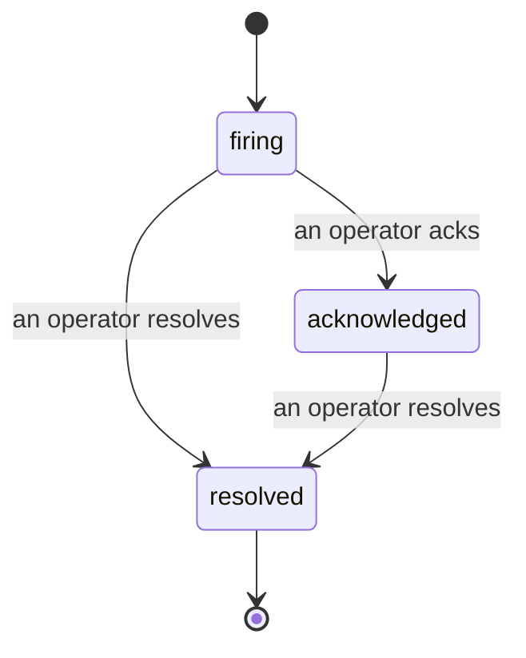

Cuando se activa una alerta, la primera pregunta siempre es «¿quién está en ello?». Los incidentes responden a eso: en el momento en que algo supera un umbral, todos pueden ver que el incidente está abierto, quién es el responsable y exactamente qué ha ocurrido hasta ahora, con un registro limpio y atribuido que puedes entregar directamente a una revisión post-mortem.

*La bandeja agrupa los incidentes abiertos por estado y filtra por severidad y responsable, para que veas de inmediato qué necesita atención humana.*

## Sabe quién lo tiene, de un vistazo

Se acabó el «¿alguien está mirando esto?» en un hilo de chat. Una brecha abre un incidente automáticamente y lo deposita en una bandeja compartida, agrupada por estado. Reconócelo y tu nombre queda registrado, para que el resto del equipo sepa que está siendo atendido. El reconocimiento es compartido: varios operadores pueden reconocer el mismo incidente y cada uno queda registrado de forma individual, de modo que todo un equipo de guardia aparece por nombre en lugar de pisarse unos a otros. Asigna un único responsable para el triaje y filtra la bandeja por severidad o responsable para quedarte solo con lo que es tuyo.

## La historia completa, en una sola línea de tiempo

Cuando el incidente termina, el informe ya está listo. Abre cualquier incidente y obtendrás la evidencia de la brecha, sus responsables asignados y suscriptores, un hilo de comentarios para coordinarse en el momento, y una línea de tiempo de actividad de solo adición.

*Todo lo que ocurrió, en orden, cada línea firmada por quien lo hizo.*

Cada acción (abierto, reconocido, resuelto, etc.) queda escrita en esa línea de tiempo y nunca se edita. Cada entrada está atribuida: al operador que la realizó, por correo electrónico, o como **automated** para cualquier cosa que Failproof AI Observability haya hecho por sí sola, como abrir el incidente al detectar la brecha. Nada es anónimo y nada se pierde, por lo que el post-mortem prácticamente se escribe solo.

## Cómo evoluciona un incidente

- **Abierto (firing):** la brecha abre el incidente y notifica a tus canales una sola vez. Las brechas repetidas se integran en el mismo incidente y actualizan su evidencia en lugar de notificarte una y otra vez.
- **Reconocido (acknowledged):** un operador lo toma. Permanece abierto y las brechas posteriores actualizan la evidencia sin ruido adicional.
- **Resuelto (resolved):** un operador lo cierra. La resolución automática cuando la condición se despeja está planificada pero aún no está habilitada, por lo que un incidente permanece abierto hasta que un humano lo resuelva, lo que mantiene a todos honestos sobre qué ha quedado realmente despejado. Más adelante puede abrirse un nuevo incidente sobre la misma alerta.

Una alerta tiene como máximo un incidente abierto a la vez, por lo que una regla inestable no puede enterrarte en duplicados. También puedes abrir un incidente manualmente: uno independiente para algo que ninguna alerta detectó, o uno vinculado a una alerta existente, si tienes `incidents:write`.

## Dónde encontrarlo

Los incidentes se encuentran en `/<org-slug>/incidents`. Para verlos se necesita **`incidents:read`**; para abrir un incidente manual se necesita **`incidents:write`**; para reconocer, asignar, comentar y resolver se necesita **`incidents:ack`**. Las claves más antiguas que concedían el permiso retirado `alerts:ack` siguen funcionando, ya que se reconoce como `incidents:ack`, por lo que tu rotación de guardia no necesita ser reemitida.

## Relacionado

- [Alertas](/es/agenteye/alerts): las reglas que abren estos incidentes cuando se supera un umbral.
- [Seguimiento de errores](/es/agenteye/error-tracking): ve todos los fallos en un solo lugar y promociona uno a alerta.
- [Auditorías](/es/agenteye/audits): el analista programado que encuentra los fallos que ninguna regla estaba vigilando.