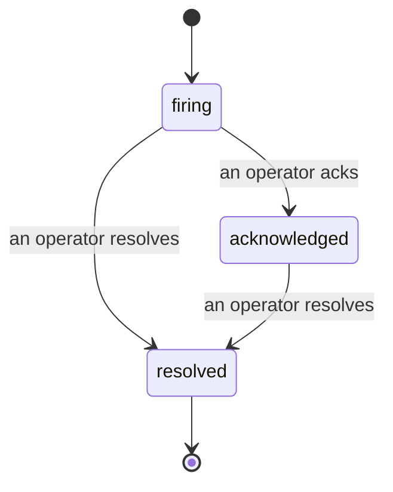

Cuando se dispara una alerta, la primera pregunta siempre es "¿quién lo está viendo?". Los incidentes responden esa pregunta: en el momento en que algo supera un umbral, todos pueden ver que el incidente está abierto, quién es el responsable y exactamente qué ha ocurrido hasta ese momento, con un registro limpio y atribuido que puedes entregar directamente a una revisión post-mortem.

*La bandeja agrupa los incidentes abiertos por estado y permite filtrar por severidad y responsable, para que veas de un vistazo qué requiere atención humana ahora mismo.*

## Saber quién lo tiene, de un vistazo

No más mensajes de "¿alguien está mirando esto?" en un hilo de chat. Cuando se supera un umbral, se abre un incidente automáticamente y aparece en una bandeja compartida, agrupada por estado. Reconócelo y tu nombre queda registrado, de modo que el resto del equipo sabe que está atendido. El reconocimiento es compartido: varios operadores pueden reconocer el mismo incidente y cada uno queda registrado por separado, así que en una sala de guerra completa cada persona aparece por su nombre sin pisarse unos a otros. Asigna un único responsable para el triaje y filtra la bandeja por severidad o responsable para quedarte solo con lo que es tuyo.

## Toda la historia, en una sola línea de tiempo

Cuando el incidente termina, el informe ya está escrito. Abre cualquier incidente y encontrarás la evidencia de la brecha, los responsables asignados y suscriptores, un hilo de comentarios para coordinar en el lugar y una línea de tiempo de actividad de solo adición.

*Todo lo que ocurrió, en orden, con cada línea firmada por quien lo hizo.*

Cada acción (apertura, reconocimiento, resolución, etc.) se escribe en esa línea de tiempo y nunca se elimina. Cada entrada está atribuida: al operador que la realizó, por correo electrónico, o a **automated** para cualquier acción que FailproofAI Observability haya realizado de forma autónoma, como abrir el incidente ante la brecha. Nada es anónimo y nada se pierde, así que el post-mortem prácticamente se escribe solo.

## Cómo se mueve un incidente

- **Abierto (firing):** la brecha abre el incidente y notifica a tus canales una sola vez. Las brechas repetidas se incorporan al mismo incidente y actualizan su evidencia en lugar de notificarte una y otra vez.
- **Reconocido (acknowledged):** un operador lo toma. El incidente permanece abierto y las brechas posteriores actualizan la evidencia sin generar nuevas notificaciones.
- **Resuelto (resolved):** un operador lo cierra. La resolución automática cuando la condición se normaliza está planificada pero aún no está habilitada, por lo que un incidente permanece abierto hasta que un humano lo resuelva, lo que mantiene a todos honestos sobre lo que realmente se ha resuelto. Más adelante puede abrirse un nuevo incidente sobre la misma alerta.

Una alerta puede tener como máximo un incidente abierto a la vez, por lo que una regla inestable no puede enterrarte en duplicados. También puedes abrir un incidente manualmente: uno independiente para algo que ninguna alerta detectó, o uno vinculado a una alerta existente, si tienes `incidents:write`.

## Dónde encontrarlo

Los incidentes se encuentran en `/<org-slug>/incidents`. Para consultarlos se necesita **`incidents:read`**; para abrir un incidente manual se necesita **`incidents:write`**; para reconocer, asignar, comentar y resolver se necesita **`incidents:ack`**. Las claves anteriores que otorgaban el permiso retirado `alerts:ack` siguen funcionando, ya que se reconoce como `incidents:ack`, por lo que tu rotación de guardia no necesita ser reemitida.

## Relacionado

- [Alertas](/es/agenteye/alerts): las reglas que abren estos incidentes cuando se supera un umbral.
- [Seguimiento de errores](/es/agenteye/error-tracking): ve todos los fallos en un solo lugar y promociónalo a una alerta.
- [Auditorías](/es/agenteye/audits): el analista programado que encuentra los fallos que ninguna regla estaba vigilando.