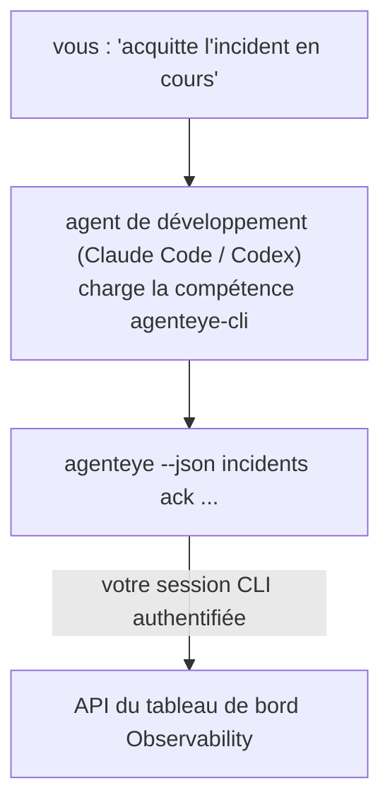

Posez à votre agent de développement la question *« quelque chose est-il cassé aujourd'hui ? »* et laissez-le répondre à partir de vos données FailproofAI Observability en direct, sans aucune commande à mémoriser. La **compétence CLI FailproofAI Observability** (`agenteye-cli`) est une *compétence d'agent* : un petit dossier d'instructions qu'un agent de développement tel que Claude Code ou Codex charge à la demande. Elle apprend à l'agent à piloter votre déploiement Observability via la [CLI `agenteye`](/fr/agenteye/cli) à partir de requêtes en langage naturel comme *« donne à la CI une clé qui ne peut qu'envoyer des événements »* ou *« acquitte l'incident en cours et assigne-le-moi. »*

Il ne s'agit **pas** d'un service ni d'un binaire séparé ; il n'y a rien à déployer. Elle s'appuie sur la CLI que vous avez déjà installée : l'agent exécute `agenteye --json …`, analyse le JSON propre renvoyé, et vous répond en prose. Tout ce qu'elle peut faire, vous pourriez le faire vous-même en tapant les mêmes commandes.

---

## Relation avec les autres interfaces FailproofAI Observability

FailproofAI Observability vous offre quatre façons d'accéder aux mêmes données et contrôles. Elles se complètent :

| Interface | Ce que c'est | Où elle s'exécute | À utiliser quand |
|---|---|---|---|
| **[CLI](/fr/agenteye/cli)** | La référence des commandes et options de `agenteye` | Votre terminal | Vous souhaitez exécuter ou scripter une commande précise |
| **[Recettes CLI](/fr/agenteye/cli-recipes)** | Modèles `jq`/pipeline à copier-coller | Votre terminal / scripts | Vous intégrez la CLI dans une automatisation |
| **Compétence CLI** (ce document) | Une porte d'entrée en langage naturel vers la CLI | Votre agent de développement, sur votre poste | Vous voulez *simplement poser une question* et laisser l'agent choisir la commande |
| **[Assistant IA intégré au tableau de bord](/fr/agenteye/assistant)** | Un chat intégré au tableau de bord | Côté serveur (dans le tableau de bord) | Vous souhaitez un Q&R dans le tableau de bord sur vos données |

La compétence elle-même n'a aucun privilège propre ; elle transforme simplement vos mots en appels CLI qui s'exécutent en votre nom :



### vs. l'assistant IA intégré au tableau de bord : une distinction importante

Ce sont deux outils différents avec des périmètres d'action très différents :

- L'**assistant IA intégré au tableau de bord** ([assistant IA](/fr/agenteye/assistant)) est un chat intégré au tableau de bord, appuyé par le service agent. Il est **en lecture seule, avec création soumise à approbation** : il peut rédiger des requêtes et des tableaux de bord sauvegardés, mais chaque écriture marque une pause pour votre validation explicite par clic, et il ne supprime jamais rien. Il est soumis à la permission `agent:use` et ne voit jamais que les données de l'organisation que vous consultez.
- La **compétence CLI** s'exécute sur *votre* poste de travail dans *votre* agent de développement et pilote la CLI `agenteye` en tant que **vous**. Elle peut effectuer l'**ensemble des opérations de la CLI, y compris les mutations** (créer/renouveler/désactiver des clés API, modifier les paramètres d'organisation, résoudre des incidents, supprimer des requêtes sauvegardées), limitées uniquement par les permissions de votre session CLI. Traitez-la avec exactement autant de prudence que si vous exécutiez ces commandes à la main.

---

## Prérequis

1. La **CLI `agenteye` installée** et présente dans le `PATH` (voir la référence [CLI](/fr/agenteye/cli) : `pipx install agenteye`).
2. Votre **URL de tableau de bord** configurée (`AGENTEYE_DASHBOARD_URL`, ou l'agent passe `--base-url`).
3. Une **session connectée** : exécutez `agenteye login` vous-même au préalable. La compétence **ne peut pas** effectuer la connexion par code à usage unique envoyé par e-mail à votre place ; elle vous demandera d'exécuter `agenteye login` si la session est absente ou expirée (code de sortie CLI `4`).

---

## Installation de la compétence

Les compétences d'agent sont des dossiers contenant un fichier `SKILL.md` (plus des références optionnelles). Vous installez la compétence `agenteye-cli` en plaçant son dossier à l'endroit où votre agent recherche les compétences :

- **Claude Code** : copiez le dossier `agenteye-cli/` dans `~/.claude/skills/` (disponible dans tous les projets) ou dans `<votre-dépôt>/.claude/skills/` (limité à ce dépôt). Claude Code le découvre automatiquement ; vérifiez avec la liste `/skills`, ou posez simplement une question correspondant à sa description.
- **Codex (OpenAI)** : Codex lit le même fichier `SKILL.md`. Le fichier `agents/openai.yaml` fourni définit `allow_implicit_invocation: true`, de sorte que Codex sélectionne automatiquement la compétence lorsqu'une tâche correspond ; sinon, invoquez-la explicitement avec `$agenteye-cli`.

La compétence est maintenue en parallèle de la CLI `agenteye` mais est livrée sous forme de **dossier séparé**, non inclus dans le paquet `pipx install agenteye`, donc ne la cherchez pas là. FailproofAI Observability vous fournit le dossier `agenteye-cli/` directement ; si vous ne l'avez pas, contactez votre interlocuteur FailproofAI. Rien n'est verrouillé : aucune accréditation n'est requise, car elle ne fait que piloter la CLI **publique** `agenteye` contre votre propre tableau de bord.

---

## Sécurité : les mutations NE demandent PAS de confirmation quand un agent exécute la CLI

> **Avertissement :** Lisez ceci avant d'autoriser un agent à effectuer des modifications.

La CLI `agenteye` demande normalement *« êtes-vous sûr ? »* avant une action destructrice. Elle **ignore automatiquement cette confirmation dès qu'elle n'est pas attachée à un terminal (ce qui est exactement le cas lors d'une exécution par un agent de développement), et `--json` l'ignore également.** La confirmation de sécurité ne se déclenchera donc **pas** pour l'agent.

La compétence est écrite pour compenser : elle est instruite d'énoncer la commande exacte qu'elle va exécuter et d'obtenir votre **accord explicite avant tout changement d'état**. Maintenez cette discipline. Lorsque vous pilotez FailproofAI Observability via un agent, *vous* êtes l'étape de confirmation. Les commandes modificatrices d'état à surveiller :

- `keys create` / `update` / `disable` / `regenerate`
- `users create` / `update` / `disable` / `enable`
- `settings set`
- `alerts create` / `update` / `delete` / `test`
- les sous-commandes d'écriture de `incidents` : `ack` / `assign` / `resolve` / `open` / `comment-add` / `comment-delete` / `subscribe` / `unsubscribe`
- `query create` / `update` / `delete`
- `agent rename` / `delete`
- `orgs switch`

Tout ce qui se trouve sous **Observe** (`events`, `sessions`, `evals`, `errors`, `list`, `whoami`, `orgs list/current/perms`) est en lecture seule et ne modifie rien.

L'agent agissant en tant que **vous**, il ne peut faire que ce que votre session est autorisée à faire ; les permissions sont résolues **par organisation** (voir [Clés API](/fr/agenteye/api-keys)). Une commande pour laquelle vous n'avez pas la permission retourne le code de sortie `5` avec le nom exact de la permission manquante, ce qui permet à l'agent de vous indiquer précisément ce que vous devez demander à un administrateur, plutôt que d'échouer de façon opaque.

---

## Ce que vous pouvez lui demander

Voici à quoi ressemble un véritable échange : d'abord une lecture, puis une modification qui attend votre accord :

```text
vous  ▸ Quelque chose est-il cassé ces dernières 24 heures ?

agent ▸ Exécution : agenteye --json errors --since 24h --aggregate
        3 types d'erreurs dans les dernières 24h. Le plus fréquent est TimeoutError
        (18 occurrences, toutes sur le checkout-agent), puis RateLimited (5).
        Voulez-vous les sessions en échec pour TimeoutError ?

vous  ▸ Donne à la CI une clé qui ne peut qu'envoyer des événements.

agent ▸ Cela va créer une clé API. Je vais exécuter :
          agenteye keys create ci --add events:add
        Je peux continuer ?

vous  ▸ oui

agent ▸ Fait. Clé « ci » créée avec events:add uniquement.
        Le secret n'est affiché qu'une seule fois, sauvegardez-le maintenant. Je ne peux pas le réafficher.
```

La compétence associe chaque intention exprimée en langage naturel à la bonne commande `agenteye`, en découvrant d'abord les valeurs valides (`list <kind>`, `whoami`) pour ne pas deviner, et en énonçant la commande exacte avant tout changement. Autres exemples :

- *« Quelque chose est-il cassé / en échec dans les dernières 24 heures ? »* → `errors --since 24h --aggregate`, puis un récapitulatif.
- *« Pourquoi la session `run-001` a-t-elle échoué ? »* → `events --session-id run-001 --all` + `evals --session-id run-001`.
- *« Comment évolue la qualité cette semaine ? »* → `evals --aggregate --since 7d`, puis analyse des exécutions mal notées.
- *« Donne à la CI une clé qui ne peut qu'envoyer des événements. »* → `keys create ci --add events:add` (elle énonce la commande, puis la crée et capture le secret à usage unique).
- *« Qui a accès ? Passe Dana en lecture seule. »* → `users list` → `users update dana@… --permission-set read-only` (après confirmation de votre part).
- *« Acquitte l'incident en cours et assigne-le-moi. »* → `incidents list --state firing` → `incidents ack <id>` / `incidents assign <id> vous@…`.

Pour les commandes exactes, les options et les structures JSON correspondantes, consultez la référence [CLI](/fr/agenteye/cli) et les [recettes CLI pour agents](/fr/agenteye/cli-recipes).

---

## Prochaines étapes

- **[CLI](/fr/agenteye/cli)** : référence complète des commandes et options de `agenteye`.
- **[Recettes CLI pour agents](/fr/agenteye/cli-recipes)** : modèles `jq` à copier-coller et gestion des codes de sortie.
- **[Assistant IA](/fr/agenteye/assistant)** : l'assistant intégré au tableau de bord (à ne pas confondre avec cette compétence en terminal).
- **[Clés API](/fr/agenteye/api-keys)** : le modèle de permissions par organisation qui délimite ce que la compétence peut faire.