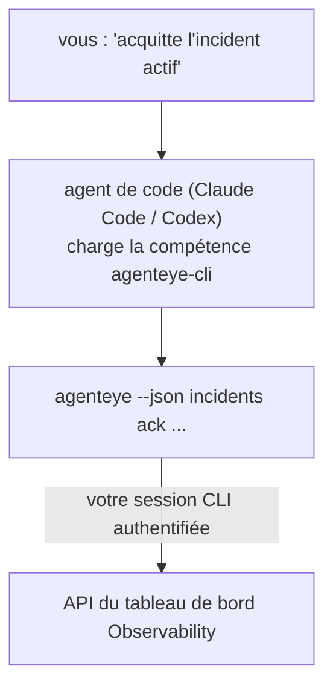

Posez à votre agent de code *«est-ce que quelque chose est cassé aujourd'hui ?»* et laissez-le répondre à partir de vos données en direct Failproof AI Observability, sans aucune commande à mémoriser. La **compétence CLI Failproof AI Observability** (`agenteye-cli`) est une *Agent Skill* : un petit dossier d'instructions qu'un agent de code tel que Claude Code ou Codex charge à la demande. Elle apprend à l'agent à piloter votre déploiement Observability via la [CLI `agenteye`](/fr/agenteye/cli) à partir de requêtes en langage naturel comme *«donne à la CI une clé qui ne peut qu'envoyer des événements»* ou *«acquitte l'incident actif et assigne-le moi.»*

Il ne s'agit **pas** d'un service ni d'un binaire distinct ; rien à déployer. Elle s'appuie sur la CLI que vous avez déjà installée : l'agent exécute `agenteye --json …`, analyse le JSON propre renvoyé, puis vous répond en prose. Tout ce qu'elle peut faire, vous pourriez le faire vous-même en tapant les mêmes commandes.

---

## Relation avec les autres interfaces Failproof AI Observability

Failproof AI Observability vous offre quatre façons d'accéder aux mêmes données et contrôles. Elles se complètent :

| Interface | Ce que c'est | Où elle s'exécute | Quand l'utiliser |
|---|---|---|---|
| **[CLI](/fr/agenteye/cli)** | La référence des commandes et options de `agenteye` | Votre terminal | Vous souhaitez exécuter ou scripter une commande précise |
| **[Recettes CLI](/fr/agenteye/cli-recipes)** | Patterns `jq`/pipeline prêts à copier-coller | Votre terminal / scripts | Vous intégrez la CLI dans une automatisation |
| **Compétence CLI** (ce document) | Une interface en langage naturel pour la CLI | Votre agent de code, sur votre poste | Vous voulez *simplement poser une question* et laisser l'agent choisir la commande |
| **[Compétence Evaluator](/fr/agenteye/evaluator-skill)** | Une compétence sœur qui conçoit et construit votre service de scoring | Votre agent de code, sur votre poste | Vous souhaitez *produire* des scores d'évaluation plutôt que les lire |
| **[Compétence Python SDK](/fr/agenteye/python-sdk-skill)** | Une compétence sœur qui instrumente votre agent pour qu'il émette de la télémétrie | Votre agent de code, sur votre poste | Vous voulez que votre agent *produise* les événements que cette compétence lit |
| **[Assistant IA intégré au tableau de bord](/fr/agenteye/assistant)** | Un chat intégré dans le tableau de bord | Côté serveur (dans le tableau de bord) | Vous souhaitez faire des Q&R sur vos données directement dans le tableau de bord |

La compétence ne possède aucun privilège propre ; elle se contente de transformer vos mots en appels CLI qui s'exécutent en votre nom :



### vs. l'assistant IA intégré au tableau de bord : une distinction importante

Ce sont deux outils différents avec des périmètres d'action très différents :

- L'**assistant IA intégré au tableau de bord** ([AI assistant](/fr/agenteye/assistant)) est un chat embarqué dans le tableau de bord, adossé au service d'agent. Il est **en lecture seule avec création approuvée** : il peut rédiger des requêtes et des tableaux de bord sauvegardés, mais chaque écriture s'interrompt pour attendre votre approbation explicite, et il ne supprime jamais rien. Il est soumis à la permission `agent:use` et ne voit que les données de l'organisation que vous consultez.
- La **compétence CLI** s'exécute sur *votre* poste de travail dans *votre* agent de code et pilote la CLI `agenteye` **en tant que vous**. Elle peut utiliser la **totalité de la surface de la CLI, y compris les mutations** (créer/faire tourner/désactiver des clés API, modifier les paramètres de l'organisation, résoudre des incidents, supprimer des requêtes sauvegardées), limitées uniquement par les permissions de votre connexion CLI. Traitez-la avec exactement la même prudence que si vous tapiez ces commandes vous-même.

---

## Prérequis

1. La **CLI `agenteye` installée** et accessible dans le `PATH` (voir la référence [CLI](/fr/agenteye/cli) : `pipx install agenteye`).
2. L'**URL de votre tableau de bord** configurée (`AGENTEYE_DASHBOARD_URL`, ou l'agent passe `--base-url`).
3. Une **session active** : exécutez `agenteye login` vous-même au préalable. La compétence **ne peut pas** finaliser le processus de connexion par code à usage unique envoyé par e-mail à votre place ; elle vous demandera d'exécuter `agenteye login` si la session est absente ou expirée (code de sortie CLI `4`).

---

## Où la trouver

La compétence est publiée dans la collection de compétences publiques de Failproof AI :

**[github.com/FailproofAI/skills](https://github.com/FailproofAI/skills)** → [`skills/agenteye-cli/`](https://github.com/FailproofAI/skills/tree/main/skills/agenteye-cli)

Aucune partie n'est restreinte : le dépôt est public et la compétence n'a besoin d'aucune accréditation propre, car elle ne pilote que la CLI `agenteye` **publique** contre *votre* tableau de bord, en utilisant la session avec laquelle *vous* vous êtes connecté. Nul besoin de la demander à qui que ce soit.

Notez qu'elle est livrée dans son propre dossier et n'est **pas** incluse dans le paquet `pipx install agenteye`, ne la cherchez donc pas là.

## Installer la compétence

Le moyen le plus rapide est la CLI [`skills`](https://skills.sh), qui récupère le dossier et le place là où votre agent le cherche :

```bash
# Claude Code, ce projet uniquement
npx skills add FailproofAI/skills --skill agenteye-cli -a claude-code

# tous les projets (installe dans ~/.claude/skills/)
npx skills add FailproofAI/skills --skill agenteye-cli -a claude-code -g --copy

# Codex à la place
npx skills add FailproofAI/skills --skill agenteye-cli -a codex
```

Gérez-la ensuite comme n'importe quelle autre compétence :

```bash
npx skills list -a claude-code      # ce qui est installé
npx skills update agenteye-cli      # récupérer la dernière version
npx skills remove agenteye-cli      # la supprimer
```

Vous préférez l'installer manuellement ? Une Agent Skill n'est qu'un dossier contenant un fichier `SKILL.md` (plus des références optionnelles), donc la copier fonctionne aussi :

- **Claude Code** : placez le dossier `agenteye-cli/` dans `~/.claude/skills/` (tous les projets) ou `<votre-dépôt>/.claude/skills/` (ce dépôt uniquement). Claude Code le détecte automatiquement — vérifiez avec la liste `/skills`, ou posez simplement une question correspondant à sa description.
- **Codex (OpenAI)** : Codex lit le même fichier `SKILL.md`. Le fichier `agents/openai.yaml` fourni définit `allow_implicit_invocation: true`, de sorte que Codex sélectionne automatiquement la compétence quand une tâche correspond ; sinon, invoquez-la explicitement avec `$agenteye-cli`.

---

## Sécurité : les mutations ne demandent PAS de confirmation quand un agent exécute la CLI

> **Avertissement :** Lisez ceci avant d'autoriser un agent à effectuer des modifications.

La CLI `agenteye` demande normalement *«êtes-vous sûr ?»* avant une action destructrice. Elle **ignore automatiquement cette confirmation lorsqu'elle n'est pas attachée à un terminal (ce qui correspond exactement à la façon dont un agent de code l'exécute), et `--json` l'ignore également.** La invite de confirmation ne se déclenchera donc **pas** pour l'agent.

La compétence est conçue pour compenser cela : il lui est demandé d'indiquer la commande exacte qu'elle va exécuter et d'obtenir votre **accord explicite avant tout changement d'état**. Maintenez cette discipline. Lorsque vous pilotez Failproof AI Observability via un agent, *vous* êtes l'étape de confirmation. Les commandes modifiant l'état à surveiller :

- `keys create` / `update` / `disable` / `regenerate`
- `users create` / `update` / `disable` / `enable`
- `settings set`
- `alerts create` / `update` / `delete` / `test`
- les sous-commandes `incidents` en écriture : `ack` / `assign` / `resolve` / `open` / `comment-add` / `comment-delete` / `subscribe` / `unsubscribe`
- `query create` / `update` / `delete`
- `agent rename` / `delete`
- `orgs switch`

Tout ce qui relève d'**Observe** (`events`, `sessions`, `evals`, `errors`, `list`, `whoami`, `orgs list/current/perms`) est en lecture seule et ne modifie rien.

L'agent agissant **en votre nom**, il ne peut faire que ce que votre connexion est autorisée à faire ; les permissions sont résolues **par organisation** (voir [Clés API](/fr/agenteye/api-keys)). Une commande pour laquelle vous n'avez pas la permission renvoie le code de sortie `5` avec le nom exact de la permission manquante, de sorte que l'agent peut vous indiquer précisément ce que vous devez demander à un administrateur plutôt qu'échouer de manière opaque.

---

## Ce que vous pouvez lui demander

Voici à quoi ressemble un vrai échange, une lecture puis une modification qui attend votre accord :

```text
vous  ▸ Est-ce que quelque chose est cassé dans la dernière journée ?

agent ▸ Exécution : agenteye --json errors --since 24h --aggregate
        3 types d'erreurs dans les dernières 24h. La plus fréquente est TimeoutError
        (18 occurrences, toutes sur checkout-agent), puis RateLimited (5).
        Voulez-vous voir les sessions en échec pour TimeoutError ?

vous  ▸ Donne à la CI une clé qui ne peut qu'envoyer des événements.

agent ▸ Cela va créer une clé API. J'exécuterai :
          agenteye keys create ci --add events:add
        OK pour continuer ?

vous  ▸ oui

agent ▸ Fait. Clé «ci» créée avec events:add uniquement.
        Le secret est affiché une seule fois, enregistrez-le maintenant. Je ne peux pas le réafficher.
```

La compétence associe chaque intention en langage naturel à la bonne commande `agenteye`, en découvrant d'abord les valeurs valides (`list <kind>`, `whoami`) pour ne pas deviner, et en indiquant la commande exacte avant tout changement. Autres exemples :

- *«Est-ce que quelque chose est cassé / en échec dans les dernières 24 heures ?»* → `errors --since 24h --aggregate`, puis un détail.
- *«Pourquoi la session `run-001` a-t-elle échoué ?»* → `events --session-id run-001 --all` + `evals --session-id run-001`.
- *«Comment la qualité évolue-t-elle cette semaine ?»* → `evals --aggregate --since 7d`, puis exploration des exécutions à faible score.
- *«Donne à la CI une clé qui ne peut qu'envoyer des événements.»* → `keys create ci --add events:add` (elle indique la commande, puis la crée et capture le secret à usage unique).
- *«Qui a accès ? Passe Dana en lecture seule.»* → `users list` → `users update dana@… --permission-set read-only` (après confirmation avec vous).
- *«Acquitte l'incident actif et assigne-le moi.»* → `incidents list --state firing` → `incidents ack <id>` / `incidents assign <id> vous@…`.

Pour les commandes exactes, les options et les structures JSON sous-jacentes, consultez la référence [CLI](/fr/agenteye/cli) et les [recettes CLI pour agents](/fr/agenteye/cli-recipes).

---

## Prochaines étapes

- **[CLI](/fr/agenteye/cli)** : référence complète des commandes et options de `agenteye`.
- **[Recettes CLI pour agents](/fr/agenteye/cli-recipes)** : patterns `jq` prêts à copier-coller et gestion des codes de sortie.
- **[Compétence agent Evaluator](/fr/agenteye/evaluator-skill)** : la compétence sœur, pour construire l'évaluateur dont les scores sont lus par `agenteye evals`.
- **[Compétence agent Python SDK](/fr/agenteye/python-sdk-skill)** : la compétence sœur, pour instrumenter un agent afin qu'il émette la télémétrie lue par `agenteye`.
- **[Assistant IA](/fr/agenteye/assistant)** : l'assistant intégré au tableau de bord (à ne pas confondre avec cette compétence en terminal).
- **[Clés API](/fr/agenteye/api-keys)** : le modèle de permissions par organisation qui définit ce que la compétence peut faire.