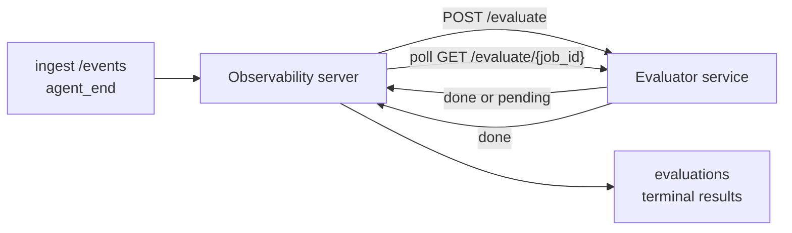

Failproof AI Observability peut automatiquement noter chaque exécution d'agent terminée selon sa qualité : vous fournissez un petit service de notation, et Observability s'occupe du reste. Utilisez-le pour suivre les dimensions qui vous importent (utilité, efficacité des outils, factualité, sécurité ; vous choisissez), détecter les régressions tôt et comparer des agents ou des environnements en un coup d'œil. La notation est optionnelle : le pipeline ne fait rien tant que vous n'avez pas défini `EVALUATOR_ENDPOINT` sur le serveur.

> **Remarque :** Vous définissez les dimensions de notation. Votre évaluateur peut retourner les clés numériques qu'il souhaite ; Observability stocke, suit les tendances et affiche tout ce que vous renvoyez.

## Vue d'ensemble

1. **Écrivez un évaluateur.** Mettez en place un petit service HTTP qui lit la transcription d'une session et retourne des scores. Observability inclut une référence fonctionnelle que vous pouvez copier. Voir [Écrire un évaluateur avec le SDK](#writing-an-evaluator-with-the-sdk).
2. **Pointez Observability vers celui-ci.** Définissez `EVALUATOR_ENDPOINT` (et un `EVALUATOR_TOKEN` partagé) sur le processus serveur.
3. **Observez les scores arriver.** Chaque session terminée est notée automatiquement ; les résultats apparaissent sur la page de détail de la session, dans la grille des sessions et dans les tableaux de bord sauvegardés.


*Une fois un évaluateur configuré, chaque exécution terminée est notée et les résultats apparaissent dans le panneau droit de la session : le résumé en haut, puis les barres de score par dimension avec leur raisonnement.*

---

## Fonctionnement



Lorsque le SDK Observability émet un événement `agent_end` pour une session, le serveur
planifie une évaluation. Il envoie ensuite en POST la transcription complète des événements à votre
service d'évaluation, qui peut soit :

- **Retourner le résultat en ligne** avec `{"status":"done", "scores":{...}, "reasoning":{...}, "summary":"..."}`. Le
  résultat est ajouté à la chronologie d'évaluation de la session. `reasoning` et
  `summary` sont optionnels.
- **Différer** avec `{"status":"pending", "job_id":"abc-123"}`. Observability appelle ensuite
  `GET {EVALUATOR_ENDPOINT}/evaluate/abc-123` jusqu'à ce que votre évaluateur
  retourne `{"status":"done", ...}` ou `{"status":"error", "error":"..."}`.

  La cadence d'interrogation est par tâche : une réponse `pending` peut inclure
  `next_poll_secs` pour la remplacer ; sinon Observability utilise la valeur
  `default_poll_interval_secs` de `GET /config` ; sinon le serveur
  se rabat sur `EVALUATOR_POLLING_INTERVAL_SECS` (par défaut 10s). Toutes les valeurs
  sont contraintes dans l'intervalle [1s, 1h].

Les sessions qui n'émettent jamais `agent_end` (par exemple, un processus d'agent planté)
peuvent également être prises en charge : le `GET /config` de l'évaluateur peut retourner
`{"inactivity_timeout_secs": 1800}`, et Observability évaluera toute session
restée inactive aussi longtemps. Définissez le champ à `null` ou omettez-le pour
désactiver ce mécanisme de secours.

Le pipeline est entièrement sans effet lorsque `EVALUATOR_ENDPOINT` n'est pas défini.

Une session peut accumuler **plusieurs évaluations terminales au fil du temps** : chaque
événement `agent_end` (et chaque réévaluation manuelle depuis le tableau de bord) ajoute
une nouvelle ligne d'évaluation. C'est la façon recommandée d'évaluer une conversation reprise :
un utilisateur termine un agent, revient plus tard, envoie de nouveaux événements,
termine à nouveau l'agent, et une deuxième évaluation s'exécute sur la transcription complète mise à jour.
Le tableau de bord affiche l'évaluation la plus récente comme titre principal et les évaluations
précédentes sous forme de chronologie réductible. Pendant qu'une évaluation est en cours pour une
session, les événements `agent_end` supplémentaires pour cette session sont ignorés ; le prochain
événement après la fin de l'évaluation en cours planifiera une nouvelle évaluation comme d'habitude.

Le mécanisme de secours par inactivité se réactive également sur les sessions reprises : si de nouveaux
événements arrivent après une évaluation terminale précédente et que la session devient ensuite inactive
au-delà de `inactivity_timeout_secs`, une nouvelle évaluation est mise en file d'attente.

Les échecs transitoires (5xx, 429, délais dépassés, erreurs réseau) font l'objet de nouvelles tentatives avec
un backoff exponentiel jusqu'à `EVALUATOR_MAX_ATTEMPTS` ; les réponses 4xx sont
terminales. Observability peut fonctionner en toute sécurité avec plusieurs instances de serveur mises
à l'échelle horizontalement ; le travail est réparti de sorte que la même session ne soit jamais
envoyée deux fois simultanément.

---

## Contrat HTTP

Chaque route authentifiée utilise **l'authentification par jeton bearer**. La même valeur doit être
configurée des deux côtés :

- Serveur Observability : variable d'environnement `EVALUATOR_TOKEN`
- Service évaluateur : configuré de la même façon (le SDK `agenteye-evaluator`
  lit `EVALUATOR_TOKEN` par convention)

Si `EVALUATOR_TOKEN` n'est pas défini, le serveur n'envoie pas d'en-tête `Authorization` ; l'évaluateur
peut alors accepter des requêtes anonymes, ce qui convient pour un réseau
purement interne mais est déconseillé sur Internet public.

### Routes que l'évaluateur doit exposer

| Route | Corps / paramètres | Réponse |
|---|---|---|
| `GET /health` | aucun | `{"status":"ok"}` (ouverte, sans authentification) |
| `GET /config` | aucun | `{"inactivity_timeout_secs": <int> \| null, "default_poll_interval_secs": <int> \| omitted}` |
| `POST /evaluate` | JSON `EvalRequest` | `{"status":"done", ...}` ou `{"status":"pending", "job_id":"..."}` |
| `GET /evaluate/{id}` | aucun | même format de réponse que `/evaluate` |

### Corps `EvalRequest` envoyé par le serveur

```json
{
  "schema_version": "1",
  "session_id":     "session-abc123",
  "agent_id":       "planner",
  "environment":    "production",
  "started_at":     "2026-05-10T12:00:00Z",
  "ended_at":       "2026-05-10T12:05:00Z",
  "events": [
    { "id": 1234, "ts": "...", "event_type": "agent_start", "payload": { ... } },
    ...
  ]
}
```

### Formats de réponse

**Synchrone (terminé) :**

```json
{
  "status": "done",
  "scores": { "helpfulness": 0.85, "tool_efficiency": 0.6 },
  "reasoning": {
    "helpfulness": "answered the question directly with citations",
    "tool_efficiency": "called list_files three times when one would have done"
  },
  "summary": "strong answer quality, weak tool selection"
}
```

`reasoning` (une carte de justification par score) et `summary` (un
récit global en un paragraphe) sont tous deux optionnels. Les clés dans `reasoning` doivent
refléter les clés dans `scores` ; le tableau de bord affiche chaque entrée en ligne sous
sa barre de score. Les anciens évaluateurs qui ne retournent que `scores` continuent de
fonctionner sans modification ; `reasoning` et `summary` apparaissent simplement comme null et
les éléments d'interface correspondants sont omis.

**Asynchrone (différé) :**

```json
{ "status": "pending", "job_id": "abc-123", "next_poll_secs": 30 }
```

`next_poll_secs` est optionnel ; s'il est omis, le serveur se rabat sur le
`default_poll_interval_secs` de l'évaluateur depuis `/config`, puis sur sa propre
variable d'environnement `EVALUATOR_POLLING_INTERVAL_SECS`.

**Erreur terminale côté évaluateur :**

```json
{ "status": "error", "error": "model service unavailable" }
```

Le serveur traite tout autre corps 2xx comme une erreur de protocole et enregistre une
`error` terminale pour la session.

---

## Écrire un évaluateur avec le SDK

Vous n'avez pas besoin d'implémenter le contrat HTTP manuellement. Le package Python
`agenteye-evaluator` vous fournit un wrapper FastAPI typé qui gère l'authentification, le routage et
les formats de requête/réponse à votre place.

Failproof AI Observability inclut également un **évaluateur de référence fonctionnel** qui
note `helpfulness`, `tool_efficiency` et `factuality` à partir de la forme de la
transcription. Copiez-le comme point de départ et remplacez la logique par la vôtre : un
juge LLM, un moteur de règles, tout ce qui correspond à votre niveau de qualité.

Évaluateur minimal viable :

```python
import os
from agenteye_evaluator import Evaluator, EvalRequest, EvalResponse

app = Evaluator(token=os.environ["EVALUATOR_TOKEN"])

@app.evaluator
def run(req: EvalRequest) -> EvalResponse:
    # Inspect req.events (the full session transcript) and return scores.
    tool_calls = sum(1 for e in req.events if e.event_type == "tool_use")
    return EvalResponse(
        scores={"tool_calls": float(tool_calls)},
        reasoning={"tool_calls": f"{tool_calls} tool invocations in the transcript"},
        summary="tight tool loop" if tool_calls < 5 else "agent looped on tools",
    )
```

L'instance `app` s'exécute sous n'importe quel serveur ASGI, donc `uvicorn module:app` la démarre.

Pour les évaluateurs qui ont besoin de différer un travail coûteux, retournez `JobPending`
à la place et enregistrez un gestionnaire `@app.job_lookup` ; le serveur Observability
interroge `GET /evaluate/{job_id}` jusqu'à ce que vous retourniez un statut terminal ou que
le délai `EVALUATOR_MAX_POLL_DURATION_SECS` (par défaut 1 h) soit atteint.

La référence complète de l'API, le schéma async et le schéma des événements sont documentés dans le
README du SDK `agenteye-evaluator`.

---

## Exécuter votre évaluateur

L'évaluateur est **votre service** — Failproof AI Observability ne fournit pas d'évaluateur
par défaut, vous le construisez et l'exécutez là où vous faites tourner vos propres services.
Il s'exécute sous n'importe quel serveur ASGI (par exemple `uvicorn my_evaluator:app`) ; exposez
les routes `/health`, `/config` et `/evaluate` définies dans le
[contrat HTTP](#http-contract), puis pointez le serveur vers celui-ci (voir
[Configurer le serveur](#configuring-the-server)).

Une fois l'évaluateur accessible, `GET /health` retourne `{"status":"ok"}`. Après
une exécution complète d'un agent, `GET /evaluations` sur le serveur retourne une ligne avec
`status: "done"` et les scores produits par votre évaluateur.

---

## Configurer le serveur

À définir sur le processus serveur :

| Variable d'env. | Signification |
|---|---|
| `EVALUATOR_ENDPOINT` | URL de base de votre évaluateur (`http://evaluator:9000`). Non définie = pipeline désactivé. |
| `EVALUATOR_TOKEN` | Jeton bearer. Doit correspondre à la valeur configurée dans le service évaluateur. |
| `EVALUATOR_WORKERS` | Tâches de travail par instance de serveur (par défaut 2). |
| `EVALUATOR_CLAIM_BATCH` | Lignes revendiquées par cycle de travailleur (par défaut 4). Les lots sont traités **en parallèle** ; la concurrence effective sur votre endpoint évaluateur est `EVALUATOR_WORKERS × EVALUATOR_CLAIM_BATCH`. |
| `EVALUATOR_POLL_IDLE_SECS` | Durée de veille d'un travailleur entre les tentatives de distribution quand aucune évaluation n'est due (par défaut 2s). |
| `EVALUATOR_POLLING_INTERVAL_SECS` | Dernier recours pour la cadence `GET /evaluate/{id}` quand ni `next_poll_secs` par réponse ni `default_poll_interval_secs` de l'évaluateur ne sont définis (par défaut 10s). |
| `EVALUATOR_REQUEST_TIMEOUT_MS` | Délai d'expiration par requête (par défaut 30000). |
| `EVALUATOR_MAX_ATTEMPTS` | Après ce nombre d'échecs transitoires, le résultat est enregistré comme `error` terminale (par défaut 5). |
| `EVALUATOR_CONFIG_REFRESH_SECS` | Cadence `GET /config` (par défaut 300). |
| `EVALUATOR_MAX_POLL_DURATION_SECS` | Durée horloge murale maximale pendant laquelle une session peut rester dans la file d'interrogation avant d'être terminée en `timeout` (par défaut 3600s). Protège contre un évaluateur qui continue à retourner `pending` indéfiniment. |

Pour activer la notation automatique, définissez `EVALUATOR_ENDPOINT` et
`EVALUATOR_TOKEN` sur le serveur, puis redémarrez-le pour prendre en compte le changement. Si
`EVALUATOR_ENDPOINT` n'est pas défini, le pipeline reste sans effet.

Les paramètres de réglage ci-dessus sont optionnels ; définissez les variables d'environnement
correspondantes sur le serveur uniquement si vous avez besoin de remplacer les valeurs par défaut.

---

## Référence API

| Méthode | Chemin | Permission requise | Objectif |
|---|---|---|---|
| `GET` | `/evaluations` | `evaluations:read` | Interroger les résultats terminaux. Prend en charge `session_id`, `agent_id`, `environment`, `status` (`done`/`error`/`timeout`), `ts_from`, `ts_to`, `cursor`, `limit`, `score_filters`, `latest_per_session`. `limit` vaut 50 par défaut et est limité à 200 (notez que cela diffère de `/events`, qui est limité à 1000). `environment` accepte une liste séparée par des virgules (ex. `environment=prod,staging`) ; les valeurs uniques fonctionnent toujours. Avec `latest_per_session=true`, la réponse contient au plus une ligne par `session_id` (la plus récente par `completed_at`), utilisée par la page de liste des sessions pour réduire la chronologie d'évaluation d'une session à son titre actuel. Vaut false par défaut (retourne l'historique complet). |
| `GET` | `/evaluations/aggregate` | `evaluations:read` | Synthèse de la santé des évaluations pour une tranche filtrée : nombre total, répartition done/error/timeout, statistiques par clé de score (count/avg/min/max/p50 sur les clés `scores` arbitraires) et une chronologie découpée par tranches temporelles. Accepte les **mêmes paramètres de filtre que `/evaluations`** plus `featured_keys` (CSV de clés de score à suivre) et `latest_per_session`. Alimente la fonctionnalité Tableaux de bord ; les métriques sont exactes sur l'ensemble correspondant, sans échantillonnage. |
| `GET` | `/evaluations/environments` | `evaluations:read` | Valeurs d'environnement distinctes de la table `evaluations`. Utilisé pour remplir les menus déroulants de filtre délimités aux données accessibles en lecture des évaluations. |
| `GET` | `/evaluation-jobs` | `evaluations:read` | Visibilité sur les évaluations en cours. Filtrer par `status` (`pending`/`polling`). |
| `GET` | `/events` | `events:read` | Diffuser les événements bruts d'une session. Prend en charge `session_id`, `agent_id`, `event_type` (CSV), `environment` (CSV), `ts_from`, `ts_to`, `cursor`, `limit` et `order`. `order` vaut `desc` (le plus récent en premier, par défaut) ou `asc` (le plus ancien en premier) ; une valeur non reconnue se rabat sur `desc`. Paginez par curseur via le `next_cursor` de la réponse (un identifiant d'événement) : passez-le en tant que `cursor` pour obtenir la page suivante ; avec `asc` la page suivante contient les événements après cet identifiant, avec `desc` les événements avant celui-ci. `limit` vaut 50 par défaut et est limité à 1000. |
| `GET` | `/sessions/:session_id/export` | `events:read` | Retourne le corps JSON exact que l'évaluateur recevrait pour cette session, servi en tant que pièce jointe téléchargeable nommée `session-<id>.json`. Utile pour rejouer des sessions de production via `agenteye-evaluator` pour des tests hors ligne. Les octets sont identiques octet par octet à ce qu'envoie le pipeline d'évaluation. |
| `POST` | `/sessions/:session_id/re-evaluate` | `evaluations:trigger` | Mettre en file d'attente une nouvelle évaluation pour une session ; s'exécute que ce soit ou non qu'une évaluation précédente existe. Le nouveau résultat est **ajouté** à la chronologie d'évaluation de la session plutôt que d'écraser le précédent, de sorte que les scores antérieurs restent visibles en historique. Retourne `202` lors de la mise en file, `404` pour une session inconnue, `409` si une évaluation est déjà en cours. À utiliser après le déploiement d'un nouvel évaluateur, ou pour les sessions qui n'ont jamais émis `agent_end`. |

### Filtrer par plage de score : `score_filters`

`GET /evaluations` accepte un paramètre optionnel `score_filters` qui
restreint les résultats par valeurs numériques dans l'objet `scores`. Le
paramètre est une liste séparée par des virgules d'entrées `key:min..max` ; l'une ou
l'autre borne peut être omise. Plusieurs entrées se combinent avec un AND logique. Les lignes
où la clé nommée est absente ou non numérique sont exclues. Une requête peut
contenir au maximum 20 entrées de filtre ; dépasser ce nombre retourne HTTP 400.

Exemples :
```text
# helpfulness in [0.5, 0.8]
GET /evaluations?score_filters=helpfulness:0.5..0.8

# tool_efficiency at most 0.3 (no lower bound)
GET /evaluations?score_filters=tool_efficiency:..0.3

# helpfulness >= 0.5 AND factuality >= 0.9
GET /evaluations?score_filters=helpfulness:0.5..,factuality:0.9..
```

Chaque objet de réponse `/evaluations` comporte ces champs :

| Champ | Type | Notes |
|---|---|---|
| `evaluation_id` | chaîne (UUID) | L'identifiant canonique de cette évaluation terminale. Chaque évaluation terminale reçoit un nouvel UUID ; une seule session peut en avoir plusieurs. |
| `id` | chaîne (UUID) | Alias de compatibilité ascendante portant la même valeur que `evaluation_id`. |
| `session_id` | chaîne | La session contre laquelle cette évaluation a été exécutée. Une session peut avoir plusieurs évaluations dans sa chronologie. |
| `agent_id` | chaîne | Identifie l'agent qui a produit la session. |
| `environment` | chaîne | Étiquette d'environnement copiée depuis la session. |
| `status` | enum | L'un de `"done"`, `"error"`, `"timeout"`. |
| `scores` | objet \| null | Scores retournés par votre évaluateur. |
| `reasoning` | objet \| null | Carte de justification optionnelle par score retournée par votre évaluateur. Les clés reflètent généralement celles dans `scores`. Le tableau de bord affiche chaque entrée sous sa barre de score. |
| `summary` | chaîne \| null | Récit global optionnel en un paragraphe retourné par votre évaluateur. Le tableau de bord l'affiche au-dessus de la répartition par score comme titre de l'évaluation. |
| `error` | chaîne \| null | Renseigné uniquement pour `"error"` / `"timeout"`. |
| `attempt_count` | entier | Nombre de tentatives de distribution (≥ 1). |
| `duration_ms` | entier \| null | Durée de la dernière tentative. |
| `completed_at` | chaîne (ISO 8601 UTC) | Quand le résultat terminal a été enregistré. Les résultats sont triés par `completed_at` (le plus récent en premier). |
| `created_at` | chaîne (ISO 8601 UTC) | Porte le même horodatage que `completed_at` (sémantique d'écriture unique). |

---

## Permissions

| Permission | Accorde |
|---|---|
| `evaluations:read` | Lister les résultats d'évaluation, voir les scores dans le tableau de bord et charger les métriques de santé du tableau de bord. |
| `evaluations:trigger` | Mettre manuellement en file d'attente une évaluation pour une session via `POST /sessions/:session_id/re-evaluate` ou le bouton de réévaluation du tableau de bord. |
| `dashboards:read` | Consulter les tableaux de bord sauvegardés (nécessite également `evaluations:read` pour charger leurs métriques). |
| `dashboards:write` | Créer et modifier des tableaux de bord. |
| `dashboards:delete` | Supprimer des tableaux de bord. |

L'administrateur bootstrap (`ADMIN_KEY`, `ADMIN_EMAIL`) reçoit automatiquement toutes ces permissions.

---

## Consulter les résultats

- **`/sessions/<id>`** : chronologie des événements + un panneau droit affichant les scores de la session
  et toute erreur issue de la tentative de distribution. Si votre clé possède
  `evaluations:trigger`, un bouton **réévaluer** apparaît à côté du bouton d'export,
  utile pour les sessions qui n'ont jamais émis `agent_end`, ou pour
  actualiser les scores après le déploiement d'un nouvel évaluateur. Le tableau de bord interroge en continu pour
  le nouveau résultat et met à jour le panneau droit à son arrivée.
- **`/sessions`** : grille de sessions filtrable ; la colonne de score affiche le statut
  d'évaluation et les scores de chaque session en un coup d'œil.
- **`/dashboards`** : vues sauvegardées de santé des évaluations (voir [Tableaux de bord](#dashboards) ci-dessous).


*La grille des sessions affiche le statut d'évaluation et les scores de chaque exécution en un coup d'œil ; les badges rouge/orange/vert font ressortir les scores faibles.*

---

## Tableaux de bord

La page **Tableaux de bord** (`/dashboards`) vous permet de sauvegarder une combinaison de filtres
d'évaluation sous forme de vue nommée et réutilisable, et de surveiller la santé de cette tranche
d'évaluations en un coup d'œil. Les tableaux de bord sont **partagés entre toute votre organisation** ;
toute personne disposant de `dashboards:read` voit le même ensemble.

Chaque tableau de bord épingle :

- **Des filtres** : les mêmes contrôles que la page des sessions : environnement, statut,
  agent, une fenêtre temporelle glissante et des filtres par plage de score (`key:min..max`).
- **Une configuration d'affichage** : quelles clés de score mettre en avant, les seuils de santé
  vert/orange/rouge, quels panneaux afficher, et s'il faut réduire à la dernière évaluation par session.

Chaque carte affiche le nombre de sessions correspondantes, une répartition done/error/timeout,
la moyenne de chaque score mis en avant et une petite courbe de tendance. Ouvrir un
tableau de bord affiche les panneaux en plein format ; **« ouvrir dans les sessions »** vous amène dans la
page des sessions pré-filtrée sur exactement cette tranche. Les métriques sont calculées
côté serveur sur l'ensemble correspondant complet (via `GET /evaluations/aggregate`), donc
les chiffres sont exacts et non échantillonnés.


**Permissions :** la consultation nécessite `dashboards:read` et `evaluations:read` ;
la création et la modification nécessitent `dashboards:write` ; la suppression nécessite `dashboards:delete`.
L'administrateur bootstrap reçoit toutes ces permissions automatiquement.

---

## Résolution des problèmes

**Les sessions existent mais aucune évaluation n'est créée.** Vérifiez que `EVALUATOR_ENDPOINT`
est défini sur le processus serveur, que le serveur et l'évaluateur partagent la même
valeur `EVALUATOR_TOKEN`, et que l'endpoint `/health` de l'évaluateur est
accessible depuis le serveur. Si `EVALUATOR_ENDPOINT` n'est pas défini, le pipeline est sans effet.

**Les évaluations en cours s'accumulent.** Interrogez `GET /evaluation-jobs` pour voir la
file en cours. Inspectez `attempt_count`, `next_attempt_at` et `last_error`
sur chaque ligne. Causes fréquentes : service évaluateur inaccessible ou retournant 5xx
(nouvelles tentatives avec backoff), `EVALUATOR_TOKEN` incorrect (401 est terminal), ou un
évaluateur asynchrone qui retourne `pending` indéfiniment (voir ci-dessous).

**Les sessions sont terminées mais il n'y a pas d'évaluation terminale.** Interrogez
`GET /evaluation-jobs?status=polling` ; le résultat est peut-être encore en cours. Si une tâche
est bloquée en `pending`, le serveur a du mal à atteindre l'évaluateur ; vérifiez
que l'évaluateur est actif et que `EVALUATOR_TOKEN` correspond.

**`HTTP 401 from evaluator: invalid bearer token`.** Le `EVALUATOR_TOKEN`
sur le serveur ne correspond pas à la valeur configurée dans le service évaluateur.
Ils doivent être identiques.

**L'évaluateur asynchrone retourne `pending` indéfiniment.** Le serveur interroge
`GET /evaluate/{job_id}` jusqu'à ce que l'évaluateur retourne `done` ou `error`, ou
jusqu'à ce que le délai `EVALUATOR_MAX_POLL_DURATION_SECS` (par défaut 1 h) soit écoulé. Après ce délai,
l'évaluation est enregistrée comme `timeout` et retirée de la file en cours.
Augmentez `EVALUATOR_MAX_POLL_DURATION_SECS` si votre évaluateur a légitimement besoin
de plus de temps que la valeur par défaut.

---

## Prochaines étapes

- [Compétence d'agent évaluateur](/fr/agenteye/evaluator-skill) : demandez à un agent de codage de concevoir vos dimensions à partir de sessions réelles et de construire ce service pour vous.
- [SDK Python](/fr/agenteye/python-sdk) : émettez les événements `agent_end` qui déclenchent la notation.
- [Clés API](/fr/agenteye/api-keys) : les permissions `evaluations:read` et `evaluations:trigger`.
- [Audits](/fr/agenteye/audits) : l'autre fonctionnalité de qualité automatisée d'Observability, pour la révision basée sur des politiques.