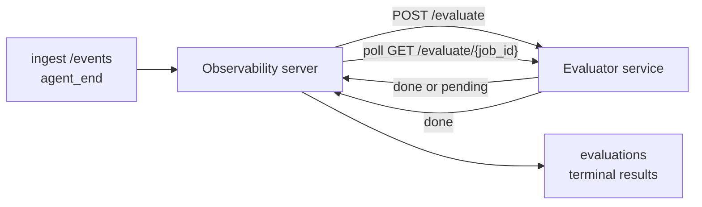

L'observabilité FailproofAI peut automatiquement évaluer la qualité de chaque exécution d'agent terminée : vous fournissez un petit service de scoring, et l'observabilité s'occupe du reste. Utilisez-la pour suivre les dimensions qui vous importent (utilité, efficacité des outils, factualité, sécurité — c'est vous qui choisissez), détecter les régressions tôt et comparer des agents ou des environnements en un coup d'œil. Le scoring est optionnel : le pipeline ne fait rien tant que vous n'avez pas défini `EVALUATOR_ENDPOINT` sur le serveur.

> **Remarque :** Vous définissez les dimensions de score. Votre évaluateur peut retourner les clés numériques de son choix ; l'observabilité stocke, suit les tendances et affiche tout ce que vous lui renvoyez.

## Vue d'ensemble

1. **Écrivez un scorer.** Mettez en place un petit service HTTP qui lit la transcription d'une session et retourne des scores. L'observabilité embarque une référence fonctionnelle que vous pouvez copier. Voir [Écrire un évaluateur avec le SDK](#writing-an-evaluator-with-the-sdk).
2. **Pointez l'observabilité vers ce service.** Définissez `EVALUATOR_ENDPOINT` (ainsi qu'un `EVALUATOR_TOKEN` partagé) sur le processus serveur.
3. **Observez les scores arriver.** Chaque session terminée est scorée automatiquement ; les résultats apparaissent sur la page de détail de la session, dans la grille des sessions et dans les tableaux de bord enregistrés.


*Une fois un évaluateur configuré, chaque exécution terminée est scorée et les résultats apparaissent dans le panneau droit de la session : le résumé en haut, puis les barres de score par dimension avec le raisonnement associé.*

---

## Fonctionnement



Lorsque le SDK d'observabilité émet un événement `agent_end` pour une session, le serveur planifie une évaluation. Il envoie ensuite la transcription complète des événements à votre service d'évaluation via POST, qui peut soit :

- **Retourner le résultat directement** avec `{"status":"done", "scores":{...}, "reasoning":{...}, "summary":"..."}`. Le résultat est ajouté à la chronologie d'évaluation de la session. `reasoning` et `summary` sont optionnels.
- **Différer** avec `{"status":"pending", "job_id":"abc-123"}`. L'observabilité appelle alors `GET {EVALUATOR_ENDPOINT}/evaluate/abc-123` jusqu'à ce que votre évaluateur retourne `{"status":"done", ...}` ou `{"status":"error", "error":"..."}`.

  La cadence de polling est par job : une réponse `pending` peut inclure `next_poll_secs` pour la surcharger ; sinon l'observabilité utilise la valeur `default_poll_interval_secs` de `GET /config` ; à défaut, le serveur se rabat sur `EVALUATOR_POLLING_INTERVAL_SECS` (10 s par défaut). Toutes les valeurs sont limitées à [1 s, 1 h].

Les sessions qui n'émettent jamais `agent_end` (par exemple, un processus d'agent planté) peuvent également être traitées : le `GET /config` de l'évaluateur peut retourner `{"inactivity_timeout_secs": 1800}`, et l'observabilité évaluera toute session restée inactive aussi longtemps. Définir ce champ à `null` ou l'omettre désactive ce mécanisme de secours.

Le pipeline est entièrement inactif lorsque `EVALUATOR_ENDPOINT` n'est pas défini.

Une session peut accumuler **plusieurs évaluations terminales dans le temps** : chaque événement `agent_end` (ainsi que chaque réévaluation manuelle depuis le tableau de bord) ajoute une nouvelle ligne d'évaluation. C'est la méthode recommandée pour évaluer une conversation reprise : un utilisateur termine un agent, revient plus tard, envoie de nouveaux événements, termine à nouveau l'agent, et une deuxième évaluation s'exécute sur la transcription complète mise à jour. Le tableau de bord affiche l'évaluation la plus récente comme titre principal, et les évaluations précédentes dans une chronologie rétractable. Pendant qu'une évaluation est en cours pour une session, les événements `agent_end` supplémentaires pour cette session sont ignorés ; le suivant une fois l'évaluation en cours terminée mettra en file d'attente une nouvelle évaluation normalement.

Le mécanisme de secours par inactivité s'applique également aux sessions reprises : si de nouveaux événements arrivent après une évaluation terminale précédente et que la session devient ensuite inactive au-delà de `inactivity_timeout_secs`, une nouvelle évaluation est mise en file d'attente.

Les échecs transitoires (5xx, 429, timeouts, erreurs réseau) sont relancés avec un backoff exponentiel jusqu'à `EVALUATOR_MAX_ATTEMPTS` ; les réponses 4xx sont terminales. L'observabilité peut fonctionner en toute sécurité avec plusieurs instances de serveur en parallèle ; le travail est partitionné de sorte qu'une même session n'est jamais traitée deux fois simultanément.

---

## Contrat HTTP

Chaque route authentifiée utilise **l'authentification par bearer token**. La même valeur doit être configurée des deux côtés :

- Serveur d'observabilité : variable d'environnement `EVALUATOR_TOKEN`
- Service d'évaluation : configuré de la même manière (le SDK `agenteye-evaluator` lit `EVALUATOR_TOKEN` par convention)

Si `EVALUATOR_TOKEN` n'est pas défini, le serveur n'envoie pas d'en-tête `Authorization` ; l'évaluateur peut alors accepter les requêtes anonymes, ce qui est acceptable sur un réseau interne uniquement, mais déconseillé sur Internet public.

### Routes que l'évaluateur doit exposer

| Route | Corps / paramètres | Réponse |
|---|---|---|
| `GET /health` | aucun | `{"status":"ok"}` (ouvert, sans authentification) |
| `GET /config` | aucun | `{"inactivity_timeout_secs": <int> \| null, "default_poll_interval_secs": <int> \| omitted}` |
| `POST /evaluate` | JSON `EvalRequest` | `{"status":"done", ...}` ou `{"status":"pending", "job_id":"..."}` |
| `GET /evaluate/{id}` | aucun | même format de réponse que `/evaluate` |

### Corps `EvalRequest` envoyé par le serveur

```json
{
  "schema_version": "1",
  "session_id":     "session-abc123",
  "agent_id":       "planner",
  "environment":    "production",
  "started_at":     "2026-05-10T12:00:00Z",
  "ended_at":       "2026-05-10T12:05:00Z",
  "events": [
    { "id": 1234, "ts": "...", "event_type": "agent_start", "payload": { ... } },
    ...
  ]
}
```

### Formats de réponse

**Synchrone (done) :**

```json
{
  "status": "done",
  "scores": { "helpfulness": 0.85, "tool_efficiency": 0.6 },
  "reasoning": {
    "helpfulness": "answered the question directly with citations",
    "tool_efficiency": "called list_files three times when one would have done"
  },
  "summary": "strong answer quality, weak tool selection"
}
```

`reasoning` (une carte de justification par score) et `summary` (un récit global en un paragraphe) sont tous deux optionnels. Les clés de `reasoning` doivent refléter celles de `scores` ; le tableau de bord affiche chaque entrée directement sous la barre de score correspondante. Les évaluateurs plus anciens qui ne retournent que `scores` continuent de fonctionner sans modification ; `reasoning` et `summary` sont simplement considérés comme nuls et les éléments d'interface correspondants sont omis.

**Asynchrone (différé) :**

```json
{ "status": "pending", "job_id": "abc-123", "next_poll_secs": 30 }
```

`next_poll_secs` est optionnel ; s'il est omis, le serveur se rabat sur `default_poll_interval_secs` de l'évaluateur via `/config`, puis sur sa propre variable d'environnement `EVALUATOR_POLLING_INTERVAL_SECS`.

**Erreur terminale côté évaluateur :**

```json
{ "status": "error", "error": "model service unavailable" }
```

Le serveur traite tout autre corps 2xx comme une erreur de protocole et enregistre une `error` terminale pour la session.

---

## Écrire un évaluateur avec le SDK

Vous n'avez pas à implémenter le contrat HTTP manuellement. Le package Python `agenteye-evaluator` vous offre un wrapper FastAPI typé qui gère l'authentification, le routage et les formats requête/réponse à votre place.

L'observabilité FailproofAI embarque également un **évaluateur de référence fonctionnel** qui score `helpfulness`, `tool_efficiency` et `factuality` à partir de la structure de la transcription. Copiez-le comme point de départ et remplacez la logique par la vôtre : un juge LLM, un moteur de règles, tout ce qui correspond à votre critère de qualité.

Évaluateur minimal viable :

```python
import os
from agenteye_evaluator import Evaluator, EvalRequest, EvalResponse

app = Evaluator(token=os.environ["EVALUATOR_TOKEN"])

@app.evaluator
def run(req: EvalRequest) -> EvalResponse:
    # Inspect req.events (the full session transcript) and return scores.
    tool_calls = sum(1 for e in req.events if e.event_type == "tool_use")
    return EvalResponse(
        scores={"tool_calls": float(tool_calls)},
        reasoning={"tool_calls": f"{tool_calls} tool invocations in the transcript"},
        summary="tight tool loop" if tool_calls < 5 else "agent looped on tools",
    )
```

L'instance `app` s'exécute sous n'importe quel serveur ASGI, donc `uvicorn module:app` suffit à la démarrer.

Pour les évaluateurs qui doivent différer un traitement coûteux, retournez `JobPending` à la place et enregistrez un handler `@app.job_lookup` ; le serveur d'observabilité interroge `GET /evaluate/{job_id}` jusqu'à ce que vous retourniez un statut terminal ou que la limite `EVALUATOR_MAX_POLL_DURATION_SECS` (1 h par défaut) soit atteinte.

La référence API complète, le modèle asynchrone et le schéma des événements sont documentés dans le README du SDK `agenteye-evaluator`.

---

## Exécuter votre évaluateur

L'évaluateur est **votre service** — l'observabilité FailproofAI ne fournit pas d'évaluateur par défaut, vous le construisez et le déployez là où vous déployez vos propres services. Il s'exécute sous n'importe quel serveur ASGI (par exemple `uvicorn my_evaluator:app`) ; exposez les routes `/health`, `/config` et `/evaluate` définies dans le [contrat HTTP](#http-contract), puis pointez le serveur vers lui (voir [Configurer le serveur](#configuring-the-server)).

Une fois l'évaluateur accessible, `GET /health` retourne `{"status":"ok"}`. Après une exécution complète d'un agent, `GET /evaluations` sur le serveur retourne une ligne avec `status: "done"` et les scores produits par votre évaluateur.

---

## Configurer le serveur

À définir sur le processus serveur :

| Variable d'env | Signification |
|---|---|
| `EVALUATOR_ENDPOINT` | URL de base de votre évaluateur (`http://evaluator:9000`). Non définie = pipeline désactivé. |
| `EVALUATOR_TOKEN` | Bearer token. Doit être identique à la valeur configurée dans le service d'évaluation. |
| `EVALUATOR_WORKERS` | Tâches worker par instance de serveur (2 par défaut). |
| `EVALUATOR_CLAIM_BATCH` | Lignes réclamées par tick worker (4 par défaut). Les lots sont traités **en parallèle** ; la concurrence effective sur votre endpoint d'évaluation est `EVALUATOR_WORKERS × EVALUATOR_CLAIM_BATCH`. |
| `EVALUATOR_POLL_IDLE_SECS` | Durée de veille d'un worker entre les tentatives de dispatch lorsqu'aucune évaluation n'est due (2 s par défaut). |
| `EVALUATOR_POLLING_INTERVAL_SECS` | Dernier recours pour la cadence de `GET /evaluate/{id}` lorsque ni `next_poll_secs` par réponse ni `default_poll_interval_secs` de l'évaluateur ne sont définis (10 s par défaut). |
| `EVALUATOR_REQUEST_TIMEOUT_MS` | Timeout par requête (30000 par défaut). |
| `EVALUATOR_MAX_ATTEMPTS` | Après ce nombre d'échecs transitoires, le résultat est enregistré comme `error` terminale (5 par défaut). |
| `EVALUATOR_CONFIG_REFRESH_SECS` | Cadence de `GET /config` (300 par défaut). |
| `EVALUATOR_MAX_POLL_DURATION_SECS` | Durée maximale en temps réel pendant laquelle une session peut rester dans la file de polling avant d'être terminée en `timeout` (3600 s par défaut). Protège contre un évaluateur qui retourne indéfiniment `pending`. |

Pour activer le scoring automatique, définissez `EVALUATOR_ENDPOINT` et `EVALUATOR_TOKEN` sur le serveur, puis redémarrez-le pour prendre en compte la modification. Sans `EVALUATOR_ENDPOINT`, le pipeline reste inactif.

Les paramètres de réglage ci-dessus sont optionnels ; définissez les variables d'environnement correspondantes sur le serveur uniquement si vous souhaitez remplacer les valeurs par défaut.

---

## Référence API

| Méthode | Chemin | Permission requise | Objectif |
|---|---|---|---|
| `GET` | `/evaluations` | `evaluations:read` | Interroger les résultats terminaux. Supporte `session_id`, `agent_id`, `environment`, `status` (`done`/`error`/`timeout`), `ts_from`, `ts_to`, `cursor`, `limit`, `score_filters`, `latest_per_session`. `limit` est 50 par défaut et plafonné à 200 (différent de `/events` qui est plafonné à 1000). `environment` accepte une liste séparée par des virgules (ex. `environment=prod,staging`) ; les valeurs uniques fonctionnent toujours. Avec `latest_per_session=true`, la réponse contient au plus une ligne par `session_id` (la plus récente par `completed_at`), utilisée par la page de liste des sessions pour réduire la chronologie d'évaluation d'une session à son titre courant. False par défaut (retourne l'historique complet). |
| `GET` | `/evaluations/aggregate` | `evaluations:read` | Santé d'évaluation agrégée pour un sous-ensemble filtré : nombre total, répartition done/error/timeout, statistiques par clé de score (count/avg/min/max/p50 sur les clés `scores` arbitraires), et une chronologie par tranches de temps. Accepte les **mêmes paramètres de filtre que `/evaluations`** plus `featured_keys` (CSV des clés de score à suivre) et `latest_per_session`. Alimente la fonctionnalité Tableaux de bord ; les métriques sont exactes sur l'ensemble correspondant, sans échantillonnage. |
| `GET` | `/evaluations/environments` | `evaluations:read` | Valeurs d'environnement distinctes de la table `evaluations`. Utilisé pour alimenter les listes déroulantes de filtres limitées aux données accessibles en lecture d'évaluation. |
| `GET` | `/evaluation-jobs` | `evaluations:read` | Visibilité sur les évaluations en cours. Filtre par `status` (`pending`/`polling`). |
| `GET` | `/events` | `events:read` | Diffuser les événements bruts d'une session. Supporte `session_id`, `agent_id`, `event_type` (CSV), `environment` (CSV), `ts_from`, `ts_to`, `cursor`, `limit` et `order`. `order` est `desc` (plus récent en premier, par défaut) ou `asc` (plus ancien en premier) ; une valeur non reconnue revient à `desc`. Paginez via le `next_cursor` de la réponse (un id d'événement) : passez-le comme `cursor` pour obtenir la page suivante ; avec `asc` la page suivante contient les événements après cet id, avec `desc` les événements avant. `limit` est 50 par défaut et plafonné à 1000. |
| `GET` | `/sessions/:session_id/export` | `events:read` | Retourne le corps JSON exact que l'évaluateur recevrait pour cette session, servi en pièce jointe téléchargeable nommée `session-<id>.json`. Utile pour rejouer des sessions de production via `agenteye-evaluator` lors de tests hors ligne. Les octets sont identiques à ce qu'envoie le pipeline d'évaluation. |
| `POST` | `/sessions/:session_id/re-evaluate` | `evaluations:trigger` | Mettre en file d'attente une nouvelle évaluation pour une session ; s'exécute qu'une évaluation précédente existe ou non. Le nouveau résultat est **ajouté** à la chronologie d'évaluation de la session plutôt que d'écraser le précédent, les scores antérieurs restent donc visibles dans l'historique. Retourne `202` lors de la mise en file d'attente, `404` pour une session inconnue, `409` si une évaluation est déjà en cours. À utiliser après le déploiement d'un nouvel évaluateur, ou pour les sessions qui n'ont jamais émis `agent_end`. |

### Filtrage par plage de score : `score_filters`

`GET /evaluations` accepte un paramètre optionnel `score_filters` qui restreint les résultats selon les valeurs numériques de l'objet `scores`. Le paramètre est une liste séparée par des virgules d'entrées `key:min..max` ; chaque borne peut être omise. Plusieurs entrées se combinent avec un ET logique. Les lignes où la clé nommée est absente ou non numérique sont exclues. Une requête peut contenir au maximum 20 entrées de filtre ; dépasser ce nombre retourne HTTP 400.

Exemples :
```text
# helpfulness in [0.5, 0.8]
GET /evaluations?score_filters=helpfulness:0.5..0.8

# tool_efficiency at most 0.3 (no lower bound)
GET /evaluations?score_filters=tool_efficiency:..0.3

# helpfulness >= 0.5 AND factuality >= 0.9
GET /evaluations?score_filters=helpfulness:0.5..,factuality:0.9..
```

Chaque objet de réponse `/evaluations` comporte ces champs :

| Champ | Type | Notes |
|---|---|---|
| `evaluation_id` | chaîne (UUID) | L'identifiant canonique de cette évaluation terminale. Chaque évaluation terminale reçoit un nouvel UUID ; une seule session peut en contenir plusieurs. |
| `id` | chaîne (UUID) | Alias de compatibilité ascendante portant la même valeur que `evaluation_id`. |
| `session_id` | chaîne | La session contre laquelle cette évaluation a été exécutée. Une session peut avoir plusieurs évaluations dans sa chronologie. |
| `agent_id` | chaîne | Identifie l'agent qui a produit la session. |
| `environment` | chaîne | Étiquette d'environnement copiée depuis la session. |
| `status` | enum | L'un de `"done"`, `"error"`, `"timeout"`. |
| `scores` | objet \| null | Scores retournés par votre évaluateur. |
| `reasoning` | objet \| null | Carte de justification optionnelle par score retournée par votre évaluateur. Les clés reflètent généralement celles de `scores`. Le tableau de bord affiche chaque entrée sous sa barre de score. |
| `summary` | chaîne \| null | Récit global optionnel en un paragraphe retourné par votre évaluateur. Le tableau de bord l'affiche au-dessus du détail par score comme titre de l'évaluation. |
| `error` | chaîne \| null | Renseigné uniquement pour `"error"` / `"timeout"`. |
| `attempt_count` | entier | Nombre de tentatives de dispatch (≥ 1). |
| `duration_ms` | entier \| null | Durée de la dernière tentative. |
| `completed_at` | chaîne (ISO 8601 UTC) | Moment où le résultat terminal a été enregistré. Les résultats sont triés par `completed_at` (plus récent en premier). |
| `created_at` | chaîne (ISO 8601 UTC) | Porte le même horodatage que `completed_at` (sémantique d'écriture unique). |

---

## Permissions

| Permission | Accorde |
|---|---|
| `evaluations:read` | Lister les résultats d'évaluation, voir les scores dans le tableau de bord et charger les métriques de santé du tableau de bord. |
| `evaluations:trigger` | Mettre manuellement en file d'attente une évaluation pour une session via `POST /sessions/:session_id/re-evaluate` ou le bouton de réévaluation du tableau de bord. |
| `dashboards:read` | Consulter les tableaux de bord enregistrés (nécessite également `evaluations:read` pour charger leurs métriques). |
| `dashboards:write` | Créer et modifier des tableaux de bord. |
| `dashboards:delete` | Supprimer des tableaux de bord. |

L'administrateur bootstrap (`ADMIN_KEY`, `ADMIN_EMAIL`) reçoit automatiquement toutes ces permissions.

---

## Consulter les résultats

- **`/sessions/<id>`** : chronologie des événements + panneau droit affichant les scores de la session et toute erreur de la tentative de dispatch. Si votre clé dispose de `evaluations:trigger`, un bouton **re-evaluate** apparaît à côté du bouton d'export, utile pour les sessions qui n'ont jamais émis `agent_end` ou pour actualiser les scores après le déploiement d'un nouvel évaluateur. Le tableau de bord interroge le nouveau résultat et met à jour le panneau droit à son arrivée.
- **`/sessions`** : grille de sessions filtrable ; la colonne de score affiche le statut d'évaluation et les scores de chaque session en un coup d'œil.
- **`/dashboards`** : vues de santé d'évaluation enregistrées (voir [Tableaux de bord](#dashboards) ci-dessous).


*La grille des sessions affiche le statut d'évaluation et les scores de chaque exécution en un coup d'œil ; les badges rouge/orange/vert font ressortir les scores faibles.*

---

## Tableaux de bord

La page **Tableaux de bord** (`/dashboards`) vous permet d'enregistrer une combinaison de filtres d'évaluation sous forme de vue nommée et réutilisable, et de surveiller l'état de cette tranche d'évaluations en un coup d'œil. Les tableaux de bord sont **partagés à l'échelle de toute votre organisation** ; toute personne disposant de `dashboards:read` voit le même ensemble.

Chaque tableau de bord fixe :

- **Filtres** : les mêmes contrôles que la page des sessions : environnement, statut, agent, une fenêtre temporelle glissante et des filtres de plage de score (`key:min..max`).
- **Une configuration d'affichage** : les clés de score à mettre en avant, les seuils de santé vert/orange/rouge, les panneaux à afficher et s'il faut réduire à la dernière évaluation par session.

Chaque carte affiche le nombre de sessions correspondantes, une répartition done/error/timeout, la moyenne de chaque score mis en avant et une petite sparkline de tendance. Ouvrir un tableau de bord affiche les panneaux en plein écran ; **"ouvrir dans les sessions"** vous amène directement à la page des sessions pré-filtrée sur cette tranche exacte. Les métriques sont calculées côté serveur sur l'ensemble correspondant (via `GET /evaluations/aggregate`), les chiffres sont donc exacts et non échantillonnés.


**Permissions :** la consultation nécessite `dashboards:read` et `evaluations:read` ; la création et la modification nécessitent `dashboards:write` ; la suppression nécessite `dashboards:delete`. L'administrateur bootstrap reçoit toutes ces permissions automatiquement.

---

## Dépannage

**Les sessions existent mais aucune évaluation n'est créée.** Vérifiez que `EVALUATOR_ENDPOINT` est défini sur le processus serveur, que le serveur et l'évaluateur partagent la même valeur `EVALUATOR_TOKEN`, et que l'endpoint `/health` de l'évaluateur est accessible depuis le serveur. Sans `EVALUATOR_ENDPOINT`, le pipeline est inactif.

**Les évaluations en cours s'accumulent.** Interrogez `GET /evaluation-jobs` pour voir la file en cours. Inspectez `attempt_count`, `next_attempt_at` et `last_error` sur chaque ligne. Causes fréquentes : service d'évaluation inaccessible ou retournant des 5xx (relancé avec backoff), `EVALUATOR_TOKEN` incorrect (401 est terminal), ou évaluateur asynchrone retournant `pending` indéfiniment (voir ci-dessous).

**Les sessions sont terminées mais aucune évaluation terminale n'apparaît.** Interrogez `GET /evaluation-jobs?status=polling` ; le résultat est peut-être encore en cours. Si un job est bloqué sur `pending`, le serveur a du mal à joindre l'évaluateur ; vérifiez que l'évaluateur est en ligne et que `EVALUATOR_TOKEN` correspond.

**`HTTP 401 from evaluator: invalid bearer token`.** Le `EVALUATOR_TOKEN` sur le serveur ne correspond pas à la valeur configurée dans le service d'évaluation. Ils doivent être identiques.

**L'évaluateur asynchrone retourne `pending` indéfiniment.** Le serveur interroge `GET /evaluate/{job_id}` jusqu'à ce que l'évaluateur retourne `done` ou `error`, ou jusqu'à ce que la limite `EVALUATOR_MAX_POLL_DURATION_SECS` (1 h par défaut) soit atteinte. Passé ce délai, l'évaluation est enregistrée comme `timeout` et retirée de la file en cours. Augmentez `EVALUATOR_MAX_POLL_DURATION_SECS` si votre évaluateur a légitimement besoin de plus que la valeur par défaut.

---

## Prochaines étapes

- [SDK Python](/fr/agenteye/python-sdk) : émettre les événements `agent_end` qui déclenchent le scoring.
- [Clés API](/fr/agenteye/api-keys) : les permissions `evaluations:read` et `evaluations:trigger`.
- [Audits](/fr/agenteye/audits) : l'autre fonctionnalité de qualité automatisée de l'observabilité, pour la révision basée sur les politiques.