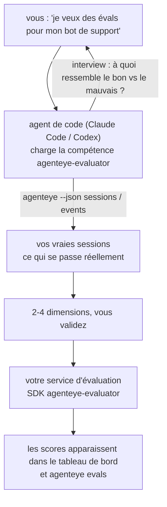

Passez de *« je pense que notre agent laisse parfois à désirer »* à un service de scoring déployé, avec votre agent de code qui s'occupe à la fois des décisions et de la construction. La **compétence d'évaluateur d'observabilité Failproof AI** (`agenteye-evaluator`) est une *compétence d'agent* : un petit dossier d'instructions qu'un agent de code tel que Claude Code ou Codex charge à la demande. Elle apprend à l'agent à déterminer quelles dimensions de qualité méritent d'être suivies pour *votre* agent, puis à écrire, tester et déployer le [service d'évaluation](/fr/agenteye/evaluation-suite) qui les note.

Ce n'est **pas** un outil de scoring hébergé, un registre vers lequel vous téléversez du contenu, ni un système de plugins. Votre évaluateur reste votre propre service HTTP sur votre propre infrastructure, exactement comme décrit dans le guide [Evaluation suite](/fr/agenteye/evaluation-suite). La compétence enseigne simplement à votre agent à bien le construire — tout ce qu'elle fait, vous pourriez le faire vous-même en écrivant le même code.

---

## La partie difficile, c'est de décider quoi scorer

La surface du SDK est réduite — un décorateur et deux modèles — et un agent peut l'écrire à partir du seul [contrat](/fr/agenteye/evaluation-suite#http-contract). Ce n'est pas là que les évaluateurs échouent. Ils échouent parce qu'ils scorent la mauvaise chose, et un évaluateur qui score la mauvaise chose est pire que l'absence d'évaluateur : il produit un tableau de bord que tout le monde apprend à ignorer.

L'essentiel de la compétence se passe donc avant qu'une seule ligne de code n'existe. L'agent vous interroge (*« décrivez une exécution qui s'est bien passée ; maintenant une qui s'est mal passée »*), puis parcourt vos vraies sessions via la [CLI `agenteye`](/fr/agenteye/cli) en les lisant de bout en bout. Ces deux sources sont souvent en désaccord, et l'écart est précisément l'enjeu : ce que vous avez l'intention de mesurer versus ce que vos transcriptions peuvent réellement prendre en charge. Une dimension ne survit que si elle est **calculable** à partir des événements et **discriminante** — si elle obtient 0,9 aussi bien sur votre bonne exécution que sur la mauvaise, elle n'enseigne rien et est éliminée.

Ce qui en ressort est une proposition de 2 à 4 dimensions avec les raisonnements associés, que vous devez valider avant qu'une seule ligne ne soit écrite.



---

## Relation avec les autres composants d'évaluation

Quatre pages couvrent le scoring, et elles se relaient dans l'ordre :

| Page | Ce que c'est | Quand y recourir |
|---|---|---|
| **[Evaluations](/fr/agenteye/evaluations)** | La fonctionnalité : scores sur la grille de sessions, tableaux de bord, réévaluation | Quand vous voulez savoir ce que le scoring automatique vous apporte |
| **[Evaluation suite](/fr/agenteye/evaluation-suite)** | Le contrat HTTP, le SDK, les variables d'environnement du serveur | Quand vous implémentez ou déboguez l'évaluateur vous-même |
| **Compétence d'évaluateur** (cette page) | Une porte d'entrée en langage naturel pour concevoir *et* construire le scorer | Quand vous voulez passer de « je veux des évals » à un service opérationnel |
| **[Compétence CLI](/fr/agenteye/cli-skill)** | Une porte d'entrée en langage naturel sur la CLI `agenteye` | Quand vous voulez *lire* les scores que vous avez déjà |
| **[Compétence Python SDK](/fr/agenteye/python-sdk-skill)** | Une porte d'entrée en langage naturel pour instrumenter votre agent | Quand votre agent n'émet pas encore de sessions — il n'y a rien à scorer |

### vs. la compétence CLI : construire versus lire

Les deux compétences sont délibérément non redondantes, et les installer toutes les deux est la configuration habituelle — l'agent choisit entre elles en fonction de ce que vous demandez :

- **`agenteye-evaluator`** (cette page) construit ce qui *produit* les scores. Sa mission s'arrête quand les scores apparaissent pour la première fois.
- **[`agenteye-cli`](/fr/agenteye/cli-skill)** lit les scores qui existent déjà (`agenteye evals`). *« La qualité a-t-elle chuté cette semaine ? »* est sa question, pas celle de cette compétence.

---

## Prérequis

1. La **CLI `agenteye` installée et connectée** (`pipx install agenteye`, puis `agenteye login`). La compétence l'utilise deux fois : pour récupérer les vraies sessions sur lesquelles elle base sa conception, et pour confirmer que vos scores sont bien arrivés à la fin. Votre connexion nécessite `events:read`, plus `evaluations:read` pour cette vérification finale. Comme avec la compétence CLI, elle **ne peut pas** compléter la connexion par code à usage unique envoyé par e-mail à votre place.
2. **Un endroit pour héberger l'évaluateur.** Il est construit en image et exécuté en tant que service long-running, il lui faut donc un vrai dépôt, pas un fichier temporaire. Les évaluateurs vivent souvent dans leur propre dépôt, séparé de l'agent évalué — la compétence cherche un dépôt existant et demande avant d'en créer un nouveau.
3. **La roue SDK `agenteye-evaluator`** — lisez la section suivante avant de laisser votre agent taper des commandes `pip`.

---

## Où l'obtenir

La compétence est publiée dans la collection publique de compétences de Failproof AI :

**[github.com/FailproofAI/skills](https://github.com/FailproofAI/skills)** → [`skills/agenteye-evaluator/`](https://github.com/FailproofAI/skills/tree/main/skills/agenteye-evaluator)

Le dépôt est public et la compétence n'a pas besoin de ses propres identifiants — elle pilote uniquement la CLI `agenteye` avec la session *que vous* avez ouverte, et écrit du code dans *votre* dépôt. Notez qu'elle est livrée dans son propre dossier et **ne fait pas partie** du package `pipx install agenteye`, ne la cherchez donc pas là.

## Installer la compétence

Le chemin le plus rapide est la CLI [`skills`](https://skills.sh), qui récupère le dossier et le dépose là où votre agent cherche :

```bash
# Claude Code, ce projet uniquement
npx skills add FailproofAI/skills --skill agenteye-evaluator -a claude-code

# tous les projets (installe dans ~/.claude/skills/)
npx skills add FailproofAI/skills --skill agenteye-evaluator -a claude-code -g --copy

# Codex à la place
npx skills add FailproofAI/skills --skill agenteye-evaluator -a codex
```

Gérez-la ensuite comme n'importe quelle autre compétence :

```bash
npx skills list -a claude-code           # ce qui est installé
npx skills update agenteye-evaluator     # récupérer la dernière version
npx skills remove agenteye-evaluator     # la supprimer
```

Vous préférez installer manuellement ? Une compétence d'agent est simplement un dossier contenant un `SKILL.md` (plus des références optionnelles), donc la copier fonctionne aussi :

- **Claude Code** : placez le dossier `agenteye-evaluator/` dans `~/.claude/skills/` (tous les projets) ou `<votre-dépôt>/.claude/skills/` (ce dépôt uniquement). Claude Code le découvre automatiquement — vérifiez avec la liste `/skills`, ou demandez simplement des évals.
- **Codex (OpenAI)** : Codex lit le même `SKILL.md`. Le fichier `agents/openai.yaml` fourni définit `allow_implicit_invocation: true`, donc Codex sélectionne automatiquement la compétence quand une tâche correspond ; sinon invoquez-la explicitement avec `$agenteye-evaluator`.

---

## Le SDK n'est pas sur le PyPI public

> **Avertissement :** Lisez ceci avant de laisser un agent installer le SDK.

La compétence est publique ; le SDK qu'elle pilote ne l'est pas. `agenteye-evaluator` est livré uniquement sous forme d'artefact de version privée, et contrairement à `agenteye`, le nom est **non revendiqué sur le PyPI public** — donc un simple `pip install agenteye-evaluator` pourrait importer le package de quelqu'un d'autre dans le service qui lit vos transcriptions de production. C'est un problème de chaîne d'approvisionnement, pas une faute de frappe.

La compétence le sait et parcourt une liste d'installation par ordre de priorité, s'arrêtant à la première étape applicable : la source du monorepo si vous êtes dans le dépôt AgentEye, sinon la roue de version privée depuis GitHub Releases (nécessite un accès), et si aucune n'est accessible, elle **s'arrête et vous demande de contacter votre interlocuteur Failproof AI pour obtenir la roue** plutôt que d'improviser.

Donc si votre agent propose un simple `pip install agenteye-evaluator` depuis le PyPI public, c'est le signe que la compétence n'a jamais été chargée. Arrêtez-vous là et vérifiez qu'elle est bien installée.

---

## Ce que vous pouvez lui demander

Un vrai aller-retour commence par une demande vague et se termine par une conception validée, pas par du code :

```text
vous  ▸ Je veux des évals pour notre bot de support. Je pense qu'il est parfois mauvais.

agent ▸ Avant d'écrire quoi que ce soit : décrivez une exécution qui s'est bien passée,
        et une qui s'est mal passée.

vous  ▸ Bien : il répond à partir de la documentation. Mal : il invente des choses,
        ou abandonne et dit « contactez le support ».

agent ▸ Exécution : agenteye --json sessions --status error --since 7d
        Lecture de 5 sessions, dont deux que vous qualifieriez de mauvaises.

        Vos mots parlent de factualité et de déflexion. Les transcriptions
        confirment la déflexion (2 sur 5 se terminent par un transfert au support,
        c'est évident dans model_response.content), mais la factualité
        nécessite une vérité de terrain que vos événements ne contiennent pas.

        Je scorerais donc trois choses :
          - deflection      règles, peu coûteux, distingue vos deux exécutions
          - tool_efficiency règles, détecte la boucle de retry dans run-004
          - groundedness    juge LLM : chaque affirmation est-elle dans la doc récupérée ?

        La « factualité » nécessiterait une vérité de terrain que nous n'avons pas ;
        groundedness est ce que vos transcriptions peuvent réellement prendre en charge.
        D'accord avec ces trois noms ? Les renommer plus tard fragmente l'historique.

vous  ▸ oui

agent ▸ Pas d'évaluateur dans ce dépôt. Dois-je en créer un ici, ou
        en avez-vous un ailleurs ?
```

À partir de là, il écrit d'abord les dimensions basées sur des règles (gratuites, instantanées, déterministes), les teste sur une vraie session capturée — y compris les sessions vides et inachevées qui font planter les évaluateurs naïfs — et ne fait appel à un juge LLM que pour la dimension subjective. Il connaît les [limites du dispatcher](/fr/agenteye/evaluation-suite#configuring-the-server) — un timeout de requête de 30s et 8 appels simultanés à l'échelle du déploiement — donc si le juge ne peut pas raisonnablement tenir dans ces contraintes, il passe en mode asynchrone avec `JobPending` plutôt que de laisser votre juge être annulé et retenté cinq fois pour cinq fois le coût.

Ensuite il déploie, définit les deux variables d'environnement du serveur, et confirme avec `agenteye --json evals --session-id <id>` que les scores sont bien arrivés. L'arrivée des scores est la seule preuve qui compte.

---

## Points de vigilance

- **Les noms de dimensions sont quasi permanents.** Les clés de score sont des chaînes arbitraires et la plateforme suit l'évolution de tout ce que vous envoyez, ce qui signifie que rien en aval ne corrige un mauvais choix. Renommez plus tard et l'historique se fragmente : les anciennes sessions gardent l'ancienne clé et la tendance se brise. C'est pourquoi la compétence obtient une validation explicite avant d'écrire du code — prenez cette étape au sérieux.
- **Les fixtures sont de vraies transcriptions de production.** Concevoir à partir de vraies sessions implique de les récupérer sur disque, et elles peuvent contenir des données clients. La compétence demande avant de les committer dans git ; en cas de doute, gardez `fixtures/` hors du dépôt et demandez à chaque développeur de récupérer les siennes.
- **L'agent écrit et déploie un service qui lit chaque transcription.** Il agit en votre nom, dans les limites des permissions de votre connexion CLI, mais revoyez l'évaluateur comme tout autre code touchant des données de production.

---

## Prochaines étapes

- **[Evaluation suite](/fr/agenteye/evaluation-suite)** : le contrat HTTP, le SDK et les variables d'environnement du serveur que la compétence configure.
- **[Evaluations](/fr/agenteye/evaluations)** : là où les scores apparaissent une fois arrivés.
- **[Compétence CLI](/fr/agenteye/cli-skill)** : la compétence complémentaire, pour lire les résultats plutôt que construire le scorer.
- **[CLI](/fr/agenteye/cli)** : la référence des commandes derrière les données de session sur lesquelles la compétence se base.