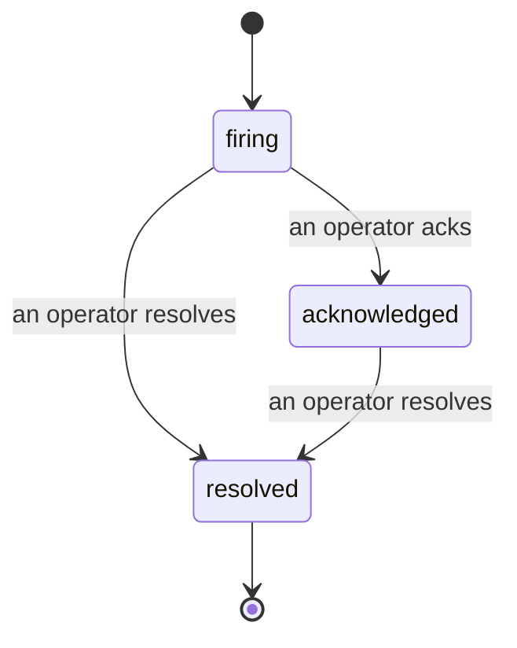

Quand une alerte se déclenche, la première question est toujours « qui s'en occupe ? » Les incidents y répondent : dès qu'un seuil est franchi, tout le monde peut voir que l'incident est ouvert, qui en est responsable, et exactement ce qui s'est passé jusqu'ici — avec un historique clair et attribué que vous pouvez remettre directement à un post-mortem.

*La liste regroupe les incidents ouverts par état et permet de filtrer par sévérité et par responsable, pour voir immédiatement ce qui nécessite une intervention humaine.*

## Savoir qui s'en occupe, en un coup d'œil

Fini le « quelqu'un regarde ça ? » dans un fil de discussion. Un franchissement de seuil ouvre automatiquement un incident et le dépose dans une boîte de réception partagée, regroupée par état. Prenez-le en charge et votre nom y apparaît, signalant au reste de l'équipe qu'il est traité. La prise en charge est partagée : plusieurs opérateurs peuvent acquitter le même incident, chacun étant enregistré individuellement — une cellule de crise complète apparaît par nom au lieu que les actions se chevauchent. Assignez un responsable unique pour le triage, et filtrez la liste par sévérité ou par responsable pour n'afficher que ce qui vous concerne.

## Toute l'histoire, dans une seule chronologie

Quand l'incident est terminé, le compte-rendu est déjà prêt. Ouvrez n'importe quel incident et vous disposez des preuves du franchissement de seuil, des responsables assignés et des abonnés, d'un fil de commentaires pour coordonner les actions en place, et d'une chronologie d'activité en ajout seul.

*Tout ce qui s'est passé, dans l'ordre, chaque ligne signée par celui ou celle qui l'a effectuée.*

Chaque action (ouverture, prise en charge, résolution, etc.) est inscrite dans cette chronologie et n'en est jamais effacée. Chaque entrée est attribuée : à l'opérateur qui l'a effectuée, par e-mail, ou à **automated** pour tout ce que FailproofAI Observability a fait de manière autonome, comme l'ouverture de l'incident lors du franchissement de seuil. Rien n'est anonyme et rien n'est perdu, de sorte que le post-mortem s'écrit pratiquement tout seul.

## Comment un incident évolue

- **Ouvert (firing) :** le franchissement de seuil ouvre l'incident et notifie vos canaux une seule fois. Les franchissements répétés sont regroupés dans le même incident et actualisent ses preuves au lieu de vous notifier à répétition.
- **Pris en charge (acknowledged) :** un opérateur s'en empare. Il reste ouvert, et les franchissements ultérieurs mettent à jour les preuves discrètement.
- **Résolu (resolved) :** un opérateur le clôture. La résolution automatique lorsque la condition se rétablit est prévue mais pas encore activée — un incident reste donc ouvert jusqu'à ce qu'un humain le résolve, ce qui maintient une rigueur collective sur ce qui a réellement été résolu. Un nouvel incident peut s'ouvrir ultérieurement sur la même alerte.

Une alerte ne peut avoir qu'un seul incident ouvert à la fois, de sorte qu'une règle qui oscille ne peut pas vous noyer sous les doublons. Vous pouvez également ouvrir un incident manuellement : un incident autonome pour quelque chose qu'aucune alerte n'a capturé, ou un incident rattaché à une alerte existante, si vous disposez de `incidents:write`.

## Où le trouver

Les incidents se trouvent à `/<org-slug>/incidents`. La consultation nécessite **`incidents:read`** ; l'ouverture d'un incident manuel nécessite **`incidents:write`** ; la prise en charge, l'assignation, les commentaires et la résolution nécessitent **`incidents:ack`**. Les anciennes clés accordant le droit retiré `alerts:ack` continuent de fonctionner, car il est reconnu comme `incidents:ack` — votre rotation d'astreinte n'a donc pas besoin d'être réémise.

## Voir aussi

- [Alertes](/fr/agenteye/alerts) : les règles qui ouvrent ces incidents lorsqu'un seuil est franchi.
- [Suivi des erreurs](/fr/agenteye/error-tracking) : visualisez toutes les défaillances en un seul endroit et transformez-en une en alerte.
- [Audits](/fr/agenteye/audits) : l'analyste planifié qui détecte les défaillances qu'aucune règle ne surveillait.