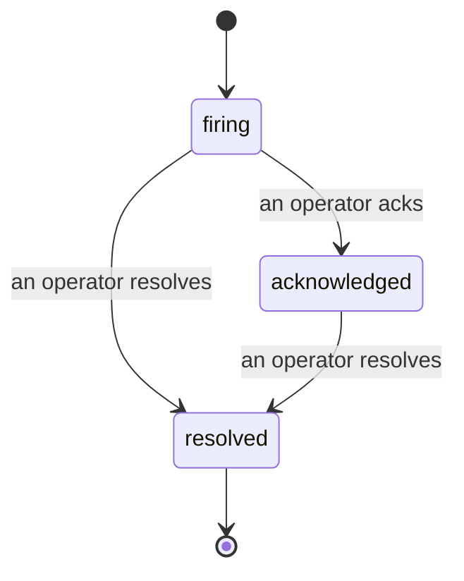

Quand une alerte se déclenche, la première question est toujours « qui s'en occupe ? » Les incidents y répondent : dès qu'un seuil est franchi, tout le monde peut voir que l'incident est ouvert, qui en est responsable, et exactement ce qui s'est passé jusqu'ici, avec un journal propre et attribué que vous pouvez transmettre directement à un post-mortem.

*La boîte de réception regroupe les incidents ouverts par état et permet de filtrer par sévérité et par responsable, afin que vous voyiez ce qui nécessite une intervention humaine immédiate.*

## Savoir d'un coup d'œil qui s'en charge

Fini le « est-ce que quelqu'un regarde ça ? » dans un fil de discussion. Un dépassement de seuil ouvre automatiquement un incident et le dépose dans une boîte de réception partagée, regroupée par état. Accusez réception et votre nom y apparaît, signalant au reste de l'équipe que c'est pris en charge. L'accusé de réception est partagé : plusieurs opérateurs peuvent acquitter le même incident, chacun étant enregistré individuellement, de sorte qu'une salle de crise entière s'affiche nominativement sans que les uns écrasent les autres. Désignez un seul responsable pour le triage, et filtrez la boîte de réception par sévérité ou par responsable pour n'afficher que ce qui vous concerne.

## Toute l'histoire, sur une seule chronologie

Une fois l'incident terminé, le compte rendu est déjà prêt. Ouvrez n'importe quel incident et vous obtenez les preuves du dépassement, ses responsables et abonnés, un fil de commentaires pour coordonner sur place, et une chronologie d'activité en ajout seul.

*Tout ce qui s'est passé, dans l'ordre, chaque ligne signée par celui ou celle qui l'a effectué.*

Chaque action (ouverture, accusé de réception, résolution, etc.) est inscrite dans cette chronologie et n'est jamais modifiée ou supprimée. Chaque entrée est attribuée : à l'opérateur qui l'a effectuée, par e-mail, ou à **automated** pour tout ce que Failproof AI Observability a fait de façon autonome, comme l'ouverture de l'incident au moment du dépassement. Rien n'est anonyme et rien n'est perdu, si bien que le post-mortem s'écrit quasiment tout seul.

## Comment un incident évolue

- **Ouvert (firing) :** le dépassement ouvre l'incident et notifie vos canaux une seule fois. Les dépassements répétés sont fusionnés dans le même incident et actualisent ses preuves au lieu de vous alerter encore et encore.
- **Acquitté (acknowledged) :** un opérateur prend en charge l'incident. Il reste ouvert, et les dépassements ultérieurs mettent à jour les preuves discrètement.
- **Résolu (resolved) :** un opérateur le clôture. La résolution automatique lorsque la condition se rétablit est prévue mais pas encore activée, donc un incident reste ouvert jusqu'à ce qu'un humain le résolve — ce qui garantit l'honnêteté sur ce qui a réellement été corrigé. Un nouvel incident peut s'ouvrir sur la même alerte par la suite.

Une alerte ne peut avoir qu'un seul incident ouvert à la fois, de sorte qu'une règle instable ne peut pas vous noyer sous des doublons. Vous pouvez également ouvrir un incident manuellement : un incident autonome pour quelque chose qu'aucune alerte n'a détecté, ou un incident attaché à une alerte existante, si vous disposez de `incidents:write`.

## Où le trouver

Les incidents se trouvent à `/<org-slug>/incidents`. La consultation nécessite **`incidents:read`** ; l'ouverture d'un incident manuel nécessite **`incidents:write`** ; l'accusé de réception, l'assignation, les commentaires et la résolution nécessitent **`incidents:ack`**. Les clés plus anciennes accordant le droit retiré `alerts:ack` continuent de fonctionner, car il est honoré en tant qu'`incidents:ack`, donc votre rotation d'astreinte n'a pas besoin d'être réémise.

## Voir aussi

- [Alertes](/fr/agenteye/alerts) : les règles qui ouvrent ces incidents lorsqu'un seuil est franchi.
- [Suivi des erreurs](/fr/agenteye/error-tracking) : visualisez chaque échec en un seul endroit et promouvez-en un en alerte.
- [Audits](/fr/agenteye/audits) : l'analyste planifié qui détecte les échecs qu'aucune règle ne surveillait.