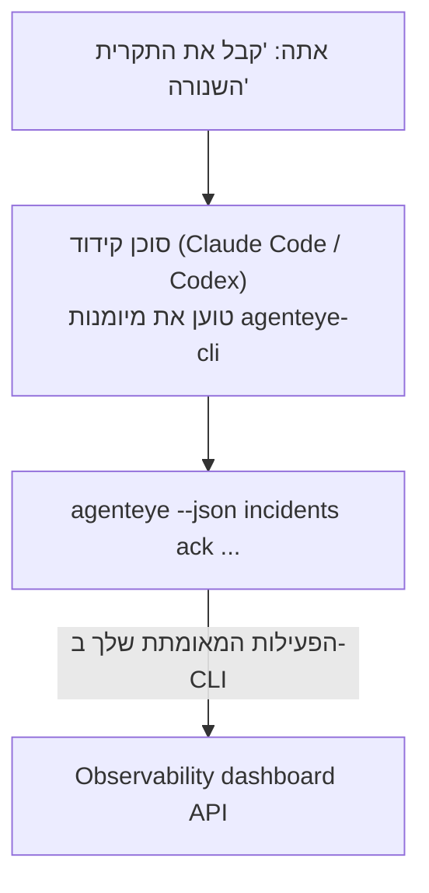

שאל את סוכן הקידוד שלך *"האם משהו שבור היום?"* והניח לו לענות מנתוני FailproofAI Observability החיים שלך, ללא פקודות שצריך לזכור. **מיומנות FailproofAI Observability CLI** (`agenteye-cli`) היא *Agent Skill*: תיקייה קטנה של הוראות שסוכן קידוד כמו Claude Code או Codex טוען לפי הצורך. היא מלמדת את הסוכן להפעיל את פריסת ה-Observability שלך דרך ה-[`agenteye` CLI](/he/agenteye/cli) מבקשות באנגלית רגילה כמו *"תן ל-CI מפתח שיכול רק לדחוף אירועים"* או *"קבל את התקרית השנורה והקצה אותה אלי."*

זה **לא** שירות או בינארי נפרד; אין כלום לפרוס. זה עובד על גבי ה-CLI שכבר התקנת: הסוכן מריץ `agenteye --json …`, מנתח את ה-JSON הנקי, ועונה לך בטקסט רגיל. כל מה שהוא יכול לעשות, אתה יכול לעשות בעצמך על ידי הקלדת אותן פקודות.

---

## כיצד זה קשור לממשקים אחרים של FailproofAI Observability

FailproofAI Observability נותן לך ארבע דרכים להגיע לאותם נתונים ובקרות. הם משלימים זה את זה:

| ממשק | מה זה | איפה זה רץ | הגש אליו כאשר |
|---|---|---|---|
| **[CLI](/he/agenteye/cli)** | ההפניה command/flag עבור `agenteye` | הטרמינל שלך | אתה רוצה להריץ או לכתוב סקריפט של פקודה ספציפית |
| **[CLI recipes](/he/agenteye/cli-recipes)** | דוגמאות `jq`/pipeline להעתקה | הטרמינל שלך / סקריפטים | אתה קושר את ה-CLI לאוטומציה |
| **CLI skill** (מסמך זה) | דלת כניסה בשפה טבעית ל-CLI | הסוכן קידוד שלך, בתחנת העבודה שלך | אתה רוצה *פשוט לשאול* והניח לסוכן לבחור את הפקודה |
| **[עוזר AI במDashboard](/he/agenteye/assistant)** | צ'אט משובץ בדשבורד | צד השרת (בדשבורד) | אתה רוצה Q&A במDashboard על הנתונים שלך |

למיומנות עצמה אין הרשאות שלה; היא פשוט הופכת את המילים שלך לקריאות CLI שרצות כשאתה:



### לעומת עוזר ה-AI במDashboard: הבחנה חשובה

אלו שני כלים שונים עם טווחי השפעה שונים מאוד:

- **עוזר ה-AI במDashboard** ([AI assistant](/he/agenteye/assistant)) הוא צ'אט משובץ בדשבורד, מופעל על ידי שירות הסוכן. זה **קריאה בלבד בתוספת authoring בשערי אישור**: זה יכול לעצב שאילתות שמורות ודשבורדים, אך כל כתיבה עוצרת לאישור ההחלטה שלך, ולעולם לא מחק. זה מצוף על ידי ההרשאה `agent:use` ורואה רק נתונים של הארגון שאתה צופה בו.
- **מיומנות CLI** רצה ב-*תחנת העבודה שלך* בתוך *הסוכן קידוד שלך* ומנהל את ה-CLI של `agenteye` כ-**אתה**. זה יכול לבצע את **המשטח המלא, כולל mutations** (יצירה/סיבוב/השבתת מפתחות API, שינוי הגדרות ארגון, פתרון תקריות, מחיקת שאילתות שמורות), מוגבל רק על ידי ההרשאות של התחברות CLI שלך. התייחס אליה בדיוק כמו שהיית מטפל בהרצת אותן פקודות ביד.

---

## דרישות מקדימות

1. **`agenteye` CLI מותקן** ב-`PATH` (ראה את ההפניה [CLI](/he/agenteye/cli): `pipx install agenteye`).
2. **URL הדשבורד שלך מוגדר** (`AGENTEYE_DASHBOARD_URL`, או הסוכן עובר `--base-url`).
3. **פעילות מחובר**: הריץ `agenteye login` בעצמך תחילה. המיומנות **לא יכולה** להשלים את כניסת קוד חד-פעמי בדוא״ל בשבילך; היא תגיד לך להריץ `agenteye login` אם ההפעילות חסרה או פגה (קוד יציאת CLI `4`).

---

## התקנת המיומנות

Agent Skills הן תיקיות שמכילות `SKILL.md` (בתוספת הפניות אופציונליות). אתה מתקין את מיומנות `agenteye-cli` על ידי הצבת התיקייה שלה במקום שהסוכן שלך מחפש מיומנויות:

- **Claude Code**: העתק את התיקייה `agenteye-cli/` ל-`~/.claude/skills/` (זמינה בכל פרויקט) או ל-`<your-repo>/.claude/skills/` (ממוקד בריפו זה). Claude Code מגלה אותה באופן אוטומטי; אמת עם רשימת `/skills`, או פשוט שאל שאלה שתואמת את התיאור שלה.
- **Codex (OpenAI)**: Codex קורא את אותו `SKILL.md`. ה-`agents/openai.yaml` המצורף קובע `allow_implicit_invocation: true`, כך ש-Codex בוחר בעצמו את המיומנות כאשר משימה תואמת; אחרת הפעל אותה במפורש כ-`$agenteye-cli`.

המיומנות מתוחזקת לצד ה-CLI של `agenteye` אך משונה כ-**תיקייה נפרדת**, לא בתוך חבילת `pipx install agenteye`, אז אל תחפש אותה שם. FailproofAI Observability מסגר את התיקייה `agenteye-cli/` אליך בעצמו; אם אין לך אותה, שאל את איש הקשר ב-FailproofAI שלך. שום דבר בה לא סגור: זה לא צריך אפילו אישור, כי זה רק מנהל את ה-CLI של `agenteye` **הציבורי** נגד הדשבורד שלך.

---

## בטיחות: mutations לא מצליחות כאשר סוכן מריץ את ה-CLI

> **Warning:** קרא את זה לפני שתתן לסוכן לבצע שינויים.

ה-CLI של `agenteye` בדרך כלל שואל *"אתה בטוח?"* לפני פעולה הרסנית. זה **דילוג אוטומטי על אישור זה בכל פעם שהוא לא מחובר לטרמינל (וזה בדיוק איך סוכן קידוד מריץ אותו), וגם `--json` דילוגים עליו.** אז הנקודת הבטיחות **לא** תישרף לסוכן.

המיומנות כתובה בכדי לפצות: היא מוסברת להצהיר את הפקודה המדויקת שתריץ ולקבל את **אישור ברור שלך לפני כל שינוי מצב**. שמור את הדיסציפלינה הזו. כאשר אתה מנהל את FailproofAI Observability דרך סוכן, *אתה* הוא שלב האישור. הפקודות המשנות מצב שיש לעקוב אחריהן:

- `keys create` / `update` / `disable` / `regenerate`
- `users create` / `update` / `disable` / `enable`
- `settings set`
- `alerts create` / `update` / `delete` / `test`
- תת-הפקודות הכתובות `incidents`: `ack` / `assign` / `resolve` / `open` / `comment-add` / `comment-delete` / `subscribe` / `unsubscribe`
- `query create` / `update` / `delete`
- `agent rename` / `delete`
- `orgs switch`

כל דבר תחת **Observe** (`events`, `sessions`, `evals`, `errors`, `list`, `whoami`, `orgs list/current/perms`) הוא קריאה בלבד ולא משנה דבר.

כי הסוכן פועל כ-**אתה**, הוא יכול לעשות רק את מה שההתחברות שלך רשאית לעשות; הרשאות מתורגמות **לכל ארגון** (ראה [API keys](/he/agenteye/api-keys)). פקודה שאתה חסר רשאות עבורה מחזירה קוד יציאה `5` עם ההרשאה המדויקת שצוינה, כך שהסוכן יכול לומר לך בדיוק מה לבקש ממנהל במקום להיכשל בצורה אטומה.

---

## מה אתה יכול לשאול אותו

הנה איך נראה סיור אמיתי במעגל, קריאה, ואחריו שינוי שממתין לאישור שלך:

```text
אתה   ▸ האם משהו שבור ביום האחרון?

סוכן ▸ רץ: agenteye --json errors --since 24h --aggregate
        3 סוגי שגיאה ביום האחרון. הגדול ביותר הוא TimeoutError
        (18 התנפץ, כולם על checkout-agent), ואחריו RateLimited (5).
        רוצה את ההפעילויות הכושלות עבור TimeoutError?

אתה   ▸ תן ל-CI מפתח שיכול רק לדחוף אירועים.

סוכן ▸ זה יוצר מפתח API. אני אריץ:
          agenteye keys create ci --add events:add
        אישור להמשך?

אתה   ▸ כן

סוכן ▸ בוצע. מפתח "ci" נוצר עם events:add בלבד.
        הסוד מוצג רק פעם אחת, אז שמור אותו עכשיו. אני לא יכול להדפיס אותו שוב.
```

המיומנות ממפה כל כוונה בשפה רגילה לפקודת `agenteye` הנכונה, גילוי ערכים תקפים תחילה (`list <kind>`, `whoami`) כך שלא יהיה ניחוש, והצהרת הפקודה המדויקת לפני כל שינוי. דוגמאות נוספות:

- *"האם משהו שבור / נכשל ביום האחרון?"* → `errors --since 24h --aggregate`, ואז פירוט.
- *"למה הפעילות `run-001` נכשלה?"* → `events --session-id run-001 --all` + `evals --session-id run-001`.
- *"איך איכות מתגוברת השבוע הזה?"* → `evals --aggregate --since 7d`, ואז קידור לריצות בציון נמוך.
- *"תן ל-CI מפתח שיכול רק לדחוף אירועים."* → `keys create ci --add events:add` (היא מצהירה על הפקודה, אחריו יוצרת אותה ותופסת את הסוד החד-פעמי).
- *"למי יש גישה? הפוך את Dana לקריאה בלבד."* → `users list` → `users update dana@… --permission-set read-only` (אחרי התאשרות איתך).
- *"קבל את התקרית השנורה והקצה אותה אלי."* → `incidents list --state firing` → `incidents ack <id>` / `incidents assign <id> you@…`.

עבור הפקודות המדויקות, הדגלים, וצורות JSON מאחורי אלה, ראה את ההפניה [CLI](/he/agenteye/cli) ו-[CLI recipes for agents](/he/agenteye/cli-recipes).

---

## שלבים הבאים

- **[CLI](/he/agenteye/cli)**: הפניה command וdlag מלאה עבור `agenteye`.
- **[CLI recipes for agents](/he/agenteye/cli-recipes)**: דוגמאות `jq` להעתקה וטיפול בקוד יציאה.
- **[AI assistant](/he/agenteye/assistant)**: העוזר במDashboard (אל תבלבל עם מיומנות המסוף הזו).
- **[API keys](/he/agenteye/api-keys)**: מודל ההרשאה לכל ארגון שמגביל את מה שהמיומנות יכולה לעשות.