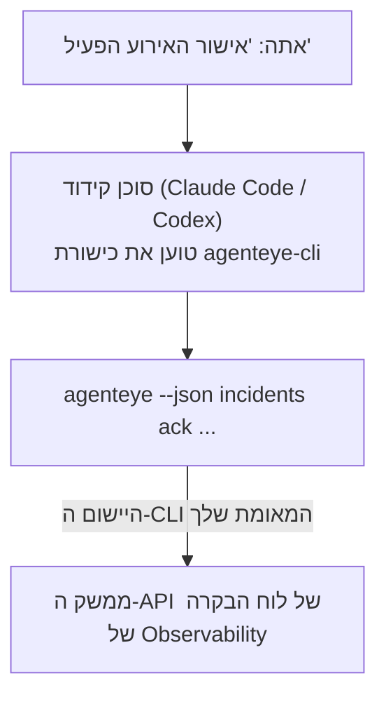

---
---
title: "כישורת ה-CLI של Failproof AI Observability Agent"
description: "שאל את הסוכן הקידוד שלך \"האם משהו שבור היום?\" והנח לו להשיב מנתוני ה-Failproof AI Observability החיים שלך, ללא פקודות לשנן."
---


שאל את הסוכן הקידוד שלך *"האם משהו שבור היום?"* והנח לו להשיב מנתוני ה-Failproof AI Observability החיים שלך, ללא פקודות לשנן. **כישורת ה-CLI של Failproof AI Observability** (`agenteye-cli`) היא *כישורת Agent*: תיקייה קטנה של הוראות שסוכן קידוד כמו Claude Code או Codex טוען לפי הצורך. היא מלמדת את הסוכן להפעיל את התקנת ה-Observability שלך דרך ה-[`agenteye` CLI](/he/agenteye/cli) מבקשות באנגלית פשוטה כמו *"תן ל-CI מפתח שיכול רק לדחוף אירועים"* או *"אישור האירוע הפעיל והצמד אותו אלי."*

זה **לא** שירות או קובץ בינארי נפרד; אין כלום לפרוס. זה עובד על גבי ה-CLI שכבר התקנת: הסוכן קורא ל-`agenteye --json …`, מנתח את ה-JSON הנקי, ועונה לך בטקסט רגיל. כל מה שהוא יכול לעשות, אתה יכול לעשות בעצמך על ידי הקלדת אותן פקודות.

---

## איך זה קשור לממשקי ה-Failproof AI Observability האחרים

Failproof AI Observability נותן לך ארבע דרכים להגיע לאותם נתונים ובקרות. הם משלימים זה את זה:

| ממשק | מה זה | איפה זה רץ | הגיע אליו כאשר |
|---|---|---|---|
| **[CLI](/he/agenteye/cli)** | הנושא הפקודה/דגל עבור `agenteye` | המסוף שלך | אתה רוצה להריץ או לתסריט פקודה ספציפית |
| **[CLI recipes](/he/agenteye/cli-recipes)** | דוגמיות `jq`/צינור של העתק-הדבק | המסוף שלך / סקריפטים | אתה מחווט את ה-CLI לאוטומציה |
| **כישורת CLI** (מסמך זה) | דלת קדמית בשפה טבעית ל-CLI | הסוכן הקידוד שלך, בתחנת העבודה שלך | אתה רוצה *פשוט לשאול* והנח לסוכן לבחור את הפקודה |
| **[כישורת Evaluator](/he/agenteye/evaluator-skill)** | כישורת אחות שמעצבת ובונה את שירות הניקוד שלך | הסוכן הקידוד שלך, בתחנת העבודה שלך | אתה רוצה *להפיק* ניקוד eval במקום לקרוא אותו |
| **[כישורת Python SDK](/he/agenteye/python-sdk-skill)** | כישורת אחות שממנעה את הסוכן שלך כדי שהוא ישדר טלמטריה בכל מקום | הסוכן הקידוד שלך, בתחנת העבודה שלך | אתה רוצה שהסוכן שלך *יפיק* את האירועים שכישורת זו קוראת |
| **[עוזר AI בתוך הלוח](/he/agenteye/assistant)** | צ'אט משובץ בלוח הבקרה | צד שרת (בלוח הבקרה) | אתה רוצה Q&A בתוך הלוח על הנתונים שלך |

לכישורת עצמה אין הרשאות משלה; היא פשוט הופכת את המילים שלך לקריאות CLI שרצות כמוך:



### לעומת עוזר ה-AI בתוך הלוח: הבחנה חשובה

אלה שני כלים שונים עם רדיוס פיצוץ שונה מאוד:

- **עוזר ה-AI בתוך הלוח** ([עוזר AI](/he/agenteye/assistant)) הוא צ'אט משובץ בלוח הבקרה, מופעל על ידי שירות הסוכן. זה **קריאה בלבד בתוספת יצירה מאושרת**: הוא יכול לטיוטת שאילתות שמורות ולוחות בקרה, אך כל כתיבה עוצרת לאישור הקליק המפורש שלך, והוא לעולם לא מוחק. זה מדורגן על ידי ההרשאה `agent:use` ורואה רק נתונים עבור הארגון שאתה צופה בו.
- **כישורת ה-CLI** רצה על *תחנת העבודה שלך* בתוך *הסוכן הקידוד שלך* ומניע את ה-CLI `agenteye` כ**אתה**. היא יכולה לבצע את **משטח ה-CLI המלא, כולל מוטציות** (יצירה/סיבוב/השבתה של מפתחות API, שינוי הגדרות ארגון, פתרון אירועים, מחיקת שאילתות שמורות), מוגבל רק על ידי ההרשאות של התחברות ה-CLI שלך. התייחס אליה בדיוק כפי שהיית מתייחס להרצת אותן פקודות ביד.

---

## דרישות קדם

1. ה-**CLI `agenteye` מותקן** וב-`PATH` (ראה את ההפניה ל-[CLI](/he/agenteye/cli): `pipx install agenteye`).
2. **כתובת ה-URL של לוח הבקרה שלך** מוגדרת (`AGENTEYE_DASHBOARD_URL`, או הסוכן עובר `--base-url`).
3. **הפעלה מחוברת**: הרץ `agenteye login` בעצמך תחילה. הכישורת **לא יכולה** להשלים את התחברות קוד חד פעמי בדוא"ל עבורך; היא תגיד לך להרוץ `agenteye login` אם ההפעלה חסרה או פגה (קוד יציאה CLI `4`).

---

## איפה להשיג את זה

הכישורת פורסמה בקולקציית הכישורות הציבורית של Failproof AI:

**[github.com/FailproofAI/skills](https://github.com/FailproofAI/skills)** → [`skills/agenteye-cli/`](https://github.com/FailproofAI/skills/tree/main/skills/agenteye-cli)

שום דבר לא מדורגן — המאגר ציבורי והכישורת לא צריכה כל כניסה משלה, כי היא רק מניע את ה-CLI `agenteye` **הציבורי** נגד לוח הבקרה שלך, תוך שימוש בהפעלה שאתה התחברת עם זה. אתה לא צריך לשאול אף אחד עבורו.

שים לב שהוא משלח כתיקייה משלו וזה **לא** בתוך חבילת `pipx install agenteye`, אז אל תחפש אותו שם.

## התקנת הכישורת

הנתיב המהיר ביותר הוא [CLI `skills`](https://skills.sh), אשר משיג את התיקייה וזורק אותה למקום שהסוכן מחפש:

```bash
# Claude Code, פרויקט זה בלבד
npx skills add FailproofAI/skills --skill agenteye-cli -a claude-code

# כל פרויקט (מתקין ל-~/.claude/skills/)
npx skills add FailproofAI/skills --skill agenteye-cli -a claude-code -g --copy

# Codex במקום זאת
npx skills add FailproofAI/skills --skill agenteye-cli -a codex
```

לאחר מכן נהל אותו כמו כל כישורת אחרת:

```bash
npx skills list -a claude-code      # מה מותקן
npx skills update agenteye-cli      # משוך את הגרסה החדשה ביותר
npx skills remove agenteye-cli      # הסר אותה
```

מעדיף להתקין ביד? כישורת Agent היא פשוט תיקייה המכילה `SKILL.md` (בתוספת הפניות אופציונליות), כך שהעתקה עובדת גם:

- **Claude Code**: שים את תיקייה `agenteye-cli/` ב-`~/.claude/skills/` (כל פרויקט) או `<your-repo>/.claude/skills/` (פרויקט זה בלבד). Claude Code מגלה אותה באופן אוטומטי — אמת באמצעות רשימה `/skills`, או פשוט שאל שאלה שתואמת את התיאור שלה.
- **Codex (OpenAI)**: Codex קורא את אותה `SKILL.md`. ה-`agents/openai.yaml` המצורף קובע `allow_implicit_invocation: true`, כך ש-Codex בוחר באופן אוטומטי את הכישורת כאשר משימה תואמת; אחרת הזמן זאת במפורש כ-`$agenteye-cli`.

---

## בטיחות: מוטציות לא מהנות כאשר סוכן מריץ את ה-CLI

> **אזהרה:** קרא את זה לפני שתתן לסוכן לעשות שינויים.

ה-CLI `agenteye` בדרך כלל שואל *"האם אתה בטוח?"* לפני פעולה הרסנית. הוא **דילוג אוטומטי של אישור זה בכל פעם שהוא לא מחובר לטרמינל (וזה בדיוק איך סוכן קידוד מריץ אותו), ו-`--json` גם דילוג עליו.** אז הנושא הבטיחות **לא** יירה עבור הסוכן.

הכישורת כתובה כדי לפצות: היא מתורגמנת להצהיר את הפקודה המדויקת שהיא תריץ ולקבל את **OK** המפורש שלך לפני כל שינוי מצב. שמור על הדיסציפלינה הזאת. כאשר אתה מניע את Failproof AI Observability דרך סוכן, *אתה* הם שלב האישור. הפקודות המשנות מצב שיש להשגיח עליהן:

- `keys create` / `update` / `disable` / `regenerate`
- `users create` / `update` / `disable` / `enable`
- `settings set`
- `alerts create` / `update` / `delete` / `test`
- הכתיבה `incidents` תת-פקודות: `ack` / `assign` / `resolve` / `open` / `comment-add` / `comment-delete` / `subscribe` / `unsubscribe`
- `query create` / `update` / `delete`
- `agent rename` / `delete`
- `orgs switch`

כל דבר תחת **Observe** (`events`, `sessions`, `evals`, `errors`, `list`, `whoami`, `orgs list/current/perms`) הוא קריאה בלבד ולא משנה כלום.

מכיוון שהסוכן פועל כ**אתה**, הוא יכול לעשות רק מה שההתחברות שלך מורשה לעשות; הרשאות מסולקות **לכל ארגון** (ראה [מפתחות API](/he/agenteye/api-keys)). פקודה שאתה חסר הרשאה עבורה מחזירה קוד יציאה `5` עם ההרשאה המדויקת בשם, כך שהסוכן יכול לומר לך בדיוק מה לבקש מ-admin במקום להיכשל בעמימות.

---

## מה אתה יכול לשאול אותה

הנה איך נראה חילופי אמיתי, קריאה, ואז שינוי שמחכה ל-OK שלך:

```text
אתה   ▸ האם משהו שבור בעיום האחרון?

סוכן  ▸ מריץ: agenteye --json errors --since 24h --aggregate
        3 סוגי שגיאה בעיום האחרון. הגדול ביותר הוא TimeoutError
        (18 פגיעות, כולן ב-checkout-agent), ואחריו RateLimited (5).
        רוצה את ההפעלות הנכשלות עבור TimeoutError?

אתה   ▸ תן ל-CI מפתח שיכול רק לדחוף אירועים.

סוכן  ▸ זה יוצר מפתח API. אני הולך להרוץ:
          agenteye keys create ci --add events:add
        OK להמשיך?

אתה   ▸ כן

סוכן  ▸ בוצע. המפתח "ci" נוצר עם events:add בלבד.
        הסוד מוצג רק פעם אחת, כך שאחסן אותו עכשיו. אני לא יכול להדפיס אותו מחדש.
```

הכישורת ממפה כל כוונה בשפה טבעית לפקודת `agenteye` הנכונה, תוך גילוי ערכים תקפים תחילה (`list <kind>`, `whoami`) כדי שזה לא יעשה ניחוש, ומצהיר את הפקודה המדויקת לפני כל שינוי. דוגמיות נוספות:

- *"האם משהו שבור / נכשל בעיום האחרון?"* → `errors --since 24h --aggregate`, ואחריו פירוט.
- *"למה ההפעלה `run-001` נכשלה?"* → `events --session-id run-001 --all` + `evals --session-id run-001`.
- *"איך האיכות נמצאת בטרנד השבוע?"* → `evals --aggregate --since 7d`, ואחריו קידוח להפעלות בניקוד נמוך.
- *"תן ל-CI מפתח שיכול רק לדחוף אירועים."* → `keys create ci --add events:add` (זה קובע את הפקודה, ואחריו יוצר אותה ותופס את הסוד החד פעמי).
- *"מי יש גישה? עשה את Dana רק קריאה."* → `users list` → `users update dana@… --permission-set read-only` (לאחר אישור איתך).
- *"אישור האירוע הפעיל והצמד אותו אלי."* → `incidents list --state firing` → `incidents ack <id>` / `incidents assign <id> you@…`.

עבור הפקודות המדויקות, הדגלים, והצורות JSON מאחורי אלה, ראה את ההפניה ל-[CLI](/he/agenteye/cli) ו-[CLI recipes for agents](/he/agenteye/cli-recipes).

---

## שלבים הבאים

- **[CLI](/he/agenteye/cli)**: הפניה מלאה לפקודה ודגל עבור `agenteye`.
- **[CLI recipes for agents](/he/agenteye/cli-recipes)**: דוגמיות `jq` של העתק-הדבק וטיפול בקוד יציאה.
- **[כישורת סוכן Evaluator](/he/agenteye/evaluator-skill)**: הכישורת האחות, לבניית ה-evaluator שניקוד `agenteye evals` קורא.
- **[כישורת סוכן Python SDK](/he/agenteye/python-sdk-skill)**: הכישורת האחות, להמנעה של סוכן כדי שהוא ישדר את הטלמטריה שה-`agenteye` קורא.
- **[עוזר AI](/he/agenteye/assistant)**: העוזר בתוך הלוח (לא להתבלבל עם כישורת טרמינל זו).
- **[מפתחות API](/he/agenteye/api-keys)**: מודל ההרשאה לכל ארגון שמגביל מה הכישורת יכולה לעשות.