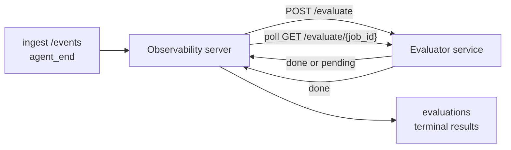

Failproof AI Observability יכול לדרג באופן אוטומטי כל הרצה של agent שהסתיימה מבחינת איכות: אתה מספק שירות דירוג קטן, ו-Observability מטפל בשאר. השתמש בזה כדי לעקוב אחר הממדים שחשובים לך (שימושיות, יעילות כלים, עובדתיות, בטיחות; אתה בוחר), לתפוס נסיגות מוקדם, ולהשוות agents או סביבות במבט אחד. הדירוג הוא בחירה: הצינור לא עושה שום דבר עד שתקבע את `EVALUATOR_ENDPOINT` בשרת.

> **הערה:** אתה מגדיר את ממדי הציון. המעריך שלך יכול להחזיר כל מפתחות מספריים שהוא רוצה; Observability שומר, מנתח טרנד, ומציג כל מה שאתה שולח חזרה.

## בתמצית

1. **כתוב מדרג.** הקם שירות HTTP קטן שקורא תמליל של session ומחזיר ציונים. Observability משלח התייחסות עובדת שאתה יכול להעתיק. ראה [כתיבת מעריך עם ה-SDK](#writing-an-evaluator-with-the-sdk).
2. **הצבע את Observability אליו.** קבע `EVALUATOR_ENDPOINT` (ו-`EVALUATOR_TOKEN` משותף) בתהליך השרת.
3. **צפה בציונים להגיע.** כל session שהסתיים מדורג באופן אוטומטי; התוצאות מופיעות בעמוד פרטי ה-session, בגריד ה-sessions, ובלוחות מחוונים שמורים.


*לאחר הגדרת מעריך, כל הרצה שהסתיימה מדורגת והתוצאות מופיעות בעמודה הימנית של ה-session: הסיכום בחלק העליון, ואחריו סרגלי ציון לפי ממד עם הנמקה.*

---

## איך זה עובד



כאשר Observability SDK פולט אירוע `agent_end` עבור session, השרת מתזמן הערכה. לאחר מכן, הוא משדר את תמליל האירוע המלא לשירות המעריך שלך, אשר יכול:

- **להחזיר את התוצאה בשורה** עם `{"status":"done", "scores":{...}, "reasoning":{...}, "summary":"..."}`. התוצאה מתוספת לציר הזמן של הערכה ה-session. `reasoning` ו-`summary` הם אופציונליים.
- **לעכב** עם `{"status":"pending", "job_id":"abc-123"}`. Observability אז קוראה ל-`GET {EVALUATOR_ENDPOINT}/evaluate/abc-123` עד שהמעריך שלך מחזיר `{"status":"done", ...}` או `{"status":"error", "error":"..."}`.

  קצב הסקירה הוא לכל עבודה: תגובה `pending` עשויה לכלול `next_poll_secs` להעלאה; אחרת Observability משתמש בערך `default_poll_interval_secs` מ-`GET /config`; אחרת השרת חוזר ל-`EVALUATOR_POLLING_INTERVAL_SECS` (ברירת מחדל 10 שניות). כל הערכים מוגבלים ל-[1 שנייה, 1 שעה].

Sessions שלעולם לא פולטים `agent_end` (למשל, תהליך agent שקרס) יכולים גם להיבחר: `GET /config` של המעריך עשוי להחזיר `{"inactivity_timeout_secs": 1800}`, ו-Observability יעריך כל session שנשאר בתהליו בחובה זה. הגדר את השדה ל-`null` או השמט אותו כדי להשבית את הפירור זה.

הצינור הוא no-op כליל כאשר `EVALUATOR_ENDPOINT` אינו מוגדר.

Session יכול להצטבר **הערכות טרמינליות מרובות לאורך זמן**: כל אירוע `agent_end` (וכל הערכה ידנית מחדש מלוח המחוונים) מוסיף שורת הערכה טרייה. זה הדרך הנתמכת להערכת שיחה שנוסרה: משתמש מסיים agent, חוזר מאוחר יותר, שולח אירועים נוספים, מסיים את ה-agent שוב, והערכה שנייה רץ כנגד התמליל המעודכן המלא. לוח המחוונים מעבד את ההערכה האחרונה ביותר כהכותרת ואת ההערכות הקודמות כציר זמן מתקפל. בזמן שהערכה אחת רצה עבור session, אירועי `agent_end` נוספים עבור session זה מתעלמים; האחד הבא לאחר הערכה רצה שהסתיימה תורשים הערכה טרייה כרגיל.

הפירור בתהליו של חוסר פעילות מתחדש גם ב-sessions שנוסרו: אם אירועים חדשים הגיעו לאחר הערכה טרמינלית קודמת ואז ה-session עובר תהליו בחובה `inactivity_timeout_secs`, הערכה טרייה מחורשת.

כשלים חולפים (5xx, 429, timeouts, שגיאות רשת) מנסים שוב עם backoff אקספוננציאלי עד `EVALUATOR_MAX_ATTEMPTS`; תגובות 4xx הן טרמינליות. Observability בטוחה להרוץ עם מספר instances של שרת בקנה מידה אופקי; עבודה מחולקת כך שאותו session לעולם לא משודר פעמיים בו-זמנית.

---

## חוזה HTTP

כל נתיב מאומת משתמש **בהנחה של bearer token**. אותו ערך חייב להיות מוגדר בשני הצדדים:

- שרת Observability: משתנה env `EVALUATOR_TOKEN`
- שירות המעריך: מוגדר באותו אופן (ה-SDK `agenteye-evaluator` קורא `EVALUATOR_TOKEN` לפי מוסכמה)

אם `EVALUATOR_TOKEN` אינו מוגדר, השרת לא שולח כותרת `Authorization`; המעריך יכול אז להשתלם בבקשות אנונימיות, וזה בסדר עבור רשת פנימית בלבד אך מונע באינטרנט הציבורי.

### נתיבים שהמעריך חייב לשרת

| נתיב | גוף / פרמטרים | תגובה |
|---|---|---|
| `GET /health` | כלום | `{"status":"ok"}` (פתוח, ללא auth) |
| `GET /config` | כלום | `{"inactivity_timeout_secs": <int> \| null, "default_poll_interval_secs": <int> \| omitted}` |
| `POST /evaluate` | JSON `EvalRequest` | `{"status":"done", ...}` או `{"status":"pending", "job_id":"..."}` |
| `GET /evaluate/{id}` | כלום | צורת תגובה זהה ל-`/evaluate` |

### גוף `EvalRequest` ששולח השרת

```json
{
  "schema_version": "1",
  "session_id":     "session-abc123",
  "agent_id":       "planner",
  "environment":    "production",
  "started_at":     "2026-05-10T12:00:00Z",
  "ended_at":       "2026-05-10T12:05:00Z",
  "events": [
    { "id": 1234, "ts": "...", "event_type": "agent_start", "payload": { ... } },
    ...
  ]
}
```

### צורות תגובה

**סינכרוני (בוצע):**

```json
{
  "status": "done",
  "scores": { "helpfulness": 0.85, "tool_efficiency": 0.6 },
  "reasoning": {
    "helpfulness": "answered the question directly with citations",
    "tool_efficiency": "called list_files three times when one would have done"
  },
  "summary": "strong answer quality, weak tool selection"
}
```

`reasoning` (מפת הצדקה לכל ציון) ו-`summary` (אחד כללי בפסקה אחת) שניהם אופציונליים. מפתחות ב-`reasoning` צריכים להשקף מפתחות ב-`scores`; לוח המחוונים מעבד כל ערך באופן מקביל מתחת לסרגל הציון שלו. מעריכים ישנים יותר שמחזירים רק `scores` ממשיכים לעבוד ללא שינוי; `reasoning` ו-`summary` פשוט נקרא כ-null ואפורדנסים ה-UI המתאימים מושמטים.

**אסינכרוני (דחוי):**

```json
{ "status": "pending", "job_id": "abc-123", "next_poll_secs": 30 }
```

`next_poll_secs` הוא אופציונלי; אם מושמט השרת חוזר ל-`default_poll_interval_secs` של המעריך מ-`/config`, ואז למשתנה ה-env שלו `EVALUATOR_POLLING_INTERVAL_SECS`.

**שגיאה טרמינלית בצד המעריך:**

```json
{ "status": "error", "error": "model service unavailable" }
```

השרת מתייחס לכל גוף 2xx אחר כשגיאת פרוטוקול ומתעד `error` טרמינלי לסשן.

---

## כתיבת מעריך עם ה-SDK

אתה לא צריך ליישם את חוזה HTTP ביד. חבילת `agenteye-evaluator` Python נותנת לך wrapper מסוג FastAPI שמטפל בהנחה, ניתוב, וצורות בקשה/תגובה בשבילך.

Failproof AI Observability גם משלח **מעריך התייחסות עובד** שדירג `helpfulness`, `tool_efficiency`, ו-`factuality` מצורת התמליל. העתק אותו כנקודת התחלה והחלף בלוגיקה שלך: שופט LLM, מנוע כללים, כל מה שמתאים לסרגל האיכות שלך.

מעריך מינימלי בר-קיימא:

```python
import os
from agenteye_evaluator import Evaluator, EvalRequest, EvalResponse

app = Evaluator(token=os.environ["EVALUATOR_TOKEN"])

@app.evaluator
def run(req: EvalRequest) -> EvalResponse:
    # Inspect req.events (the full session transcript) and return scores.
    tool_calls = sum(1 for e in req.events if e.event_type == "tool_use")
    return EvalResponse(
        scores={"tool_calls": float(tool_calls)},
        reasoning={"tool_calls": f"{tool_calls} tool invocations in the transcript"},
        summary="tight tool loop" if tool_calls < 5 else "agent looped on tools",
    )
```

מופע `app` פועל תחת כל שרת ASGI, כך ש-`uvicorn module:app` מתחיל אותו.

עבור מעריכים שצריכים לעכב עבודה יקרה, החזר `JobPending` במקום זאת ורשום מטפל `@app.job_lookup`; שרת Observability סוקר `GET /evaluate/{job_id}` עד שאתה מחזיר סטטוס טרמינלי או את התופס `EVALUATOR_MAX_POLL_DURATION_SECS` (ברירת מחדל 1 שעה) עובר.

ייחוס ה-API המלא, דפוס אסינכרוני, ותכנית אירוע מתועדים ב-README של ה-SDK `agenteye-evaluator`.

---

## הנעת המעריך שלך

המעריך הוא **השירות שלך** — Failproof AI Observability לא משלח מעריך ברירת מחדל, לכן אתה בונה והוא רץ איפה שאתה מריץ את השירותים שלך. הוא פועל תחת כל שרת ASGI (למשל `uvicorn my_evaluator:app`); שרת את נתיבי `/health`, `/config`, ו-`/evaluate` מ-[חוזה HTTP](#http-contract), ואז הצבע את השרת אליו (ראה [הגדרת השרת](#configuring-the-server)).

ברגע שהמעריך קיים, `GET /health` מחזיר `{"status":"ok"}`. לאחר agent שרץ מקצה לקצה, `GET /evaluations` בשרת מחזיר שורה עם `status: "done"` והציונים שהמעריך שלך הפיק.

---

## הגדרת השרת

קבע בתהליך השרת:

| משתנה Env | משמעות |
|---|---|
| `EVALUATOR_ENDPOINT` | URL בסיס של המעריך שלך (`http://evaluator:9000`). לא מוגדר = צינור מושבת. |
| `EVALUATOR_TOKEN` | bearer token. חייב להיות שווה לערך ששירות המעריך מוגדר איתו. |
| `EVALUATOR_WORKERS` | משימות עובדים לכל instance שרת (ברירת מחדל 2). |
| `EVALUATOR_CLAIM_BATCH` | שורות תבעו לכל tick עובד (ברירת מחדל 4). קבוצות מעובדות **בו-זמנית**; concurrency אפקטיבי בנקודת הקצה של המעריך שלך הוא `EVALUATOR_WORKERS × EVALUATOR_CLAIM_BATCH`. |
| `EVALUATOR_POLL_IDLE_SECS` | כמה זמן עובד ישן בין ניסיונות dispatch כשלא הערכה עד (ברירת מחדל 2 שניות). |
| `EVALUATOR_POLLING_INTERVAL_SECS` | fallback סופי עבור קצב `GET /evaluate/{id}` כאשר לא `next_poll_secs` לכל תגובה ולא `default_poll_interval_secs` של המעריך מוגדר (ברירת מחדל 10 שניות). |
| `EVALUATOR_REQUEST_TIMEOUT_MS` | timeout לכל בקשה (ברירת מחדל 30000). |
| `EVALUATOR_MAX_ATTEMPTS` | אחרי כמה כשלים ארעיים התוצאה מתועדת כ-`error` טרמינלי (ברירת מחדל 5). |
| `EVALUATOR_CONFIG_REFRESH_SECS` | קצב `GET /config` (ברירת מחדל 300). |
| `EVALUATOR_MAX_POLL_DURATION_SECS` | זמן wallclock מקסימלי session עשוי להישאר בתור הסקירה לפני שהוא מסומן כ-`timeout` (ברירת מחדל 3600 שניות). מגנים כנגד מעריך שממשיך להחזיר `pending` לנצח. |

כדי להדליק ניקוד אוטומטי, קבע גם `EVALUATOR_ENDPOINT` וגם `EVALUATOR_TOKEN` בשרת, ואז הפעל מחדש אותו כדי לאחוז בשינוי. עם `EVALUATOR_ENDPOINT` לא מוגדר הצינור נשאר no-op.

כפתורי הטיונינג לעיל הם אופציונליים; קבע משתנים env מתאימים בשרת רק אם אתה צריך לעקוף את ברירות המחדל.

---

## API reference

| שיטה | נתיב | הרשאה נדרשת | מטרה |
|---|---|---|---|
| `GET` | `/evaluations` | `evaluations:read` | תוצאות טרמינליות בשאילתה. תומך ב-`session_id`, `agent_id`, `environment`, `status` (`done`/`error`/`timeout`), `ts_from`, `ts_to`, `cursor`, `limit`, `score_filters`, `latest_per_session`. `limit` בברירת מחדל ל-50 ומגולח ב-200 (שימו לב זה שונה מ-`/events`, שחרוט ב-1000). `environment` מקבל רשימה מופרדת בפסיקים (למשל `environment=prod,staging`); ערכים בודדים עדיין עובדים. עם `latest_per_session=true` התגובה מכילה לכל היותר שורה אחת לכל `session_id` (האחרונה ב-`completed_at`) בשימוש בדף רשימת ה-sessions להכשרת הערכה של session למקום הכתרת הנוכחי שלה. ברירות למשמרות כוזבות (מחזיר את התוריה המלאה). |
| `GET` | `/evaluations/aggregate` | `evaluations:read` | בריאות eval מעוגלת לפרוסה מסוננת: סך הכל, breakdown done/error/timeout, עם סטטיסטיקות מפתח-לאחר-ציון (count/avg/min/max/p50 מעל `scores` שרירותי keys), וציר זמן קטגוריה זמן. מקבל **את אותם פרמטרים בפילטור כמו `/evaluations`** בתוספת `featured_keys` (CSV של score keys) וטרנד `latest_per_session`. כוח לוח מחוונים תכונה; מטרו הם מדויקים על פני הסט השלם התואם, לא דוגמה. |
| `GET` | `/evaluations/environments` | `evaluations:read` | ערכי environment שונים מטבלת `evaluations`. בשימוש לאכלוס תיבות סינון החמורות לנתונים הנקראים על ידי eval. |
| `GET` | `/evaluation-jobs` | `evaluations:read` | ראות בהערכות בטיסה. סנן לפי `status` (`pending`/`polling`). |
| `GET` | `/events` | `events:read` | זרום אירועי raw של session. תומך ב-`session_id`, `agent_id`, `event_type` (CSV), `environment` (CSV), `ts_from`, `ts_to`, `cursor`, `limit`, ו-`order`. `order` הוא `desc` (חדש ראשון, ברירת המחדל) או `asc` (הישן ראשון); ערך לא מזוהה חוזר ל-`desc`. Cursor-paginate דרך `next_cursor` התגובה (event id): העביר אותו חזרה כ-`cursor` כדי לקבל את העמוד הבא; עם `asc` העמוד הבא הוא האירועים אחרי זה id, עם `desc` האירועים לפניו. `limit` בברירת מחדל ל-50 ומגולח ב-1000. |
| `GET` | `/sessions/:session_id/export` | `events:read` | מחזיר את גוף JSON המדויק בדיוק שהמעריך יקבל עבור session זה, שירות כקובץ הורדה בשם `session-<id>.json`. שימושי להשגת sessions של ייצור דרך `agenteye-evaluator` לבדיקה לא מקוונת. הבתים זהים בתים לבדיוק למה צינור המעריך שולח. |
| `POST` | `/sessions/:session_id/re-evaluate` | `evaluations:trigger` | הערכה טרייה בתור עבור session; רץ בין אם קיימת הערכה קודמת או לא. התוצאה החדשה היא **מוספת** לציר הזמן של הערכה ה-session במקום להחליף את האחת הקודמת, כך שציונים קודמים נשארים גלויים כהיסטוריה. מחזיר `202` על תור, `404` עבור session לא ידוע, `409` אם הערכה כבר בטיסה. השתמש בזה לאחר פרסום מעריך חדש, או עבור sessions שלעולם לא פלטו `agent_end`. |

### סינון לפי טווח ציון: `score_filters`

`GET /evaluations` מקבל פרמטר `score_filters` אופציונלי שמצמצם תוצאות לפי ערכים מספריים בתוך אובייקט `scores`. הפרמטר הוא רשימה מופרדת בפסיקים של ערכים `key:min..max`; כל גבול עשוי להישמט. ערכים מרובים משולבים עם AND לוגי. שורות כאשר המפתח המוגדר אינו קיים או לא מספרי מודרו. בקשה עשויה להחזיק לכל היותר 20 ערכי בפילטור; חריגה מזה מחזיר HTTP 400.

דוגמאות:
```text
# helpfulness in [0.5, 0.8]
GET /evaluations?score_filters=helpfulness:0.5..0.8

# tool_efficiency at most 0.3 (no lower bound)
GET /evaluations?score_filters=tool_efficiency:..0.3

# helpfulness >= 0.5 AND factuality >= 0.9
GET /evaluations?score_filters=helpfulness:0.5..,factuality:0.9..
```

כל אובייקט תגובת `/evaluations` יש את השדות הללו:

| שדה | סוג | הערות |
|---|---|---|
| `evaluation_id` | string (UUID) | המזהה הקנוני להערכה טרמינלית זו. כל הערכה טרמינלית מקבלת UUID חדש; session יחיד יכול להחזיק כפול. |
| `id` | string (UUID) | כינוי תאימות לאחור נושא את אותו ערך כמו `evaluation_id`. |
| `session_id` | string | ה-session שהערכה זו רצה כנגדו. session יכול להיות לה הערכות מרובות בציר הזמן. |
| `agent_id` | string | מזהה את ה-agent שהפיק את ה-session. |
| `environment` | string | תווית סביבה שהועתקה מ-session. |
| `status` | enum | אחד מ-`"done"`, `"error"`, `"timeout"`. |
| `scores` | object \| null | ציונים שהוחזרו על ידי המעריך שלך. |
| `reasoning` | object \| null | מפת הצדקה אופציונלית לכל ציון שהוחזרה על ידי המעריך שלך. מפתחות בדרך כלל משקפים אלה ב-`scores`. לוח המחוונים עובד כל ערך מתחת לסרגל הציון שלו. |
| `summary` | string \| null | סיכום כללי אופציונלי בפסקה אחת שהוחזר על ידי המעריך שלך. לוח המחוונים עובד זה מעל הפירוט לכל ציון כהערכה של הערכה. |
| `error` | string \| null | מאוכלס ב-`"error"` / `"timeout"` בלבד. |
| `attempt_count` | integer | מספר ניסיונות dispatch (≥ 1). |
| `duration_ms` | integer \| null | משך הניסיון הסופי. |
| `completed_at` | string (ISO 8601 UTC) | כאשר התוצאה הטרמינלית תועדה. תוצאות מסודרות לפי `completed_at` (חדש ראשון). |
| `created_at` | string (ISO 8601 UTC) | נושא בדיוק אותו חותם זמן כמו `completed_at` (סמנטיקה כתיבה פעם אחת). |

---

## הרשאות

| הרשאה | מעניקה |
|---|---|
| `evaluations:read` | רשימה תוצאות הערכה, צפה ציונים בלוח המחוונים, וטעון מטרו בריאות לוח מחוונים. |
| `evaluations:trigger` | ידני תור הערכה עבור session דרך `POST /sessions/:session_id/re-evaluate` או כפתור בתיבת הוידג'טים של לוח המחוונים. |
| `dashboards:read` | צפה בלוחות מחוונים שמורים (צריך גם `evaluations:read` כדי לטעון את המטרו שלהם). |
| `dashboards:write` | צור וערוך לוחות מחוונים. |
| `dashboards:delete` | מחק לוחות מחוונים. |

ה-admin bootstrap (`ADMIN_KEY`, `ADMIN_EMAIL`) מקבל באופן אוטומטי אלה.

---

## צפייה בתוצאות

- **`/sessions/<id>`**: ציר זמן אירועים + עמודה ימנית המציגה ציונים של ה-session וכל שגיאה מניסיון dispatch. אם המפתח שלך יש `evaluations:trigger`, כפתור **re-evaluate** מופיע ליד כפתור הייצוא, שימושי עבור sessions שלעולם לא פלטו `agent_end`, או כדי לרענן ציונים לאחר פרסום מעריך חדש. לוח המחוונים סוקר את התוצאה החדשה ומעדכן את העמודה הימנית כאשר היא מגיעה.
- **`/sessions`**: גריד session מסנן; עמודת הציון מציגה כל סטטוס הערכה של session וציונים במבט אחד.
- **`/dashboards`**: נתונים eval-health שמורים (ראה [לוחות מחוונים](#dashboards) בהמשך).


*גריד ה-sessions מציג כל סטטוס הערכה הרצה וציונים במבט אחד; תגי red/amber/green הופכים ציונים נמוכים להיות בולטים.*

---

## לוחות מחוונים

עמוד **לוחות מחוונים** (`/dashboards`) מאפשר לך לשמור שילוב של בפילטור הערכה כתצוגה בשם, שנושאת, וצפייה באיך אותו פרוסה של הערכות עוקבות זה בחד. לוחות מחוונים הם **משותפים על פני כל הארגון שלך**; כולם עם `dashboards:read` רואים את אותה ערכה.

כל לוח מחוונים pin:

- **בפילטרים**: אותם בקרות כמו עמוד sessions: סביבה, סטטוס, סוכן, חלון זמן מתגלגל, וציונים-בטווח בפילטרים (`key:min..max`).
- **תצוג configuration**: אילו מפתחות ציון לתכונה, סף בריאות green/amber/red, פנלים אילו להציג, ו-whether כדי שולכל להערכה האחרונה לכל session.

כל כרטיסיה מציגה את מספר ה-sessions ספוג, done/error/timeout breakdown, הממוצע של כל ציון תכונה, ו-sparkline trend קטן. פתיחת לוח מחוונים מציגה הפנלים בגודל מלא; **פתיחה ב-sessions** מזרק אותך לעמוד ה-sessions מסונן מראש לפרוסה בדיוק זו. מטרו מחושבים שרת-צד מעל הסט כל התואם (דרך `GET /evaluations/aggregate`), כך שהמספרים מדויקים ולא דגומה.


**הרשאות:** צפייה צריכה גם `dashboards:read` וגם `evaluations:read`; יצירה וערעור צריכים `dashboards:write`; מחיקה צריכה `dashboards:delete`. ה-bootstrap admin מקבל את כל אלה באופן אוטומטי.

---

## פתרון בעיות

**Sessions קיימים אך אין הערכות שנוצרו.** אשר `EVALUATOR_ENDPOINT` קבוע בתהליך השרת, כי השרת ו-evaluator שיתוף אותו `EVALUATOR_TOKEN` ערך, וכי נקודת הקצה `/health` של המעריך קיימת משרת. עם `EVALUATOR_ENDPOINT` לא מוגדר הצינור הוא no-op.

**In-flight evaluations צבור.** שאילתת `GET /evaluation-jobs` כדי לראות בתור בטיסה. אבחן `attempt_count`, `next_attempt_at`, ו-`last_error` על כל שורה. גורמים נפוצים: שירות evaluator unreachable או מחזיר 5xx (מנסה שוב עם backoff), `EVALUATOR_TOKEN` שגוי (401 הוא טרמינלי), או evaluator אסינכרוני שמחזיר `pending` בחובה (ראה להלן).

**Sessions משלם אך אין הערכה טרמינלית.** שאילתת `GET /evaluation-jobs?status=polling`; התוצאה עדיין יכולה להיות בטיסה. אם job תקוע ב-`pending`, השרת יש צרות להגיע למעריך; בדוק כי ה-evaluator הוא עד וכי `EVALUATOR_TOKEN` משקף.

**`HTTP 401 from evaluator: invalid bearer token`.** ה-`EVALUATOR_TOKEN` בשרת לא משקף את הערך ששירות המעריך מוגדר איתו. הם חייבים להיות זהים.

**Async evaluator מחזיר `pending` לנצח.** השרת סוקר `GET /evaluate/{job_id}` עד המעריך מחזיר `done` או `error`, או עד `EVALUATOR_MAX_POLL_DURATION_SECS` (ברירת מחדל 1 שעה) עובר. לאחר התופס ההערכה תועדה כ-`timeout` והוסרה מתור בטיסה. העלה `EVALUATOR_MAX_POLL_DURATION_SECS` אם ה-evaluator שלך בצדק צרך יותר מברירת המחדל.

---

## הצעדים הבאים

- [Evaluator agent skill](/he/agenteye/evaluator-skill): יש coding agent לעצב ממדים שלך כנגד sessions אמיתיים ובנה את שירות זה בשבילך.
- [Python SDK](/he/agenteye/python-sdk): פלוט את אירועי `agent_end` שהם הנעת דירוג.
- [API keys](/he/agenteye/api-keys): הרשאות `evaluations:read` ו-`evaluations:trigger`.
- [Audits](/he/agenteye/audits): תכונת איכות אוטומטית אחרת של Observability, עבור סקירה מבוססת מדיניות.