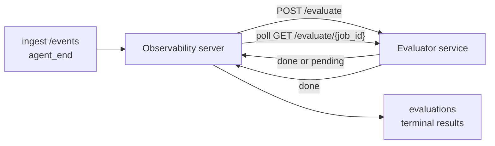

FailproofAI Observability יכול לדרג באופן אוטומטי כל הרצה סוכן שהושלמה לאיכות: אתה מספק שירות דירוג קטן, וObservability מטפל בשאר. השתמש בזה כדי לעקוב אחר הממדים שחשובים לך (עזרתיות, יעילות כלים, עובדתיות, בטיחות; אתה בוחר), לתפוס רגרסיות מוקדם, ולהשוות סוכנים או סביבות במבט אחד. הדירוג הוא בחירה: הצינור לא עושה כלום עד שתגדיר את `EVALUATOR_ENDPOINT` בשרת.

> **הערה:** אתה מגדיר את ממדי הניקוד. המעריך שלך יכול להחזיר כל מפתחות מספריים שהוא רוצה; Observability מאחסן, מעקב, ומציג כל מה שאתה שולח בחזרה.

## בקצרה

1. **כתוב דירג.** הקם שירות HTTP קטן שקורא תמלול של הפעלה ומחזיר ניקודים. Observability משלח הפניה עובדת שאתה יכול להעתיק. ראה [כתיבת מעריך עם ה-SDK](#writing-an-evaluator-with-the-sdk).
2. **הצבע את Observability עליו.** הגדר `EVALUATOR_ENDPOINT` (ו-`EVALUATOR_TOKEN` משותף) בתהליך השרת.
3. **צפה בנקודות להגיע.** כל הפעלה שהושלמה נדרגת באופן אוטומטי; התוצאות מופיעות בעמוד פרטי ההפעלה, בגריד ההפעלות, ובלוחות מחוונים שמורים.


*לאחר הגדרת מעריך, כל הרצה שהושלמה נדרגת והתוצאות מופיעות בפס הימני של ההפעלה: הסיכום למעלה, ואז פסי ניקוד לפי ממד עם נימוק.*

---

## איך זה עובד



כאשר ה-SDK של Observability משדר אירוע `agent_end` להפעלה, השרת תזמן הערכה. לאחר מכן הוא מפרסם את תמלול האירוע המלא לשירות המעריך שלך, שיכול לעשות כל אחד מהדברים הבאים:

- **החזר את התוצאה בשורה** עם `{"status":"done", "scores":{...}, "reasoning":{...}, "summary":"..."}`. התוצאה מוסיפה לציר הזמן של ההערכה של ההפעלה. `reasoning` ו-`summary` הם אופציוניים.
- **דחה** עם `{"status":"pending", "job_id":"abc-123"}`. Observability אז קורא ל-`GET {EVALUATOR_ENDPOINT}/evaluate/abc-123` עד שהמעריך שלך מחזיר `{"status":"done", ...}` או `{"status":"error", "error":"..."}`.

  קצב הסקר הוא לפי עבודה: תגובת `pending` עשויה לכלול `next_poll_secs` להגברה; אחרת Observability משתמש בערך `default_poll_interval_secs` מ-`GET /config`; אחרת השרת חוזר ל-`EVALUATOR_POLLING_INTERVAL_SECS` (ברירת מחדל 10s). כל הערכים מקובעים ל-[1s, 1h].

הפעלות שלעולם לא משדרות `agent_end` (לדוגמה, תהליך סוכן שקרס) יכולות גם להיות מנותחות: `GET /config` של המעריך עשוי להחזיר `{"inactivity_timeout_secs": 1800}`, וObservability יעריך כל הפעלה שהייתה בטלה לאורך זמן כזה. הגדר את השדה ל-`null` או השמיט אותו כדי להשבית את ההחזר הזה.

הצינור הוא no-op לחלוטין כאשר `EVALUATOR_ENDPOINT` לא מוגדר.

הפעלה יכולה להצטברות **הערכות סופיות מרובות לאורך זמן**: כל אירוע `agent_end` (וכל הערכה ידנית מחדש מלוח הבקרה) מוסיף שורת הערכה טרייה. זו הדרך הנתמכת להערכה של שיחה שחודשה: משתמש מסיים סוכן, חוזר מאוחר יותר, משדר אירועים נוספים, מסיים את הסוכן שוב, והערכה שנייה פועלת מול תמלול המלא המעודכן. לוח הבקרה משדר את ההערכה האחרונה כהכותרת ואת ההערכות הקודמות כציר זמן מתקפל. בזמן שהערכה אחת פועלת להפעלה, אירועי `agent_end` נוספים להפעלה זו מתעלמים; האחד הבא אחרי שההערכה הפועלת מסתיימת יתנתק הערכה טרייה כרגיל.

החזור האי-פעילות מחדש למשימה בהפעלות חודשות גם: אם אירועים חדשים מגיעים לאחר הערכה סופית קודמת והפעלה אז הולכת בטלה מעבר `inactivity_timeout_secs`, הערכה טרייה מתוייבת.

כשלים זמניים (5xx, 429, timeouts, שגיאות רשת) מנסים מחדש עם backoff מעריכי עד `EVALUATOR_MAX_ATTEMPTS`; תגובות 4xx הן סופיות. Observability בטוח להפעיל עם מספר מקביל-scaled instances של שרת; העבודה מחולקת כך שאותה הפעלה לעולם לא מועברת פעמיים במקביל.

---

## חוזה HTTP

כל נתיב מאומת משתמש **בהערכת bearer token**. אותו ערך חייב להיות מוגדר משני הצדדים:

- Observability server: משתנה env `EVALUATOR_TOKEN`
- Evaluator service: מוגדר באותו אופן (ה-SDK של `agenteye-evaluator` קורא `EVALUATOR_TOKEN` לפי מוסכמה)

אם `EVALUATOR_TOKEN` לא מוגדר, השרת לא שולח כותרת `Authorization`; המעריך עשוי לאחר מכן לקבל בקשות אנונימיות, וזה בסדר לרשת פנימית בלבד אך לא מומלץ באינטרנט הציבורי.

### נתיבים שהמעריך חייב לשרת

| נתיב | גוף / פרמטרים | תגובה |
|---|---|---|
| `GET /health` | אף אחד | `{"status":"ok"}` (פתוח, ללא הערכה) |
| `GET /config` | אף אחד | `{"inactivity_timeout_secs": <int> \| null, "default_poll_interval_secs": <int> \| omitted}` |
| `POST /evaluate` | `EvalRequest` JSON | `{"status":"done", ...}` או `{"status":"pending", "job_id":"..."}` |
| `GET /evaluate/{id}` | אף אחד | צורה תגובה זהה ל-`/evaluate` |

### גוף `EvalRequest` ששרת משדר

```json
{
  "schema_version": "1",
  "session_id":     "session-abc123",
  "agent_id":       "planner",
  "environment":    "production",
  "started_at":     "2026-05-10T12:00:00Z",
  "ended_at":       "2026-05-10T12:05:00Z",
  "events": [
    { "id": 1234, "ts": "...", "event_type": "agent_start", "payload": { ... } },
    ...
  ]
}
```

### צורות תגובה

**סינכרוני (בוצע):**

```json
{
  "status": "done",
  "scores": { "helpfulness": 0.85, "tool_efficiency": 0.6 },
  "reasoning": {
    "helpfulness": "answered the question directly with citations",
    "tool_efficiency": "called list_files three times when one would have done"
  },
  "summary": "strong answer quality, weak tool selection"
}
```

`reasoning` (מפת הצדקה לכל ניקוד) ו-`summary` (נרטיב כללי בפסקה אחת) שניהם אופציוניים. מפתחות ב-`reasoning` צריכים לשקף מפתחות ב-`scores`; לוח הבקרה משדר כל ערך בשורה מתחת לפס הניקוד שלו. מעריכים ישנים שמחזירים רק `scores` ממשיכים לעבוד ללא שינוי; `reasoning` ו-`summary` פשוט קוראים כ-null והחזות הממשק המתאימות מושמטות.

**אסינכרוני (דחוי):**

```json
{ "status": "pending", "job_id": "abc-123", "next_poll_secs": 30 }
```

`next_poll_secs` הוא אופציוני; אם הוא מושמט השרת חוזר ל-`default_poll_interval_secs` של המעריך מ-`/config`, אחר כך למשתנה `EVALUATOR_POLLING_INTERVAL_SECS` שלו.

**שגיאת סופית בצד מעריך:**

```json
{ "status": "error", "error": "model service unavailable" }
```

השרת מטפל בכל גוף 2xx אחר כשגיאת פרוטוקול ורושם `error` סופי להפעלה.

---

## כתיבת מעריך עם ה-SDK

אתה לא צריך ליישם את חוזה HTTP ביד. חבילת Python של `agenteye-evaluator` נותנת לך עטוף FastAPI מוקלד שמטפל בהערכה, ניתוב, וצורות בקשה/תגובה בשבילך.

FailproofAI Observability גם משלח **מעריך הפניה עובד** שדירג `helpfulness`, `tool_efficiency`, ו-`factuality` מצורת התמלול. העתק אותו כנקודת התחלה והחלף את הלוגיקה שלך: שופט LLM, מנוע כללים, כל מה שמתאים לסרגל האיכות שלך.

מעריך מינימלי:

```python
import os
from agenteye_evaluator import Evaluator, EvalRequest, EvalResponse

app = Evaluator(token=os.environ["EVALUATOR_TOKEN"])

@app.evaluator
def run(req: EvalRequest) -> EvalResponse:
    # Inspect req.events (the full session transcript) and return scores.
    tool_calls = sum(1 for e in req.events if e.event_type == "tool_use")
    return EvalResponse(
        scores={"tool_calls": float(tool_calls)},
        reasoning={"tool_calls": f"{tool_calls} tool invocations in the transcript"},
        summary="tight tool loop" if tool_calls < 5 else "agent looped on tools",
    )
```

ה-`app` instance פועל תחת כל שרת ASGI, כך `uvicorn module:app` מתחיל אותו.

למעריכים שצריכים לדחות עבודה יקרה, החזר `JobPending` במקום וregistered a `@app.job_lookup` handler; שרת Observability סוקר `GET /evaluate/{job_id}` עד שתחזור לסטטוס סופי או כובה `EVALUATOR_MAX_POLL_DURATION_SECS` (ברירת מחדל 1 h).

ה-API reference המלא, דפוס אסינכרוני, וסכמת אירוע מתועדות ב-README של `agenteye-evaluator` SDK.

---

## הפעלת המעריך שלך

המעריך הוא **השירות שלך** — FailproofAI Observability לא משלח מעריך ברירת מחדל, אז אתה בונה והפעיל אותו כאן שאתה מפעיל את השירותים שלך. הוא פועל תחת כל שרת ASGI (לדוגמה `uvicorn my_evaluator:app`); שרת את נתיבי `/health`, `/config`, ו-`/evaluate` מ-[חוזה HTTP](#http-contract), ואז הצבע את השרת עליו (ראה [הגדרת השרת](#configuring-the-server)).

ברגע שהמעריך זמין, `GET /health` מחזיר `{"status":"ok"}`. אחרי שסוכן פועל בעצמו סוף-לסוף, `GET /evaluations` בשרת מחזיר שורה עם `status: "done"` וניקודי המעריך שהופקו.

---

## הגדרת השרת

הגדר בתהליך השרת:

| משתנה Env | משמעות |
|---|---|
| `EVALUATOR_ENDPOINT` | Base URL של המעריך שלך (`http://evaluator:9000`). לא מוגדר = צינור מנוטרל. |
| `EVALUATOR_TOKEN` | Bearer token. חייב להיות שווה לערך ששירות המעריך מוגדר איתו. |
| `EVALUATOR_WORKERS` | משימות עובד לכל instance של שרת (ברירת מחדל 2). |
| `EVALUATOR_CLAIM_BATCH` | שורות תביעה לתיק עובד (ברירת מחדל 4). תיקים מעובדים **במקביל**; ניסיון מעשי בנקודת הקצה של המעריך שלך הוא `EVALUATOR_WORKERS × EVALUATOR_CLAIM_BATCH`. |
| `EVALUATOR_POLL_IDLE_SECS` | כמה עובד ישן בין ניסיונות dispatch כאשר אין הערכה בגדול (ברירת מחדל 2s). |
| `EVALUATOR_POLLING_INTERVAL_SECS` | החזור סופי ל-`GET /evaluate/{id}` קצב כאשר לא `next_poll_secs` לכל תגובה ולא `default_poll_interval_secs` של המעריך מוגדר (ברירת מחדל 10s). |
| `EVALUATOR_REQUEST_TIMEOUT_MS` | Per-request timeout (ברירת מחדל 30000). |
| `EVALUATOR_MAX_ATTEMPTS` | אחרי שכמות זו של כשלים זמניים התוצאה נרשמת כ-`error` סופי (ברירת מחדל 5). |
| `EVALUATOR_CONFIG_REFRESH_SECS` | `GET /config` קצב (ברירת מחדל 300). |
| `EVALUATOR_MAX_POLL_DURATION_SECS` | זמן תקרה מקסימום שהפעלה עשויה להישאר בתור הסקר לפני שהיא מסתיימת כ-`timeout` (ברירת מחדל 3600s). שומר נגד מעריך שממשיך להחזיר `pending` לנצח. |

כדי להפעיל דירוג אוטומטי, הגדר גם `EVALUATOR_ENDPOINT` וגם `EVALUATOR_TOKEN` בשרת, אחר כך הפעל אותו מחדש כדי להרים את השינוי. עם `EVALUATOR_ENDPOINT` לא מוגדר הצינור נשאר no-op.

ידיות כיוונון לעיל אופציוניות; הגדר משתנים env המתאימים בשרת רק אם אתה צריך להגביר את ברירות המחדל.

---

## API reference

| שיטה | נתיב | הרשאה נדרשת | מטרה |
|---|---|---|---|
| `GET` | `/evaluations` | `evaluations:read` | תוצאות סופיות שאלה. תומך `session_id`, `agent_id`, `environment`, `status` (`done`/`error`/`timeout`), `ts_from`, `ts_to`, `cursor`, `limit`, `score_filters`, `latest_per_session`. `limit` ברירת מחדל ל-50 ו capped ל-200 (שימו לב שזה שונה מ-`/events`, ש capped ל-1000). `environment` מקבל רשימה מופרדת בפסיק (למשל `environment=prod,staging`); ערכים יחידים עדיין עובדים. עם `latest_per_session=true` התגובה מכילה לכל היותר שורה אחת לכל `session_id` (ביותר אחרון לפי `completed_at`) בשימוש בעמוד רשימת הפעלות לתקיפה ציר הזמן ההערכה של הפעלה לכותרת הנוכחית שלה. ברירת מחדל ל-false (מחזיר את הסטוריה המלאה). |
| `GET` | `/evaluations/aggregate` | `evaluations:read` | בריאות eval מקופלת לפרוסת מסוננת: ספירה כוללת, פירוק done/error/timeout, per-score-key stats (count/avg/min/max/p50 על המפתחות `scores` שרירותיים), וציר זמן בערך זמן. מקבל **אותם פרמטרים filter כמו `/evaluations`** פלוס `featured_keys` (CSV של score keys כדי לעקב) ו-`latest_per_session`. סמכויות תכונה לוח מחוונים; מדדים מדויקים על פני הסט המתאים כולו, לא דגומים. |
| `GET` | `/evaluations/environments` | `evaluations:read` | ערכי environment מובחנים מטבלה `evaluations`. משמש למילוי רשימות השניות מסננות מתוחמות לנתונים הניתנים לקריאה הערכה. |
| `GET` | `/evaluation-jobs` | `evaluations:read` | ראות להערכות בטיסה. סנן לפי `status` (`pending`/`polling`). |
| `GET` | `/events` | `events:read` | זרם אירועים גולמיים של הפעלה. תומך `session_id`, `agent_id`, `event_type` (CSV), `environment` (CSV), `ts_from`, `ts_to`, `cursor`, `limit`, ו-`order`. `order` הוא `desc` (newest-first, ברירת מחדל) או `asc` (oldest-first); ערך לא מזוהה חוזר ל-`desc`. Cursor-paginate דרך `next_cursor` של התגובה (event id): פסול אותו בחזרה כ-`cursor` כדי להשיג דף הבא; עם `asc` הדף הבא הוא האירועים אחרי אותו id, עם `desc` האירועים לפניו. `limit` ברירת מחדל ל-50 ו capped ל-1000. |
| `GET` | `/sessions/:session_id/export` | `events:read` | מחזיר את גוף JSON המדויק שהמעריך היה מקבל להפעלה זו, משודר כמצורף הניתן להורדה בשם `session-<id>.json`. שימושי להשמעה חוזרת של הפעלות ייצור דרך `agenteye-evaluator` לבדיקה offline. הבתים זהים בביטו לשרשור ששרת הערכה משדר. |
| `POST` | `/sessions/:session_id/re-evaluate` | `evaluations:trigger` | תור הערכה טרייה להפעלה; פועל בין אם הערכה קודמת קיימת או לא. התוצאה החדשה היא **appended** לציר הזמן ההערכה של ההפעלה במקום לדרוס את ההערכה הקודמת, כך ניקודים קודמים נשאר נראה כסטוריה. מחזיר `202` בתור, `404` להפעלה לא ידועה, `409` אם הערכה כבר בטיסה. השתמש בעד לאחר פרישה של מעריך חדש, או להפעלות שלעולם לא משדרות `agent_end`. |

### סינון לפי טווח ניקוד: `score_filters`

`GET /evaluations` מקבל פרמטר אופציוני `score_filters` שמצמצם תוצאות לפי ערכים מספריים בתוך אובייקט `scores`. הפרמטר הוא רשימה מופרדת בפסיק של ערכים `key:min..max`; כל קשור עשוי להיות מושמט. ערכים מרובים משלבים עם AND לוגי. שורות כאשר המפתח המוקצה חסר או לא מספרי הם מבוצעו. בקשה עשויה לשאת לכל היותר 20 ערכי filter; חריגה של זה מחזיר HTTP 400.

דוגמאות:
```text
# helpfulness in [0.5, 0.8]
GET /evaluations?score_filters=helpfulness:0.5..0.8

# tool_efficiency at most 0.3 (no lower bound)
GET /evaluations?score_filters=tool_efficiency:..0.3

# helpfulness >= 0.5 AND factuality >= 0.9
GET /evaluations?score_filters=helpfulness:0.5..,factuality:0.9..
```

לכל אובייקט תגובה `/evaluations` יש שדות אלה:

| שדה | סוג | הערות |
|---|---|---|
| `evaluation_id` | string (UUID) | המזהה הקנוני להערכה סופית זו. כל הערכה סופית מקבלת UUID חדש; הפעלה יחידה יכולה להחזיק מרובות. |
| `id` | string (UUID) | תאימות לאחור alias נוסע אותו הערך כמו `evaluation_id`. |
| `session_id` | string | ההפעלה שהערכה פעלה נגדה. הפעלה יכולה להיות מרובות הערכות בציר הזמן. |
| `agent_id` | string | מזהה את הסוכן שייצר את ההפעלה. |
| `environment` | string | תווית Environment העתקה מההפעלה. |
| `status` | enum | אחד מ-`"done"`, `"error"`, `"timeout"`. |
| `scores` | object \| null | ניקודים שהוחזרו על ידי המעריך שלך. |
| `reasoning` | object \| null | מפת הצדקה אופציונית לכל ניקוד שהוחזרה על ידי המעריך שלך. מפתחות בדרך כלל משקפים אלה ב-`scores`. לוח הבקרה משדר כל ערך מתחת לפס הניקוד שלו. |
| `summary` | string \| null | נרטיב כללי אופציוני בפסקה אחת שהוחזר על ידי המעריך שלך. לוח הבקרה משדר זה מעל פירוט הניקוד לכל ממד כהכותרת של ההערכה. |
| `error` | string \| null | מלא ב-`"error"` / `"timeout"` בלבד. |
| `attempt_count` | integer | מספר ניסיונות dispatch (≥ 1). |
| `duration_ms` | integer \| null | משך ניסיון סופי. |
| `completed_at` | string (ISO 8601 UTC) | מתי התוצאה הסופית נרשמה. התוצאות מסודרות לפי `completed_at` (newest first). |
| `created_at` | string (ISO 8601 UTC) | נושא אותו חותם זמן כמו `completed_at` (semantics write-once). |

---

## הרשאות

| הרשאה | מענקים |
|---|---|
| `evaluations:read` | הערכות רשימה, ניקודים תצוגה בלוח מחוונים, וטעון metrics בריאות לוח מחוונים. |
| `evaluations:trigger` | Manually queue evaluation for session via `POST /sessions/:session_id/re-evaluate` or dashboard's re-evaluate button. |
| `dashboards:read` | צפו בלוחות מחוונים שמורים (גם צריך `evaluations:read` כדי טעון את metrics שלהם). |
| `dashboards:write` | יצור ועריכה לוחות מחוונים. |
| `dashboards:delete` | מחק לוחות מחוונים. |

bootstrap admin (`ADMIN_KEY`, `ADMIN_EMAIL`) אוטומטית מקבל אלה.

---

## צפיית תוצאות

- **`/sessions/<id>`**: אירועים timeline + פס ימני מציג ניקודי ההפעלה וכל טעות מניסיון dispatch. אם המפתח שלך יש `evaluations:trigger`, כפתור **re-evaluate** מופיע ליד כפתור ייצוא, שימושי להפעלות שלעולם לא משדרות `agent_end`, או רענון ניקודים אחרי פרישה של מעריך חדש. לוח הבקרה סוקר התוצאה החדשה ומעדכן את פס הימני כאשר היא נוחתת.
- **`/sessions`**: רשת הפעלות מסננת; טור הניקוד מציג את סטטוס ההערכה וניקודי כל הפעלה במבט אחד.
- **`/dashboards`**: צפו בריאות eval שמורות (ראה [לוחות מחוונים](#dashboards) להלן).


*רשת ההפעלות מציגה סטטוס ההערכה וניקודי כל הרצה במבט אחד; סימני אדום/כתום/ירוק עושים ניקודים נמוכים לקפוץ החוצה.*

---

## לוחות מחוונים

עמוד **Dashboards** (`/dashboards`) מאפשר לך לשמור שילוב של מסננים הערכה כתצוגה שם, שניתן לשימוש חוזר ולראות איך הפרוסה של הערכות פועלת במבט אחד. לוחות מחוונים הם **שותפים על כל הארגון שלך**; כל מי עם `dashboards:read` רואה אותה סט.

כל לוח מחוונים יצמד:

- **Filters**: אותן בקרות כמו דף ההפעלות: סביבה, סטטוס, סוכן, חלון זמן מתגלגל, וסינון טווח ניקוד (`key:min..max`).
- **תצורת תצוגה**: אילו score keys לתכונה, הסף בריאות ירוק/כתום/אדום, איזה עמודות להציג, ותצרוך אם הערכה האחרונה לכל הפעלה.

כל כרטיס מציג את מספר ההפעלות תואמות, פירוק done/error/timeout, הממוצע של כל featured score, וטרנד sparkline קטן. פתיחת לוח מחוונים מציגה את עמודות גודל מלא; **"open in sessions"** משפיע לדף ההפעלות pre-filtered לפרוסה בדיוק זו. מדדים מחושבים server-side על פני הסט המתאים כולו (via `GET /evaluations/aggregate`), כך המספרים מדויקים ולא דגומים.


**הרשאות:** צפיה צריכה גם `dashboards:read` וגם `evaluations:read`; יצור ועריכה צריכה `dashboards:write`; מחיקה צריכה `dashboards:delete`. bootstrap admin מקבל את כל אלה אוטומטית.

---

## פתרון בעיות

**הפעלות קיימות אבל אין הערכות נוצרות.** אישור `EVALUATOR_ENDPOINT` מוגדר בתהליך השרת, ששרת ומעריך משתפים את אותו ערך `EVALUATOR_TOKEN`, וכי נקודת הקצה `/health` של המעריך זמינה מהשרת. עם `EVALUATOR_ENDPOINT` לא מוגדר הצינור הוא no-op.

**הערכות בטיסה צברו.** שאלה `GET /evaluation-jobs` כדי לראות את תור בטיסה. בדוק `attempt_count`, `next_attempt_at`, ו-`last_error` בכל שורה. סיבות משותפות: שירות מעריך לא זמין או מחזיר 5xx (עיכוב עם backoff), `EVALUATOR_TOKEN` גרוע (401 הוא סופי), או מעריך אסינכרוני שמחזיר `pending` לנצח (ראה להלן).

**הפעלות הושלמו אבל אין הערכה סופית.** שאלה `GET /evaluation-jobs?status=polling`; התוצאה עשויה להיות עדיין בטיסה. אם עבודה תקועה ב-`pending`, לשרת יש בעיה להגיע למעריך; בדוק שהמעריך למעלה וש-`EVALUATOR_TOKEN` תואם.

**`HTTP 401 from evaluator: invalid bearer token`.** `EVALUATOR_TOKEN` בשרת לא תואם את הערך ששירות המעריך מוגדר איתו. הם חייבים להיות זהים.

**מעריך אסינכרוני מחזיר `pending` לנצח.** השרת סוקר `GET /evaluate/{job_id}` עד שהמעריך מחזיר `done` או `error`, או עד `EVALUATOR_MAX_POLL_DURATION_SECS` (ברירת מחדל 1 h) elapses. אחרי תקרה ההערכה נרשמת כ-`timeout` ומוסרה מתור בטיסה. הרם `EVALUATOR_MAX_POLL_DURATION_SECS` אם המעריך שלך בעצם צריך יותר מברירת מחדל.

---

## צעדים הבאים

- [Python SDK](/he/agenteye/python-sdk): משדר אירועי `agent_end` שמתנתקים ניקוד.
- [API keys](/he/agenteye/api-keys): הרשאות `evaluations:read` ו-`evaluations:trigger`.
- [Audits](/he/agenteye/audits): תכונת בריאות הזמנות אחרת של Observability, לבדיקה מבוססת מדיניות.