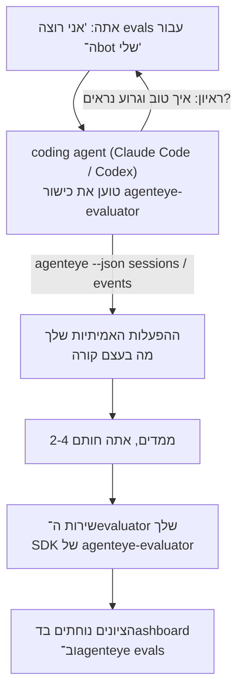

מעבר מ־*"אני חושב שה־agent שלנו לפעמים רע"* לשירות scoring מפורס, כשה־coding agent שלך עושה גם את ההחלטה וגם את הבנייה. **כישור Failproof AI Observability evaluator** (`agenteye-evaluator`) הוא *Agent Skill*: תיקייה קטנה של הוראות שה־coding agent כמו Claude Code או Codex טוען על פי הצורך. היא מלמדת את ה־agent לחשוב אילו ממדי איכות כדאי לעקוב עבור *ה־agent שלך*, ואז לכתוב, לבדוק ולפרוס את [שירות ה־evaluator](/he/agenteye/evaluation-suite) שנותן ציון להם.

זה **לא** scorer מתארח, רג׳יסטרי שאתה מעלה אליו, או מערכת תוסף. ה־evaluator שלך נשאר שירות HTTP משלך על התשתית שלך, בדיוק כמו שתואר ב־[מדריך Evaluation suite](/he/agenteye/evaluation-suite). הכישור רק מלמד את ה־agent לבנות את זה טוב, אז הכל שהוא עושה, אתה יכול לעשות בעצמך בכתיבת אותו קוד.

---

## החלק הקשה הוא להחליט מה לתת ציון

משטח ה־SDK קטן — דקורטור ושני מודלים — וה־agent יכול לכתוב את זה מ־[החוזה](/he/agenteye/evaluation-suite#http-contract) לבד. זה לא המקום שבו evaluators נכשלים. הם נכשלים כי הם נותנים ציון לדבר לא נכון, וה־evaluator שנותן ציון לדבר לא נכון גרוע יותר מאפס: הוא מייצר dashboard שכולם למדו להתעלם ממנו.

אז רוב הכישור הוא החלק לפני שקיים קוד. יש לו את ה־agent לראיין אותך (*"תאר הרצה שהשתפרה; עכשיו אחת שהשתפרה בצורה גרועה"*), אז משוך את ההפעלות האמיתיות שלך דרך [`agenteye` CLI](/he/agenteye/cli) וקרא אותן מקצה לקצה. שתי החצאים האלה בדרך כלל לא מסכימים, והפער הוא הנקודה: מה אתה מתכוון למדוד מול מה שהטרנסקריפטים שלך יכולים בעצם לתמוך. מימד שורד רק אם הוא **חישוב** מהאירועים ו־**מבחין** — אם הוא נותן ציון 0.9 גם בהרצה הטובה שלך וגם בזו הרעה, הוא לא מלמד כלום ומקבל את הגזר.

מה שחוזר היא הצעה של 2-4 ממדים עם ההנמקה המצורפת, כדי שתוכל לחתום עליה לפני שכל שורה כתובה.



---

## איך זה קשור לחלקי ה־evaluation האחרים

ארבעה דוקים מכסים scoring, והם חוזרים אחד לשני לפי סדר:

| דף | מה זה | הגשו לו כאשר |
|---|---|---|
| **[Evaluations](/he/agenteye/evaluations)** | התכונה: ציונים על רשת ההפעלות, dashboards, הערכה מחדש | אתה רוצה לדעת מה scoring אוטומטי נותן לך |
| **[Evaluation suite](/he/agenteye/evaluation-suite)** | החוזה HTTP, ה־SDK, משתני סביבת השרת | אתה מממש או דיבוג את ה־evaluator בעצמך |
| **כישור Evaluator** (דוק זה) | דלת כניסה בשפה טבעית על עיצוב *וגם* בנייה של ה־scorer | אתה רוצה ללכת מ־"אני רוצה evals" לשירות פעיל |
| **[כישור CLI](/he/agenteye/cli-skill)** | דלת כניסה בשפה טבעית על `agenteye` CLI | אתה רוצה *לקרוא* את הציונים שכבר יש לך |
| **[כישור Python SDK](/he/agenteye/python-sdk-skill)** | דלת כניסה בשפה טבעית על instrumentation של ה־agent שלך | ה־agent שלך עדיין לא פולט הפעלות — אין כלום לתת ציון |

### מול כישור CLI: בנייה מול קריאה

שני הכישורים מעומדים כדי שלא יהיו חופפים, והתקנת שניהם היא ההגדרה הנורמלית — ה־agent בוחר ביניהם על סמך מה שאתה שואל:

- **`agenteye-evaluator`** (דוק זה) בונה את הדבר שמ*יצר* ציונים. העבודה שלה מסתיימת כאשר ציונים נוחתים בפעם הראשונה.
- **[`agenteye-cli`](/he/agenteye/cli-skill)** קורא ציונים שכבר קיימים (`agenteye evals`). *"האם האיכות ירדה השבוע?"* היא השאלה שלו, לא של כישור זה.

---

## דרישות מוקדמות

1. **`agenteye` CLI מותקן ומחובר** (`pipx install agenteye`, ואז `agenteye login`). הכישור משתמש בו פעמיים: כדי למשוך את ההפעלות האמיתיות שהוא מעצב עבורן, וכדי לאשר שהציונים שלך נוחתו בסוף. ההתחברות שלך צריכה `events:read`, בתוספת `evaluations:read` עבור הבדיקה הסופית הזו. כמו בכישור ה־CLI, היא **לא יכולה** להשלים את ההתחברות לקוד חד־פעמי שנשלח לדוא״ל בשבילך.
2. **מקום לה־evaluator להיות.** הוא נבנה לתמונה ורץ כשירות ארוך טווח, אז זה צריך repo אמיתי, לא קובץ scratch. Evaluators לעתים קרובות חיים בה־repo שלהם, נפרדים מה־agent שנותן לו ציון — הכישור מחפש אחד קיים ושואל לפני scaffolding של אחד חדש.
3. **גלגל `agenteye-evaluator` SDK** — קרא את הסעיף הבא לפני שה־agent שלך מתחיל להקליד פקודות `pip`.

---

## איפה להשיג את זה

הכישור מפורסם בקולקציית הכישורים הציבורית של Failproof AI:

**[github.com/FailproofAI/skills](https://github.com/FailproofAI/skills)** → [`skills/agenteye-evaluator/`](https://github.com/FailproofAI/skills/tree/main/skills/agenteye-evaluator)

ה־repository הוא ציבורי והכישור לא צריך אישור משלו — הוא רק מנהל את `agenteye` CLI עם ההפעלה *שאתה* התחברת אליה, ודורך קוד *ב־repo שלך*. שימו לב שהוא משנה כתיקייה משלו והוא **לא** בתוך חבילת `pipx install agenteye`, אז אל תחפש את זה שם.

## התקנת הכישור

הנתיב המהיר ביותר הוא [`skills`](https://skills.sh) CLI, שמביא את התיקייה ומשנה אותה למקום שבו ה־agent שלך מחפש:

```bash
# Claude Code, פרויקט זה בלבד
npx skills add FailproofAI/skills --skill agenteye-evaluator -a claude-code

# כל פרויקט (מתקנים ל ~/.claude/skills/)
npx skills add FailproofAI/skills --skill agenteye-evaluator -a claude-code -g --copy

# Codex במקום זאת
npx skills add FailproofAI/skills --skill agenteye-evaluator -a codex
```

אז נהל את זה כמו כל כישור אחר:

```bash
npx skills list -a claude-code           # מה מותקן
npx skills update agenteye-evaluator     # משוך את הגרסה החדשה ביותר
npx skills remove agenteye-evaluator     # הסר אותו
```

מעדיף להתקין ביד? Agent Skill הוא רק תיקייה המכילה `SKILL.md` (בתוספת התייחסויות אופציונליות), אז העתקה עובדת גם:

- **Claude Code**: שנה את תיקיית `agenteye-evaluator/` לתוך `~/.claude/skills/` (כל פרויקט) או `<your-repo>/.claude/skills/` (רק repo זה). Claude Code מגלה אותו באופן אוטומטי — אמת עם רשימת `/skills`, או פשוט בקש evals.
- **Codex (OpenAI)**: Codex קורא את אותו `SKILL.md`. ה־`agents/openai.yaml` המצורף מגדיר `allow_implicit_invocation: true`, אז Codex בוחר את הכישור באופן אוטומטי כאשר משימה תואמת; אחרת קרא אותו באופן מפורש כ־`$agenteye-evaluator`.

---

## ה־SDK לא נמצא ב־PyPI הציבורי

> **אזהרה:** קרא זה לפני שאתה נותן ל־agent להתקין את ה־SDK.

הכישור הוא ציבורי; ה־SDK שהוא מנהל את זה אינו. `agenteye-evaluator` משנה רק כחפץ release פרטי, ובניגוד ל־`agenteye`, השם הוא **לא תבוע ב־PyPI הציבורי** — אז bare `pip install agenteye-evaluator` יכול למשוך חבילת זר לשירות שקורא את טרנסקריפטים הייצור שלך. זה בעיה בשרשרת הזמנה, לא טיפו.

הכישור יודע את זה ועובד למטה בסולם התקנה במקום, מעצור בראשון שחל: המקור monorepo אם אתה בתוך repo AgentEye, אחרת הגלגל release פרטי מ־GitHub Releases (צריך access), ואם אף אחד לא זמין זה **עוצר ואומר לך לבקש את הגלגל מ־contact Failproof AI שלך** במקום להתמודד.

אז אם ה־agent שלך מציע bare `pip install agenteye-evaluator` מ־PyPI הציבורי, זה הסימן שהכישור לעולם לא נטען. עצור שם ובדוק שהוא מותקן.

---

## מה אתה יכול לבקש ממנו

סיבוב אמיתי מתחיל בבקשה מעורפלת ומסתיים בעיצוב שחותם עליו, לא בקוד:

```text
אתה   ▸ אני רוצה evals עבור ה־support bot שלנו. אני חושב שהוא לפעמים רע.

agent ▸ לפני שאני כותב כלום: תאר הרצה שהשתפרה,
        ואחת שהשתפרה בצורה גרועה.

אתה   ▸ טוב: הוא עונה מהדוקים. גרוע: הוא משכנע דברים,
        או מוותר ואומר "צור קשר עם התמיכה".

agent ▸ רץ: agenteye --json sessions --status error --since 7d
        קריאה 5 הפעלות, כולל שתיים שאתה קורא להן גרועות.

        המילים שלך אומרות עובדתיות וסילוג. הטרנסקריפטים
        מסכימים על סילוג (2 מתוך 5 מסתיימים בהעברת תמיכה,
        וזה ברור ב־model_response.content), אבל עובדתיות
        צריכה אמת קרקע שהאירועים שלך לא נושאים.

        אז אתן ציון לשלושה דברים:
          - deflection      כללים, זול, מפריד בין שתי הרצות שלך
          - tool_efficiency כללים, תופס לולאת retry בהרצה 004
          - groundedness    שופט LLM: כל טענה בדוקים שהוא שלף?

        "עובדתיות" הייתה צריכה אמת קרקע שאין לנו; groundedness
        הוא הדבר הקרוב ביותר שהטרנסקריפטים שלך יכולים בעצם לתמוך.
        בסדר עם שלושה השמות האלה? שינוי שם מאוחר יותר מפצל את ההיסטוריה.

אתה   ▸ כן

agent ▸ אין evaluator ב־repo הזה. האם אני צריך ליצור scaffolding כאן, או יש
        לך אחד במקום אחר?
```

משם הוא כותב את הממדים המבוססי כללים קודם (חינם, מיידי, דטרמיניסטי), בודק אותם מול הפעלה אמיתית שנתפסה כולל האלה הריקות ושלעולם לא גמרו שמשבשות evaluators נאיביים, ורק מגיע לשופט LLM בממד הסובייקטיבי. הוא יודע את [המגבלות של המשדר](/he/agenteye/evaluation-suite#configuring-the-server) — timeout של 30 שנייה וקריאות 8 בו זמניות בכלל הפריסה — אז אם השופט לא יתאים בצורה אמינה, הוא הולך async עם `JobPending` במקום לתת לשופט שלך להתבטל ולהיות מוגש מחדש חמש פעמים בחמש פעמים העלות.

אז הוא פורס, מגדיר את שני משתני סביבת השרת, ומאשר עם `agenteye --json evals --session-id <id>` שהציונים בעצם נוחתו. ציונים שנוחתו היא ההוכחה היחידה.

---

## מה לשים לב

- **שמות ממדים קרובים לתחתוני.** מפתחות ציון הם מחרוזות שרירותיות והפלטפורמה מטרנדת כל מה שאתה שולח, מה שאומר שכלום downstream לא מתקן בחירה רעה. שינוי שם מאוחר יותר והיסטוריה מתפצלת: הפעלות ישנות שומרות את המפתח הישן והמגמה שבורה. זו הסיבה שהכישור מקבל אישור מפורש לפני כתיבת קוד — קח את הנתון הזה ברצינות.
- **Fixtures הם טרנסקריפטים ייצור אמיתיים.** עיצוב נגד הפעלות אמיתיות אומר משיכה אליהם לדיסק, והם יכולים להכיל נתוני לקוח. הכישור שואל לפני התחייבות אליהם ל־git; אם בספק, שמור `fixtures/` מחוץ ל־repo והעמדה כל מפתח לעצמם משלהם.
- **ה־agent כותב ופורס שירות שקורא כל טרנסקריפט.** הוא פועל כאתה, חסום על ידי הרשאות ה־CLI login שלך, אבל בדוק את ה־evaluator כמו כל קוד אחר הנוגע לנתוני ייצור.

---

## צעדים הבאים

- **[Evaluation suite](/he/agenteye/evaluation-suite)**: החוזה HTTP, ה־SDK, ומשתני סביבת השרת שהכישור מגדיר.
- **[Evaluations](/he/agenteye/evaluations)**: איפה הציונים מופיעים ברגע שהם נוחתים.
- **[כישור CLI](/he/agenteye/cli-skill)**: הכישור התאום, לקריאת תוצאות במקום בנייה של ה־scorer.
- **[CLI](/he/agenteye/cli)**: ההתייחסות לפקודות מאחורי נתוני ההפעלה שהכישור מעצב עבורה.