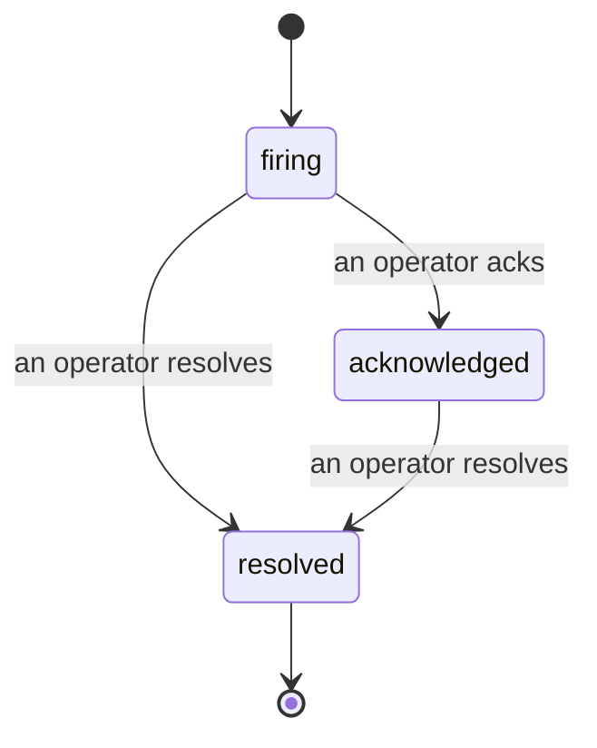

כשהתראה משתלחת, השאלה הראשונה היא תמיד "מי מטפל בזה?" תקריות עונות לכך: ברגע שמשהו חוצה סף, כולם רואים שתקרית פתוחה, מי הבעלים שלה, ובדיוק מה קרה עד כה, עם רשומה נקייה וממוקדת שאתה יכול להעביר ישירות לניתוח post-mortem.

*תיבת הכניסה מקבצת תקריות פתוחות לפי מצב ומסננת לפי חומרה ובעלות, כך שאתה רואה מה צריך תשומת לב אנושית עכשיו.*

## דע מי יש לזה, במבט חטוף

אין עוד "האם מישהו בודק את זה?" בשרשור צ'אט. הפרה פותחת תקרית באופן אוטומטי וזורקת אותה לתיבת כניסה משותפת, מקובצת לפי מצב. הודע על כך והשם שלך כתוב עליה, כך ששאר הצוות יודע שזה מטופל. ההודעה היא משותפת: מספר מפעילים יכולים להודות על אותה תקרית וכל אחד מתועד בנפרד, כך שחדר מלחמה שלם מופיע בשמות במקום שהם דורכים אחד על השני. הקצה בעלים אחד לבדיקה ראשונית, וסנן את תיבת הכניסה לפי חומרה או בעלות כדי להצטמצם לממה שלך.

## כל הסיפור, בציר הזמן אחד

כשהתקרית נגמרת, כבר יש לך את הכתיבה. פתח כל תקרית וקבל את ראיות ההפרה, בעליה והמנויים שלה, שרשור תגובות לתיאום במקום, וציר זמן פעילות מצטבר בלבד.

*כל מה שקרה, לפי סדר, כל שורה חתומה על ידי מי שעשה זאת.*

כל פעולה (פתוחה, הודקה, פתורה וכו') נכתבת לציר הזמן הזה ולעולם לא נערכת. כל ערך מיוחס: למפעיל שנקט בו, לפי דוא"ל, או ל**automated** לכל דבר ש-FailproofAI Observability עשה בעצמו, כמו פתיחת התקרית בהפרה. שום דבר לא אנונימי ולא מאבד, כך שה-post-mortem פחות או יותר כותב את עצמו.

## כיצד תקרית זה נעה

- **פתוחה (firing):** ההפרה פותחת את התקרית והעמודים בערוצים שלך פעם אחת. הפרות חוזרות מתקפלות לאותה תקרית ורענן את הראיות שלה במקום להעמיד דף לך שוב ושוב.
- **Acknowledged:** מפעיל הרימו. זה נשאר פתוח, והפרות מאוחרות יותר מעדכנות את הראיות בשקט.
- **Resolved:** מפעיל סוגר זאת. רזולוציה אוטומטית כאשר התנאי מתעדכן מתוכננת אך עדיין לא מופעלת, כך שתקרית נשארת פתוחה עד שאדם פותר אותה, מה ששומר על כולם כנים בנושא מה שבעצם התחדש. תקרית טרייה יכולה להיפתח באותה התראה מאוחר יותר.

התראה אחת מחזיקה לכל היותר תקרית פתוחה אחת בכל פעם, כך שכלל נדנדה לא יכולה להטביע אותך בשכפולים. אתה יכול גם לפתוח תקרית ביד: אחד עצמאי לדבר שלא התראה תפסה, או אחד המקושר להתראה קיימת, אם יש לך `incidents:write`.

## איפה למצוא את זה

תקריות חיות ב-`/<org-slug>/incidents`. הצפייה דורשת **`incidents:read`**; פתיחת תקרית ידנית דורשת **`incidents:write`**; הודעה, הקצאה, הערה, ופתרון דורשים **`incidents:ack`**. מפתחות ישנים יותר שהעניקו את `alerts:ack` שפרש מחזיקים בעבודה, מכיוון שהוא מכובד כ-`incidents:ack`, כך שסיבוב ה-on-call שלך לא צריך להוציא מחדש.

## קשור

- [Alerts](/he/agenteye/alerts): הכללים שפותחים את התקריות הללו כאשר סף חוצה.
- [Error tracking](/he/agenteye/error-tracking): ראה כל כשל במקום אחד ותקדם אחד להתראה.
- [Audits](/he/agenteye/audits): האנליסט המתוזמן שמוצא את ההנחותים שלא היה כלל כלל שמשקיף.