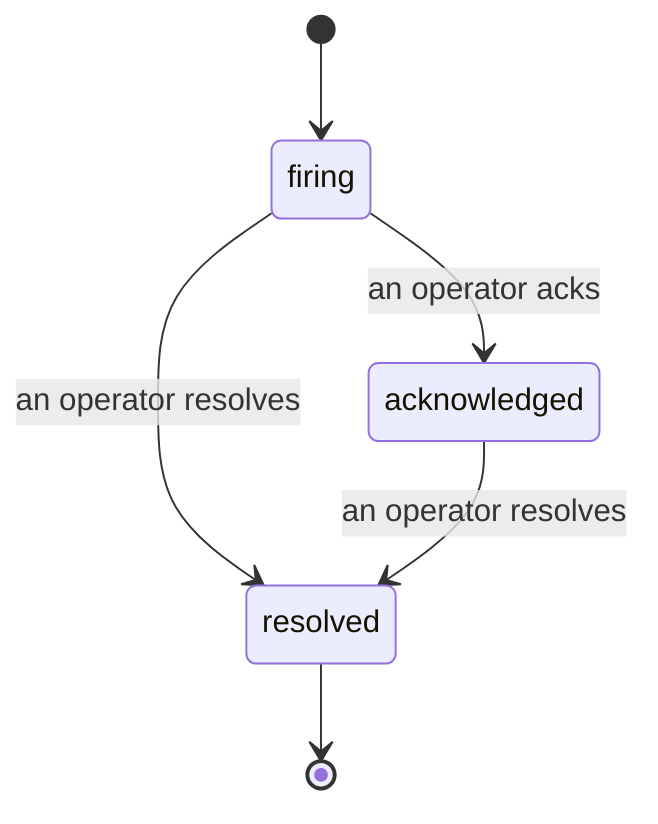

כאשר התראה נורה, השאלה הראשונה היא תמיד "מי טוען בזה?" התקריות משיבות לה: ברגע שמשהו חוצה סף, כולם יכולים לראות שהתקרית פתוחה, מי אחראי לה, ובדיוק מה קרה עד כה, עם רשומה נקייה ומיוחסת שאתה יכול להעביר ישירות לניתוח ما-after.

*תיבת הכניסה מקבצת תקריות פתוחות לפי מצב ומסננת לפי חומרה והשמה, כך שאתה רואה מה זקוק לתשומת לב אנושית עכשיו.*

## דע מי טוען בזה, במבט אחד

לא עוד "האם מישהו בודק את זה?" בשרשור צ'אט. הפרצה פותחת תקרית באופן אוטומטי ומושלכת אותה לתיבת כניסה משותפת, מקובצת לפי מצב. אשר עליה והשם שלך כתוב עליה, כך ששאר הצוות יודע שזה מטופל. אישור משותף: מספר מפעילים יכולים לאשר את אותה התקרית וכל אחד מתועד בנפרד, כך שחדר מלחמה מלא מופיע לפי שם במקום שהם דורכים אחד על השני. הקצה בעלים אחד לתיקוי, וסנן את תיבת הכניסה לפי חומרה או השמה כדי לצמצם אותה למה שלך.

## כל הסיפור, בציר זמן אחד

כאשר התקרית תיגמר, כבר יש לך את הכתיבה. פתח כל תקרית ותקבל את ראיות ההפרצה, בעליה ומינויה מרצים, שרשור הערות לתיאום במקום, וציר זמן פעילויות להוספה בלבד.

*כל מה שקרה, לפי סדר, כל שורה חתומה על ידי מי שעשה את זה.*

כל פעולה (נפתחה, אושרה, נפתרה, וכו') נכתבת לציר הזמן ולא עורכת מחדש. כל ערך מיוחס: למפעיל שלקח אותו, לפי דוא"ל, או ל**automated** לכל מה ש-Failproof AI Observability עשה בעצמו, כמו פתיחת התקרית בהפרצה. שום דבר אינו אנונימי ושום דבר אינו אבוד, כך שניתוח ما-after כמעט כותב את עצמו.

## איך התקרית נעה

- **פתוחה (firing):** ההפרצה פותחת את התקרית ומעמידה פנים לערוצים שלך פעם אחת. הפרצות חוזרות מתקפלות לאותה התקרית ורוענות את הראיות שלה במקום להציע לך פנים שוב ושוב.
- **Acknowledged:** מפעיל קוטף אותה. היא נשארת פתוחה, והפרצות מאוחרות יותר מעדכנות את הראיות בשקט.
- **Resolved:** מפעיל סוגר אותה. רזולוציה אוטומטית כאשר התנאי מתפזר מתוכננת אך עדיין לא מופעלת, כך שתקרית נשארת פתוחה עד שאדם מפתור אותה, מה שמחזיק את כולם כנים בנוגע למה שהצליח בפועל. תקרית טרייה יכולה להיפתח באותה ההתראה מאוחר יותר.

התראה אחת מחזיקה לכל היותר תקרית פתוחה אחת בכל פעם, כך שכלל רועד לא יכולה לקבור אותך בעותקים. אתה יכול גם לפתוח תקרית ביד: תקרית עצמאית למשהו שלא התראה תפסה, או אחת המצורפת להתראה קיימת, אם יש לך `incidents:write`.

## היכן למצוא אותה

התקריות חיות ב-`/<org-slug>/incidents`. הצפייה זקוקה ל-**`incidents:read`**; פתיחת תקרית ידנית זקוקה ל-**`incidents:write`**; אישור, הקצאה, הערה, וריזולוציה זקוקים ל-**`incidents:ack`**. מפתחות ישנים יותר שהעניקו את ה-`alerts:ack` המיושן הנחסלים ממשיכים לעבוד, מכיוון שהוא מכובד כ-`incidents:ack`, כך שרוטציית ה-on-call שלך לא זקוקה להוצאה מחדש.

## קשור

- [Alerts](/he/agenteye/alerts): הכללים שפותחים את התקריות הללו כאשר סף חוצה.
- [Error tracking](/he/agenteye/error-tracking): ראה כל כישלון במקום אחד והעלה אחד להתראה.
- [Audits](/he/agenteye/audits): האנליסט המתוזמן שמוצא את הכישלונות שלא כלל אחד היה צופה.