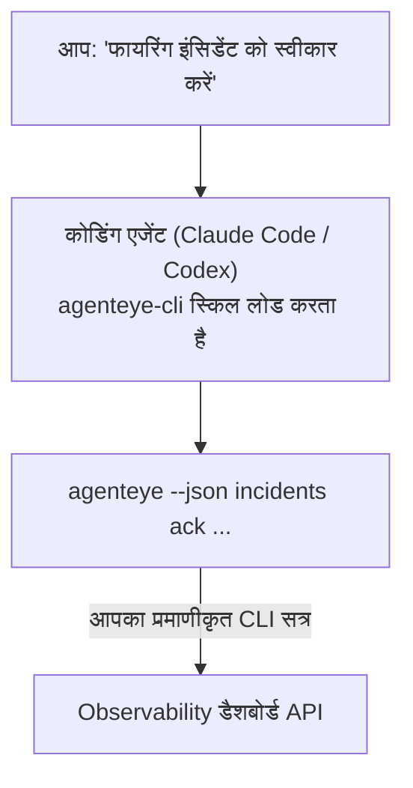

---
---
title: "Failproof AI Observability CLI Agent Skill"
description: "अपने कोडिंग एजेंट से पूछें कि \"क्या आज कुछ टूटा है?\" और इसे आपके लाइव Failproof AI Observability डेटा से उत्तर दें, कोई कमांड याद रखने की जरूरत नहीं।"
---


अपने कोडिंग एजेंट से पूछें *"क्या आज कुछ टूटा है?"* और इसे आपके लाइव Failproof AI Observability डेटा से उत्तर दें, कोई कमांड याद रखने की जरूरत नहीं। **Failproof AI Observability CLI स्किल** (`agenteye-cli`) एक *एजेंट स्किल* है: निर्देशों का एक छोटा फोल्डर जो Claude Code या Codex जैसे कोडिंग एजेंट को मांग पर लोड करता है। यह एजेंट को आपके Observability डिप्लॉयमेंट को [`agenteye` CLI](/hi/agenteye/cli) के माध्यम से सादे अंग्रेजी अनुरोधों के साथ संचालित करना सिखाता है जैसे *"CI को एक कुंजी दें जो केवल ईवेंट पुश कर सके"* या *"फायरिंग इंसिडेंट को स्वीकार करें और इसे मुझे असाइन करें।"*

यह एक सेवा या अलग बाइनरी **नहीं** है; तैनात करने के लिए कुछ नहीं है। यह CLI के शीर्ष पर काम करता है जो आप पहले ही इंस्टॉल कर चुके हैं: एजेंट `agenteye --json …` को कॉल करता है, स्वच्छ JSON को पार्स करता है, और आपको गद्य में उत्तर देता है। यह जो भी कर सकता है, आप उन्हीं कमांड को टाइप करके खुद कर सकते हैं।

---

## यह अन्य Failproof AI Observability इंटरफेस से कैसे संबंधित है

Failproof AI Observability आपको एक ही डेटा और नियंत्रण तक पहुंचने के चार तरीके देता है। वे एक दूसरे के पूरक हैं:

| इंटरफेस | यह क्या है | यह कहाँ चलता है | इसका उपयोग करें जब |
|---|---|---|---|
| **[CLI](/hi/agenteye/cli)** | `agenteye` के लिए कमांड/फ्लैग संदर्भ | आपका टर्मिनल | आप एक विशिष्ट कमांड चलाना या स्क्रिप्ट करना चाहते हैं |
| **[CLI व्यंजन](/hi/agenteye/cli-recipes)** | कॉपी-पेस्ट `jq`/पाइपलाइन पैटर्न | आपका टर्मिनल / स्क्रिप्ट | आप CLI को ऑटोमेशन में जोड़ रहे हैं |
| **CLI स्किल** (यह दस्तावेज़) | CLI पर एक प्राकृतिक-भाषा सामने का दरवाजा | आपका कोडिंग एजेंट, आपके वर्कस्टेशन पर | आप बस पूछना चाहते हैं और एजेंट को कमांड चुनने दें |
| **[मूल्यांकनकर्ता स्किल](/hi/agenteye/evaluator-skill)** | एक भाई स्किल जो आपकी स्कोरिंग सेवा डिजाइन और निर्माण करता है | आपका कोडिंग एजेंट, आपके वर्कस्टेशन पर | आप eval स्कोर *उत्पन्न* करना चाहते हैं न कि पढ़ना |
| **[Python SDK स्किल](/hi/agenteye/python-sdk-skill)** | एक भाई स्किल जो आपके एजेंट को साधन करता है ताकि यह टेलीमेट्री उत्सर्जित करे | आपका कोडिंग एजेंट, आपके वर्कस्टेशन पर | आप अपने एजेंट को ईवेंट *उत्पन्न* करना चाहते हैं जो यह स्किल पढ़ता है |
| **[डैशबोर्ड में AI सहायक](/hi/agenteye/assistant)** | डैशबोर्ड में एम्बेड किया गया चैट | सर्वर-साइड (डैशबोर्ड में) | आप अपने डेटा पर डैशबोर्ड में Q&A चाहते हैं |

स्किल का अपना कोई विशेषाधिकार नहीं है; यह केवल आपके शब्दों को CLI कॉल में बदलता है जो आप के रूप में चलते हैं:



### डैशबोर्ड में AI सहायक की तुलना में: एक महत्वपूर्ण अंतर

ये दो अलग-अलग उपकरण हैं जिनके बहुत अलग-अलग प्रभाव क्षेत्र हैं:

- **डैशबोर्ड में AI सहायक** ([AI सहायक](/hi/agenteye/assistant)) डैशबोर्ड में एम्बेड किया गया एक चैट है, एजेंट सेवा द्वारा समर्थित। यह **केवल पढ़ने के साथ-साथ अनुमोदन-गेटेड लेखन** है: यह सहेजे गए प्रश्न और डैशबोर्ड ड्राफ्ट कर सकता है, लेकिन हर लेखन आपके स्पष्ट क्लिक-अनुमोदन के लिए रुकता है, और यह कभी हटाता नहीं है। यह `agent:use` अनुमति द्वारा गेटेड है और केवल उस org के डेटा को देखता है जिसे आप देख रहे हैं।
- **CLI स्किल** *आपके* वर्कस्टेशन पर *आपके* कोडिंग एजेंट के अंदर चलता है और **आप के रूप में** `agenteye` CLI को चलाता है। यह CLI के **पूर्ण सतह, सहित म्यूटेशन** (API कुंजियां बनाएं/घुमाएं/अक्षम करें, org सेटिंग्स बदलें, इंसिडेंट को हल करें, सहेजे गए प्रश्न हटाएं) कर सकता है, केवल आपके CLI लॉगिन की अनुमतियों तक सीमित। इसे बिल्कुल वैसे ही व्यवहार करें जैसे आप उन कमांडों को हाथ से चलाते।

---

## पूर्वापेक्षाएं

1. **`agenteye` CLI इंस्टॉल** और `PATH` पर ([CLI](/hi/agenteye/cli) संदर्भ देखें: `pipx install agenteye`)।
2. आपका **डैशबोर्ड URL सेट** (`AGENTEYE_DASHBOARD_URL`, या एजेंट `--base-url` पास करता है)।
3. एक **लॉगिन किया हुआ सत्र**: पहले `agenteye login` खुद चलाएं। स्किल **नहीं** ईमेल किए गए एकबारी कोड लॉगिन को आपके लिए पूरा कर सकता है; यह आपको `agenteye login` चलाने के लिए कहेगा यदि सत्र गायब है या समाप्त है (CLI निकास कोड `4`)।

---

## इसे कहाँ से प्राप्त करें

स्किल Failproof AI के सार्वजनिक स्किल संग्रह में प्रकाशित है:

**[github.com/FailproofAI/skills](https://github.com/FailproofAI/skills)** → [`skills/agenteye-cli/`](https://github.com/FailproofAI/skills/tree/main/skills/agenteye-cli)

इसके बारे में कुछ भी गेटेड नहीं है — रिपॉजिटरी सार्वजनिक है और स्किल को अपने स्वयं की किसी भी क्रेडेंशियल की आवश्यकता नहीं है, क्योंकि यह केवल **सार्वजनिक** `agenteye` CLI को *आपके* डैशबोर्ड के विरुद्ध चलाता है, उस सत्र का उपयोग करके *जिसके साथ* आप लॉगिन करते हैं। आपको किसी से इसके लिए पूछने की जरूरत नहीं है।

ध्यान दें कि यह अपने स्वयं के फोल्डर के रूप में शिप करता है और `pipx install agenteye` पैकेज के अंदर **नहीं** है, इसलिए इसे वहां न खोजें।

## स्किल को इंस्टॉल करना

सबसे तेज़ मार्ग [`skills`](https://skills.sh) CLI है, जो फोल्डर को लाता है और इसे वहां रखता है जहां आपका एजेंट देखता है:

```bash
# Claude Code, केवल यह प्रोजेक्ट
npx skills add FailproofAI/skills --skill agenteye-cli -a claude-code

# प्रत्येक प्रोजेक्ट (~/.claude/skills/ में इंस्टॉल करता है)
npx skills add FailproofAI/skills --skill agenteye-cli -a claude-code -g --copy

# Codex के बजाय
npx skills add FailproofAI/skills --skill agenteye-cli -a codex
```

फिर इसे किसी अन्य स्किल की तरह प्रबंधित करें:

```bash
npx skills list -a claude-code      # क्या इंस्टॉल है
npx skills update agenteye-cli      # नवीनतम संस्करण खींचें
npx skills remove agenteye-cli      # इसे हटाएं
```

हाथ से इंस्टॉल करना पसंद है? एक एजेंट स्किल केवल एक `SKILL.md` वाला फोल्डर है (साथ में वैकल्पिक संदर्भ), इसलिए इसे कॉपी करना काम करता है:

- **Claude Code**: `agenteye-cli/` फोल्डर को `~/.claude/skills/` में रखें (प्रत्येक प्रोजेक्ट) या `<your-repo>/.claude/skills/` (केवल वह रेपो)। Claude Code इसे स्वचालित रूप से खोजता है — `/skills` सूची के साथ सत्यापित करें, या बस एक प्रश्न पूछें जो इसके विवरण से मेल खाता है।
- **Codex (OpenAI)**: Codex एक ही `SKILL.md` को पढ़ता है। बंडल किया गया `agents/openai.yaml` `allow_implicit_invocation: true` सेट करता है, इसलिए Codex जब कोई कार्य मेल खाता है तो स्किल को स्वचालित रूप से चुनता है; अन्यथा इसे `$agenteye-cli` के रूप में स्पष्ट रूप से आमंत्रित करें।

---

## सुरक्षा: जब एजेंट CLI चलाता है तो म्यूटेशन प्रॉम्प्ट **नहीं** करते हैं

> **चेतावनी:** एक एजेंट को परिवर्तन करने देने से पहले यह पढ़ें।

`agenteye` CLI आमतौर पर एक विनाशकारी क्रिया से पहले *"क्या आप निश्चित हैं?"* पूछता है। यह **हर बार उस पुष्टि को स्वचालित रूप से छोड़ देता है जब यह एक टर्मिनल से जुड़ा नहीं होता है (जो कि बिल्कुल वैसे ही है जैसे एक कोडिंग एजेंट इसे चलाता है), और `--json` भी इसे छोड़ देता है।** तो सुरक्षा प्रॉम्प्ट एजेंट के लिए **नहीं** चलेगी।

स्किल इसकी भरपाई के लिए लिखी गई है: इसे निर्देश दिया जाता है कि सटीक कमांड को बताएं जो यह चलाएगी और किसी भी स्थिति परिवर्तन से पहले आपकी स्पष्ट **OK लें**। उस अनुशासन को रखें। जब आप Failproof AI Observability को एजेंट के माध्यम से चलाते हैं, *आप* पुष्टि कदम हैं। स्थिति-परिवर्तन कमांड देखने के लिए:

- `keys create` / `update` / `disable` / `regenerate`
- `users create` / `update` / `disable` / `enable`
- `settings set`
- `alerts create` / `update` / `delete` / `test`
- लेखन `incidents` उपकमांड: `ack` / `assign` / `resolve` / `open` / `comment-add` / `comment-delete` / `subscribe` / `unsubscribe`
- `query create` / `update` / `delete`
- `agent rename` / `delete`
- `orgs switch`

**Observe** के तहत सब कुछ (`events`, `sessions`, `evals`, `errors`, `list`, `whoami`, `orgs list/current/perms`) केवल पढ़ने के लिए है और कुछ भी नहीं बदलता है।

क्योंकि एजेंट **आप के रूप में** कार्य करता है, यह केवल वह कर सकता है जो आपके लॉगिन को करने की अनुमति है; अनुमतियां **प्रति org** हल की जाती हैं ([API कुंजियां](/hi/agenteye/api-keys) देखें)। एक कमांड जिसके लिए आपके पास अनुमति नहीं है, निकास कोड `5` के साथ सटीक अनुमति का नाम देता है, इसलिए एजेंट आपको सटीक रूप से बता सकता है कि एक व्यवस्थापक से क्या पूछना है बजाय अस्पष्ट विफलता के।

---

## आप इससे क्या पूछ सकते हैं

यहां एक वास्तविक राउंड-ट्रिप क्या दिखता है, एक पढ़ना, फिर एक परिवर्तन जो आपकी OK के लिए प्रतीक्षा करता है:

```text
आप   ▸ क्या पिछले दिन में कुछ टूटा है?

एजेंट ▸ चल रहा है: agenteye --json errors --since 24h --aggregate
        पिछले 24 घंटों में 3 त्रुटि प्रकार। सबसे बड़ी है TimeoutError
        (18 हिट, सभी checkout-agent पर), फिर RateLimited (5)।
        क्या आप TimeoutError के लिए विफल सत्र चाहते हैं?

आप   ▸ CI को एक कुंजी दें जो केवल ईवेंट पुश कर सके।

एजेंट ▸ यह एक API कुंजी बनाता है। मैं चलाऊंगा:
          agenteye keys create ci --add events:add
        आगे बढ़ने के लिए ठीक है?

आप   ▸ हाँ

एजेंट ▸ पूर्ण। कुंजी "ci" केवल events:add के साथ बनाई गई।
        गुप्त केवल एक बार दिखाया जाता है, इसलिए अभी इसे स्टोर करें। मैं इसे पुनः नहीं प्रिंट कर सकता।
```

स्किल प्रत्येक सादे-भाषा इरादे को सही `agenteye` कमांड में मैप करता है, पहले वैध मानों की खोज करता है (`list <kind>`, `whoami`) ताकि यह अनुमान न लगाए, और किसी भी परिवर्तन से पहले सटीक कमांड को बताता है। अधिक उदाहरण:

- *"पिछले 24 घंटे में कुछ टूटा है / विफल हो रहा है?"* → `errors --since 24h --aggregate`, फिर एक विभाजन।
- *"सत्र `run-001` क्यों विफल हुआ?"* → `events --session-id run-001 --all` + `evals --session-id run-001`।
- *"इस सप्ताह गुणवत्ता कैसे रुझान दिखा रही है?"* → `evals --aggregate --since 7d`, फिर कम-स्कोरिंग रन में ड्रिल करें।
- *"CI को एक कुंजी दें जो केवल ईवेंट पुश कर सके।"* → `keys create ci --add events:add` (यह कमांड को बताता है, फिर इसे बनाता है और एकबारी गुप्त को कैप्चर करता है)।
- *"किसके पास अ्रेसेस है? Dana को केवल पढ़ने के लिए बनाएं।"* → `users list` → `users update dana@… --permission-set read-only` (आपके साथ पुष्टि के बाद)।
- *"फायरिंग इंसिडेंट को स्वीकार करें और इसे मुझे असाइन करें।"* → `incidents list --state firing` → `incidents ack <id>` / `incidents assign <id> you@…`।

सटीक कमांड, फ्लैग, और JSON आकार के लिए, [CLI](/hi/agenteye/cli) संदर्भ और [एजेंटों के लिए CLI व्यंजन](/hi/agenteye/cli-recipes) देखें।

---

## अगले कदम

- **[CLI](/hi/agenteye/cli)**: `agenteye` के लिए पूर्ण कमांड और फ्लैग संदर्भ।
- **[एजेंटों के लिए CLI व्यंजन](/hi/agenteye/cli-recipes)**: कॉपी-पेस्ट `jq` पैटर्न और निकास-कोड हैंडलिंग।
- **[मूल्यांकनकर्ता एजेंट स्किल](/hi/agenteye/evaluator-skill)**: भाई स्किल, मूल्यांकनकर्ता के निर्माण के लिए जिसके स्कोर `agenteye evals` पढ़ता है।
- **[Python SDK एजेंट स्किल](/hi/agenteye/python-sdk-skill)**: भाई स्किल, एजेंट को साधन के लिए ताकि यह टेलीमेट्री उत्सर्जित करे जो `agenteye` पढ़ता है।
- **[AI सहायक](/hi/agenteye/assistant)**: डैशबोर्ड में सहायक (इस टर्मिनल स्किल से भ्रमित न हों)।
- **[API कुंजियां](/hi/agenteye/api-keys)**: प्रति-org अनुमति मॉडल जो बाध्य करता है कि स्किल क्या कर सकता है।