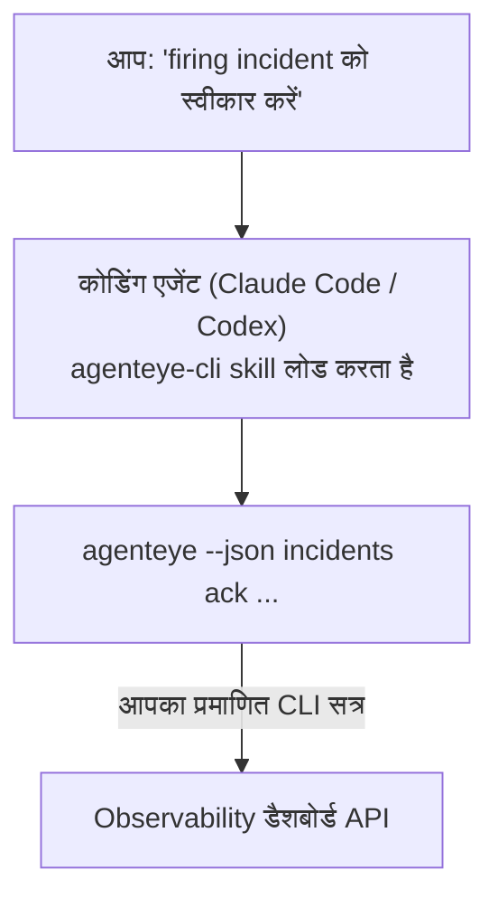

अपने कोडिंग एजेंट से पूछें *"क्या आज कुछ टूटा हुआ है?"* और इसे आपके लाइव FailproofAI Observability डेटा से उत्तर दें, बिना कोई कमांड याद किए। **FailproofAI Observability CLI skill** (`agenteye-cli`) एक *Agent Skill* है: निर्देशों का एक छोटा-सा फ़ोल्डर जो Claude Code या Codex जैसे कोडिंग एजेंट को आवश्यकता पर लोड करता है। यह एजेंट को [`agenteye` CLI](/hi/agenteye/cli) के माध्यम से आपके Observability डिप्लॉयमेंट को संचालित करना सिखाता है, सादे अंग्रेजी अनुरोधों से जैसे *"CI को एक कुंजी दें जो केवल events push कर सके"* या *"firing incident को स्वीकार करें और इसे मुझे असाइन करें।"*

यह एक सेवा या अलग बाइनरी **नहीं** है; डिप्लॉय करने के लिए कुछ भी नहीं है। यह आपके द्वारा पहले से इंस्टॉल किए गए CLI के शीर्ष पर चलता है: एजेंट `agenteye --json …` को शेल करता है, साफ JSON को पार्स करता है, और आपको सादे भाषा में उत्तर देता है। यह सब कुछ कर सकता है, आप इसे स्वयं उन्हीं कमांड को टाइप करके कर सकते थे।

---

## यह अन्य FailproofAI Observability इंटरफेस से कैसे संबंधित है

FailproofAI Observability आपको एक ही डेटा और नियंत्रण तक पहुंचने के चार तरीके देता है। ये एक दूसरे की पूरक हैं:

| इंटरफेस | यह क्या है | यह कहां चलता है | इसे कब प्राप्त करें |
|---|---|---|---|
| **[CLI](/hi/agenteye/cli)** | `agenteye` के लिए कमांड/फ्लैग संदर्भ | आपका टर्मिनल | जब आप कोई विशेष कमांड चलाना या स्क्रिप्ट करना चाहते हैं |
| **[CLI recipes](/hi/agenteye/cli-recipes)** | कॉपी-पेस्ट `jq`/pipeline पैटर्न | आपका टर्मिनल / स्क्रिप्ट | जब आप CLI को ऑटोमेशन में जोड़ रहे हैं |
| **CLI skill** (यह doc) | CLI पर एक प्राकृतिक-भाषा फ्रंट डोर | आपके कोडिंग एजेंट पर, आपके वर्कस्टेशन पर | जब आप बस पूछना चाहते हैं और एजेंट को कमांड चुनने दें |
| **[इन-डैशबोर्ड AI असिस्टेंट](/hi/agenteye/assistant)** | डैशबोर्ड में एम्बेड किया गया चैट | सर्वर-साइड (डैशबोर्ड में) | जब आप अपने डेटा पर इन-डैशबोर्ड Q&A चाहते हैं |

skill के पास अपनी कोई विशेषाधिकार नहीं है; यह केवल आपके शब्दों को CLI कॉल में बदलता है जो आप के रूप में चलते हैं:



### इन-डैशबोर्ड AI असिस्टेंट के विरुद्ध: एक महत्वपूर्ण अंतर

ये दो भिन्न उपकरण हैं जिनकी बहुत भिन्न प्रभाव सीमा है:

- **इन-डैशबोर्ड AI असिस्टेंट** ([AI assistant](/hi/agenteye/assistant)) डैशबोर्ड में एम्बेड किया गया एक चैट है, जिसे एजेंट सेवा द्वारा समर्थित किया जाता है। यह **केवल पढ़ने के साथ अनुमोदन-गेटेड लेखन** है: यह सहेजे गए प्रश्न और डैशबोर्ड ड्राफ्ट कर सकता है, लेकिन हर लेखन आपकी स्पष्ट क्लिक-अनुमोदन के लिए रुकता है, और यह कभी भी हटाता नहीं है। इसे `agent:use` अनुमति द्वारा गेट किया जाता है और केवल आपके द्वारा देखे जा रहे org के लिए डेटा देखता है।
- **CLI skill** आपके वर्कस्टेशन पर आपके कोडिंग एजेंट के अंदर चलता है और `agenteye` CLI को **आप** के रूप में चलाता है। यह CLI की **पूरी सतह, परिवर्तन सहित** कर सकता है (API कुंजी बनाएं/रोटेट/अक्षम करें, org सेटिंग बदलें, incidents हल करें, सहेजे गए प्रश्न हटाएं), केवल आपकी CLI लॉगिन की अनुमतियों द्वारा सीमित। इसे ठीक उसी तरह व्यवहार करें जैसे आप उन कमांड को हाथ से चलाते हैं।

---

## आवश्यकताएं

1. **`agenteye` CLI इंस्टॉल** और `PATH` पर (देखें [CLI](/hi/agenteye/cli) संदर्भ: `pipx install agenteye`)।
2. आपका **डैशबोर्ड URL सेट** (`AGENTEYE_DASHBOARD_URL`, या एजेंट `--base-url` पास करता है)।
3. एक **लॉगिन किया हुआ सत्र**: पहले अपने आप `agenteye login` चलाएं। skill **आपके लिए** ईमेल किए गए एकबारी-कोड लॉगिन को पूरा नहीं कर सकता; यदि सत्र गायब या समाप्त है तो यह आपको `agenteye login` चलाने के लिए कहेगा (CLI exit code `4`)।

---

## Skill स्थापित करना

Agent Skills फ़ोल्डर हैं जिनमें एक `SKILL.md` होता है (साथ ही optional संदर्भ)। आप `agenteye-cli` skill को अपने एजेंट जहां skill खोजता है वहां `agenteye-cli/` फ़ोल्डर रखकर स्थापित करते हैं:

- **Claude Code**: `agenteye-cli/` फ़ोल्डर को `~/.claude/skills/` में कॉपी करें (हर प्रोजेक्ट में उपलब्ध) या `<your-repo>/.claude/skills/` में (उस repo पर scoped)। Claude Code इसे auto-discover करता है; `/skills` list से verify करें, या बस कोई प्रश्न पूछें जो इसके विवरण से मेल खाता हो।
- **Codex (OpenAI)**: Codex एक ही `SKILL.md` पढ़ता है। bundled `agents/openai.yaml` `allow_implicit_invocation: true` सेट करता है, इसलिए Codex स्वचालित रूप से skill को चुनता है जब कोई कार्य मेल खाता है; अन्यथा `$agenteye-cli` के रूप में explicitly invoke करें।

Skill `agenteye` CLI के साथ बनाए रखा जाता है लेकिन एक **अलग फ़ोल्डर** के रूप में ship होता है, `pipx install agenteye` पैकेज के अंदर नहीं, तो वहां इसे मत देखो। FailproofAI Observability `agenteye-cli/` फ़ोल्डर को आपको अपने आप deliver करता है; यदि आपके पास यह नहीं है, तो अपने FailproofAI contact से पूछें। इसके बारे में कुछ भी gated नहीं है: इसे कोई credential की आवश्यकता नहीं है, क्योंकि यह केवल **public** `agenteye` CLI को आपके स्वयं के डैशबोर्ड के विरुद्ध चलाता है।

---

## सुरक्षा: परिवर्तन जब एजेंट CLI चलाता है तो PROMPT नहीं करते

> **Warning:** किसी एजेंट को changes बनाने देने से पहले इसे पढ़ें।

`agenteye` CLI आमतौर पर एक विनाशकारी कार्रवाई से पहले *"क्या आप निश्चित हैं?"* पूछता है। यह **जब भी यह terminal से attached नहीं होता है (जो बिल्कुल है कैसे कोडिंग एजेंट इसे चलाता है), तो auto-skip करता है, और `--json` भी इसे skip करता है।** तो सुरक्षा prompt एजेंट के लिए **नहीं** fire होगा।

Skill को compensate करने के लिए लिखा गया है: इसे निर्देशित किया जाता है कि कौन सी सटीक कमांड चलेगी और किसी भी state change से पहले आपकी explicit **OK** प्राप्त करें। उस अनुशासन को बनाए रखें। जब आप एजेंट के माध्यम से FailproofAI Observability चलाते हैं, तो *आप* confirmation step हैं। state-changing commands जिन्हें देखना है:

- `keys create` / `update` / `disable` / `regenerate`
- `users create` / `update` / `disable` / `enable`
- `settings set`
- `alerts create` / `update` / `delete` / `test`
- writing `incidents` subcommands: `ack` / `assign` / `resolve` / `open` / `comment-add` / `comment-delete` / `subscribe` / `unsubscribe`
- `query create` / `update` / `delete`
- `agent rename` / `delete`
- `orgs switch`

**Observe** के तहत सब कुछ (`events`, `sessions`, `evals`, `errors`, `list`, `whoami`, `orgs list/current/perms`) read-only है और कुछ नहीं बदलता है।

क्योंकि एजेंट **आप** के रूप में कार्य करता है, यह केवल वह कर सकता है जो आपकी लॉगिन को करने की अनुमति है; अनुमतियां **प्रति org** resolved होती हैं (देखें [API keys](/hi/agenteye/api-keys))। कोई कमांड जिसके लिए आपके पास अनुमति नहीं है, exit code `5` सटीक अनुमति नाम के साथ return करता है, इसलिए एजेंट आपको बिल्कुल यह बता सकता है कि admin से क्या पूछना है बजाय opaquely fail करने के।

---

## आप इससे क्या पूछ सकते हैं

यहां एक वास्तविक round-trip क्या दिखता है, एक read, फिर एक change जो आपकी OK के लिए प्रतीक्षा करता है:

```text
आप   ▸ क्या पिछले दिन में कुछ टूटा हुआ है?

एजेंट ▸ Running: agenteye --json errors --since 24h --aggregate
        पिछले 24h में 3 error types हैं। सबसे बड़ा TimeoutError है
        (18 hits, सभी checkout-agent पर), फिर RateLimited (5)।
        क्या आप TimeoutError के लिए failing sessions चाहते हैं?

आप   ▸ CI को एक कुंजी दें जो केवल events push कर सके।

एजेंट ▸ यह एक API key बनाता है। मैं चलाऊंगा:
          agenteye keys create ci --add events:add
        आगे बढ़ने के लिए OK?

आप   ▸ हां

एजेंट ▸ पूरा। Key "ci" केवल events:add के साथ बनाई गई।
        Secret केवल एक बार दिखाया जाता है, इसलिए इसे अभी संग्रहीत करें। मैं इसे पुनः प्रिंट नहीं कर सकता।
```

Skill प्रत्येक plain-English intent को सही `agenteye` कमांड में map करता है, पहले valid values खोज करता है (`list <kind>`, `whoami`) इसलिए यह अनुमान नहीं लगाता, और किसी भी change से पहले सटीक कमांड बताता है। अधिक उदाहरण:

- *"क्या कुछ टूटा/fail हो रहा है पिछले 24 घंटों में?"* → `errors --since 24h --aggregate`, फिर एक breakdown।
- *"सत्र `run-001` क्यों fail हुआ?"* → `events --session-id run-001 --all` + `evals --session-id run-001`।
- *"इस हफ्ते quality कैसे trending हो रहा है?"* → `evals --aggregate --since 7d`, फिर low-scoring runs में drill करें।
- *"CI को एक कुंजी दें जो केवल events push कर सके।"* → `keys create ci --add events:add` (यह कमांड बताता है, फिर बनाता है और one-time secret को capture करता है)।
- *"किसे access है? Dana को read-only बनाएं।"* → `users list` → `users update dana@… --permission-set read-only` (आपके साथ confirm करने के बाद)।
- *"Firing incident को स्वीकार करें और इसे मुझे असाइन करें।"* → `incidents list --state firing` → `incidents ack <id>` / `incidents assign <id> you@…`।

सटीक कमांड, flags, और इन के पीछे JSON shapes के लिए, देखें [CLI](/hi/agenteye/cli) संदर्भ और [agents के लिए CLI recipes](/hi/agenteye/cli-recipes)।

---

## अगले कदम

- **[CLI](/hi/agenteye/cli)**: `agenteye` के लिए पूर्ण कमांड और flag संदर्भ।
- **[agents के लिए CLI recipes](/hi/agenteye/cli-recipes)**: कॉपी-पेस्ट `jq` पैटर्न और exit-code handling।
- **[AI assistant](/hi/agenteye/assistant)**: इन-डैशबोर्ड असिस्टेंट (इस टर्मिनल skill से confused नहीं होना चाहिए)।
- **[API keys](/hi/agenteye/api-keys)**: per-org अनुमति मॉडल जो बताता है कि skill क्या कर सकता है।