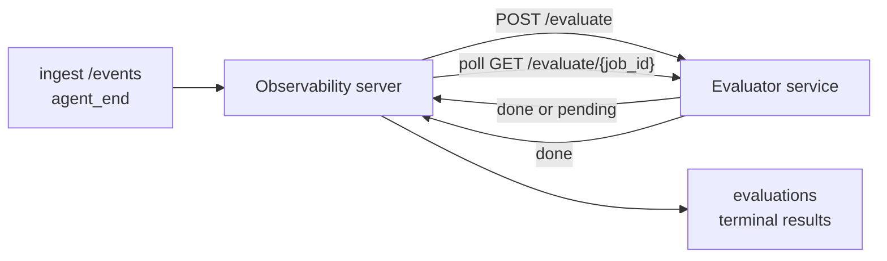

FailproofAI प्रेक्षणीयता प्रत्येक पूर्ण एजेंट रन को गुणवत्ता के लिए स्वचालित रूप से स्कोर कर सकती है: आप एक छोटी स्कोरिंग सेवा प्रदान करते हैं, और प्रेक्षणीयता बाकी काम संभालती है। इसका उपयोग उन आयामों को ट्रैक करने के लिए करें जिनकी आपको परवाह है (उपयोगिता, उपकरण दक्षता, तथ्यात्मकता, सुरक्षा; आप चुनते हैं), प्रतिगमन को जल्दी पकड़ें, और एक नज़र में एजेंटों या वातावरणों की तुलना करें। स्कोरिंग वैकल्पिक है: जब तक आप सर्वर पर `EVALUATOR_ENDPOINT` सेट न करें, पाइपलाइन कुछ नहीं करती।

> **नोट:** आप स्कोर आयामों को परिभाषित करते हैं। आपका मूल्यांकनकर्ता कोई भी संख्यात्मक कुंजी वापस कर सकता है; प्रेक्षणीयता जो कुछ भी आप भेजते हैं उसे संग्रहीत, ट्रेंड और प्रदर्शित करती है।

## एक नज़र में

1. **एक स्कोरर लिखें।** एक छोटी HTTP सेवा खड़ी करें जो एक सत्र प्रतिलेख पढ़ती है और स्कोर वापस करती है। प्रेक्षणीयता एक कार्यशील संदर्भ भेज देती है जिसे आप कॉपी कर सकते हैं। [SDK के साथ एक मूल्यांकनकर्ता लिखना](#writing-an-evaluator-with-the-sdk) देखें।
2. **प्रेक्षणीयता को इसकी ओर इशारा करें।** सर्वर प्रक्रिया पर `EVALUATOR_ENDPOINT` (और एक साझा `EVALUATOR_TOKEN`) सेट करें।
3. **स्कोर आते देखें।** हर पूर्ण सत्र स्वचालित रूप से स्कोर किया जाता है; परिणाम सत्र विवरण पृष्ठ, सत्र ग्रिड और सहेजे गए डैशबोर्ड पर दिखाई देते हैं।


*एक बार मूल्यांकनकर्ता कॉन्फ़िगर हो जाने के बाद, प्रत्येक पूर्ण रन को स्कोर किया जाता है और परिणाम सत्र की दाईं ओर की रेल में दिखाई देते हैं: ऊपर सारांश, फिर प्रति-आयाम स्कोर बार तर्क के साथ।*

---

## यह कैसे काम करता है



जब प्रेक्षणीयता SDK किसी सत्र के लिए `agent_end` ईवेंट उत्सर्जित करता है, तो सर्वर एक मूल्यांकन शेड्यूल करता है। यह तब पूरी ईवेंट प्रतिलेख आपकी मूल्यांकन सेवा को POST करता है, जो निम्न में से कर सकता है:

- **परिणाम को इनलाइन लौटाएं** `{"status":"done", "scores":{...}, "reasoning":{...}, "summary":"..."}` के साथ। परिणाम सत्र की मूल्यांकन समयरेखा में जोड़ा जाता है। `reasoning` और `summary` वैकल्पिक हैं।
- **स्थगित करें** `{"status":"pending", "job_id":"abc-123"}` के साथ। प्रेक्षणीयता तब `GET {EVALUATOR_ENDPOINT}/evaluate/abc-123` को कॉल करती है जब तक आपका मूल्यांकनकर्ता `{"status":"done", ...}` या `{"status":"error", "error":"..."}` न लौटाए।

  पोलिंग गति प्रति-कार्य है: एक `pending` प्रतिक्रिया में `next_poll_secs` शामिल हो सकते हैं; अन्यथा प्रेक्षणीयता `GET /config` से `default_poll_interval_secs` मान का उपयोग करती है; अन्यथा सर्वर `EVALUATOR_POLLING_INTERVAL_SECS` (डिफ़ॉल्ट 10s) पर वापस जाता है। सभी मान [1s, 1h] पर सीमित हैं।

सत्र जो कभी `agent_end` उत्सर्जित नहीं करते (उदाहरण के लिए, एक दुर्घटनाग्रस्त एजेंट प्रक्रिया) को भी चुना जा सकता है: मूल्यांकनकर्ता का `GET /config` `{"inactivity_timeout_secs": 1800}` लौटा सकता है, और प्रेक्षणीयता किसी भी सत्र का मूल्यांकन करेगी जो उतने समय के लिए निष्क्रिय है। इस फ़ॉलबैक को अक्षम करने के लिए फ़ील्ड को `null` पर सेट करें या इसे छोड़ दें।

जब `EVALUATOR_ENDPOINT` असेट हो तो पाइपलाइन पूरी तरह से नो-ऑप है।

एक सत्र समय के साथ **कई टर्मिनल मूल्यांकन जमा कर सकता है**: प्रत्येक `agent_end` ईवेंट (और डैशबोर्ड से प्रत्येक मैनुअल पुनः-मूल्यांकन) एक ताज़ा मूल्यांकन पंक्ति जोड़ता है। यह एक पुनः प्राप्त बातचीत का मूल्यांकन करने का समर्थित तरीका है: एक उपयोगकर्ता एक एजेंट को समाप्त करता है, बाद में वापस आता है, अधिक ईवेंट भेजता है, एजेंट को फिर से समाप्त करता है, और एक दूसरा मूल्यांकन पूरी अपडेट की गई प्रतिलेख के विरुद्ध चलता है। डैशबोर्ड सबसे हाल के मूल्यांकन को हेडलाइन के रूप में प्रस्तुत करता है और पूर्व मूल्यांकन को एक संक्षिप्त समयरेखा के रूप में प्रस्तुत करता है। जबकि एक सत्र के लिए एक मूल्यांकन चल रहा है, उस सत्र के लिए अतिरिक्त `agent_end` ईवेंट को अनदेखा कर दिया जाता है; चलने वाले मूल्यांकन के पूरा होने के बाद अगला एक नए सिरे से एक ताज़ा मूल्यांकन को कतारबद्ध करेगा।

निष्क्रियता फॉलबैक पुनः प्राप्त सत्रों पर भी फिर से जुड़ता है: यदि पूर्व टर्मिनल मूल्यांकन के बाद नई ईवेंट आती हैं और सत्र तब `inactivity_timeout_secs` को पास करने के लिए निष्क्रिय हो जाता है, तो एक ताज़ा मूल्यांकन कतारबद्ध है।

क्षणिक विफलताएं (5xx, 429, टाइमआउट, नेटवर्क त्रुटियां) `EVALUATOR_MAX_ATTEMPTS` तक घातीय बैकऑफ के साथ पुनः प्रयास की जाती हैं; 4xx प्रतिक्रियाएं टर्मिनल हैं। प्रेक्षणीयता कई क्षैतिज-स्केल किए गए सर्वर इंस्टेंस के साथ चलाने के लिए सुरक्षित है; काम विभाजित किया जाता है इसलिए एक ही सत्र को कभी एक साथ दो बार भेजा नहीं जाता है।

---

## HTTP अनुबंध

हर प्रमाणित मार्ग **bearer टोकन auth** का उपयोग करता है। एक ही मान दोनों ओर कॉन्फ़िगर किया जाना चाहिए:

- प्रेक्षणीयता सर्वर: env var `EVALUATOR_TOKEN`
- मूल्यांकनकर्ता सेवा: एक ही तरीके से कॉन्फ़िगर किया गया (`agenteye-evaluator` SDK परंपरा के अनुसार `EVALUATOR_TOKEN` पढ़ता है)

यदि `EVALUATOR_TOKEN` असेट है, तो सर्वर कोई `Authorization` हेडर नहीं भेजता है; मूल्यांकनकर्ता तब अनाम अनुरोधों को स्वीकार कर सकता है, जो एक आंतरिक-केवल नेटवर्क के लिए ठीक है लेकिन सार्वजनिक इंटरनेट पर हतोत्साहित है।

### मार्ग जो मूल्यांकनकर्ता को परोसना चाहिए

| मार्ग | बॉडी / पैरामीटर | प्रतिक्रिया |
|---|---|---|
| `GET /health` | कोई नहीं | `{"status":"ok"}` (खुला, कोई auth नहीं) |
| `GET /config` | कोई नहीं | `{"inactivity_timeout_secs": <int> \| null, "default_poll_interval_secs": <int> \| omitted}` |
| `POST /evaluate` | `EvalRequest` JSON | `{"status":"done", ...}` या `{"status":"pending", "job_id":"..."}` |
| `GET /evaluate/{id}` | कोई नहीं | `/evaluate` के समान प्रतिक्रिया आकार |

### सर्वर द्वारा भेजा गया `EvalRequest` बॉडी

```json
{
  "schema_version": "1",
  "session_id":     "session-abc123",
  "agent_id":       "planner",
  "environment":    "production",
  "started_at":     "2026-05-10T12:00:00Z",
  "ended_at":       "2026-05-10T12:05:00Z",
  "events": [
    { "id": 1234, "ts": "...", "event_type": "agent_start", "payload": { ... } },
    ...
  ]
}
```

### प्रतिक्रिया आकार

**सिंक (पूर्ण):**

```json
{
  "status": "done",
  "scores": { "helpfulness": 0.85, "tool_efficiency": 0.6 },
  "reasoning": {
    "helpfulness": "answered the question directly with citations",
    "tool_efficiency": "called list_files three times when one would have done"
  },
  "summary": "strong answer quality, weak tool selection"
}
```

`reasoning` (एक प्रति-स्कोर न्यायसंगतता नक्शा) और `summary` (एक समग्र एक-पैराग्राफ आख्यान) दोनों वैकल्पिक हैं। `reasoning` में कुंजियां `scores` में कुंजियों को मिरर करनी चाहिए; डैशबोर्ड प्रत्येक प्रविष्टि को इसके स्कोर बार के तहत इनलाइन प्रस्तुत करता है। पुराने मूल्यांकनकर्ता जो केवल `scores` लौटाते हैं वे अपरिवर्तित काम करते रहते हैं; `reasoning` और `summary` बस null के रूप में पढ़ते हैं और संबंधित UI सामर्थ्य को छोड़ दिया जाता है।

**असिंक (स्थगित):**

```json
{ "status": "pending", "job_id": "abc-123", "next_poll_secs": 30 }
```

`next_poll_secs` वैकल्पिक है; यदि छोड़ दिया जाता है तो सर्वर `/config` से मूल्यांकनकर्ता के `default_poll_interval_secs` पर वापस जाता है, फिर इसके स्वयं के `EVALUATOR_POLLING_INTERVAL_SECS` env var पर।

**टर्मिनल मूल्यांकनकर्ता-पक्ष त्रुटि:**

```json
{ "status": "error", "error": "model service unavailable" }
```

सर्वर किसी अन्य 2xx बॉडी को एक प्रोटोकॉल त्रुटि के रूप में मानता है और सत्र के लिए एक टर्मिनल `error` को रिकॉर्ड करता है।

---

## SDK के साथ एक मूल्यांकनकर्ता लिखना

आपको HTTP अनुबंध को हाथ से लागू करने की आवश्यकता नहीं है। `agenteye-evaluator` Python पैकेज आपको एक टाइप किया गया FastAPI रैपर देता है जो auth, राउटिंग और अनुरोध/प्रतिक्रिया आकार को आपके लिए संभालता है।

FailproofAI प्रेक्षणीयता एक **कार्यशील संदर्भ मूल्यांकनकर्ता** भी भेज देती है जो प्रतिलेख के आकार से `helpfulness`, `tool_efficiency` और `factuality` को स्कोर करता है। इसे एक प्रारंभिक बिंदु के रूप में कॉपी करें और अपने स्वयं के तर्क में स्वैप करें: एक LLM न्यायाधीश, एक नियम इंजन, जो भी आपकी गुणवत्ता की पट्टी के अनुरूप हो।

न्यूनतम व्यवहार्य मूल्यांकनकर्ता:

```python
import os
from agenteye_evaluator import Evaluator, EvalRequest, EvalResponse

app = Evaluator(token=os.environ["EVALUATOR_TOKEN"])

@app.evaluator
def run(req: EvalRequest) -> EvalResponse:
    # Inspect req.events (the full session transcript) and return scores.
    tool_calls = sum(1 for e in req.events if e.event_type == "tool_use")
    return EvalResponse(
        scores={"tool_calls": float(tool_calls)},
        reasoning={"tool_calls": f"{tool_calls} tool invocations in the transcript"},
        summary="tight tool loop" if tool_calls < 5 else "agent looped on tools",
    )
```

`app` इंस्टेंस किसी भी ASGI सर्वर के तहत चलता है, इसलिए `uvicorn module:app` इसे शुरू करता है।

महंगे काम को स्थगित करने की आवश्यकता वाले मूल्यांकनकर्ताओं के लिए, `JobPending` लौटाएं और एक `@app.job_lookup` हैंडलर रजिस्टर करें; प्रेक्षणीयता सर्वर `GET /evaluate/{job_id}` को तब तक पोल करता है जब तक आप एक टर्मिनल स्थिति या `EVALUATOR_MAX_POLL_DURATION_SECS` कैप (डिफ़ॉल्ट 1 h) समाप्त न करें।

पूर्ण API संदर्भ, async पैटर्न और ईवेंट स्कीमा `agenteye-evaluator` SDK के README में प्रलेखित हैं।

---

## अपने मूल्यांकनकर्ता को चलाना

मूल्यांकनकर्ता **आपकी सेवा** है — FailproofAI प्रेक्षणीयता एक डिफ़ॉल्ट मूल्यांकनकर्ता भेज नहीं देती है, इसलिए आप इसे जहां भी अपनी सेवाओं को चलाते हैं वहां बनाते और चलाते हैं। यह किसी भी ASGI सर्वर के तहत चलता है (उदाहरण के लिए `uvicorn my_evaluator:app`); [HTTP अनुबंध](#http-contract) से `/health`, `/config` और `/evaluate` मार्ग परोसें, फिर सर्वर को इसकी ओर इशारा करें ([सर्वर कॉन्फ़िगर करना](#configuring-the-server) देखें)।

एक बार मूल्यांकनकर्ता तक पहुंचने योग्य हो जाने के बाद, `GET /health` `{"status":"ok"}` लौटाता है। एक एजेंट पूरी तरह चलने के बाद, सर्वर पर `GET /evaluations` एक पंक्ति को `status: "done"` और आपके मूल्यांकनकर्ता द्वारा उत्पन्न स्कोर के साथ लौटाता है।

---

## सर्वर कॉन्फ़िगर करना

सर्वर प्रक्रिया पर सेट करें:

| Env var | अर्थ |
|---|---|
| `EVALUATOR_ENDPOINT` | आपके मूल्यांकनकर्ता का आधार URL (`http://evaluator:9000`)। असेट = पाइपलाइन अक्षम। |
| `EVALUATOR_TOKEN` | Bearer टोकन। मूल्यांकनकर्ता सेवा के साथ कॉन्फ़िगर किए गए मान के बराबर होना चाहिए। |
| `EVALUATOR_WORKERS` | सर्वर इंस्टेंस प्रति कार्यकर्ता कार्य (डिफ़ॉल्ट 2)। |
| `EVALUATOR_CLAIM_BATCH` | कार्यकर्ता टिक प्रति पंक्तियां दावा की गई (डिफ़ॉल्ट 4)। बैच **समवर्ती** रूप से संसाधित किए जाते हैं; आपके मूल्यांकनकर्ता एंडपॉइंट पर प्रभावी समवर्ती `EVALUATOR_WORKERS × EVALUATOR_CLAIM_BATCH` है। |
| `EVALUATOR_POLL_IDLE_SECS` | कार्यकर्ता कितने समय तक सो जाता है जब कोई मूल्यांकन कारण न हो (डिफ़ॉल्ट 2s)। |
| `EVALUATOR_POLLING_INTERVAL_SECS` | अंतिम फॉलबैक `GET /evaluate/{id}` गति के लिए जब न तो प्रति-प्रतिक्रिया `next_poll_secs` और न ही मूल्यांकनकर्ता का `default_poll_interval_secs` सेट हो (डिफ़ॉल्ट 10s)। |
| `EVALUATOR_REQUEST_TIMEOUT_MS` | प्रति-अनुरोध टाइमआउट (डिफ़ॉल्ट 30000)। |
| `EVALUATOR_MAX_ATTEMPTS` | इतनी अनेक क्षणिक विफलताओं के बाद परिणाम को टर्मिनल `error` के रूप में दर्ज किया जाता है (डिफ़ॉल्ट 5)। |
| `EVALUATOR_CONFIG_REFRESH_SECS` | `GET /config` गति (डिफ़ॉल्ट 300)। |
| `EVALUATOR_MAX_POLL_DURATION_SECS` | अधिकतम wallclock समय एक सत्र पोलिंग कतार में रह सकता है इससे पहले कि इसे `timeout` के रूप में समाप्त किया जाए (डिफ़ॉल्ट 3600s)। एक मूल्यांकनकर्ता के विरुद्ध रक्षा करता है जो `pending` को हमेशा के लिए लौटाता है। |

स्वचालित स्कोरिंग को चालू करने के लिए, सर्वर पर `EVALUATOR_ENDPOINT` और `EVALUATOR_TOKEN` दोनों सेट करें, फिर परिवर्तन को चुनने के लिए इसे पुनः आरंभ करें। `EVALUATOR_ENDPOINT` असेट होने के साथ पाइपलाइन एक नो-ऑप रहती है।

ऊपर ट्यूनिंग नॉब्स वैकल्पिक हैं; यदि आपको डिफ़ॉल्ट को ओवरराइड करने की आवश्यकता है तो सर्वर पर केवल संबंधित environment variables सेट करें।

---

## API संदर्भ

| विधि | पथ | आवश्यक अनुमति | उद्देश्य |
|---|---|---|---|
| `GET` | `/evaluations` | `evaluations:read` | टर्मिनल परिणाम क्वेरी करें। `session_id`, `agent_id`, `environment`, `status` (`done`/`error`/`timeout`), `ts_from`, `ts_to`, `cursor`, `limit`, `score_filters`, `latest_per_session` को समर्थन करता है। `limit` डिफ़ॉल्ट 50 है और 200 तक सीमित है (ध्यान दें यह `/events` से अलग है, जो 1000 तक सीमित है)। `environment` अल्पविराम-पृथक सूची को स्वीकार करता है (उदाहरण के लिए `environment=prod,staging`); एकल मान अभी भी काम करते हैं। `latest_per_session=true` के साथ प्रतिक्रिया में `session_id` प्रति अधिकतम एक पंक्ति होती है (सबसे हाल `completed_at` द्वारा) सत्र-सूची पृष्ठ द्वारा एक सत्र की मूल्यांकन समयरेखा को इसकी वर्तमान हेडलाइन में संक्षिप्त करने के लिए उपयोग किया जाता है। डिफ़ॉल्ट false है (पूर्ण इतिहास लौटाता है)। |
| `GET` | `/evaluations/aggregate` | `evaluations:read` | एक फ़िल्टर किए गए स्लाइस के लिए रोल्ड-अप eval स्वास्थ्य: कुल गणना, एक done/error/timeout विभाजन, प्रति-स्कोर-कुंजी आँकड़े (अनियंत्रण `scores` कुंजियों पर count/avg/min/max/p50) और एक समय-बकेटेड समयरेखा। `/evaluations` के **समान फ़िल्टर पैरामीटर** प्लस `featured_keys` (ट्रेंड करने के लिए स्कोर कुंजियों का CSV) और `latest_per_session` को स्वीकार करता है। डैशबोर्ड सुविधा को शक्तिदेता है; मेट्रिक्स संपूर्ण मिलान सेट पर सटीक होते हैं, नमूना नहीं। |
| `GET` | `/evaluations/environments` | `evaluations:read` | `evaluations` तालिका से भिन्न पर्यावरण मान। मूल्यांकन-पठनीय डेटा के लिए दायरे में फ़िल्टर ड्रॉपडाउन को भरने के लिए उपयोग किया जाता है। |
| `GET` | `/evaluation-jobs` | `evaluations:read` | इन-फ्लाइट मूल्यांकन में दृश्यमानता। `status` (`pending`/`polling`) द्वारा फ़िल्टर करें। |
| `GET` | `/events` | `events:read` | एक सत्र की कच्ची ईवेंट स्ट्रीम करें। `session_id`, `agent_id`, `event_type` (CSV), `environment` (CSV), `ts_from`, `ts_to`, `cursor`, `limit` और `order` को समर्थन करता है। `order` `desc` (सबसे नई-पहली, डिफ़ॉल्ट) या `asc` (सबसे पुरानी-पहली) है; अपरिचित मान `desc` पर वापस जाता है। प्रतिक्रिया के `next_cursor` (एक ईवेंट id) के माध्यम से कर्सर-पेजिनेट करें: अगले पृष्ठ के लिए इसे `cursor` के रूप में वापस पास करें; `asc` के साथ अगला पृष्ठ उस id के बाद की ईवेंट हैं, `desc` के साथ इससे पहले की ईवेंट हैं। `limit` डिफ़ॉल्ट 50 है और 1000 तक सीमित है। |
| `GET` | `/sessions/:session_id/export` | `events:read` | सटीक JSON बॉडी लौटाता है जो मूल्यांकनकर्ता इस सत्र के लिए प्राप्त करेगा, एक डाउनलोड करने योग्य संलग्नक के रूप में `session-<id>.json` के रूप में परोसा जाता है। ऑफलाइन परीक्षण के लिए `agenteye-evaluator` के माध्यम से उत्पादन सत्रों को पुनः चलाने के लिए उपयोगी। बाइट्स मूल्यांकनकर्ता पाइपलाइन जो भेजती हैं उसके लिए byte-समरूप होते हैं। |
| `POST` | `/sessions/:session_id/re-evaluate` | `evaluations:trigger` | एक सत्र के लिए एक ताज़ा मूल्यांकन कतारबद्ध करें; चाहे एक पूर्व मूल्यांकन मौजूद हो या न हो। नया परिणाम पिछले एक को ओवरराइट करने के बजाय सत्र की मूल्यांकन समयरेखा में **जोड़ा** जाता है, इसलिए पूर्व स्कोर इतिहास के रूप में दृश्यमान रहते हैं। कतार में `202` लौटाता है, अज्ञात सत्र के लिए `404`, यदि एक मूल्यांकन पहले से ही चल रहा है तो `409`। एक नया मूल्यांकनकर्ता तैनात करने के बाद, या ऐसे सत्र के लिए जो कभी `agent_end` उत्सर्जित नहीं करते हैं। |

### स्कोर रेंज द्वारा फ़िल्टर करना: `score_filters`

`GET /evaluations` एक वैकल्पिक `score_filters` पैरामीटर को स्वीकार करता है जो `scores` ऑब्जेक्ट के अंदर संख्यात्मक मानों द्वारा परिणामों को संकीर्ण करता है। पैरामीटर `key:min..max` एंट्रीज की अल्पविराम-पृथक सूची है; किसी भी बाध्यता को छोड़ा जा सकता है। कई एंट्रीज तार्किक AND के साथ गठबंधन करती हैं। पंक्तियां जहां नाम की गई कुंजी अनुपस्थित या गैर-संख्यात्मक है, बहिष्कृत की जाती हैं। एक अनुरोध अधिकतम 20 फ़िल्टर एंट्रीज ले सकता है; इसे अतिक्रम करना HTTP 400 लौटाता है।

उदाहरण:
```text
# helpfulness in [0.5, 0.8]
GET /evaluations?score_filters=helpfulness:0.5..0.8

# tool_efficiency at most 0.3 (no lower bound)
GET /evaluations?score_filters=tool_efficiency:..0.3

# helpfulness >= 0.5 AND factuality >= 0.9
GET /evaluations?score_filters=helpfulness:0.5..,factuality:0.9..
```

प्रत्येक `/evaluations` प्रतिक्रिया ऑब्जेक्ट में ये फ़ील्ड हैं:

| फ़ील्ड | प्रकार | नोट्स |
|---|---|---|
| `evaluation_id` | string (UUID) | इस टर्मिनल मूल्यांकन के लिए विहित पहचानकर्ता। प्रत्येक टर्मिनल मूल्यांकन को एक नया UUID मिलता है; एक ही सत्र में कई हो सकते हैं। |
| `id` | string (UUID) | पिछड़ी-संगतता उपनाम `evaluation_id` के समान मान ले जाता है। |
| `session_id` | string | सत्र जिसके विरुद्ध यह मूल्यांकन चलाया गया। एक सत्र समयरेखा में कई मूल्यांकन हो सकते हैं। |
| `agent_id` | string | एजेंट को पहचानता है जिसने सत्र का उत्पादन किया। |
| `environment` | string | सत्र से कॉपी किया गया वातावरण लेबल। |
| `status` | enum | `"done"`, `"error"`, `"timeout"` में से एक। |
| `scores` | object \| null | आपके मूल्यांकनकर्ता द्वारा लौटाए गए स्कोर। |
| `reasoning` | object \| null | आपके मूल्यांकनकर्ता द्वारा लौटाया गया वैकल्पिक प्रति-स्कोर न्यायसंगतता नक्शा। कुंजियां आमतौर पर `scores` में उन लोगों को मिरर करती हैं। डैशबोर्ड इसके स्कोर बार के तहत प्रत्येक प्रविष्टि को प्रस्तुत करता है। |
| `summary` | string \| null | आपके मूल्यांकनकर्ता द्वारा लौटाया गया वैकल्पिक एक-पैराग्राफ समग्र आख्यान। डैशबोर्ड इसे प्रति-स्कोर विभाजन के ऊपर मूल्यांकन की हेडलाइन के रूप में प्रस्तुत करता है। |
| `error` | string \| null | केवल `"error"` / `"timeout"` पर भरा जाता है। |
| `attempt_count` | integer | डिस्पैच प्रयासों की संख्या (≥ 1)। |
| `duration_ms` | integer \| null | अंतिम प्रयास की अवधि। |
| `completed_at` | string (ISO 8601 UTC) | जब टर्मिनल परिणाम दर्ज किया गया था। परिणाम `completed_at` द्वारा क्रमबद्ध हैं (सबसे नई पहली)। |
| `created_at` | string (ISO 8601 UTC) | `completed_at` के समान timestamp ले जाता है (write-once शब्दार्थ)। |

---

## अनुमतियां

| अनुमति | अनुदान |
|---|---|
| `evaluations:read` | मूल्यांकन परिणाम सूचीबद्ध करें, डैशबोर्ड में स्कोर देखें और डैशबोर्ड स्वास्थ्य मेट्रिक्स को लोड करें। |
| `evaluations:trigger` | `POST /sessions/:session_id/re-evaluate` के माध्यम से सत्र के लिए मैनुअल रूप से एक मूल्यांकन कतारबद्ध करें या डैशबोर्ड के पुनः-मूल्यांकन बटन। |
| `dashboards:read` | सहेजे गए डैशबोर्ड देखें (उनके मेट्रिक्स लोड करने के लिए `evaluations:read` भी चाहिए)। |
| `dashboards:write` | डैशबोर्ड बनाएं और संपादित करें। |
| `dashboards:delete` | डैशबोर्ड हटाएं। |

बूटस्ट्रैप admin (`ADMIN_KEY`, `ADMIN_EMAIL`) स्वचालित रूप से ये प्राप्त करता है।

---

## परिणाम देखना

- **`/sessions/<id>`**: ईवेंट समयरेखा + एक दाईं ओर की रेल जो सत्र के स्कोर और डिस्पैच प्रयास से कोई त्रुटि दिखाती है। यदि आपकी कुंजी के पास `evaluations:trigger` है, तो निर्यात बटन के आगे एक **पुनः-मूल्यांकन** बटन दिखाई देता है, उन सत्रों के लिए उपयोगी जो कभी `agent_end` उत्सर्जित नहीं करते हैं, या एक नया मूल्यांकनकर्ता तैनात करने के बाद स्कोर ताज़ा करने के लिए। डैशबोर्ड नए परिणाम के लिए पोल करता है और जब यह आता है तो दाईं ओर की रेल को अपडेट करता है।
- **`/sessions`**: फ़िल्ट्रेबल सत्र ग्रिड; स्कोर कॉलम प्रत्येक सत्र की मूल्यांकन स्थिति और स्कोर को एक नज़र में दिखाता है।
- **`/dashboards`**: सहेजे गए eval-स्वास्थ्य दृश्य ([डैशबोर्ड](#dashboards) नीचे देखें)।


*सत्र ग्रिड प्रत्येक रन की मूल्यांकन स्थिति और स्कोर को एक नज़र में दिखाता है; लाल/एम्बर/हरी बैज कम स्कोर को बाहर निकालते हैं।*

---

## डैशबोर्ड

**डैशबोर्ड** पृष्ठ (`/dashboards`) आपको मूल्यांकन फ़िल्टर के एक संयोजन को एक नाम, पुन: प्रयोग करने योग्य दृश्य के रूप में सहेजने और देखने के लिए देता है कि फ़िल्टर किया गया स्लाइस एक नज़र में कैसा चल रहा है। डैशबोर्ड **आपके पूरे संगठन में साझा** हैं; `dashboards:read` वाले सभी को एक ही सेट दिखाई देता है।

प्रत्येक डैशबोर्ड पिन करता है:

- **फ़िल्टर**: सत्र पृष्ठ के समान नियंत्रण: वातावरण, स्थिति, एजेंट, एक रोलिंग समय विंडो, और स्कोर-रेंज फ़िल्टर (`key:min..max`)।
- **एक प्रदर्शन कॉन्फ़िगरेशन**: किन स्कोर कुंजियों को विशेषता दी जाए, हरे/एम्बर/लाल स्वास्थ्य सीमाएं, कौन से पैनल दिखाने हैं, और क्या प्रति सत्र नवीनतम मूल्यांकन में संक्षिप्त करना है।

प्रत्येक कार्ड मिलान सत्रों की संख्या, एक done/error/timeout विभाजन, प्रत्येक विशेषताकृत स्कोर का औसत और एक छोटी ट्रेंड स्पार्कलाइन दिखाता है। डैशबोर्ड खोलने से पूर्ण-आकार के पैनल दिखाई देते हैं; **"सत्र में खोलें"** आपको सत्र पृष्ठ पर इस सटीक स्लाइस के लिए पूर्व-फ़िल्टर के साथ ड्रॉप करता है। मेट्रिक्स संपूर्ण मिलान सेट पर सर्वर-पक्ष (via `GET /evaluations/aggregate`) के माध्यम से गणना की जाती हैं, इसलिए संख्याएं नमूने के बजाय सटीक होती हैं।


**अनुमतियां:** देखना `dashboards:read` और `evaluations:read` दोनों की आवश्यकता है; बनाना और संपादित करना `dashboards:write` की आवश्यकता है; हटाना `dashboards:delete` की आवश्यकता है। बूटस्ट्रैप admin को ये सभी स्वचालित रूप से प्राप्त होते हैं।

---

## समस्या निवारण

**सत्र मौजूद हैं लेकिन कोई मूल्यांकन नहीं बनाया जाता।** सर्वर प्रक्रिया पर `EVALUATOR_ENDPOINT` सेट है, सर्वर और मूल्यांकनकर्ता एक ही `EVALUATOR_TOKEN` मान साझा करते हैं और मूल्यांकनकर्ता का `/health` एंडपॉइंट सर्वर से पहुंचने योग्य है, की पुष्टि करें। `EVALUATOR_ENDPOINT` असेट होने पर पाइपलाइन एक नो-ऑप है।

**इन-फ्लाइट मूल्यांकन ढेर हो जाते हैं।** `GET /evaluation-jobs` को क्वेरी करके इन-फ्लाइट कतार देखें। प्रत्येक पंक्ति पर `attempt_count`, `next_attempt_at` और `last_error` को निरीक्षण करें। सामान्य कारण: मूल्यांकनकर्ता सेवा अपहुंच या 5xx लौटाना (बैकऑफ के साथ पुनः प्रयास), गलत `EVALUATOR_TOKEN` (401 टर्मिनल है), या एक async मूल्यांकनकर्ता जो `pending` को अनिश्चित काल के लिए लौटाता है (नीचे देखें)।

**सत्र पूर्ण हुए लेकिन कोई टर्मिनल मूल्यांकन नहीं।** `GET /evaluation-jobs?status=polling` को क्वेरी करें; परिणाम अभी भी इन-फ्लाइट हो सकता है। यदि कोई कार्य `pending` में फंसा है, तो सर्वर को मूल्यांकनकर्ता तक पहुंचने में परेशानी हो रही है; मूल्यांकनकर्ता ऊपर है और `EVALUATOR_TOKEN` मेल खाता है कि यह जांचें।

**मूल्यांकनकर्ता से `HTTP 401: invalid bearer token`।** सर्वर पर `EVALUATOR_TOKEN` मूल्यांकनकर्ता सेवा के साथ कॉन्फ़िगर किए गए मान से मेल नहीं खाता है। उन्हें समान होना चाहिए।

**Async मूल्यांकनकर्ता `pending` को हमेशा के लिए लौटाता है।** सर्वर `GET /evaluate/{job_id}` को तब तक पोल करता है जब तक मूल्यांकनकर्ता `done` या `error` न लौटाए, या `EVALUATOR_MAX_POLL_DURATION_SECS` (डिफ़ॉल्ट 1 h) समाप्त न हो। कैप के बाद मूल्यांकन को `timeout` के रूप में दर्ज किया जाता है और इन-फ्लाइट कतार से हटाया जाता है। यदि आपके मूल्यांकनकर्ता को वास्तव में डिफ़ॉल्ट से लंबे समय की आवश्यकता है तो `EVALUATOR_MAX_POLL_DURATION_SECS` बढ़ाएं।

---

## अगले कदम

- [Python SDK](/hi/agenteye/python-sdk): स्कोरिंग को ट्रिगर करने वाली `agent_end` ईवेंट उत्सर्जित करें।
- [API कुंजियां](/hi/agenteye/api-keys): `evaluations:read` और `evaluations:trigger` अनुमतियां।
- [ऑडिट](/hi/agenteye/audits): प्रेक्षणीयता की अन्य स्वचालित गुणवत्ता सुविधा, नीति-आधारित समीक्षा के लिए।