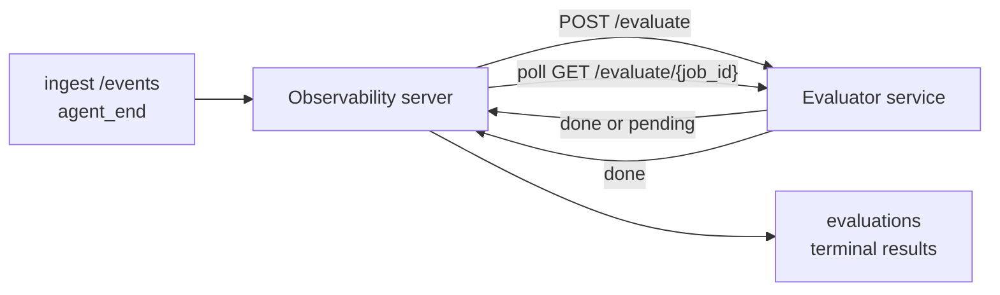

Failproof AI Observability हर पूरे हुए एजेंट रन को गुणवत्ता के लिए स्वचालित रूप से स्कोर कर सकता है: आप एक छोटी स्कोरिंग सेवा प्रदान करते हैं, और Observability बाकी को संभालता है। उन आयामों को ट्रैक करने के लिए इसका उपयोग करें जिनकी आपको परवाह है (सहायकता, टूल दक्षता, तथ्यात्मकता, सुरक्षा; आप चुनते हैं), प्रतिगमन को जल्दी पकड़ें, और एजेंट या परिवेशों की तुलना एक नज़र में करें। स्कोरिंग वैकल्पिक है: जब तक आप सर्वर पर `EVALUATOR_ENDPOINT` सेट नहीं करते, तब तक पाइपलाइन कुछ नहीं करती है।

> **नोट:** आप स्कोर आयामों को परिभाषित करते हैं। आपका मूल्यांकनकर्ता किसी भी संख्यात्मक कुंजी को वापस कर सकता है; Observability जो भी आप भेजते हैं उसे संग्रहीत, ट्रेंड और प्रदर्शित करता है।

## एक नज़र में

1. **एक स्कोरर लिखें।** एक छोटी HTTP सेवा खड़ी करें जो एक सत्र प्रतिलेख पढ़ता है और स्कोर लौटाता है। Observability एक कार्यशील संदर्भ भेज देता है जिसे आप कॉपी कर सकते हैं। [SDK के साथ एक मूल्यांकनकर्ता लिखना](#writing-an-evaluator-with-the-sdk) देखें।
2. **Observability को इसकी ओर इशारा करें।** सर्वर प्रक्रिया पर `EVALUATOR_ENDPOINT` (और एक साझा `EVALUATOR_TOKEN`) सेट करें।
3. **स्कोर आते देखें।** हर पूरा हुआ सत्र स्वचालित रूप से स्कोर किया जाता है; परिणाम सत्र विवरण पृष्ठ, सत्र ग्रिड, और सहेजे गए डैशबोर्ड पर दिखाई देते हैं।


*एक बार मूल्यांकनकर्ता कॉन्फ़िगर हो जाने के बाद, हर पूर्ण रन स्कोर किया जाता है और परिणाम सत्र के दाएं रेल में दिखाई देते हैं: शीर्ष पर सारांश, फिर प्रति-आयाम स्कोर बार और तर्क।*

---

## यह कैसे काम करता है



जब Observability SDK किसी सत्र के लिए `agent_end` इवेंट उत्सर्जित करता है, सर्वर एक मूल्यांकन निर्धारित करता है। यह फिर पूरे इवेंट प्रतिलेख को आपकी मूल्यांकनकर्ता सेवा में पोस्ट करता है, जो:

- **परिणाम को इनलाइन लौटा सकता है** `{"status":"done", "scores":{...}, "reasoning":{...}, "summary":"..."}` के साथ। परिणाम सत्र की मूल्यांकन टाइमलाइन में जोड़ा जाता है। `reasoning` और `summary` वैकल्पिक हैं।
- **स्थगित कर सकता है** `{"status":"pending", "job_id":"abc-123"}` के साथ। Observability फिर `GET {EVALUATOR_ENDPOINT}/evaluate/abc-123` को कॉल करता है जब तक आपका मूल्यांकनकर्ता `{"status":"done", ...}` या `{"status":"error", "error":"..."}` न लौटाए।

  पोलिंग गति प्रति-कार्य है: एक `pending` प्रतिक्रिया `next_poll_secs` शामिल कर सकती है; अन्यथा Observability `GET /config` से `default_poll_interval_secs` मान का उपयोग करता है; अन्यथा सर्वर `EVALUATOR_POLLING_INTERVAL_SECS` (डिफ़ॉल्ट 10s) पर वापस गिरता है। सभी मान [1s, 1h] तक सीमित हैं।

सत्र जो कभी `agent_end` उत्सर्जित नहीं करते (उदाहरण के लिए, एक दुर्घटनाग्रस्त एजेंट प्रक्रिया) भी उठाए जा सकते हैं: मूल्यांकनकर्ता का `GET /config` `{"inactivity_timeout_secs": 1800}` लौटा सकता है, और Observability किसी भी सत्र का मूल्यांकन करेगा जो इतने समय के लिए निष्क्रिय रहा हो। इस फ़ील्ड को `null` पर सेट करें या इस फ़ॉलबैक को अक्षम करने के लिए इसे छोड़ दें।

जब `EVALUATOR_ENDPOINT` अनसेट होता है तो पाइपलाइन पूरी तरह से no-op होती है।

एक सत्र समय के साथ **कई टर्मिनल मूल्यांकन जमा कर सकता है**: हर `agent_end` इवेंट (और डैशबोर्ड से हर मैनुअल पुनः-मूल्यांकन) एक ताजा मूल्यांकन पंक्ति जोड़ता है। यह एक पुनः शुरू किए गए संवाद का मूल्यांकन करने का समर्थित तरीका है: एक उपयोगकर्ता एजेंट को समाप्त करता है, बाद में वापस आता है, अधिक इवेंट भेजता है, एजेंट को फिर से समाप्त करता है, और पूरे अपडेट किए गए प्रतिलेख के विरुद्ध दूसरा मूल्यांकन चलता है। डैशबोर्ड सबसे हाल के मूल्यांकन को हेडलाइन के रूप में और पूर्ववर्ती मूल्यांकन को एक संक्षिप्त टाइमलाइन के रूप में प्रस्तुत करता है। जबकि एक मूल्यांकन किसी सत्र के लिए चल रहा है, उस सत्र के लिए अतिरिक्त `agent_end` इवेंट अनदेखे कर दिए जाते हैं; चलने वाले मूल्यांकन के पूरा होने के बाद अगला एक सामान्य रूप से एक ताजा मूल्यांकन को कतारबद्ध करेगा।

निष्क्रियता फ़ॉलबैक पुनः शुरू किए गए सत्र पर भी फिर से जुड़ता है: यदि पिछले टर्मिनल मूल्यांकन के बाद नए इवेंट आते हैं और सत्र फिर `inactivity_timeout_secs` के भीतर निष्क्रिय हो जाता है, तो एक ताजा मूल्यांकन कतारबद्ध किया जाता है।

अस्थायी विफलताएं (5xx, 429, टाइमआउट, नेटवर्क त्रुटियां) `EVALUATOR_MAX_ATTEMPTS` तक घातीय बैकऑफ के साथ पुनः प्रयास की जाती हैं; 4xx प्रतिक्रियाएं टर्मिनल हैं। Observability कई क्षैतिज-मापनीय सर्वर उदाहरणों के साथ चलाने के लिए सुरक्षित है; काम विभाजित है ताकि एक ही सत्र कभी एक साथ दो बार प्रेषित न हो।

---

## HTTP अनुबंध

हर प्रमाणीकृत मार्ग **वाहक टोकन प्रमाणीकरण** का उपयोग करता है। एक ही मान दोनों पक्षों पर कॉन्फ़िगर किया जाना चाहिए:

- Observability सर्वर: env var `EVALUATOR_TOKEN`
- Evaluator सेवा: एक ही तरीके से कॉन्फ़िगर की गई (संक्षेप से `agenteye-evaluator` SDK `EVALUATOR_TOKEN` पढ़ता है)

यदि `EVALUATOR_TOKEN` अनसेट है, तो सर्वर कोई `Authorization` हेडर नहीं भेजता है; मूल्यांकनकर्ता तब अनाम अनुरोध स्वीकार कर सकता है, जो एक आंतरिक-केवल नेटवर्क के लिए ठीक है लेकिन सार्वजनिक इंटरनेट पर हतोत्साहित है।

### मार्ग जो मूल्यांकनकर्ता को परोसने चाहिए

| मार्ग | बॉडी / पैरामस | प्रतिक्रिया |
|---|---|---|
| `GET /health` | कोई नहीं | `{"status":"ok"}` (खुला, बिना प्रमाणीकरण) |
| `GET /config` | कोई नहीं | `{"inactivity_timeout_secs": <int> \| null, "default_poll_interval_secs": <int> \| omitted}` |
| `POST /evaluate` | `EvalRequest` JSON | `{"status":"done", ...}` या `{"status":"pending", "job_id":"..."}` |
| `GET /evaluate/{id}` | कोई नहीं | `/evaluate` के समान प्रतिक्रिया आकार |

### सर्वर द्वारा भेजे गए `EvalRequest` बॉडी

```json
{
  "schema_version": "1",
  "session_id":     "session-abc123",
  "agent_id":       "planner",
  "environment":    "production",
  "started_at":     "2026-05-10T12:00:00Z",
  "ended_at":       "2026-05-10T12:05:00Z",
  "events": [
    { "id": 1234, "ts": "...", "event_type": "agent_start", "payload": { ... } },
    ...
  ]
}
```

### प्रतिक्रिया आकार

**सिंक (पूरा):

```json
{
  "status": "done",
  "scores": { "helpfulness": 0.85, "tool_efficiency": 0.6 },
  "reasoning": {
    "helpfulness": "answered the question directly with citations",
    "tool_efficiency": "called list_files three times when one would have done"
  },
  "summary": "strong answer quality, weak tool selection"
}
```

`reasoning` (प्रति-स्कोर औचित्य मानचित्र) और `summary` (एक समग्र एक-पैराग्राफ आख्यान) दोनों वैकल्पिक हैं। `reasoning` में कुंजियां `scores` में कुंजियों को दर्पण करनी चाहिए; डैशबोर्ड अपने स्कोर बार के तहत प्रत्येक प्रविष्टि को इनलाइन प्रस्तुत करता है। पुराने मूल्यांकनकर्ता जो केवल `scores` लौटाते हैं अपरिवर्तित काम करते रहते हैं; `reasoning` और `summary` बस null के रूप में पढ़े जाते हैं और संबंधित UI सुविधाएं छोड़ी जाती हैं।

**असिंक (स्थगित):**

```json
{ "status": "pending", "job_id": "abc-123", "next_poll_secs": 30 }
```

`next_poll_secs` वैकल्पिक है; यदि छोड़ा गया तो सर्वर `/config` से मूल्यांकनकर्ता की `default_poll_interval_secs` पर वापस गिरता है, फिर अपने `EVALUATOR_POLLING_INTERVAL_SECS` env var पर।

**टर्मिनल मूल्यांकनकर्ता-पक्ष त्रुटि:**

```json
{ "status": "error", "error": "model service unavailable" }
```

सर्वर किसी भी अन्य 2xx बॉडी को प्रोटोकॉल त्रुटि के रूप में मानता है और सत्र के लिए एक टर्मिनल `error` रिकॉर्ड करता है।

---

## SDK के साथ एक मूल्यांकनकर्ता लिखना

आपको HTTP अनुबंध को हाथ से लागू नहीं करना है। `agenteye-evaluator` Python पैकेज आपको एक टाइप किया गया FastAPI रैपर देता है जो प्रमाणीकरण, राउटिंग, और अनुरोध/प्रतिक्रिया आकारों को आपके लिए संभालता है।

Failproof AI Observability एक **कार्यशील संदर्भ मूल्यांकनकर्ता** भी भेज देता है जो प्रतिलेख के आकार से `helpfulness`, `tool_efficiency`, और `factuality` को स्कोर करता है। इसे एक शुरुआत के रूप में कॉपी करें और अपना स्वयं का लॉजिक स्वैप करें: एक LLM जज, एक नियम इंजन, जो भी आपकी गुणवत्ता पट्टी को फिट बैठता है।

न्यूनतम व्यवहार्य मूल्यांकनकर्ता:

```python
import os
from agenteye_evaluator import Evaluator, EvalRequest, EvalResponse

app = Evaluator(token=os.environ["EVALUATOR_TOKEN"])

@app.evaluator
def run(req: EvalRequest) -> EvalResponse:
    # Inspect req.events (the full session transcript) and return scores.
    tool_calls = sum(1 for e in req.events if e.event_type == "tool_use")
    return EvalResponse(
        scores={"tool_calls": float(tool_calls)},
        reasoning={"tool_calls": f"{tool_calls} tool invocations in the transcript"},
        summary="tight tool loop" if tool_calls < 5 else "agent looped on tools",
    )
```

`app` उदाहरण किसी भी ASGI सर्वर के तहत चलता है, इसलिए `uvicorn module:app` इसे शुरू करता है।

उन मूल्यांकनकर्ताओं के लिए जिन्हें महंगे काम को स्थगित करने की आवश्यकता है, इसके बजाय `JobPending` लौटाएं और एक `@app.job_lookup` हैंडलर पंजीकृत करें; Observability सर्वर `GET /evaluate/{job_id}` को तब तक पोल करता है जब तक आप एक टर्मिनल स्थिति न लौटाएं या `EVALUATOR_MAX_POLL_DURATION_SECS` कैप (डिफ़ॉल्ट 1 h) समाप्त न हो।

पूर्ण API संदर्भ, असिंक पैटर्न, और इवेंट स्कीमा `agenteye-evaluator` SDK के README में दस्तावेज़ित हैं।

---

## आपके मूल्यांकनकर्ता को चलाना

मूल्यांकनकर्ता **आपकी सेवा** है — Failproof AI Observability एक डिफ़ॉल्ट मूल्यांकनकर्ता नहीं भेज देता है, इसलिए आप इसे जहां भी अपनी सेवाओं को चलाते हैं, वहां बनाते और चलाते हैं। यह किसी भी ASGI सर्वर के तहत चलता है (उदाहरण के लिए `uvicorn my_evaluator:app`); [HTTP अनुबंध](#http-contract) से `/health`, `/config`, और `/evaluate` मार्गों को परोसें, फिर सर्वर को इस पर इशारा करें ([सर्वर को कॉन्फ़िगर करना](#configuring-the-server) देखें)।

एक बार जब मूल्यांकनकर्ता पहुंचने योग्य हो, `GET /health` `{"status":"ok"}` लौटाता है। एक एजेंट के बाद अंत से अंत तक चलता है, `GET /evaluations` सर्वर पर `status: "done"` और आपके मूल्यांकनकर्ता द्वारा उत्पादित स्कोर के साथ एक पंक्ति लौटाता है।

---

## सर्वर को कॉन्फ़िगर करना

सर्वर प्रक्रिया पर सेट करें:

| Env var | अर्थ |
|---|---|
| `EVALUATOR_ENDPOINT` | आपके मूल्यांकनकर्ता का आधार URL (`http://evaluator:9000`)। अनसेट = पाइपलाइन अक्षम। |
| `EVALUATOR_TOKEN` | वाहक टोकन। मूल्यांकनकर्ता सेवा के साथ कॉन्फ़िगर किए गए मान के बराबर होना चाहिए। |
| `EVALUATOR_WORKERS` | सर्वर उदाहरण प्रति कार्यकर्ता कार्य (डिफ़ॉल्ट 2)। |
| `EVALUATOR_CLAIM_BATCH` | कार्यकर्ता टिक प्रति पंक्तियां दावा की गई (डिफ़ॉल्ट 4)। बैच **एक साथ** संसाधित किए जाते हैं; आपके मूल्यांकनकर्ता अंतिम बिंदु पर प्रभावी समवर्ती है `EVALUATOR_WORKERS × EVALUATOR_CLAIM_BATCH`। |
| `EVALUATOR_POLL_IDLE_SECS` | एक कार्यकर्ता कितने समय के लिए सो जाता है जब कोई मूल्यांकन देय न हो (डिफ़ॉल्ट 2s)। |
| `EVALUATOR_POLLING_INTERVAL_SECS` | `GET /evaluate/{id}` गति के लिए अंतिम फ़ॉलबैक जब न तो प्रति-प्रतिक्रिया `next_poll_secs` न ही मूल्यांकनकर्ता की `default_poll_interval_secs` सेट हो (डिफ़ॉल्ट 10s)। |
| `EVALUATOR_REQUEST_TIMEOUT_MS` | प्रति-अनुरोध टाइमआउट (डिफ़ॉल्ट 30000)। |
| `EVALUATOR_MAX_ATTEMPTS` | इतने सारे अस्थायी विफलताओं के बाद परिणाम टर्मिनल `error` के रूप में रिकॉर्ड किया जाता है (डिफ़ॉल्ट 5)। |
| `EVALUATOR_CONFIG_REFRESH_SECS` | `GET /config` गति (डिफ़ॉल्ट 300)। |
| `EVALUATOR_MAX_POLL_DURATION_SECS` | अधिकतम wallclock समय एक सत्र पोलिंग कतार में रह सकता है इससे पहले कि इसे `timeout` के रूप में समाप्त किया जाए (डिफ़ॉल्ट 3600s)। एक मूल्यांकनकर्ता के विरुद्ध रक्षा जो `pending` को हमेशा के लिए लौटाता रहता है। |

स्वचालित स्कोरिंग को चालू करने के लिए, सर्वर पर `EVALUATOR_ENDPOINT` और `EVALUATOR_TOKEN` दोनों सेट करें, फिर परिवर्तन को उठाने के लिए इसे पुनः आरंभ करें। `EVALUATOR_ENDPOINT` अनसेट के साथ पाइपलाइन एक no-op रहती है।

ऊपर ट्यूनिंग नॉब्स वैकल्पिक हैं; केवल तभी सर्वर पर संबंधित पर्यावरण चर सेट करें जब आपको डिफ़ॉल्ट को ओवरराइड करने की आवश्यकता हो।

---

## API संदर्भ

| विधि | पथ | आवश्यक अनुमति | उद्देश्य |
|---|---|---|---|
| `GET` | `/evaluations` | `evaluations:read` | टर्मिनल परिणामों को क्वेरी करें। `session_id`, `agent_id`, `environment`, `status` (`done`/`error`/`timeout`), `ts_from`, `ts_to`, `cursor`, `limit`, `score_filters`, `latest_per_session` को समर्थन करता है। `limit` डिफ़ॉल्ट 50 और 200 पर कैप (ध्यान दें यह `/events` से अलग है, जो 1000 पर कैप करता है)। `environment` एक अल्पविराम-सीमांकित सूची स्वीकार करता है (जैसे `environment=prod,staging`); एकल मान अभी भी काम करते हैं। `latest_per_session=true` के साथ प्रतिक्रिया प्रति `session_id` में सबसे अधिक एक पंक्ति शामिल करती है (सबसे हाल की `completed_at` द्वारा) जिसका उपयोग सत्र-सूची पृष्ठ एक सत्र की मूल्यांकन टाइमलाइन को अपनी वर्तमान हेडलाइन में संक्षिप्त करने के लिए किया जाता है। डिफ़ॉल्ट false (पूर्ण इतिहास लौटाता है)। |
| `GET` | `/evaluations/aggregate` | `evaluations:read` | फ़िल्टर किए गए स्लाइस के लिए रोल-अप eval स्वास्थ्य: कुल गणना, एक done/error/timeout ब्रेकडाउन, प्रति-स्कोर-कुंजी आंकड़े (मनमाने ढंग से `scores` कुंजियों पर गणना/औसत/न्यूनतम/अधिकतम/p50), और एक समय-बकेट टाइमलाइन। `/evaluations` के समान फ़िल्टर पैरामस को स्वीकार करता है और `featured_keys` (ट्रेंड करने के लिए स्कोर कुंजियों के CSV) और `latest_per_session`। डैशबोर्ड सुविधा को शक्ति देता है; मेट्रिक्स संपूर्ण मिलान सेट पर सटीक हैं, नमूनाकृत नहीं। |
| `GET` | `/evaluations/environments` | `evaluations:read` | `evaluations` तालिका से अलग environment मान। मूल्यांकन-पठनीय डेटा के लिए स्कोप किए गए फ़िल्टर ड्रॉपडाउन को भरने के लिए उपयोग किया जाता है। |
| `GET` | `/evaluation-jobs` | `evaluations:read` | उड़ान में मूल्यांकन में दृश्यमानता। `status` (`pending`/`polling`) द्वारा फ़िल्टर करें। |
| `GET` | `/events` | `events:read` | किसी सत्र के कच्चे इवेंट को स्ट्रीम करें। `session_id`, `agent_id`, `event_type` (CSV), `environment` (CSV), `ts_from`, `ts_to`, `cursor`, `limit`, और `order` को समर्थन करता है। `order` `desc` (नवीनतम-प्रथम, डिफ़ॉल्ट) या `asc` (सबसे पुरानी-प्रथम) है; एक अमान्य मान `desc` पर वापस गिरता है। प्रतिक्रिया के `next_cursor` (एक इवेंट id) के माध्यम से कर्सर-पेजिनेट करें: अगला पृष्ठ प्राप्त करने के लिए इसे `cursor` के रूप में वापस पास करें; `asc` के साथ अगला पृष्ठ उस id के बाद के इवेंट हैं, `desc` के साथ इससे पहले के इवेंट हैं। `limit` डिफ़ॉल्ट 50 और 1000 पर कैप। |
| `GET` | `/sessions/:session_id/export` | `events:read` | सटीक JSON बॉडी मूल्यांकनकर्ता इस सत्र के लिए प्राप्त करेगा, `session-<id>.json` नामित डाउनलोड योग्य संलग्नक के रूप में परोसा गया। ऑफ़लाइन परीक्षण के लिए `agenteye-evaluator` के माध्यम से उत्पादन सत्र को फिर से चलाने के लिए उपयोगी। बाइट्स मूल्यांकनकर्ता पाइपलाइन जो भेजता है उसके लिए बाइट-समान हैं। |
| `POST` | `/sessions/:session_id/re-evaluate` | `evaluations:trigger` | किसी सत्र के लिए एक ताजा मूल्यांकन कतारबद्ध करें; चाहे पूर्ववर्ती मूल्यांकन मौजूद हो या नहीं। नया परिणाम पिछले को ओवरराइट करने के बजाय सत्र की मूल्यांकन टाइमलाइन में **जोड़ा** जाता है, इसलिए पूर्ववर्ती स्कोर इतिहास के रूप में दृश्यमान रहते हैं। `202` को कतारबद्ध करने पर लौटाता है, अज्ञात सत्र के लिए `404`, यदि एक मूल्यांकन पहले से उड़ान में है तो `409`। नए मूल्यांकनकर्ता को तैनात करने के बाद, या उन सत्रों के लिए उपयोग करें जिन्होंने कभी `agent_end` उत्सर्जित नहीं किया। |

### स्कोर रेंज द्वारा फ़िल्टरिंग: `score_filters`

`GET /evaluations` एक वैकल्पिक `score_filters` पैरामीटर स्वीकार करता है जो `scores` ऑब्जेक्ट के अंदर संख्यात्मक मान द्वारा परिणामों को संकीर्ण करता है। पैरामीटर `key:min..max` प्रविष्टियों की एक अल्पविराम-सीमांकित सूची है; या तो बाउंड को छोड़ा जा सकता है। कई प्रविष्टियां तार्किक AND के साथ संयोजित होती हैं। पंक्तियां जहां नामित कुंजी अनुपस्थित है या गैर-संख्यात्मक है, को बाहर रखा जाता है। एक अनुरोध सर्वाधिक 20 फ़िल्टर प्रविष्टियां ले सकता है; उससे अधिक HTTP 400 लौटाता है।

उदाहरण:
```text
# helpfulness in [0.5, 0.8]
GET /evaluations?score_filters=helpfulness:0.5..0.8

# tool_efficiency at most 0.3 (no lower bound)
GET /evaluations?score_filters=tool_efficiency:..0.3

# helpfulness >= 0.5 AND factuality >= 0.9
GET /evaluations?score_filters=helpfulness:0.5..,factuality:0.9..
```

हर `/evaluations` प्रतिक्रिया ऑब्जेक्ट में ये फ़ील्ड हैं:

| फ़ील्ड | प्रकार | नोट्स |
|---|---|---|
| `evaluation_id` | string (UUID) | इस टर्मिनल मूल्यांकन के लिए विहित पहचानकर्ता। हर टर्मिनल मूल्यांकन को एक नया UUID मिलता है; एक एकल सत्र कई हो सकता है। |
| `id` | string (UUID) | पिछड़ी-संगतता उपनाम `evaluation_id` के समान मान ले जा रहा है। |
| `session_id` | string | वह सत्र जिसके लिए यह मूल्यांकन चलाया गया। एक सत्र में टाइमलाइन में कई मूल्यांकन हो सकते हैं। |
| `agent_id` | string | एजेंट की पहचान जिसने सत्र का उत्पादन किया। |
| `environment` | string | Environment लेबल सत्र से कॉपी किया गया। |
| `status` | enum | `"done"`, `"error"`, `"timeout"` में से एक। |
| `scores` | object \| null | आपके मूल्यांकनकर्ता द्वारा लौटाए गए स्कोर। |
| `reasoning` | object \| null | आपके मूल्यांकनकर्ता द्वारा लौटाया गया वैकल्पिक प्रति-स्कोर औचित्य मानचित्र। कुंजियां आम तौर पर `scores` में उन्हें दर्पण करती हैं। डैशबोर्ड अपने स्कोर बार के तहत प्रत्येक प्रविष्टि प्रस्तुत करता है। |
| `summary` | string \| null | आपके मूल्यांकनकर्ता द्वारा लौटाया गया वैकल्पिक एक-पैराग्राफ समग्र आख्यान। डैशबोर्ड इसे मूल्यांकन की हेडलाइन के रूप में प्रति-स्कोर ब्रेकडाउन से ऊपर प्रस्तुत करता है। |
| `error` | string \| null | केवल `"error"` / `"timeout"` पर आबादी। |
| `attempt_count` | integer | प्रेषण प्रयासों की संख्या (≥ 1)। |
| `duration_ms` | integer \| null | अंतिम प्रयास की अवधि। |
| `completed_at` | string (ISO 8601 UTC) | जब टर्मिनल परिणाम दर्ज किया गया था। परिणाम `completed_at` द्वारा क्रमबद्ध होते हैं (नवीनतम प्रथम)। |
| `created_at` | string (ISO 8601 UTC) | `completed_at` के समान टाइमस्टैम्प ले जाता है (write-once शब्दार्थ)। |

---

## अनुमतियां

| अनुमति | अनुदान |
|---|---|
| `evaluations:read` | मूल्यांकन परिणामों को सूचीबद्ध करें, डैशबोर्ड में स्कोर देखें, और डैशबोर्ड स्वास्थ्य मेट्रिक्स लोड करें। |
| `evaluations:trigger` | `POST /sessions/:session_id/re-evaluate` के माध्यम से या डैशबोर्ड के पुनः-मूल्यांकन बटन के माध्यम से किसी सत्र के लिए मैन्युअल रूप से एक मूल्यांकन कतारबद्ध करें। |
| `dashboards:read` | सहेजे गए डैशबोर्ड देखें (उनके मेट्रिक्स लोड करने के लिए `evaluations:read` की भी आवश्यकता है)। |
| `dashboards:write` | डैशबोर्ड बनाएं और संपादित करें। |
| `dashboards:delete` | डैशबोर्ड हटाएं। |

बूटस्ट्रैप admin (`ADMIN_KEY`, `ADMIN_EMAIL`) स्वचालित रूप से इनमें से सभी को प्राप्त करता है।

---

## परिणाम देखना

- **`/sessions/<id>`**: इवेंट टाइमलाइन + एक दाएं रेल जो सत्र के स्कोर और प्रेषण प्रयास से कोई त्रुटि दिखाता है। यदि आपकी कुंजी के पास `evaluations:trigger` है, एक **पुनः-मूल्यांकन** बटन निर्यात बटन के आगे दिखाई देता है, उन सत्रों के लिए उपयोगी जिन्होंने कभी `agent_end` उत्सर्जित नहीं किया, या नए मूल्यांकनकर्ता को तैनात करने के बाद स्कोर को ताज़ा करने के लिए। डैशबोर्ड नए परिणाम के लिए पोल करता है और इसे दाएं रेल में अपडेट करता है।
- **`/sessions`**: फ़िल्टर योग्य सत्र ग्रिड; स्कोर कॉलम प्रत्येक सत्र की मूल्यांकन स्थिति और स्कोर एक नज़र में दिखाता है।
- **`/dashboards`**: सहेजे गए eval-स्वास्थ्य दृश्य ([डैशबोर्ड](#dashboards) नीचे देखें)।


*सत्र ग्रिड प्रत्येक रन की मूल्यांकन स्थिति और स्कोर एक नज़र में दिखाता है; लाल/एम्बर/हरे बैज कम स्कोर को कूद बनाते हैं।*

---

## डैशबोर्ड

**डैशबोर्ड** पृष्ठ (`/dashboards`) आपको मूल्यांकन फ़िल्टर का एक संयोजन सहेजने देता है एक नामित, पुनः प्रयोज्य दृश्य के रूप में और देखते हैं कि मूल्यांकन का वह स्लाइस कैसे कर रहा है। डैशबोर्ड **आपके पूरे संगठन में साझा किए जाते हैं**; सभी `dashboards:read` के साथ समान सेट देखते हैं।

हर डैशबोर्ड:

- **फ़िल्टर**: सत्र पृष्ठ के समान नियंत्रण: environment, स्थिति, एजेंट, एक रोलिंग समय विंडो, और स्कोर-रेंज फ़िल्टर (`key:min..max`)।
- **एक प्रदर्शन कॉन्फ़िगरेशन**: किन स्कोर कुंजियों को दिखाया जाए, हरा/एम्बर/लाल स्वास्थ्य सीमा, कौन से पैनल दिखाएं, और सत्र के प्रति नवीनतम मूल्यांकन को संक्षिप्त करें या नहीं।

प्रत्येक कार्ड मेल खाने वाले सत्रों की संख्या, एक done/error/timeout ब्रेकडाउन, प्रत्येक दिखाए गए स्कोर का औसत, और एक छोटी ट्रेंड sparkline दिखाता है। एक डैशबोर्ड खोलने से पूर्ण आकार के पैनल दिखाई देते हैं; **"सत्रों में खोलें"** आपको सत्र पृष्ठ में सटीक उस स्लाइस के लिए पूर्व-फ़िल्टर किया जाता है। मेट्रिक्स सर्वर-पक्ष पर संपूर्ण मिलान सेट पर (`GET /evaluations/aggregate` के माध्यम से) गणना की जाती हैं, इसलिए संख्याएं नमूनाकृत नहीं बल्कि सटीक हैं।


**अनुमतियां:** देखने के लिए `dashboards:read` और `evaluations:read` दोनों की आवश्यकता है; बनाने और संपादित करने के लिए `dashboards:write` की आवश्यकता है; हटाने के लिए `dashboards:delete` की आवश्यकता है। बूटस्ट्रैप admin स्वचालित रूप से इनमें से सभी को प्राप्त करता है।

---

## समस्या निवारण

**सत्र मौजूद हैं लेकिन कोई मूल्यांकन नहीं बनाए जाते हैं।** पुष्टि करें कि `EVALUATOR_ENDPOINT` सर्वर प्रक्रिया पर सेट है, कि सर्वर और मूल्यांकनकर्ता एक ही `EVALUATOR_TOKEN` मान साझा करते हैं, और कि मूल्यांकनकर्ता की `/health` अंतिम बिंदु सर्वर से पहुंचने योग्य है। `EVALUATOR_ENDPOINT` अनसेट के साथ पाइपलाइन एक no-op है।

**उड़ान में मूल्यांकन ढेर हो जाते हैं।** `GET /evaluation-jobs` को क्वेरी करें उड़ान में कतार देखने के लिए। प्रत्येक पंक्ति पर `attempt_count`, `next_attempt_at`, और `last_error` का निरीक्षण करें। सामान्य कारण: मूल्यांकनकर्ता सेवा अनुपलब्ध या 5xx लौटा रहा है (बैकऑफ के साथ पुनः प्रयास), गलत `EVALUATOR_TOKEN` (401 टर्मिनल है), या एक असिंक मूल्यांकनकर्ता जो `pending` अनिश्चित काल के लिए लौटाता है (नीचे देखें)।

**सत्र पूरा लेकिन कोई टर्मिनल मूल्यांकन नहीं।** `GET /evaluation-jobs?status=polling` को क्वेरी करें; परिणाम अभी भी उड़ान में हो सकता है। यदि कोई job `pending` में फंसा हुआ है, तो सर्वर को मूल्यांकनकर्ता तक पहुंचने में परेशानी है; जांचें कि मूल्यांकनकर्ता ऊपर है और `EVALUATOR_TOKEN` मेल खाता है।

**मूल्यांकनकर्ता से `HTTP 401`: अमान्य वाहक टोकन**। सर्वर पर `EVALUATOR_TOKEN` मूल्यांकनकर्ता सेवा के साथ कॉन्फ़िगर किए गए मान से मेल नहीं खाता। वे समान होने चाहिए।

**असिंक मूल्यांकनकर्ता `pending` को हमेशा के लिए लौटाता है।** सर्वर `GET /evaluate/{job_id}` को तब तक पोल करता है जब तक मूल्यांकनकर्ता `done` या `error` न लौटाए, या `EVALUATOR_MAX_POLL_DURATION_SECS` (डिफ़ॉल्ट 1 h) समाप्त न हो। कैप के बाद मूल्यांकन `timeout` के रूप में रिकॉर्ड किया जाता है और उड़ान में कतार से हटा दिया जाता है। `EVALUATOR_MAX_POLL_DURATION_SECS` बढ़ाएं यदि आपका मूल्यांकनकर्ता वास्तव में डिफ़ॉल्ट की तुलना में अधिक समय की आवश्यकता है।

---

## अगले कदम

- [मूल्यांकनकर्ता एजेंट कौशल](/hi/agenteye/evaluator-skill): वास्तविक सत्रों के विरुद्ध आयाम डिजाइन करने और यह सेवा बनाने के लिए कोडिंग एजेंट है।
- [Python SDK](/hi/agenteye/python-sdk): `agent_end` इवेंट उत्सर्जित करें जो स्कोरिंग को ट्रिगर करते हैं।
- [API कुंजियां](/hi/agenteye/api-keys): `evaluations:read` और `evaluations:trigger` अनुमतियां।
- [Audits](/hi/agenteye/audits): Observability की अन्य स्वचालित गुणवत्ता सुविधा, नीति-आधारित समीक्षा के लिए।