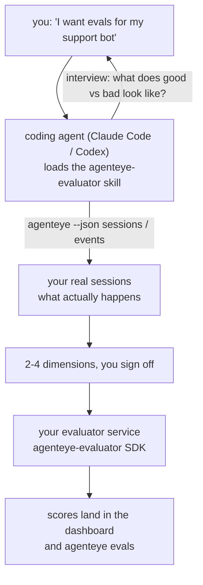

*"मुझे लगता है कि हमारा एजेंट कभी-कभी खराब है"* से लेकर एक तैनात स्कोरिंग सेवा तक जाएं, आपका कोडिंग एजेंट दोनों निर्णय और निर्माण कर रहा है। **Failproof AI Observability मूल्यांकनकर्ता कौशल** (`agenteye-evaluator`) एक *Agent Skill* है: निर्देशों का एक छोटा फ़ोल्डर जो एक कोडिंग एजेंट जैसे Claude Code या Codex मांग पर लोड करता है। यह एजेंट को यह पता लगाना सिखाता है कि आपके *एजेंट* के लिए कौन से गुणवत्ता आयाम ट्रैक करने के लायक हैं, फिर [मूल्यांकनकर्ता सेवा](/hi/agenteye/evaluation-suite) लिखें, परीक्षण करें और तैनात करें जो उन्हें स्कोर करे।

यह एक **होस्ट किए गए स्कोरर** नहीं है, एक रजिस्ट्री जो आप अपलोड करते हैं, या एक प्लगइन सिस्टम नहीं है। आपका मूल्यांकनकर्ता आपकी अपनी HTTP सेवा आपके अपने बुनियादी ढांचे पर रहता है, बिल्कुल [मूल्यांकन सूट](/hi/agenteye/evaluation-suite) गाइड में वर्णित है। कौशल केवल आपके एजेंट को इसे अच्छी तरह बनाना सिखाता है, इसलिए यह जो कुछ भी करता है, आप समान कोड लिखकर स्वयं कर सकते हैं।

---

## कठिन हिस्सा यह तय करना है कि क्या स्कोर करें

SDK सतह छोटी है — एक डेकोरेटर और दो मॉडल — और एक एजेंट [अनुबंध](/hi/agenteye/evaluation-suite#http-contract) से अकेले लिख सकता है। यह वह जगह नहीं है जहां मूल्यांकनकर्ता विफल होते हैं। वे विफल होते हैं क्योंकि वे गलत चीज को स्कोर करते हैं, और एक मूल्यांकनकर्ता जो गलत चीज को स्कोर करता है वह कोई भी नहीं है: यह एक डैशबोर्ड बनाता है जिसे सभी को अनदेखा करना सीखते हैं।

तो कौशल का अधिकांश हिस्सा कोड मौजूद होने से पहले का हिस्सा है। इसमें एजेंट आपसे साक्षात्कार लेता है (*"एक ऐसा रन वर्णित करें जो अच्छी तरह चला; अब एक ऐसा रन जो खराब चला"*), फिर [`agenteye` CLI](/hi/agenteye/cli) के माध्यम से आपके वास्तविक सत्र खींचें और उन्हें अंत तक पढ़ें। ये दोनों हिस्से आमतौर पर असहमत होते हैं, और अंतराल बिंदु है: आप क्या मापना चाहते हैं बनाम आपके टेप क्या वास्तव में समर्थन कर सकते हैं। एक आयाम केवल तभी जीवित रहता है जब वह **घटनाओं से संगणनीय** हो और **विभेदक** हो — यदि यह आपके अच्छे रन और खराब दोनों पर 0.9 स्कोर करता है, तो यह कुछ भी सिखाता नहीं और कट जाता है।

जो वापस आता है वह 2-4 आयामों का एक प्रस्ताव है जिसमें तर्क संलग्न है, आप कोई भी लाइन लिखने से पहले हस्ताक्षर कर सकते हैं।



---

## यह अन्य मूल्यांकन टुकड़ों से कैसे संबंधित है

चार दस्तावेज स्कोरिंग को कवर करते हैं, और वे क्रम में एक दूसरे को हस्तांतरित करते हैं:

| पृष्ठ | यह क्या है | इसे कब लें |
|---|---|---|
| **[Evaluations](/hi/agenteye/evaluations)** | सुविधा: सत्र ग्रिड पर स्कोर, डैशबोर्ड, पुनः-मूल्यांकन करें | आप जानना चाहते हैं कि स्वचालित स्कोरिंग आपको क्या मिलता है |
| **[Evaluation suite](/hi/agenteye/evaluation-suite)** | HTTP अनुबंध, SDK, सर्वर पर्यावरण चर | आप स्वयं मूल्यांकनकर्ता को लागू या डीबग कर रहे हैं |
| **Evaluator skill** (यह दस्तावेज़) | स्कोरर को डिज़ाइन *और* बनाने पर एक प्राकृतिक-भाषा सामने का दरवाजा | आप "मुझे इवल्स चाहते हैं" से एक चलती सेवा तक जाना चाहते हैं |
| **[CLI skill](/hi/agenteye/cli-skill)** | `agenteye` CLI पर एक प्राकृतिक-भाषा सामने का दरवाजा | आप पहले से मौजूद स्कोर को *पढ़ना* चाहते हैं |
| **[Python SDK skill](/hi/agenteye/python-sdk-skill)** | अपने एजेंट को उपकरण करने पर एक प्राकृतिक-भाषा सामने का दरवाजा | आपका एजेंट अभी तक सत्र नहीं दे रहा है — स्कोर करने के लिए कुछ नहीं है |

### CLI कौशल के मुकाबले: बनाम पढ़ना

दोनों कौशल जानबूझकर गैर-अतिव्यापी हैं, और दोनों को स्थापित करना सामान्य सेटअप है — एजेंट इस बात के आधार पर उन्हें चुनता है कि आप क्या पूछते हैं:

- **`agenteye-evaluator`** (यह दस्तावेज़) वह चीज़ बनाता है जो *स्कोर बनाती है*। जब पहली बार स्कोर आते हैं तो इसका काम समाप्त हो जाता है।
- **[`agenteye-cli`](/hi/agenteye/cli-skill)** पहले से मौजूद स्कोर को पढ़ता है (`agenteye evals`)। *"क्या गुणवत्ता इस सप्ताह गिरी?"* इसका सवाल है, इस कौशल का नहीं।

---

## आवश्यकताएं

1. **`agenteye` CLI स्थापित और लॉगिन किया हुआ** (`pipx install agenteye`, फिर `agenteye login`)। कौशल इसे दो बार उपयोग करता है: वास्तविक सत्र खींचने के लिए जिसे यह डिज़ाइन करता है, और पुष्टि करने के लिए कि आपके स्कोर अंत में आ गए। आपके लॉगिन को `events:read` की आवश्यकता है, साथ ही उस अंतिम जांच के लिए `evaluations:read`। CLI कौशल की तरह, यह **नहीं** आपके लिए ईमेल किए गए एकबारी कोड लॉगिन को पूरा कर सकता।
2. **मूल्यांकनकर्ता के लिए कहीं रहने के लिए।** इसे एक छवि में बनाया जाता है और एक दीर्घकालिक सेवा के रूप में चलाया जाता है, इसलिए इसे एक वास्तविक रेपो की आवश्यकता है, एक स्क्रैच फ़ाइल नहीं। मूल्यांकनकर्ता अक्सर अपने स्वयं के रेपो में रहते हैं, स्कोर किए जा रहे एजेंट से अलग — कौशल एक मौजूदा को देखता है और एक नया स्कैफोल्ड करने से पहले पूछता है।
3. **`agenteye-evaluator` SDK व्हील** — अपने एजेंट को `pip` कमांड टाइप करना शुरू करने से पहले अगला सेक्शन पढ़ें।

---

## इसे कहाँ से प्राप्त करें

कौशल Failproof AI के सार्वजनिक कौशल संग्रह में प्रकाशित है:

**[github.com/FailproofAI/skills](https://github.com/FailproofAI/skills)** → [`skills/agenteye-evaluator/`](https://github.com/FailproofAI/skills/tree/main/skills/agenteye-evaluator)

रिपोजिटरी सार्वजनिक है और कौशल को अपने स्वयं के क्रेडेंशियल की आवश्यकता नहीं है — यह केवल `agenteye` CLI को सत्र के साथ चलाता है *आप* लॉगिन किए हुए हैं, और *आपके* रेपो में कोड लिखते हैं। ध्यान दें कि यह अपने स्वयं के फ़ोल्डर के रूप में शिप करता है और `pipx install agenteye` पैकेज के अंदर **नहीं** है, इसलिए वहां इसे न खोजें।

## कौशल को स्थापित करना

सबसे तेज़ रास्ता [`skills`](https://skills.sh) CLI है, जो फ़ोल्डर को फ़ेच करता है और इसे वहां गिराता है जहां आपका एजेंट देखता है:

```bash
# Claude Code, this project only
npx skills add FailproofAI/skills --skill agenteye-evaluator -a claude-code

# every project (installs to ~/.claude/skills/)
npx skills add FailproofAI/skills --skill agenteye-evaluator -a claude-code -g --copy

# Codex instead
npx skills add FailproofAI/skills --skill agenteye-evaluator -a codex
```

फिर इसे किसी अन्य कौशल की तरह प्रबंधित करें:

```bash
npx skills list -a claude-code           # what's installed
npx skills update agenteye-evaluator     # pull the latest version
npx skills remove agenteye-evaluator     # remove it
```

हाथ से स्थापित करना पसंद है? एक Agent Skill सिर्फ एक फ़ोल्डर है जिसमें एक `SKILL.md` होता है (प्लस वैकल्पिक संदर्भ), इसलिए इसे कॉपी करना काम करता है:

- **Claude Code**: `agenteye-evaluator/` फ़ोल्डर को `~/.claude/skills/` (हर प्रोजेक्ट) या `<your-repo>/.claude/skills/` (केवल वह रेपो) में रखें। Claude Code इसे स्वचालित रूप से खोजता है — `/skills` सूची के साथ सत्यापित करें, या बस इवल्स के लिए पूछें।
- **Codex (OpenAI)**: Codex एक ही `SKILL.md` को पढ़ता है। बंडल किया गया `agents/openai.yaml` `allow_implicit_invocation: true` सेट करता है, इसलिए Codex एक कार्य से मेल खाने पर कौशल को स्वचालित रूप से चुनता है; अन्यथा इसे `$agenteye-evaluator` के रूप में स्पष्ट रूप से लागू करें।

---

## SDK सार्वजनिक PyPI पर नहीं है

> **Warning:** एजेंट को SDK स्थापित करने देने से पहले इसे पढ़ें।

कौशल सार्वजनिक है; यह जो SDK चलाता है वह नहीं है। `agenteye-evaluator` केवल निजी रिलीज़ आर्टिफैक्ट के रूप में शिप करता है, और `agenteye` के विपरीत, नाम **सार्वजनिक PyPI पर दावा नहीं किया गया है** — इसलिए एक नंगे `pip install agenteye-evaluator` किसी अजनबी के पैकेज को सेवा में खींच सकता है जो आपके उत्पादन टेप को पढ़ता है। यह एक टाइपो नहीं है, एक आपूर्ति-श्रृंखला समस्या है।

कौशल यह जानता है और एक स्थापना सीढ़ी नीचे काम करता है, पहले पायदान पर रुकता है जो लागू होता है: MonoRepo स्रोत यदि आप AgentEye रेपो के अंदर हैं, अन्यथा GitHub Releases से निजी रिलीज़ व्हील (एक्सेस की आवश्यकता है), और यदि दोनों नहीं हैं पहुंचने योग्य यह **रुकता है और आपको बताता है कि अपने Failproof AI संपर्क से व्हील के लिए पूछें** के बजाय सार्वजनिक PyPI से तुरंत करने के।

इसलिए यदि आपका एजेंट सार्वजनिक PyPI से एक नंगा `pip install agenteye-evaluator` प्रस्तावित करता है, तो यह बताता है कि कौशल कभी लोड नहीं हुआ। वहां रुकें और जांचें कि यह स्थापित है।

---

## आप इससे क्या पूछ सकते हैं

एक वास्तविक राउंड-ट्रिप एक अस्पष्ट पूछताछ के साथ शुरू होता है और एक हस्ताक्षरित डिजाइन के साथ समाप्त होता है, कोड के साथ नहीं:

```text
you   ▸ I want evals for our support bot. I think it's sometimes bad.

agent ▸ Before I write anything: describe a run that went well,
        and one that went badly.

you   ▸ Good: it answers from the docs. Bad: it makes stuff up,
        or gives up and says "contact support".

agent ▸ Running: agenteye --json sessions --status error --since 7d
        Reading 5 sessions, including two you'd call bad.

        Your words say factuality and deflection. The transcripts
        agree on deflection (2 of 5 end with a support hand-off,
        and it's plain in model_response.content), but factuality
        needs a ground truth your events don't carry.

        So I'd score three things:
          - deflection      rules, cheap, separates your two runs
          - tool_efficiency rules, catches the retry loop in run-004
          - groundedness    LLM judge: is every claim in the docs it retrieved?

        "factuality" would need ground truth we don't have; groundedness
        is the closest thing your transcripts can actually support.
        OK with those three names? Renaming later splits the history.

you   ▸ yes

agent ▸ No evaluator in this repo. Should I scaffold one here, or do
        you have one elsewhere?
```

वहां से यह नियम-आधारित आयामों को पहले लिखता है (मुफ्त, तत्काल, नियतात्मक), उन्हें एक वास्तविक कैप्चर किए गए सत्र के विरुद्ध परीक्षण करता है जिसमें खाली और कभी-समाप्त नहीं होने वाले शामिल होते हैं जो भोली मूल्यांकनकर्ताओं को दुर्घटनाग्रस्त करते हैं, और केवल व्यक्तिपरक आयाम पर एक LLM जज तक पहुंचता है। यह [डिस्पैचर की सीमाओं](/hi/agenteye/evaluation-suite#configuring-the-server) को जानता है — एक 30s अनुरोध समय सीमा और 8 समवर्ती कॉल तैनाती-व्यापी — इसलिए यदि जज विश्वसनीय रूप से फिट नहीं होगा, तो यह `JobPending` के साथ अतुल्यकालिक चला जाता है के बजाय आपके जज को रद्द करने और पांच बार पांच गुना लागत पर पुनः प्रयास करने दें।

फिर यह तैनात करता है, दो सर्वर पर्यावरण चर सेट करता है, और `agenteye --json evals --session-id <id>` के साथ पुष्टि करता है कि स्कोर वास्तव में आ गए हैं। स्कोर आना एकमात्र प्रमाण है।

---

## क्या देखना है

- **आयाम नाम लगभग स्थायी हैं।** स्कोर कुंजियां मनमानी स्ट्रिंग हैं और मंच जो कुछ भी आप भेजते हैं उसका रुझान रखता है, जिसका मतलब है कि कोई भी डाउनस्ट्रीम गलत विकल्प को सही नहीं करता है। बाद में नाम बदलें और इतिहास विभाजित होता है: पुरानी सत्र पुरानी कुंजी रखती हैं और प्रवृत्ति टूट जाती है। यह है क्यों कौशल कोड लिखने से पहले स्पष्ट हस्ताक्षर प्राप्त करता है — उस संकेत को गंभीरता से लें।
- **Fixtures असली उत्पादन टेप हैं।** वास्तविक सत्रों के विरुद्ध डिज़ाइन करने का मतलब है उन्हें डिस्क में खींचना, और उनमें ग्राहक डेटा हो सकता है। कौशल उन्हें git में प्रतिबद्ध करने से पहले पूछता है; यदि संदेह हो, तो `fixtures/` को रेपो के बाहर रखें और हर डेवलपर को अपना खींचने दें।
- **एजेंट लिखता है और एक सेवा को तैनात करता है जो हर टेप को पढ़ता है।** यह आपके रूप में कार्य करता है, आपके CLI लॉगिन की अनुमतियों से सीमित, लेकिन उत्पादन डेटा को स्पर्श करने वाली किसी अन्य कोड की तरह मूल्यांकनकर्ता की समीक्षा करें।

---

## अगले कदम

- **[Evaluation suite](/hi/agenteye/evaluation-suite)**: HTTP अनुबंध, SDK, और कौशल को कॉन्फ़िगर करने वाले सर्वर पर्यावरण चर।
- **[Evaluations](/hi/agenteye/evaluations)**: जहां स्कोर एक बार आने पर दिखाई देते हैं।
- **[CLI skill](/hi/agenteye/cli-skill)**: अन्य कौशल, परिणामों को पढ़ने के बजाय स्कोरर बनाने के लिए।
- **[CLI](/hi/agenteye/cli)**: कमांड संदर्भ जिसके पीछे कौशल डिज़ाइन करता है सत्र डेटा।