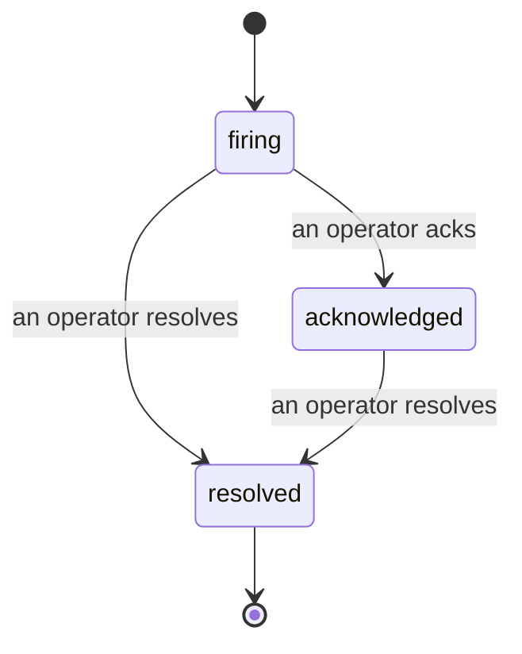

जब कोई अलर्ट ट्रिगर होता है, तो पहला सवाल हमेशा यही होता है "कौन इस पर काम कर रहा है?" Incidents इसका जवाब देते हैं: जैसे ही कोई समस्या पकड़ी जाती है, सभी देख सकते हैं कि incident खुला है, उसका मालिक कौन है, और अब तक क्या हुआ है। आपके पास एक स्पष्ट, attribute किया गया record होता है जिसे आप सीधे post-mortem में दे सकते हैं।

*Inbox open incidents को state के आधार पर group करता है और severity और assignee के आधार पर filter करता है, ताकि आप देख सकें कि अभी किसे human की ज़रूरत है।*

## एक नज़र में जानें कि किसके पास है

अब chat thread में "क्या कोई इस पर देख रहा है?" पूछने की ज़रूरत नहीं। एक breach automatically एक incident खोलता है और इसे shared inbox में डालता है, जो state के आधार पर grouped होता है। इसे acknowledge करें और आपका नाम उस पर होगा, ताकि बाकी टीम को पता चल जाए कि यह handle हो गया है। Acknowledgement shared होता है: कई operators एक ही incident को ack कर सकते हैं और हर एक को अलग से record किया जाता है, ताकि एक पूरा war room नामों के साथ दिख सके, एक-दूसरे के ऊपर न चढ़ें। Triage के लिए एक owner assign करें, और inbox को severity या assignee के आधार पर filter करें ताकि सिर्फ आपका काम दिखे।

## पूरी कहानी, एक timeline में

जब incident ख़त्म हो जाता है, तो आपके पास पहले से ही write-up होता है। किसी भी incident को खोलें और आपको breach का सबूत, इसके assignees और subscribers, coordinating के लिए एक comment thread, और एक append-only activity timeline मिलता है।

*जो कुछ हुआ, क्रम में, हर line को जो किसी ने किया उसके द्वारा signed।*

हर action (opened, acknowledged, resolved, आदि) उस timeline में लिखा जाता है और कभी edit नहीं किया जाता। हर entry attribute किया होता है: जो operator ने यह action लिया, उसके email के साथ, या **automated** के लिए कोई भी चीज़ जो FailproofAI Observability ने अपने आप की, जैसे breach पर incident खोलना। कुछ भी anonymous नहीं है और कुछ भी खो नहीं जाता, इसलिए post-mortem कमोबेश खुद ही लिख जाता है।

## एक incident कैसे आगे बढ़ता है

- **Open (firing):** breach incident को खोलता है और आपके channels को एक बार page करता है। दोहराए गए breaches उसी incident में fold हो जाते हैं और इसके evidence को refresh करते हैं, बजाय आपको बार-बार page करने के।
- **Acknowledged:** एक operator इसे pick करता है। यह खुला रहता है, और बाद के breaches quietly evidence को update करते हैं।
- **Resolved:** एक operator इसे बंद करता है। Automatic resolution जब condition clear हो जाता है, planned है लेकिन अभी enable नहीं है, तो एक incident तब तक खुला रहता है जब तक एक human इसे resolve न कर दे, जो सभी को यह honest रहने देता है कि वास्तव में क्या clear हो गया है। एक ही alert पर बाद में एक नया incident खुल सकता है।

एक alert के पास एक समय में अधिकतम एक open incident हो सकता है, इसलिए एक flapping rule आपको duplicates में नहीं दफन कर सकता। आप manually भी एक incident खोल सकते हैं: कोई alert नहीं पकड़ने के लिए एक standalone, या एक existing alert से attach किया हुआ, अगर आपके पास `incidents:write` है।

## इसे कहाँ खोजें

Incidents `/<org-slug>/incidents` पर रहते हैं। Viewing के लिए **`incidents:read`** चाहिए; manual incident खोलने के लिए **`incidents:write`** चाहिए; acknowledging, assigning, commenting, और resolving के लिए **`incidents:ack`** चाहिए। पुरानी keys जिन्होंने retired `alerts:ack` दिया, काम करती रहती हैं, क्योंकि इसे `incidents:ack` के रूप में honor किया जाता है, तो आपके on-call rotation को फिर से issue करने की ज़रूरत नहीं है।

## संबंधित

- [Alerts](/hi/agenteye/alerts): वह rules जो threshold breach होने पर ये incidents खोलते हैं।
- [Error tracking](/hi/agenteye/error-tracking): हर failure को एक जगह देखें और एक को alert में promote करें।
- [Audits](/hi/agenteye/audits): वह scheduled analyst जो उन failures को ढूंढता है जिन्हें कोई rule नहीं देख रहा था।