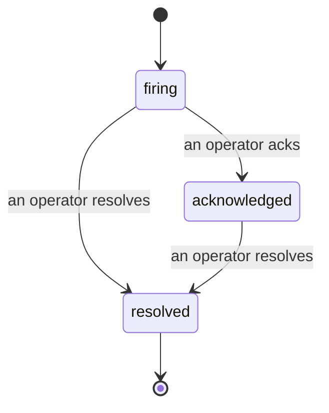

जब कोई अलर्ट फायर होता है, तो पहला सवाल हमेशा यही होता है "इस पर कौन काम कर रहा है?" Incidents इसका जवाब देते हैं: जैसे ही कोई breach होता है, सभी को पता चल जाता है कि incident खुला है, इसका मालिक कौन है, और अभी तक बिल्कुल क्या हुआ है, साथ ही एक साफ़, attributed record जो आप सीधे post-mortem को दे सकते हैं।

*Inbox open incidents को state के अनुसार group करता है और severity तथा assignee के अनुसार filter करता है, ताकि आप देख सकें कि किन्हें अभी मानवीय हस्तक्षेप की आवश्यकता है।*

## एक नजर में जान लें कि किसके पास है

अब "क्या कोई इस पर नज़र रख रहा है?" चैट thread में नहीं पूछना पड़ेगा। एक breach automatically एक incident खोलता है और इसे एक shared inbox में डालता है, state के अनुसार grouped। इसे acknowledge करें और आपका नाम इस पर होगा, ताकि बाकी team को पता चल जाए कि इसे संभाल लिया गया है। Acknowledgement shared है: कई operators एक ही incident को ack कर सकते हैं और प्रत्येक को अलग-अलग record किया जाता है, इसलिए एक पूरे war room में सभी के नाम दिखते हैं। Triage के लिए एक owner assign करें, और inbox को severity या assignee के अनुसार filter करें ताकि आप सिर्फ अपने काम को देख सकें।

## पूरी कहानी, एक timeline में

जब incident खत्म हो जाता है, तो आपके पास पहले से ही write-up होता है। कोई भी incident खोलें और आपको breach का evidence, इसके assignees और subscribers, coordination के लिए एक comment thread, और एक append-only activity timeline मिलता है।

*सब कुछ जो हुआ, क्रम में, प्रत्येक line उस पर sign किया गया है जिसने यह किया।*

प्रत्येक action (opened, acknowledged, resolved, आदि) उस timeline पर लिखा जाता है और कभी edit नहीं किया जाता। प्रत्येक entry attributed है: जिस operator ने यह किया उसे, email द्वारा, या **automated** को Failproof AI Observability के लिए जो कुछ अपने आप करता है, जैसे breach पर incident खोलना। कुछ भी anonymous नहीं है और कुछ भी खोया नहीं जाता, इसलिए post-mortem ज्यादातर खुद लिख जाता है।

## एक incident कैसे move करता है

- **Open (firing):** breach incident को खोलता है और आपके channels को एक बार page करता है। Repeated breaches एक ही incident में fold हो जाते हैं और इसके evidence को refresh करते हैं बजाय आपको बार-बार page करने के।
- **Acknowledged:** कोई operator इसे pick up करता है। यह खुला रहता है, और बाद में breaches quietly evidence को update करते हैं।
- **Resolved:** एक operator इसे close कर देता है। Automatic resolution जब condition clear हो जाती है, यह planned है लेकिन अभी enabled नहीं है, इसलिए एक incident तब तक खुला रहता है जब तक कोई मानव इसे resolve न कर दे, जो सभी को honest रखता है कि वास्तव में क्या clear हुआ है। एक ही alert पर बाद में एक fresh incident खुल सकता है।

एक alert एक बार में सबसे ज्यादा एक open incident hold कर सकता है, इसलिए एक flapping rule आपको duplicates में दबा नहीं सकता। आप एक incident को manually भी खोल सकते हैं: कुछ के लिए एक standalone जो कोई alert नहीं पकड़ा, या एक existing alert से attached, अगर आपके पास `incidents:write` है।

## इसे कहाँ खोजें

Incidents `/<org-slug>/incidents` पर live हैं। Viewing को **`incidents:read`** की आवश्यकता है; एक manual incident खोलने के लिए **`incidents:write`** की आवश्यकता है; acknowledging, assigning, commenting, और resolving के लिए **`incidents:ack`** की आवश्यकता है। Older keys जिन्होंने retired `alerts:ack` को grant किया है वे काम करते रहते हैं, क्योंकि इसे `incidents:ack` के रूप में honor किया जाता है, इसलिए आपके on-call rotation को re-issue नहीं करना पड़ता।

## संबंधित

- [Alerts](/hi/agenteye/alerts): वे rules जो ये incidents खोलते हैं जब threshold breach हो।
- [Error tracking](/hi/agenteye/error-tracking): हर failure को एक जगह देखें और एक को alert में promote करें।
- [Audits](/hi/agenteye/audits): scheduled analyst जो वे failures खोजता है जिनको कोई rule देख नहीं रहा था।